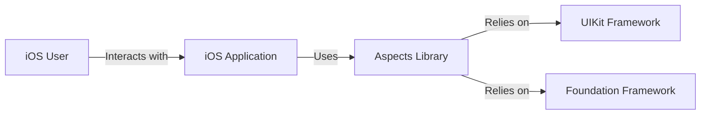
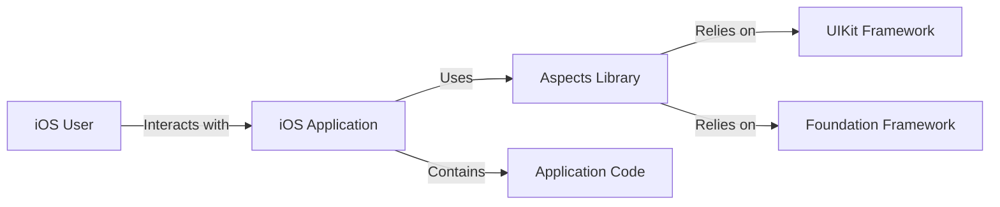
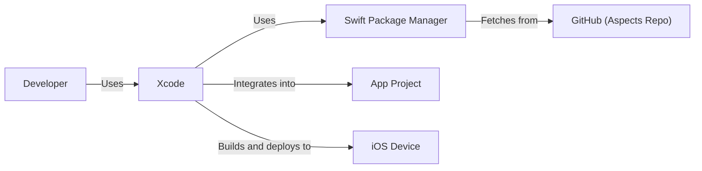
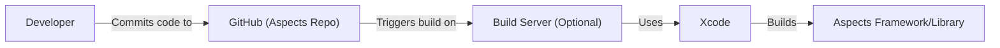

Okay, let's create a design document for the Aspects project, focusing on security and architecture.

# BUSINESS POSTURE

Business Priorities and Goals:

*   Provide a simple, efficient, and reliable way to manage UI state in iOS applications.
*   Offer a lightweight alternative to more complex state management solutions.
*   Improve developer productivity by reducing boilerplate code related to UI updates.
*   Enhance the testability of UI components.
*   Maintain a small codebase that is easy to understand and contribute to.
*   Gain adoption within the iOS development community.

Most Important Business Risks:

*   Security vulnerabilities that could lead to application crashes, data corruption, or unexpected behavior.
*   Performance issues that could negatively impact the user experience.
*   Lack of adoption due to complexity, poor documentation, or competition from other solutions.
*   Inability to maintain the project due to lack of resources or community involvement.
*   Compatibility issues with different iOS versions or device configurations.

# SECURITY POSTURE

Existing Security Controls:

*   security control: Code Reviews: The GitHub repository indicates the use of pull requests, suggesting that code reviews are part of the development process. (Visible in GitHub's pull request history).
*   security control: Static Analysis: The project is written in Swift, which offers some built-in memory safety features. (Implicit in the choice of Swift as the programming language).
*   security control: Limited Scope: The library's focused functionality reduces the attack surface. (Inferred from the project description and code).

Accepted Risks:

*   accepted risk: Reliance on Underlying Frameworks: The library depends on the stability and security of Apple's UIKit and Foundation frameworks. Any vulnerabilities in these frameworks could potentially impact Aspects.
*   accepted risk: Limited Input Validation: As a UI state management library, Aspects primarily deals with internal application state. It likely performs minimal input validation, relying on the application using it to handle user input sanitization.
*   accepted risk: Single Developer/Small Team: The project appears to be maintained by a small team or a single developer, which can increase the risk of undiscovered vulnerabilities or delayed security updates.

Recommended Security Controls:

*   security control: Integrate Static Application Security Testing (SAST): Incorporate a SAST tool into the build process to automatically scan for potential vulnerabilities.
*   security control: Fuzz Testing: Implement fuzz testing to identify edge cases and unexpected behavior that could lead to crashes or vulnerabilities.
*   security control: Dependency Analysis: Regularly scan dependencies for known vulnerabilities and update them promptly.
*   security control: Security-Focused Code Review Checklist: Develop a checklist specifically for code reviews that emphasizes security considerations.

Security Requirements:

*   Authentication: Not directly applicable, as Aspects is a state management library, not an authentication system. Authentication should be handled by the application using Aspects.
*   Authorization: Not directly applicable. Authorization should be handled by the application using Aspects.
*   Input Validation: While Aspects itself may have limited input validation needs, the application using it *must* thoroughly validate all user inputs to prevent injection attacks and other vulnerabilities. Aspects should document this requirement clearly.
*   Cryptography: Not directly applicable, unless Aspects is used to manage cryptographic keys or sensitive data (which is not its intended purpose). If such a use case arises, strong cryptographic practices must be employed, but this should be the responsibility of the application using Aspects.

# DESIGN

## C4 CONTEXT

Element Descriptions:

*   Element:
    *   Name: iOS User
    *   Type: Person
    *   Description: The end-user interacting with the iOS application.
    *   Responsibilities: Interacts with the application's UI.
    *   Security Controls: None directly within the scope of Aspects. Relies on the security of the iOS device and the application itself.

*   Element:
    *   Name: Aspects Library
    *   Type: Software System
    *   Description: The Aspects library for managing UI state.
    *   Responsibilities: Provides a mechanism for observing and updating UI state.
    *   Security Controls: Code Reviews, Static Analysis (Swift's built-in features), Limited Scope.

*   Element:
    *   Name: UIKit Framework
    *   Type: Software System
    *   Description: Apple's framework for building user interfaces.
    *   Responsibilities: Provides UI components and handles user interaction.
    *   Security Controls: Managed by Apple. Aspects relies on Apple's security updates.

*   Element:
    *   Name: Foundation Framework
    *   Type: Software System
    *   Description: Apple's framework providing fundamental data types and utilities.
    *   Responsibilities: Provides core functionality used by Aspects.
    *   Security Controls: Managed by Apple. Aspects relies on Apple's security updates.

*   Element:
    *   Name: iOS Application
    *   Type: Software System
    *   Description: The iOS application that integrates the Aspects library.
    *   Responsibilities: Implements the application's logic and UI, utilizing Aspects for state management.
    *   Security Controls: The application developer is responsible for implementing appropriate security controls, including input validation, authentication, and authorization.

## C4 CONTAINER

Since Aspects is a relatively simple library, the container diagram is essentially an extension of the context diagram.

Element Descriptions:

*   Element:
    *   Name: iOS User
    *   Type: Person
    *   Description: The end-user interacting with the iOS application.
    *   Responsibilities: Interacts with the application's UI.
    *   Security Controls: None directly within the scope of Aspects. Relies on the security of the iOS device and the application itself.

*   Element:
    *   Name: Aspects Library
    *   Type: Software System
    *   Description: The Aspects library for managing UI state.
    *   Responsibilities: Provides a mechanism for observing and updating UI state.
    *   Security Controls: Code Reviews, Static Analysis (Swift's built-in features), Limited Scope.

*   Element:
    *   Name: UIKit Framework
    *   Type: Software System
    *   Description: Apple's framework for building user interfaces.
    *   Responsibilities: Provides UI components and handles user interaction.
    *   Security Controls: Managed by Apple. Aspects relies on Apple's security updates.

*   Element:
    *   Name: Foundation Framework
    *   Type: Software System
    *   Description: Apple's framework providing fundamental data types and utilities.
    *   Responsibilities: Provides core functionality used by Aspects.
    *   Security Controls: Managed by Apple. Aspects relies on Apple's security updates.

*   Element:
    *   Name: iOS Application
    *   Type: Software System
    *   Description: The iOS application that integrates the Aspects library.
    *   Responsibilities: Implements the application's logic and UI, utilizing Aspects for state management.
    *   Security Controls: The application developer is responsible for implementing appropriate security controls, including input validation, authentication, and authorization.

*   Element:
    *   Name: Application Code
    *   Type: Container
    *   Description: Code of application that is using Aspects library.
    *   Responsibilities: Implements the application's logic and UI, utilizing Aspects for state management.
    *   Security Controls: The application developer is responsible for implementing appropriate security controls, including input validation, authentication, and authorization.

## DEPLOYMENT

Deployment Solutions:

1.  **Direct Integration (Manual):** Developers manually download the Aspects source code and integrate it into their Xcode project.
2.  **CocoaPods:** Developers use CocoaPods, a dependency manager, to add Aspects to their project.
3.  **Swift Package Manager (SPM):** Developers use SPM, Apple's built-in package manager, to add Aspects to their project.
4.  **Carthage:** Developers use Carthage, a decentralized dependency manager, to add Aspects to their project.

Chosen Solution (Swift Package Manager): SPM is the preferred solution due to its integration with Xcode and its ease of use.

Element Descriptions:

*   Element:
    *   Name: Developer
    *   Type: Person
    *   Description: The iOS developer integrating Aspects into their application.
    *   Responsibilities: Adds Aspects as a dependency using SPM.
    *   Security Controls: Relies on the security of their development environment and the integrity of the SPM process.

*   Element:
    *   Name: Xcode
    *   Type: Software System
    *   Description: Apple's integrated development environment (IDE).
    *   Responsibilities: Manages the project, builds the application, and handles SPM integration.
    *   Security Controls: Managed by Apple. Relies on Apple's security updates.

*   Element:
    *   Name: Swift Package Manager
    *   Type: Software System
    *   Description: Apple's package manager for Swift projects.
    *   Responsibilities: Fetches the Aspects library from GitHub and resolves dependencies.
    *   Security Controls: Relies on the security of GitHub and the integrity of the package manifest. Uses checksums to verify package integrity.

*   Element:
    *   Name: GitHub (Aspects Repo)
    *   Type: Software System
    *   Description: The Git repository hosting the Aspects source code.
    *   Responsibilities: Provides access to the Aspects source code.
    *   Security Controls: Managed by GitHub. Relies on GitHub's security measures.

*   Element:
    *   Name: App Project
    *   Type: Software System
    *   Description: The developer's iOS application project.
    *   Responsibilities: Contains the application's code and integrates the Aspects library.
    *   Security Controls: The application developer is responsible for implementing appropriate security controls.

*   Element:
    *   Name: iOS Device
    *   Type: Device
    *   Description: Physical device where application is deployed.
    *   Responsibilities: Runs application.
    *   Security Controls: Managed by Apple. Relies on Apple's security updates.

## BUILD

Build Process Description:

1.  **Code Commit:** The developer commits code changes to the Aspects repository on GitHub.
2.  **Build Trigger (Optional):** A continuous integration (CI) system (e.g., GitHub Actions, Jenkins) can be configured to trigger a build whenever changes are pushed to the repository. This is optional but highly recommended.
3.  **Build Execution:** The build server (or the developer's local machine if no CI is used) uses Xcode to build the Aspects library. This involves compiling the Swift code and creating the necessary framework or library files.
4.  **Artifact Creation:** The build process produces the Aspects framework or library as an artifact.
5.  **Security Checks:**
    *   **SAST:** A SAST tool (as recommended in the Security Posture section) should be integrated into the build process to scan the code for vulnerabilities.
    *   **Dependency Analysis:** A dependency analysis tool should be used to check for known vulnerabilities in any dependencies.
    *   **Linters:** SwiftLint or other linters can be used to enforce code style and identify potential issues.

# RISK ASSESSMENT

Critical Business Processes:

*   Providing a stable and reliable UI state management solution.
*   Maintaining the library and addressing bug reports and feature requests.

Data to Protect:

*   Aspects itself does not handle sensitive user data directly. It primarily manages UI state, which is typically not considered highly sensitive. However, the *application* using Aspects might use it to manage data that *is* sensitive. Therefore, the sensitivity of the data depends on the specific application.
*   Source code of the library. While the code is open-source, unauthorized modifications could introduce vulnerabilities.

# QUESTIONS & ASSUMPTIONS

Questions:

*   Are there any specific compliance requirements (e.g., HIPAA, GDPR) that the applications using Aspects typically need to adhere to? This would influence recommendations for how the application using Aspects should handle data.
*   What is the expected level of traffic or usage for applications using Aspects? This would help assess performance requirements.
*   What is the long-term maintenance plan for Aspects? This would influence recommendations for security updates and vulnerability management.

Assumptions:

*   BUSINESS POSTURE: The primary goal is to provide a useful and reliable library, with a secondary goal of gaining community adoption.
*   SECURITY POSTURE: The project currently relies primarily on code reviews and the inherent security features of Swift. There is no formal security testing process in place.
*   DESIGN: The library is designed to be lightweight and easy to integrate. It relies heavily on Apple's frameworks. The deployment process will primarily use SPM. The build process is assumed to be standard Xcode build, potentially with CI integration.