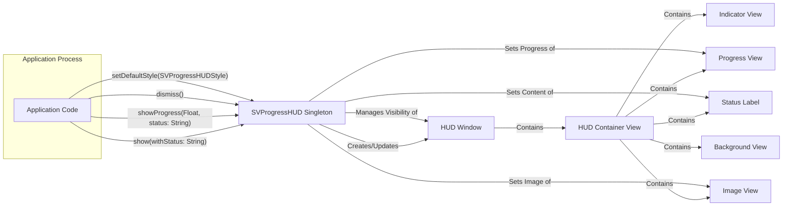

# Project Design Document: SVProgressHUD

**Version:** 1.1
**Date:** October 26, 2023
**Author:** AI Software Architect

## 1. Introduction

This document provides an enhanced design overview of the SVProgressHUD iOS and tvOS library. SVProgressHUD is a widely adopted, streamlined, and user-friendly HUD (Heads-Up Display) control. It facilitates the display of a translucent overlay containing an activity indicator and optional descriptive text, offering crucial visual feedback to users during background processing. This revised document aims to provide a more detailed and refined understanding of SVProgressHUD's architecture and functionality, specifically tailored for subsequent threat modeling exercises.

## 2. Goals and Objectives

The core objectives of SVProgressHUD are to:

*   Offer a straightforward and consistent mechanism for presenting progress indicators within iOS and tvOS applications.
*   Enable customization of visual attributes to seamlessly integrate with diverse application aesthetics.
*   Maintain a lightweight footprint and high performance to ensure a smooth user experience.
*   Provide effortless integration and intuitive usage within existing project structures.
*   Accommodate various progress states, encompassing both indeterminate and determinate progress visualization.
*   Support the display of informative messages and relevant images alongside the progress indicator.

## 3. Architectural Overview

SVProgressHUD's architecture is centered around a primary, self-contained class (`SVProgressHUD`) responsible for the complete lifecycle management of the HUD. It operates within the application's `UIWindow` hierarchy, typically adding a new `UIWindow` on top for presentation.

### 3.1. Key Components

*   **`SVProgressHUD` Class:** The central class managing the HUD's behavior and presentation. It exposes static methods for controlling the HUD's visibility, content, and appearance. This class often acts as a singleton.
*   **HUD Window:** A dedicated `UIWindow` instance created and managed by `SVProgressHUD`. This ensures the HUD is displayed above all other application content, regardless of the current view hierarchy.
*   **HUD Container View:** A primary `UIView` that acts as a container for all the visual elements of the HUD. This view handles layout and styling.
*   **Background View (Mask):** A semi-transparent `UIView` that covers the underlying application content, providing visual separation and preventing user interaction with the background.
*   **Indicator View:**  A `UIActivityIndicatorView` (for indeterminate progress) or a custom animation view.
*   **Progress View:** A `UIProgressView` (for determinate progress) or a custom progress visualization.
*   **Status Label:** A `UILabel` used to display textual messages to the user, providing context for the ongoing operation.
*   **ImageView:** A `UIImageView` for displaying optional custom images or icons within the HUD.

### 3.2. Core Interactions

1. **Initiating HUD Display:** When the application code invokes a `show...` method on the `SVProgressHUD` class (e.g., `show()`, `show(withStatus:)`), the `SVProgressHUD` singleton instance either creates or reuses the HUD window and its subviews. The HUD window is then made visible.
2. **Content Presentation:** Based on the specific `show` method called and the provided parameters (status text, progress value, image), the `SVProgressHUD` class updates the content of the indicator view, progress view, status label, and image view.
3. **Determinate Progress Updates:** For operations with measurable progress, the application updates the `progress` property of the `SVProgressHUD` class. This triggers an update to the `UIProgressView` to reflect the current progress.
4. **HUD Dismissal:** Calling a `dismiss()` method on the `SVProgressHUD` class initiates the removal of the HUD window from the screen. This involves animating the dismissal and releasing resources.
5. **Configuration and Customization:** Static methods and properties on the `SVProgressHUD` class allow developers to globally customize the HUD's appearance, such as background color, foreground color, font, and animation styles. These settings are typically applied to the singleton instance.

## 4. Data Flow

The data flow within SVProgressHUD primarily involves the transfer of information related to the HUD's state and content.

## 5. Security Considerations (For Threat Modeling)

When considering SVProgressHUD from a security perspective for threat modeling, the following points are relevant:

*   **UI Redressing/Overlay Attacks:** While operating on a separate `UIWindow` mitigates some risks, consider scenarios where malicious actors might attempt to overlay deceptive UI elements on top of or around the HUD to mislead users.
    *   Ensure the HUD's presentation and dismissal are predictable and cannot be manipulated by external factors.
*   **Information Disclosure via Status Messages:** The text displayed in the HUD's status label should not contain sensitive information that could be inadvertently exposed if the device is compromised or observed.
    *   Implement proper sanitization or avoid displaying highly confidential data.
*   **Denial of Service (DoS) through Excessive HUD Display:**  While unlikely to be a primary attack vector, consider the potential for rapidly showing and dismissing the HUD to consume resources or disrupt the user experience.
    *   Implement safeguards against excessive or uncontrolled HUD presentation.
*   **Dependency Chain Vulnerabilities:** Although SVProgressHUD has minimal direct dependencies, vulnerabilities in the underlying `UIKit` framework could indirectly impact its security.
    *   Keep abreast of security updates for the iOS SDK.
*   **Input Validation for Customizations:** If developers are allowed to provide custom views or content within the HUD (beyond basic text and images), ensure proper input validation to prevent injection attacks or unexpected behavior.
*   **Accessibility Considerations:** While not directly a security vulnerability, improper accessibility implementation could be exploited to infer information about the application's state or ongoing operations.
*   **Potential for Misleading Information:** Ensure the progress information displayed is accurate and cannot be manipulated to deceive the user about the actual progress of an operation.
*   **Code Injection (Less Likely):** While highly improbable given the nature of SVProgressHUD, consider theoretical scenarios where vulnerabilities in the library itself could be exploited for code injection if custom rendering or handling of external data were involved (currently not a significant risk).

## 6. Dependencies

SVProgressHUD primarily relies on the following Apple frameworks:

*   `UIKit`: Provides the fundamental UI building blocks such as `UIView`, `UILabel`, `UIActivityIndicatorView`, `UIProgressView`, and `UIWindow`.
*   `CoreGraphics`: May be used for custom drawing or rendering within the HUD's visual elements.

The library is designed to be relatively self-contained, minimizing external dependencies beyond the standard iOS SDK.

## 7. Deployment

SVProgressHUD is commonly integrated into iOS and tvOS projects using the following dependency management tools:

*   **CocoaPods:** A widely used dependency manager for Objective-C and Swift projects.
*   **Carthage:** A decentralized dependency manager for macOS and iOS.
*   **Swift Package Manager (SPM):** Apple's native dependency management tool for Swift projects.

Integration typically involves adding the SVProgressHUD dependency to the project's manifest file (e.g., `Podfile`, `Cartfile`, `Package.swift`) and then importing the necessary modules or headers in the application code. Manual integration by directly including the source files is also possible.

## 8. Future Considerations

Potential areas for future development and improvement of SVProgressHUD include:

*   **Enhanced Accessibility Features:**  Further improvements to ensure the HUD is fully accessible to users with various disabilities, adhering to accessibility guidelines.
*   **More Granular Customization Options:** Providing developers with finer-grained control over the appearance, animations, and behavior of individual HUD elements.
*   **Native SwiftUI Support:**  Developing a native SwiftUI implementation or a seamless bridge for integration with SwiftUI-based applications.
*   **Advanced Theming and Styling Capabilities:**  Introducing more robust mechanisms for creating and applying custom themes and styles to the HUD.
*   **Improved Error Handling and Feedback:**  Potentially adding standardized ways to display error states or more informative feedback within the HUD.

This refined design document offers a more in-depth understanding of the SVProgressHUD library's architecture and functionality. It serves as a valuable resource for security professionals and developers preparing for threat modeling activities, enabling a more comprehensive assessment of potential security considerations.