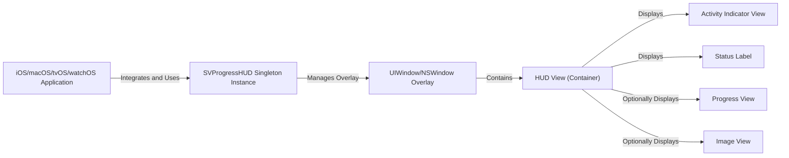
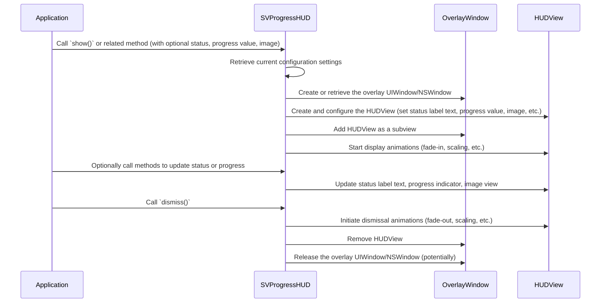

# Project Design Document: SVProgressHUD

**Version:** 1.1
**Date:** October 26, 2023
**Author:** AI Software Architect

## 1. Introduction

This document provides a detailed design overview of the SVProgressHUD library, an open-source library for Apple platforms (iOS, macOS, tvOS, and watchOS) used to display a clean and user-friendly Heads-Up Display (HUD) for indicating activity or progress. This document is intended to serve as a foundation for subsequent threat modeling activities.

## 2. Goals and Objectives

The primary goal of SVProgressHUD is to offer a straightforward and visually appealing method for displaying progress or activity indicators within applications on Apple platforms. Key objectives include:

*   Providing a consistent and native-looking user experience for activity indication across iOS, macOS, tvOS, and watchOS.
*   Offering a range of styles and customization options to match application branding and design.
*   Ensuring ease of integration and usage within existing and new projects.
*   Supporting various types of progress indication, including indeterminate (ongoing activity) and determinate (progress with a specific percentage).
*   Providing mechanisms for displaying informative messages and relevant images alongside the indicator.

## 3. Architectural Overview

SVProgressHUD operates as a client-side library that is integrated directly into the application's user interface layer. It primarily functions on the main thread to ensure smooth and responsive UI updates.

### 3.1. High-Level Architecture

*   **iOS/macOS/tvOS/watchOS Application:** The application that incorporates and utilizes the SVProgressHUD library to display activity indicators.
*   **SVProgressHUD Singleton Instance:** A single, shared instance of the `SVProgressHUD` class manages the lifecycle, presentation, and state of the HUD. This singleton pattern ensures consistent behavior throughout the application.
*   **UIWindow/NSWindow Overlay:** SVProgressHUD creates a new `UIWindow` (on iOS, tvOS, watchOS) or `NSWindow` (on macOS) that overlays the application's existing windows. This ensures the HUD is visually prominent and appears on top of other UI elements.
*   **HUD View (Container):** This is the primary view that acts as a container for all the visual components of the HUD, including the activity indicator, status label, progress view, and image view. It manages the layout and overall appearance of the HUD.
*   **Activity Indicator View:**  A standard platform activity indicator (e.g., `UIActivityIndicatorView`, `NSProgressIndicator`) or a custom animation used to visually represent ongoing, indeterminate activity.
*   **Status Label:** A `UILabel` (or platform equivalent) used to display a textual message or status update to the user.
*   **Progress View:** A view (e.g., `UIProgressView`, `NSProgressIndicator`) used to display determinate progress, often represented by a progress bar or a circular progress indicator.
*   **Image View:** An `UIImageView` (or platform equivalent) used to display an image, typically used to indicate success, error, or other specific states.

### 3.2. Detailed Component Description

*   **`SVProgressHUD` Class:**
    *   **Singleton Management:** Responsible for managing the single, shared instance of the `SVProgressHUD` class, ensuring only one HUD is active at a time.
    *   **Public API:** Provides static methods for controlling the HUD's visibility and content, such as `show()`, `show(withStatus:)`, `showProgress(_:status:)`, `showImage(_:status:)`, and `dismiss()`.
    *   **Overlay Window Management:** Handles the creation, presentation, and dismissal of the overlay `UIWindow` or `NSWindow`.
    *   **HUD View Management:** Creates and manages the `HUDView` instance, configuring its subviews based on the provided parameters and current settings.
    *   **Configuration Handling:** Stores and applies configuration settings such as default style, mask type, animation type, foreground color, background color, and font.
    *   **State Management:** Maintains the internal state of the HUD, including whether it's visible, the current status message, progress value, and displayed image.
    *   **Animation Control:** Manages the animations for showing and dismissing the HUD, providing visual transitions.
    *   **User Interaction Blocking (Optional):** Implements the logic for optionally blocking user interaction with the underlying application while the HUD is visible.
*   **`SVIndefiniteAnimatedView` (for indeterminate progress):**
    *   **Custom Animation Rendering:**  Responsible for rendering the visual animation for indeterminate progress, typically a spinning circle or similar animation.
    *   **Drawing Implementation:** Utilizes Core Graphics (or platform equivalents) to draw the animation frames.
    *   **Animation Timing:** Manages the timing and duration of the animation.
*   **`SVProgressAnimatedView` (for determinate progress):**
    *   **Determinate Progress Visualization:**  Responsible for visually representing determinate progress, often as a filled circle or a progress bar.
    *   **Progress Value Display:** Updates the visual representation based on the current progress value (typically between 0 and 1).
    *   **Drawing Implementation:** Uses Core Graphics (or platform equivalents) to draw the progress indicator.
*   **Configuration Properties (e.g., `defaultStyle`, `defaultMaskType`, `foregroundColor`):**
    *   **Customization:**  Provide developers with options to customize the appearance and behavior of the HUD to match their application's design.
    *   **Global Settings:** These properties often act as global defaults for the HUD's appearance.

## 4. Data Flow

The typical sequence of actions and data flow when using SVProgressHUD involves the following steps:

1. The application initiates the display of the HUD by invoking a static method on the `SVProgressHUD` class, such as `show()`, `show(withStatus:)`, or `showProgress(_:status:)`. This call may include optional parameters like a status message, progress value, or an image.
2. `SVProgressHUD` retrieves the current configuration settings, which determine the HUD's appearance and behavior.
3. `SVProgressHUD` creates a new overlay `UIWindow` (or `NSWindow`) if one doesn't already exist, or retrieves the existing one. This overlay will host the HUD.
4. A `HUDView` instance is created and configured. This involves setting the text of the status label, the value of the progress indicator (if applicable), and the image to be displayed (if any).
5. The configured `HUDView` is added as a subview to the overlay window, making it visible on the screen.
6. Animations for displaying the HUD, such as fade-in or scaling effects, are started to provide a smooth visual transition.
7. While the HUD is visible, the application can optionally call methods on `SVProgressHUD` to update the status message or the progress value.
8. The `HUDView` is updated to reflect the new status message, progress value, or image.
9. When the activity is completed or the user action is done, the application calls the `dismiss()` method on `SVProgressHUD`.
10. The `HUDView` initiates dismissal animations, such as fade-out or scaling effects.
11. The `HUDView` is removed from the overlay window's hierarchy.
12. The overlay window might be released or hidden, depending on the implementation and whether it's intended to be reused.

## 5. Security Considerations (For Threat Modeling)

While SVProgressHUD primarily focuses on UI presentation, several potential security considerations are relevant for threat modeling:

*   **UI Redressing/Clickjacking Potential:**
    *   **Threat:** A malicious application or attacker could potentially overlay deceptive UI elements on top of or around the SVProgressHUD, tricking users into performing unintended actions.
    *   **Impact:** Users might be misled into clicking on elements they don't intend to interact with, potentially leading to data breaches, unauthorized actions, or phishing attacks.
    *   **Mitigation:** While SVProgressHUD itself doesn't directly prevent this, developers should be aware of this risk and implement measures to protect against UI redressing at the application level.
*   **Information Disclosure via Status Messages:**
    *   **Threat:** Developers might inadvertently display sensitive information within the HUD's status label, which could be observed by users or captured in screenshots or screen recordings.
    *   **Impact:** Exposure of confidential data, internal system details, or personally identifiable information.
    *   **Mitigation:**  Carefully review the content displayed in the status label and avoid including any sensitive data. Error messages should be generic and not reveal internal workings.
*   **Denial of Service (DoS) via Excessive HUD Display:**
    *   **Threat:** Malicious code or a vulnerability could be exploited to repeatedly or continuously display the HUD, effectively blocking user interaction with the application and leading to a denial of service.
    *   **Impact:**  The application becomes unusable, impacting user experience and potentially causing business disruption.
    *   **Mitigation:** Implement proper error handling and rate limiting to prevent excessive HUD display. Review the logic that controls the HUD's visibility.
*   **Input Validation for Status Messages (Potential Injection):**
    *   **Threat:** If the status message is derived from untrusted user input or external sources without proper sanitization, it could potentially be a vector for injecting malicious code or causing unexpected UI behavior (though less likely in a simple `UILabel`).
    *   **Impact:**  While unlikely to lead to direct code execution in this context, it could cause unexpected UI rendering or potentially be a stepping stone for more sophisticated attacks.
    *   **Mitigation:** Sanitize and validate any external input before displaying it in the status label.
*   **Resource Exhaustion:**
    *   **Threat:** Rapidly showing and dismissing the HUD with complex animations or large images could potentially lead to resource exhaustion, especially on low-powered devices, impacting performance and potentially causing crashes.
    *   **Impact:** Reduced application performance, battery drain, and potential crashes.
    *   **Mitigation:**  Use lightweight animations and optimize image sizes. Avoid excessive rapid showing and dismissing of the HUD.
*   **Accessibility Issues Exploitation:**
    *   **Threat:** If the HUD is not implemented with accessibility in mind (e.g., missing ARIA attributes or proper contrast), attackers might exploit these issues to target users with disabilities.
    *   **Impact:**  Makes the application difficult or impossible to use for users with disabilities, potentially leading to legal and reputational damage.
    *   **Mitigation:** Ensure the HUD adheres to accessibility guidelines (WCAG). Provide alternative text descriptions for images and ensure sufficient color contrast.
*   **Dependency Vulnerabilities:**
    *   **Threat:** Although SVProgressHUD has minimal direct dependencies, vulnerabilities in the underlying platform frameworks (UIKit, AppKit, etc.) could indirectly affect its security.
    *   **Impact:**  Potential for various security vulnerabilities depending on the nature of the underlying framework vulnerability.
    *   **Mitigation:** Keep the development environment and dependencies up-to-date with the latest security patches.

## 6. Dependencies

*   **UIKit (iOS, tvOS):** The fundamental UI framework for building applications on iOS and tvOS, providing essential view classes and drawing capabilities.
*   **AppKit (macOS):** The native UI framework for developing applications on macOS.
*   **WatchKit (watchOS):** The framework for building user interfaces and experiences on watchOS.
*   **Core Graphics (Quartz 2D):** Used for custom drawing and rendering within the indeterminate and determinate progress views.

## 7. Deployment

SVProgressHUD is typically integrated into projects using dependency management tools or by manual inclusion of source files:

*   **CocoaPods:** A widely used dependency manager for Swift and Objective-C projects. Developers specify the dependency in their `Podfile`.
*   **Swift Package Manager (SPM):** Apple's native dependency manager for Swift projects. Developers add the package dependency through Xcode or the `Package.swift` file.
*   **Carthage:** A decentralized dependency manager. Developers list the dependency in their `Cartfile`.
*   **Manual Integration:** Developers can also directly include the source files of SVProgressHUD into their project.

## 8. Future Considerations

*   **Enhanced Accessibility Features:**  Further improvements to ensure the HUD is fully accessible and compliant with the latest accessibility standards, including better support for screen readers and keyboard navigation.
*   **More Granular Customization Options:** Providing developers with even more fine-grained control over the styling and animation of the HUD, potentially through a theming system or more customizable properties.
*   **Built-in Support for Asynchronous Operations:**  Exploring ways to integrate more directly with asynchronous operations, potentially offering callbacks or completion handlers to automatically dismiss the HUD upon completion of a task.
*   **Regular Security Audits and Penetration Testing:**  Conducting periodic security audits and penetration testing to proactively identify and address potential vulnerabilities in the library.
*   **Improved Test Coverage:**  Expanding the unit and UI test suite to ensure the reliability and security of the library across different platforms and configurations.
