# Project Design Document: SVProgressHUD

**Version:** 1.1
**Date:** October 26, 2023
**Author:** AI Software Architect

## 1. Introduction

This document provides an enhanced design overview of the SVProgressHUD project, a widely used iOS and tvOS library for displaying a clean and lightweight Heads-Up Display (HUD) to indicate the progress of ongoing tasks. This document aims to offer a comprehensive understanding of the component's architecture, functionality, and data flow, serving as a robust foundation for subsequent threat modeling activities. We have expanded on the previous version to provide more detail and clarity.

## 2. Goals and Non-Goals

### 2.1. Goals

* Provide a clear, concise, and detailed design overview of the SVProgressHUD library.
* Identify key components, their specific responsibilities, and their interactions.
* Describe the data flow within the library, including key method calls and state transitions.
* Outline the library's integration points with the host application, providing concrete examples.
* Serve as a well-defined foundation for identifying potential security vulnerabilities during threat modeling exercises.

### 2.2. Non-Goals

* Provide a detailed, line-by-line code-level implementation guide.
* Analyze the performance characteristics and optimization strategies of the library.
* Conduct a comparative analysis of SVProgressHUD with other similar HUD libraries.
* Include an exhaustive list of every configurable option and their specific effects.

## 3. Architectural Overview

SVProgressHUD employs a single-view architecture, overlaying its content on top of the application's window. Its design emphasizes ease of use and seamless integration. The central element is the `SVProgressHUD` class, which operates as a singleton, ensuring that only one HUD is visible at any given time. This class manages the entire lifecycle of the HUD, from its presentation to its eventual dismissal.

## 4. Key Components

* **`SVProgressHUD` Class:** The core of the library. This singleton class is responsible for:
    * Managing the HUD's visibility state (showing, dismissing).
    * Creating and configuring the `HUD View`.
    * Handling animation for presentation and dismissal.
    * Managing the display queue for multiple show requests.
    * Providing the public API for interacting with the HUD.
    * Holding configuration settings for the HUD's appearance.
* **HUD View:** A custom `UIView` subclass that encapsulates the visual elements of the HUD. It typically contains:
    * **Background View:** A `UIView` providing the background color and shape of the HUD.
    * **Container View:** A `UIView` that groups the content elements (activity indicator, label, image view).
    * **Activity Indicator View:**  A `UIActivityIndicatorView` (or a customizable alternative) to visually represent ongoing activity.
    * **Status Label:** A `UILabel` for displaying textual messages to the user.
    * **Image View:** A `UIImageView` to display custom images or system-provided success/error icons.
* **Mask View (Optional):** A semi-transparent `UIView` added as an overlay to the application's window. Its purpose is to:
    * Prevent user interaction with the underlying application content while the HUD is active.
    * Provide a visual cue that a background process is in progress.
* **Window Association:** The `HUD View` is dynamically added as a subview to the application's key window or a specific `UIWindow` provided by the developer. This ensures the HUD appears on top of all other content.

## 5. Data Flow

The following diagram illustrates the typical sequence of actions and data flow within SVProgressHUD:

```mermaid
graph LR
    A("Application Code") --> B("SVProgressHUD Singleton");
    B -- "Call show(withStatus:)" --> C("Check Existing HUD & Queue");
    C -- "Create/Reuse HUD View" --> D("Configure HUD View (message, image, etc.)");
    D --> E("Add HUD View & Optional Mask to Window");
    E --> F("Animate HUD In (e.g., fadeIn)");
    F --> G("User Interaction Blocked (if Mask Present)");
    G --> H("Background Task Executes");
    H --> I("Application Code");
    I -- "Call dismiss(withDelay:completion:)" --> J("SVProgressHUD Singleton");
    J --> K("Animate HUD Out (e.g., fadeOut)");
    K --> L("Remove HUD View & Mask from Window");
    L --> M("Release Resources & Notify Completion");
```

**Detailed Data Flow Steps:**

* **Application Initiates Show:** The application code invokes a static `show` method on the `SVProgressHUD` singleton, potentially providing a status message or an image (e.g., `SVProgressHUD.show(withStatus: "Loading...")`).
* **Check Existing HUD & Queue:** The singleton checks if a HUD is already being displayed. If so, the new request might be queued depending on the configuration.
* **Create/Reuse HUD View:** The `SVProgressHUD` singleton either creates a new `HUD View` instance or reuses an existing one if appropriate.
* **Configure HUD View:** The singleton configures the visual elements of the `HUD View` based on the parameters passed in the `show` method. This includes setting the text of the `Status Label`, the image in the `Image View`, and potentially adjusting the size of the container.
* **Add to Window:** The configured `HUD View` and the optional `Mask View` are added as subviews to the designated `UIWindow`.
* **Animate In:** The `HUD View` is animated into view, typically using a fade-in or a custom animation.
* **User Interaction Blocking:** If the `Mask View` is enabled, it intercepts user input events, preventing interaction with the underlying application.
* **Background Task Execution:** The application proceeds with the background task for which the progress HUD was displayed.
* **Application Initiates Dismissal:** Once the background task is complete or an error occurs, the application code calls a static dismiss method on the `SVProgressHUD` singleton (e.g., `SVProgressHUD.dismiss(withDelay: 0.5) { /* completion handler */ }`).
* **Animate Out:** The `HUD View` is animated out of view, typically using a fade-out or a custom animation.
* **Remove from Window:** The `HUD View` and the `Mask View` are removed from the `UIWindow`'s subviews.
* **Release Resources & Notify:** The `SVProgressHUD` singleton may release any associated resources and execute the provided completion handler, if any.

## 6. Integration Points

SVProgressHUD offers several integration points for developers:

* **Showing the HUD:**
    * `show()`: Displays a simple, indeterminate progress HUD.
    * `show(withStatus:)`: Displays a progress HUD with a textual status message.
    * `showProgress(_:)`: Displays a progress HUD with a numerical progress indicator.
    * `showImage(_:status:)`: Displays a progress HUD with a custom image and an optional status message.
* **Dismissing the HUD:**
    * `dismiss()`: Immediately dismisses the currently displayed HUD.
    * `dismiss(withDelay:)`: Dismisses the HUD after a specified delay.
    * `showSuccess(withStatus:)`: Displays a success indicator with an optional status message before dismissing.
    * `showError(withStatus:)`: Displays an error indicator with an optional status message before dismissing.
* **Configuration:** Static properties on the `SVProgressHUD` class allow extensive customization of the HUD's appearance. Examples include:
    * `foregroundColor`: Sets the color of the text and activity indicator.
    * `backgroundColor`: Sets the background color of the HUD.
    * `font`:  Customizes the font used for the status message.
    * `cornerRadius`:  Adjusts the corner radius of the HUD's background.
    * `defaultMaskType`:  Controls the appearance of the optional mask view.
* **Notifications (Optional):** SVProgressHUD posts `NSNotification`s when the HUD is shown or dismissed. This allows other parts of the application to observe these events and react accordingly. Examples include `SVProgressHUDDidReceiveTouchEventNotification` and `SVProgressHUDDidFinishDismissAnimationNotification`.

## 7. Security Considerations (Pre-Threat Model)

While SVProgressHUD primarily focuses on UI presentation, several security considerations are relevant for threat modeling:

* **Information Disclosure via Status Messages:** If sensitive data is directly displayed in the HUD's status label without proper redaction or sanitization, it could be exposed to the user. For example, displaying error messages containing internal server details.
* **UI Blocking/Denial of Service (DoS):** Although less likely in typical usage, a malicious actor could potentially trigger rapid and repeated calls to `show()` without corresponding `dismiss()` calls, potentially leading to UI unresponsiveness or excessive resource consumption.
* **Accessibility Vulnerabilities:** Incorrectly configured HUDs might not adhere to accessibility guidelines, potentially hindering users with disabilities. This could be considered a security concern from a compliance perspective. For instance, insufficient color contrast or lack of proper screen reader support.
* **Dependency Chain Vulnerabilities:** While SVProgressHUD has minimal direct dependencies, vulnerabilities in the underlying UIKit framework could indirectly impact its security.
* **Input Sanitization for Status Messages (Potential UI Injection):** If user-provided input is directly used as the HUD's status message without proper sanitization, it could theoretically lead to UI injection vulnerabilities, although this is less probable with standard `UILabel` usage. However, if custom rendering or attributed strings are used, this risk increases.
* **Tap Gesture Handling:**  Consider the security implications if custom tap gestures are added to the HUD or its subviews. Malicious code could potentially intercept these gestures.
* **Notification Handling:** If the application relies on SVProgressHUD's notifications for critical logic, a malicious actor might try to spoof or interfere with these notifications.

## 8. Deployment

SVProgressHUD is commonly deployed as a library integrated into iOS or tvOS applications. Standard integration methods include:

* **CocoaPods:**  Specify the dependency in the `Podfile`: `pod 'SVProgressHUD'`.
* **Carthage:** Add the repository to the `Cartfile`: `github "SVProgressHUD/SVProgressHUD"`.
* **Swift Package Manager (SPM):** Add the repository URL as a package dependency within Xcode.
* **Manual Integration:**  Copying the source files directly into the project's file structure.

## 9. Dependencies

SVProgressHUD has very few external dependencies. Its primary and essential dependency is on Apple's **UIKit** framework, which provides the fundamental building blocks for creating iOS and tvOS user interfaces.

## 10. Future Considerations

* **Enhanced Customization Options:**  Future iterations might introduce more granular control over the appearance and behavior of individual HUD elements.
* **Advanced Animation Techniques:** Exploring more sophisticated and visually appealing animation options for showing and dismissing the HUD.
* **Improved Accessibility Support:**  Continuous efforts to enhance accessibility features and ensure compliance with accessibility standards.
* **Asynchronous Operations Handling:**  Potentially providing more built-in mechanisms for managing HUD display in conjunction with asynchronous tasks.

This revised document provides a more detailed and structured understanding of the SVProgressHUD project's design. This enhanced information will be invaluable for conducting a comprehensive threat model to identify and effectively mitigate potential security risks associated with its integration and use within applications.