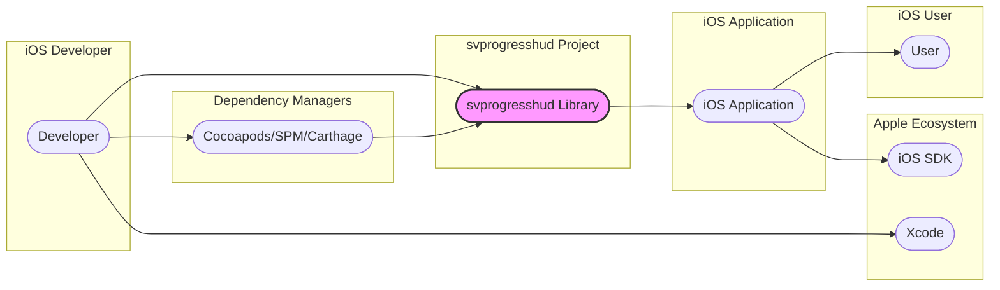
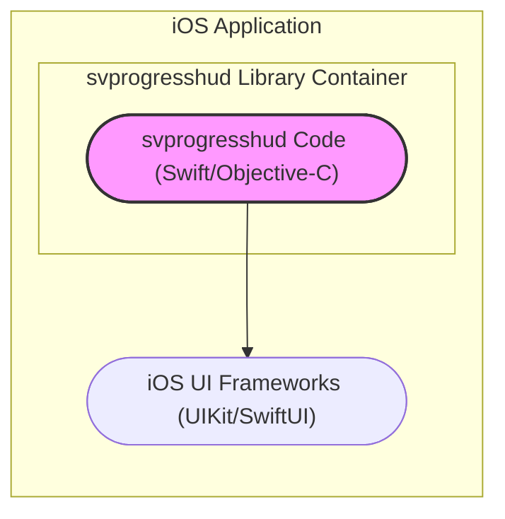
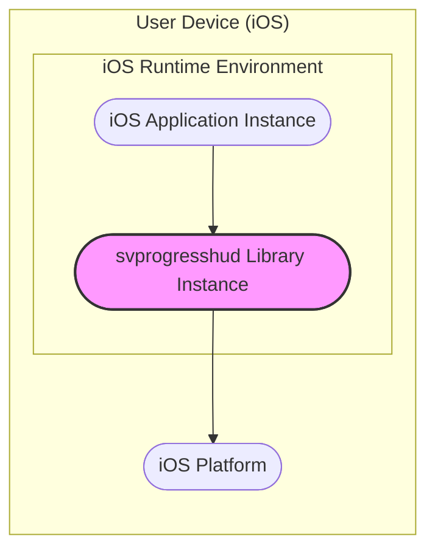
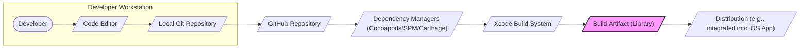

# BUSINESS POSTURE

- Business Priorities and Goals:
  - Provide a reusable, easy-to-integrate, and visually appealing progress HUD component for iOS application developers.
  - Enhance the user experience of iOS applications by providing clear visual feedback during loading and background operations.
  - Improve developer productivity by offering a well-documented and customizable progress HUD library.
  - Maintain compatibility with a wide range of iOS versions and devices.
- Business Risks:
  - Risk of introducing UI glitches or performance issues in applications using the library.
  - Risk of compatibility issues with new iOS versions or device types, leading to application crashes or unexpected behavior.
  - Risk of developer dissatisfaction due to complex integration, lack of customization, or poor documentation, hindering adoption.
  - While less critical for a UI library, there is a minor risk of subtle security vulnerabilities that could be exploited if the library handles user input or interacts with sensitive APIs in unexpected ways.

# SECURITY POSTURE

- Existing Security Controls:
  - security control: Source code hosted on GitHub, providing version control and transparency. (Implemented: GitHub Repository)
  - security control: Publicly available code, allowing for community review and scrutiny. (Implemented: GitHub Repository)
  - security control: Use of standard iOS development tools and SDKs. (Implemented: Development Environment)
- Accepted Risks:
  - accepted risk: Low inherent security risk due to the nature of a UI library, which primarily focuses on visual presentation and does not typically handle sensitive data or core application logic.
  - accepted risk: Reliance on the security of the underlying iOS platform and development tools.
- Recommended Security Controls:
  - security control: Implement automated dependency scanning to identify and address vulnerabilities in third-party dependencies.
  - security control: Integrate static analysis security testing (SAST) tools into the development workflow to identify potential code-level security issues.
  - security control: Conduct regular code reviews, including security-focused reviews, to identify and mitigate potential vulnerabilities.
- Security Requirements:
  - Authentication: Not applicable. The library itself does not handle user authentication. Applications using the library are responsible for their own authentication mechanisms.
  - Authorization: Not applicable. The library does not enforce authorization. Authorization is the responsibility of the applications using the library.
  - Input Validation: Implement input validation for any configurable parameters or API inputs to prevent unexpected behavior or potential vulnerabilities. While a progress HUD library might have limited input, ensure any input is validated against expected types and ranges.
  - Cryptography: Not applicable. The library is not expected to handle cryptographic operations. If cryptographic functionality is needed in applications, it should be implemented by the application itself, not within the UI library.

# DESIGN

## C4 CONTEXT

### Context Diagram Elements

- Element:
  - Name: User
  - Type: Person
  - Description: End-user of iOS applications that integrate the svprogresshud library.
  - Responsibilities: Interacting with iOS applications and experiencing the progress HUD provided by the library.
  - Security controls: None directly related to the library. User device security is managed by the user and the iOS platform.
- Element:
  - Name: Developer
  - Type: Person
  - Description: iOS application developer who integrates the svprogresshud library into their applications.
  - Responsibilities: Integrating the library, configuring it, and ensuring it functions correctly within their applications.
  - Security controls: Responsible for securely integrating the library and ensuring no vulnerabilities are introduced in their application through misuse or misconfiguration of the library.
- Element:
  - Name: iOS Application
  - Type: Software System
  - Description: iOS application that utilizes the svprogresshud library to display progress indicators to the user.
  - Responsibilities: Providing application functionality to the user, including displaying progress HUDs using the library when necessary.
  - Security controls: Responsible for the overall security of the application, including secure data handling, authentication, authorization, and proper usage of third-party libraries like svprogresshud.
- Element:
  - Name: svprogresshud Library
  - Type: Software System
  - Description: The svprogresshud UI library project, providing the progress HUD functionality.
  - Responsibilities: Providing a reliable, customizable, and easy-to-use progress HUD component for iOS developers.
  - Security controls: Ensuring the library code is free from vulnerabilities, following secure coding practices, and providing clear documentation for secure integration.
- Element:
  - Name: Cocoapods/SPM/Carthage
  - Type: Software System
  - Description: Dependency managers used by iOS developers to integrate third-party libraries like svprogresshud into their projects.
  - Responsibilities: Managing dependencies, downloading and integrating libraries into developer projects.
  - Security controls: Rely on the security of the dependency manager platforms and package repositories. Developers should use trusted sources and verify package integrity.
- Element:
  - Name: iOS SDK
  - Type: Software System
  - Description: Apple's iOS Software Development Kit, providing the core APIs and frameworks for iOS application development.
  - Responsibilities: Providing the foundation for iOS application development and the runtime environment for applications using svprogresshud.
  - Security controls: Security is managed by Apple. svprogresshud relies on the security of the iOS SDK.
- Element:
  - Name: Xcode
  - Type: Software System
  - Description: Apple's Integrated Development Environment (IDE) used by iOS developers to build and develop iOS applications.
  - Responsibilities: Providing tools for coding, building, debugging, and deploying iOS applications.
  - Security controls: Security of the development environment is important. Developers should use trusted and updated versions of Xcode.

## C4 CONTAINER

### Container Diagram Elements

- Element:
  - Name: svprogresshud Code (Swift/Objective-C)
  - Type: Container - Library
  - Description: The compiled Swift and/or Objective-C code of the svprogresshud library. This is the core component providing the progress HUD functionality.
  - Responsibilities: Implementing the logic for displaying and managing progress HUDs, providing APIs for customization and control.
  - Security controls: Code-level security practices, input validation for API parameters, dependency scanning for any internal dependencies (though unlikely for a UI library of this type).
- Element:
  - Name: iOS UI Frameworks (UIKit/SwiftUI)
  - Type: Container - Framework
  - Description: Apple's UI frameworks (UIKit or SwiftUI) used by the svprogresshud library to render the UI components of the progress HUD.
  - Responsibilities: Providing the underlying UI rendering capabilities for the progress HUD.
  - Security controls: Security is managed by Apple as part of the iOS platform. svprogresshud relies on the security of these frameworks.

## DEPLOYMENT

### Deployment Diagram Elements

- Element:
  - Name: iOS Application Instance
  - Type: Deployment Node - Software Instance
  - Description: A running instance of an iOS application that has integrated the svprogresshud library.
  - Responsibilities: Executing the application logic, including using the svprogresshud library to display progress HUDs to the user.
  - Security controls: Application-level security controls, including secure data handling, session management, and protection against application-level vulnerabilities.
- Element:
  - Name: svprogresshud Library Instance
  - Type: Deployment Node - Software Instance
  - Description: An instance of the svprogresshud library running within the context of the iOS application instance.
  - Responsibilities: Providing the progress HUD functionality to the application instance.
  - Security controls: Inherits the security context of the iOS application instance. Library code is executed within the application's sandbox.
- Element:
  - Name: iOS Platform
  - Type: Deployment Node - Infrastructure
  - Description: The underlying iOS operating system and hardware on the user's device.
  - Responsibilities: Providing a secure and isolated environment for running iOS applications and libraries.
  - Security controls: Managed by Apple. Includes operating system security features, sandboxing, and security updates.

## BUILD

### Build Diagram Elements

- Element:
  - Name: Developer
  - Type: Person
  - Description: Software developer writing and maintaining the svprogresshud library code.
  - Responsibilities: Writing code, committing changes, and ensuring code quality.
  - Security controls: Secure coding practices, code reviews, and using secure development workstations.
- Element:
  - Name: Code Editor
  - Type: Tool
  - Description: IDE or text editor used by the developer to write code.
  - Responsibilities: Providing a development environment for writing and editing code.
  - Security controls: Developer workstation security, secure editor configurations.
- Element:
  - Name: Local Git Repository
  - Type: Data Store
  - Description: Local Git repository on the developer's workstation for version control.
  - Responsibilities: Tracking code changes and enabling version control.
  - Security controls: Access control to the developer's workstation.
- Element:
  - Name: GitHub Repository
  - Type: Software System - Version Control
  - Description: Central Git repository hosted on GitHub, used for source code management and collaboration.
  - Responsibilities: Hosting the source code, managing versions, and facilitating collaboration.
  - Security controls: GitHub's security controls, including access control, authentication, and audit logs.
- Element:
  - Name: Dependency Managers (Cocoapods/SPM/Carthage)
  - Type: Software System - Package Management
  - Description: Dependency managers used to distribute and integrate the library.
  - Responsibilities: Packaging and distributing the library, managing dependencies for developers.
  - Security controls: Security of the dependency manager platforms, package integrity checks (if available).
- Element:
  - Name: Xcode Build System
  - Type: Tool - Build System
  - Description: Apple's Xcode build system used to compile and build the library.
  - Responsibilities: Compiling the source code, linking dependencies, and creating the build artifact.
  - Security controls: Rely on the security of the Xcode build environment and toolchain.
- Element:
  - Name: Build Artifact (Library)
  - Type: Data Store - File
  - Description: The compiled library file (e.g., .framework, .xcframework) produced by the build process.
  - Responsibilities: Containing the compiled code of the library, ready for distribution and integration.
  - Security controls: Integrity of the build artifact, secure storage and distribution.
- Element:
  - Name: Distribution (e.g., integrated into iOS App)
  - Type: Process
  - Description: The process of distributing and integrating the build artifact into iOS applications.
  - Responsibilities: Making the library available to developers for integration into their projects.
  - Security controls: Secure distribution channels, verification of library integrity by developers.

# RISK ASSESSMENT

- Critical Business Processes:
  - Adoption and integration of the svprogresshud library by iOS developers.
  - Maintaining the library's functionality, compatibility, and ease of use.
- Data to Protect and Sensitivity:
  - Source code of the svprogresshud library. Sensitivity: Publicly available on GitHub, but maintaining integrity and preventing unauthorized modifications is important.
  - Build artifacts (compiled library). Sensitivity: Should be trustworthy and free from malware.

# QUESTIONS & ASSUMPTIONS

- Questions:
  - Are there any specific regulatory compliance requirements for applications that might use this library (e.g., accessibility standards)?
  - Are there any performance benchmarks or targets for the library that need to be considered from a security perspective (e.g., avoiding performance bottlenecks that could be exploited)?
  - What is the expected lifespan and maintenance plan for the library?
- Assumptions:
  - The primary use case is displaying non-sensitive progress information to users.
  - The library is intended to be used in a wide range of iOS applications, from small to large scale.
  - Developers integrating the library are responsible for the overall security of their applications.
  - Security vulnerabilities in the UI library are considered to have a lower impact compared to vulnerabilities in core application logic or data handling components.
  - The library does not handle any user data directly and primarily interacts with iOS UI frameworks.