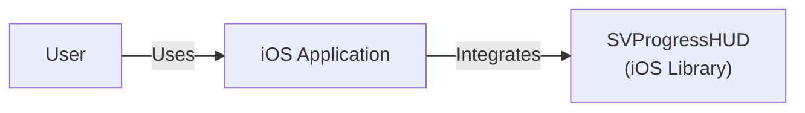
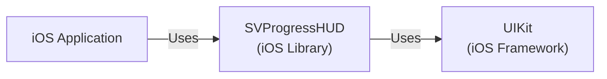
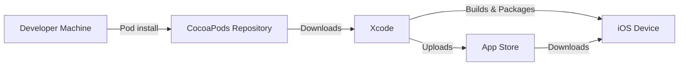
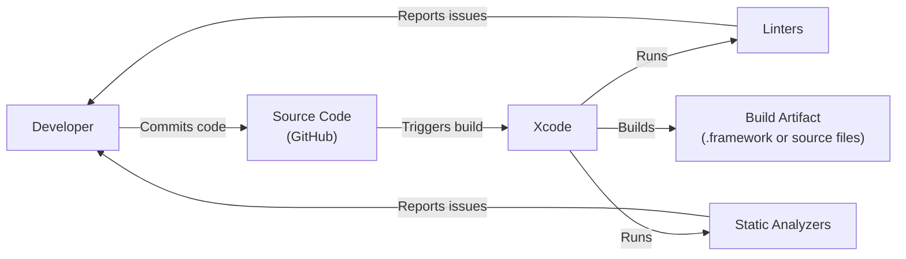

# BUSINESS POSTURE

Business Priorities and Goals:

*   Provide a lightweight, easy-to-use, and visually appealing progress HUD for iOS applications.
*   Offer a clean and simple API for developers to integrate the HUD into their apps.
*   Maintain high performance and minimal impact on the app's overall responsiveness.
*   Ensure compatibility with a wide range of iOS versions and devices.
*   Provide customization options to match the app's branding and UI style.
*   Maintain an active and responsive open-source project, addressing user issues and contributions.

Business Risks:

*   Negative user reviews due to UI glitches, performance issues, or compatibility problems.
*   Security vulnerabilities that could be exploited by malicious actors.
*   Lack of adoption by developers due to complexity or limited functionality.
*   Inability to keep up with new iOS releases and features, leading to obsolescence.
*   Reputational damage due to unresolved issues or lack of maintenance.

# SECURITY POSTURE

Existing Security Controls:

*   security control: The project is open-source, allowing for community review and contributions to identify and fix potential security issues. (Described in the GitHub repository's README and contribution guidelines).
*   security control: The project uses standard iOS APIs and frameworks, reducing the risk of introducing custom vulnerabilities. (Implemented in the project's source code).
*   security control: The project is relatively simple in scope, minimizing the attack surface. (Described in the project's functionality and architecture).

Accepted Risks:

*   accepted risk: The project does not handle sensitive user data directly, reducing the impact of potential data breaches.
*   accepted risk: The project relies on the security of the underlying iOS platform and its APIs.

Recommended Security Controls:

*   security control: Implement regular security audits and code reviews to identify and address potential vulnerabilities.
*   security control: Integrate static analysis tools into the development workflow to catch common coding errors and security flaws.
*   security control: Consider using a dependency management system to track and update third-party libraries, reducing the risk of supply chain attacks.
*   security control: Provide clear documentation on secure usage of the library, including best practices for developers.

Security Requirements:

*   Authentication: Not applicable, as the library does not handle user authentication.
*   Authorization: Not applicable, as the library does not manage user roles or permissions.
*   Input Validation:
    *   The library should validate user-provided input, such as text and images, to prevent potential injection attacks or crashes.
    *   Ensure that input lengths are within reasonable limits to avoid buffer overflows.
*   Cryptography: Not directly applicable, but if the library ever handles sensitive data, it should use appropriate cryptographic algorithms and secure key management practices.

# DESIGN

## C4 CONTEXT

Context Diagram Elements:

*   Element:
    *   Name: User
    *   Type: Person
    *   Description: The end-user interacting with the iOS application.
    *   Responsibilities: Interacts with the iOS application, triggering actions that may display the progress HUD.
    *   Security controls: Relies on the security of the iOS device and the application.
*   Element:
    *   Name: SVProgressHUD
    *   Type: Software System (Library)
    *   Description: A clean and easy-to-use HUD meant to display the progress of an ongoing task on iOS.
    *   Responsibilities: Provides a visual indication of progress, blocking the user interface while a task is in progress.
    *   Security controls: Input validation, relies on iOS platform security.
*   Element:
    *   Name: iOS Application
    *   Type: Software System
    *   Description: The iOS application that integrates the SVProgressHUD library.
    *   Responsibilities: Performs tasks that require displaying a progress HUD, manages user interactions, and handles application logic.
    *   Security controls: Application-specific security controls, secure coding practices.

## C4 CONTAINER

Container Diagram Elements:

*   Element:
    *   Name: iOS Application
    *   Type: Software System
    *   Description: The iOS application that integrates the SVProgressHUD library.
    *   Responsibilities: Performs tasks that require displaying a progress HUD, manages user interactions, and handles application logic.
    *   Security controls: Application-specific security controls, secure coding practices.
*   Element:
    *   Name: SVProgressHUD
    *   Type: Library
    *   Description: A clean and easy-to-use HUD meant to display the progress of an ongoing task on iOS.
    *   Responsibilities: Provides a visual indication of progress, blocking the user interface while a task is in progress. Manages its own UI elements and presentation.
    *   Security controls: Input validation, relies on iOS platform security.
*   Element:
    *   Name: UIKit
    *   Type: Framework
    *   Description: Apple's UIKit framework, providing essential UI components and infrastructure for iOS apps.
    *   Responsibilities: Provides UI elements (windows, views, controls), handles user input, manages layout and rendering.
    *   Security controls: Relies on iOS platform security, sandboxing, and built-in security features.

## DEPLOYMENT

Deployment Solutions:

1.  CocoaPods: Developers integrate SVProgressHUD into their projects using CocoaPods, a dependency manager for Swift and Objective-C projects.
2.  Carthage: Another dependency manager that can be used to integrate SVProgressHUD.
3.  Swift Package Manager: Apple's built-in package manager, also a viable option.
4.  Manual Integration: Developers can manually add the SVProgressHUD source files to their Xcode project.

Chosen Solution (CocoaPods):

Deployment Diagram Elements:

*   Element:
    *   Name: Developer Machine
    *   Type: Workstation
    *   Description: The developer's computer where the iOS application is developed and built.
    *   Responsibilities: Hosts the development environment (Xcode), manages source code, and initiates the build process.
    *   Security controls: Developer machine security, secure coding practices.
*   Element:
    *   Name: CocoaPods Repository
    *   Type: Server
    *   Description: The central repository for CocoaPods packages.
    *   Responsibilities: Stores and serves SVProgressHUD and other libraries.
    *   Security controls: Repository security, access controls, integrity checks.
*   Element:
    *   Name: Xcode
    *   Type: Software
    *   Description: Apple's Integrated Development Environment (IDE) for iOS development.
    *   Responsibilities: Manages project files, compiles code, links libraries, and builds the application package.
    *   Security controls: Relies on macOS security, code signing.
*   Element:
    *   Name: iOS Device
    *   Type: Device
    *   Description: The target device (iPhone, iPad) where the application is deployed.
    *   Responsibilities: Runs the iOS application, including the integrated SVProgressHUD.
    *   Security controls: iOS platform security, sandboxing, app review process (if distributed through the App Store).
*   Element:
    *   Name: App Store
    *   Type: Server
    *   Description: Apple's platform for distributing iOS applications.
    *   Responsibilities: Hosts and delivers applications to users.
    *   Security controls: Apple's App Store security, app review process, code signing verification.

## BUILD

Build Process Description:

1.  Developer: The developer writes code and commits changes to the GitHub repository.
2.  Source Code (GitHub): The GitHub repository hosts the project's source code.
3.  Xcode: The developer uses Xcode to build the project. This can be triggered manually or through a continuous integration (CI) system.
4.  Linters: Linters (e.g., SwiftLint) are run as part of the build process to enforce code style and identify potential issues.
5.  Static Analyzers: Static analysis tools (e.g., Xcode's built-in analyzer) are used to detect potential bugs and security vulnerabilities.
6.  Build Artifact: The build process produces either a compiled framework (.framework) or the source files themselves, depending on how the library is integrated (e.g., via CocoaPods, Carthage, or manual integration).

Security Controls in Build Process:

*   security control: Code review: Pull requests on GitHub are reviewed by other developers before being merged.
*   security control: Linters: Enforce code style and identify potential issues.
*   security control: Static Analyzers: Detect potential bugs and security vulnerabilities.
*   security control: Dependency Management (CocoaPods, Carthage, SPM): Helps manage and update third-party libraries, reducing the risk of using outdated or vulnerable dependencies.

# RISK ASSESSMENT

Critical Business Processes:

*   Displaying progress of ongoing tasks within iOS applications.
*   Providing a smooth and responsive user experience.

Data Protection:

*   SVProgressHUD itself does not handle sensitive user data directly. The primary concern is the integrity and availability of the library itself, ensuring it functions as expected and does not introduce vulnerabilities into the integrating application.
*   Data Sensitivity: Low (for the library itself). The sensitivity of data handled by the integrating application is outside the scope of this assessment.

# QUESTIONS & ASSUMPTIONS

Questions:

*   Are there any specific compliance requirements (e.g., HIPAA, GDPR) that the integrating application must adhere to? (This would influence recommendations for the integrating application, but not directly for SVProgressHUD).
*   What is the expected frequency of updates and releases for SVProgressHUD?
*   What is the process for handling security vulnerabilities reported by external researchers or users?

Assumptions:

*   BUSINESS POSTURE: The primary goal is to provide a functional and reliable progress HUD library. User experience and ease of integration are prioritized.
*   SECURITY POSTURE: The project relies on the security of the underlying iOS platform and standard APIs. The developers are assumed to follow secure coding practices.
*   DESIGN: The library is designed to be lightweight and have minimal impact on the performance of the integrating application. The provided C4 diagrams are accurate representations of the system's context and containers. The deployment process via CocoaPods is representative of a common integration method.