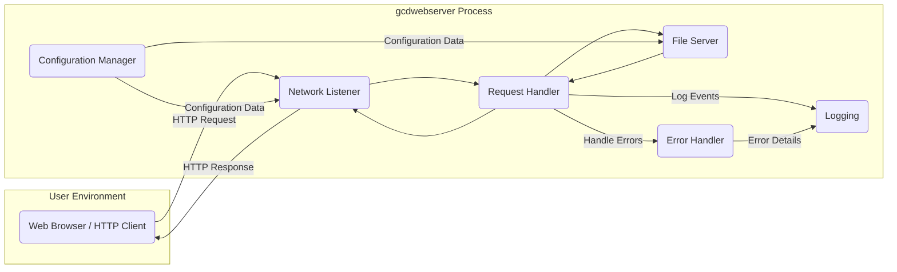
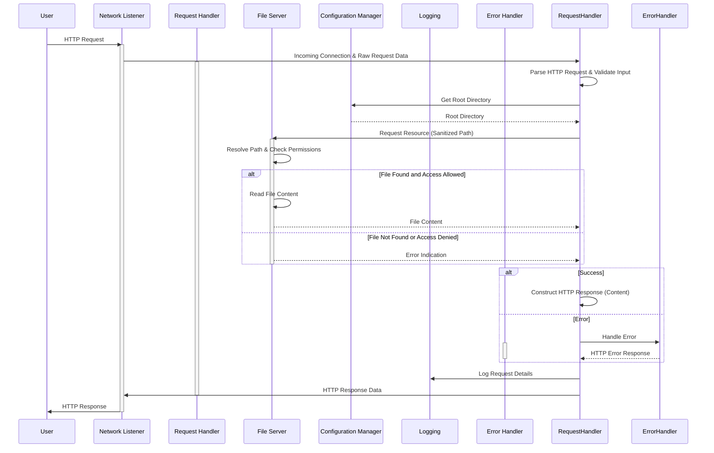

# Project Design Document: gcdwebserver

**Version:** 1.1
**Date:** October 26, 2023
**Prepared By:** Gemini (AI Model)

## 1. Introduction

This document provides an enhanced and more detailed design overview of the `gcdwebserver` project, a simple web server written in Go. The primary purpose of this document is to serve as a robust foundation for subsequent threat modeling activities by clearly articulating the system's architecture, components, data flow, and crucial security considerations. This document aims to provide a comprehensive understanding of the system's potential attack surface and vulnerabilities.

### 1.1. Purpose

This document aims to provide a comprehensive and improved architectural description of the `gcdwebserver` application, focusing on aspects relevant to security analysis. It will be used as the primary input for a thorough threat modeling exercise to identify potential security risks and vulnerabilities.

### 1.2. Scope

This document covers the design of the `gcdwebserver` application as it is described in the provided GitHub repository: [https://github.com/swisspol/gcdwebserver](https://github.com/swisspol/gcdwebserver). The focus remains on the core functionality of serving static files over HTTP, but with greater detail on security-relevant aspects.

### 1.3. Goals

*   Clearly and comprehensively define the system's architecture and components, with a focus on security implications.
*   Describe the data flow within the application in detail, highlighting potential interception and manipulation points.
*   Explicitly identify key areas, interactions, and data transformations relevant to security.
*   Provide a solid and detailed basis for identifying potential threats, vulnerabilities, and attack vectors.

## 2. System Overview

The `gcdwebserver` is a lightweight, command-line driven web server designed to serve static files from a specified directory. It listens for HTTP requests on a configurable port and responds with the content of the requested files or a directory listing if explicitly configured and no specific file is requested within a directory.

### 2.1. High-Level Architecture

**Components:**

*   **User (Web Browser / HTTP Client):** The external entity initiating HTTP requests to interact with the `gcdwebserver`. This represents an untrusted source of input.
*   **gcdwebserver Process:** The core application running on the server.
    *   **Network Listener:**  Responsible for binding to a specified network interface and port, listening for incoming TCP connection requests. It accepts new connections, establishing communication channels for each request.
    *   **Request Handler:** The central component responsible for processing individual HTTP requests. It receives raw data from the Network Listener, parses the HTTP request (including method, headers, and URI), and orchestrates the retrieval of the requested resource.
    *   **File Server:**  Responsible for locating and retrieving static files from the designated root directory on the file system. It handles path resolution and file access.
    *   **Configuration Manager:**  Responsible for loading and managing the server's configuration parameters, such as the listening port and the root directory for serving files. This might involve reading command-line arguments or a configuration file.
    *   **Logging:**  Responsible for recording events, such as received requests, served files, and errors. This is crucial for auditing and debugging.
    *   **Error Handler:**  Responsible for managing errors that occur during request processing, such as file not found errors or internal server errors. It generates appropriate HTTP error responses.

### 2.2. Key Interactions

*   A **User** sends an **HTTP Request** to the `gcdwebserver`.
*   The **Network Listener** accepts the incoming TCP connection.
*   The **Request Handler** receives the raw request data.
*   The **Request Handler** parses the **HTTP Request**, extracting the requested URI and other headers.
*   The **Request Handler** consults the **Configuration Manager** for the server's root directory.
*   The **Request Handler** passes the requested resource path to the **File Server**.
*   The **File Server** attempts to locate and retrieve the requested resource from the configured root directory on the file system.
*   If the resource is found, the **File Server** reads the file content and provides it to the **Request Handler**.
*   If the resource is a directory and directory listing is enabled (if implemented), the **File Server** generates an HTML listing of the directory contents.
*   If the resource is not found, the **File Server** signals an error to the **Request Handler**.
*   The **Request Handler** uses the **Error Handler** to generate an appropriate HTTP error response (e.g., 404 Not Found).
*   The **Request Handler** constructs the **HTTP Response**, including headers (e.g., Content-Type, Content-Length) and the response body (file content or error message).
*   The **Request Handler** sends relevant events to the **Logging** component.
*   The **Network Listener** sends the **HTTP Response** back to the **User**.

## 3. Detailed Design

This section provides a more granular view of the individual components and their functionalities, with a strong emphasis on security considerations.

### 3.1. Network Listener

*   **Functionality:**
    *   Binds to a specified IP address and port, as configured by the **Configuration Manager**.
    *   Listens for incoming TCP connection requests.
    *   Accepts new connections, establishing a dedicated socket for communication with the client.
    *   Passes the established connection to the **Request Handler**.
*   **Configuration:** The listening port and potentially the listening address are configurable parameters.
*   **Security Considerations:**
    *   **Exposure to Network Attacks:** If the server is exposed to a public network without proper firewall rules, it's vulnerable to various network-based attacks.
    *   **Denial of Service (DoS):** Susceptible to SYN flood attacks or other connection exhaustion attacks that can overwhelm the listener.
    *   **Information Disclosure:**  Potentially leak information about the server if error messages during connection establishment are too verbose.

### 3.2. Request Handler

*   **Functionality:**
    *   Receives raw byte streams from the **Network Listener**.
    *   Parses the HTTP request according to HTTP specifications, including the request method (e.g., GET), URI, headers, and potentially body.
    *   Performs URI decoding and normalization.
    *   Determines the target resource based on the parsed URI.
    *   Interacts with the **File Server** to retrieve the requested resource.
    *   Constructs the HTTP response, setting appropriate headers based on the retrieved content or error status.
    *   Handles errors by invoking the **Error Handler**.
    *   Logs request details using the **Logging** component.
*   **Security Considerations:**
    *   **HTTP Request Smuggling:** Vulnerable to attacks exploiting ambiguities in parsing HTTP requests if not strictly adhering to specifications.
    *   **Path Traversal:** If the URI is not properly sanitized and validated, attackers could manipulate it to access files outside the intended root directory (e.g., using `../`).
    *   **Input Validation:** Failure to validate the URI and headers can lead to unexpected behavior or vulnerabilities.
    *   **Information Disclosure:**  Including sensitive information in response headers or error messages.
    *   **Cross-Site Scripting (XSS):** If directory listing is implemented, improper escaping of file names could lead to XSS if the listing is rendered in a browser.

### 3.3. File Server

*   **Functionality:**
    *   Receives a file path from the **Request Handler**.
    *   Resolves the provided path relative to the configured root directory.
    *   Performs checks to ensure the resolved path remains within the allowed root directory.
    *   Accesses the file system to read the content of the requested file.
    *   If a directory is requested and directory listing is enabled, generates an HTML representation of the directory contents.
*   **Configuration:** The root directory for serving files is a crucial configuration parameter.
*   **Security Considerations:**
    *   **Path Traversal (Critical):** The primary attack vector. Insufficient validation of the requested path can allow attackers to access arbitrary files on the server's file system.
    *   **Symbolic Link Vulnerabilities:** If not handled carefully, symbolic links within the served directory could allow access to files outside the intended scope.
    *   **Information Disclosure:** Serving files with incorrect MIME types or without proper access controls.
    *   **Denial of Service:** Serving extremely large files could consume excessive server resources.

### 3.4. Configuration Manager

*   **Functionality:**
    *   Loads configuration parameters, typically from command-line arguments or potentially a configuration file.
    *   Provides configuration values (e.g., listening port, root directory) to other components.
*   **Security Considerations:**
    *   **Configuration Injection:** If configuration is loaded from external sources without proper validation, attackers might be able to inject malicious configurations.
    *   **Exposure of Sensitive Information:** If a configuration file is used, it needs to be protected from unauthorized access.
    *   **Default Configurations:** Insecure default configurations can leave the server vulnerable.

### 3.5. Logging

*   **Functionality:**
    *   Records events related to server operation, such as received requests, served files, errors, and potentially security-related events.
    *   Typically writes log messages to a file or standard output.
*   **Security Considerations:**
    *   **Information Disclosure:**  Logging sensitive information in log files.
    *   **Log Forgery:** If logging mechanisms are not secure, attackers might be able to manipulate log entries.
    *   **Denial of Service:** Excessive logging can consume disk space and potentially impact performance.

### 3.6. Error Handler

*   **Functionality:**
    *   Receives error information from other components, primarily the **Request Handler** and **File Server**.
    *   Generates appropriate HTTP error responses (e.g., 404 Not Found, 500 Internal Server Error).
    *   May log error details using the **Logging** component.
*   **Security Considerations:**
    *   **Information Disclosure:**  Providing overly detailed error messages that reveal information about the server's internal workings or file system structure.

## 4. Data Flow Diagram

This diagram illustrates the detailed flow of data during a typical request-response cycle, highlighting potential security checkpoints.

## 5. Deployment Considerations

The security of the `gcdwebserver` is heavily influenced by its deployment environment.

*   **Deployment Environment:** Local development, internal network, or public internet. Public internet deployments require significantly more stringent security measures.
*   **Operating System:** The underlying OS security is crucial. Regular patching and secure configurations are essential.
*   **Network Configuration:** Firewall rules are critical to restrict access to the server to authorized clients and ports. Consider using a reverse proxy for added security features.
*   **User Permissions:** The user account under which the `gcdwebserver` runs should have the minimum necessary permissions to access the served files.
*   **Containerization:** Deploying within a container can provide isolation and limit the impact of potential vulnerabilities.

## 6. Technology Stack

*   **Programming Language:** Go (known for memory safety and built-in concurrency).
*   **Standard Library:** Relies heavily on Go's standard library packages such as `net/http` for networking, `os` and `io` for file system operations, and potentially `log` for logging. The specific versions of these libraries can impact security.

## 7. Assumptions and Constraints

*   The server is primarily intended for serving static files.
*   The security of the underlying operating system and network infrastructure is assumed.
*   The analysis is based on the codebase available in the provided GitHub repository.
*   Authentication and authorization mechanisms are assumed to be absent in the core functionality.
*   Input validation and sanitization are crucial for security but the specific implementation details are not explicitly defined in the architecture.

## 8. Trust Boundaries

Understanding trust boundaries is essential for threat modeling.

*   **Boundary 1: User <-> Network Listener:**  The boundary between the untrusted user and the server's network interface. All incoming data from the user is considered untrusted.
*   **Boundary 2: Request Handler <-> File Server:** The boundary between the request processing logic and the file access component. The Request Handler must sanitize and validate paths before passing them to the File Server.
*   **Boundary 3: gcdwebserver Process <-> File System:** The boundary between the server process and the underlying file system. The server should only access files within the designated root directory.

## 9. Input Validation

Input validation is a critical security measure that should be implemented throughout the `gcdwebserver`.

*   **URI Validation:** The Request Handler must validate and sanitize the requested URI to prevent path traversal attacks. This includes checking for sequences like `../` and ensuring the path stays within the allowed root directory.
*   **Header Validation:** While less critical for this simple server, validating HTTP headers can prevent unexpected behavior or vulnerabilities.

## 10. Error Handling

Proper error handling is important for both functionality and security.

*   **Avoid Information Disclosure:** Error messages should be generic and avoid revealing sensitive information about the server's internal state or file system structure.
*   **Logging:** Detailed error information should be logged for debugging purposes but not exposed to the user.

## 11. Future Considerations

These are potential areas for future development or further security analysis.

*   Implementation of HTTPS for secure communication using TLS/SSL.
*   Adding support for different HTTP methods (e.g., POST, PUT, DELETE) would significantly increase the attack surface and require careful security considerations.
*   Implementing authentication and authorization mechanisms to control access to files.
*   Enhancements to directory listing functionality, including proper escaping to prevent XSS.
*   Rate limiting to mitigate DoS attacks.

This improved design document provides a more detailed and security-focused overview of the `gcdwebserver` project, making it a more effective foundation for subsequent threat modeling activities. The explicit identification of trust boundaries, input validation considerations, and error handling best practices will aid in identifying a wider range of potential threats and vulnerabilities.