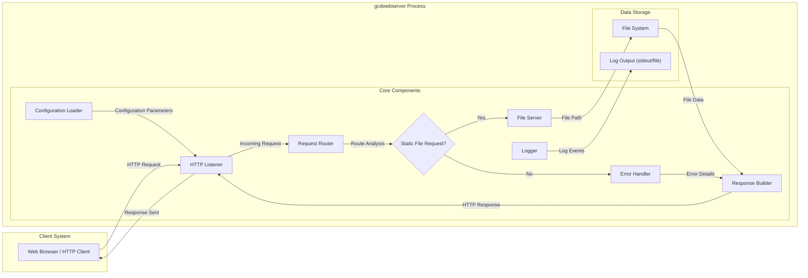

## Project Design Document: gcdwebserver (Improved)

**1. Project Overview**

*   Project Name: gcdwebserver
*   Project Repository: [https://github.com/swisspol/gcdwebserver](https://github.com/swisspol/gcdwebserver)
*   Description: `gcdwebserver` is a lightweight, command-line HTTP server written in Go, designed for serving static files from a specified directory. Its primary use cases include simple file sharing, local development environments, and serving static content for testing purposes.

**2. Goals and Objectives of this Document**

*   Provide a detailed and enhanced architectural overview of the `gcdwebserver` application, focusing on aspects relevant to security analysis.
*   Clearly document the interactions between key components and the flow of data within the system, with a security-centric perspective.
*   Establish a robust foundation for conducting thorough threat modeling exercises, enabling the identification of potential vulnerabilities and attack vectors.
*   Serve as a comprehensive reference for security audits, penetration testing, and ongoing security assessments of the `gcdwebserver`.

**3. Target Audience**

*   Security Engineers and Architects
*   Software Developers involved in maintaining or extending `gcdwebserver`
*   Cloud Architects responsible for deploying and managing instances of `gcdwebserver`
*   Threat Modeling Teams tasked with identifying and mitigating security risks
*   Penetration Testers evaluating the security posture of the application

**4. System Architecture**

**5. Data Flow (Detailed)**

*   **Startup Phase:**
    *   The `gcdwebserver` application begins execution.
    *   The `Configuration Loader` reads configuration parameters from command-line arguments or potentially a configuration file (if implemented). These parameters include the listening port, root directory for serving files, and logging configurations.
    *   The `HTTP Listener` initializes and starts listening for incoming TCP connections on the configured port.
*   **Incoming HTTP Request:**
    *   A `Web Browser / HTTP Client` initiates an HTTP request targeting the `gcdwebserver`.
    *   The `HTTP Listener` accepts the incoming TCP connection and receives the HTTP request data.
    *   The `HTTP Listener` passes the raw HTTP request to the `Request Router`.
*   **Request Routing and Processing:**
    *   The `Request Router` parses the HTTP request, focusing on the request method (e.g., GET, HEAD) and the request URI (path).
    *   The `Request Router` determines if the request is for a static file by examining the URI.
        *   **Static File Request:** If the URI corresponds to a file within the configured root directory, the `Request Router` forwards the request, along with the resolved file path, to the `File Server`.
        *   **Non-Static File Request (Error):** If the URI does not map to a static file or if an error occurs during routing, the `Request Router` directs the flow to the `Error Handler`.
*   **File Serving (Static File Request):**
    *   The `File Server` receives the file path from the `Request Router`.
    *   The `File Server` interacts with the `File System` to open and read the content of the requested file.
    *   The `File System` provides the raw file data to the `File Server`.
    *   The `File Server` determines the appropriate `Content-Type` for the response based on the file extension (e.g., `text/html`, `image/jpeg`).
    *   The `File Server` passes the file data and `Content-Type` to the `Response Builder`.
*   **Error Handling (Non-Static File Request):**
    *   The `Error Handler` receives information about the error (e.g., file not found).
    *   The `Error Handler` generates an appropriate HTTP error status code (e.g., 404 Not Found) and a corresponding error message.
    *   The `Error Handler` passes the error status code and message to the `Response Builder`.
*   **Response Construction:**
    *   The `Response Builder` constructs the HTTP response.
    *   For successful file requests, it sets the HTTP status code to 200 OK, includes the file data in the response body, and sets relevant headers like `Content-Type` and `Content-Length`.
    *   For error requests, it sets the appropriate error status code and includes the error message in the response body.
    *   The `Response Builder` passes the complete HTTP response to the `HTTP Listener`.
*   **Response Transmission and Logging:**
    *   The `HTTP Listener` sends the constructed HTTP response back to the originating `Web Browser / HTTP Client`.
    *   The `Logger` receives information about the processed request (e.g., request path, status code, response size) and writes log entries to the configured output (stdout or a log file).

**6. Key Components (Detailed)**

*   **HTTP Listener:**
    *   Utilizes Go's `net/http` package to establish a TCP listener on the specified port.
    *   Handles the initial TCP handshake for incoming connections.
    *   Parses the raw TCP stream into an `http.Request` object.
    *   Crucially responsible for handling connection management and potential connection-level attacks.
*   **Request Router:**
    *   Examines the `http.Request` object, specifically the `URL.Path` to determine the requested resource.
    *   Implements the logic for mapping request paths to appropriate handlers (in this case, primarily the `File Server`).
    *   **Security Implication:**  This component is critical for preventing path traversal vulnerabilities. Proper input validation and sanitization of the request path are essential here.
*   **File Server:**
    *   Receives the resolved file path from the `Request Router`.
    *   Uses Go's `os` package to access the `File System`.
    *   **Security Implication:** Must ensure that it only accesses files within the configured root directory and does not allow access to parent directories or sensitive system files.
    *   Determines the `Content-Type` based on the file extension, which can influence how the client interprets the data.
*   **File System:**
    *   Represents the underlying operating system's file system.
    *   Provides the raw data of the requested files to the `File Server`.
    *   **Security Implication:** The security of the served files heavily relies on the file system permissions configured at the OS level.
*   **Error Handler:**
    *   Generates standard HTTP error responses for various scenarios (e.g., 404 Not Found, 500 Internal Server Error).
    *   **Security Implication:**  Care must be taken to avoid revealing sensitive information in error messages.
*   **Response Builder:**
    *   Constructs the `http.Response` object.
    *   Sets HTTP headers, including `Content-Type`, `Content-Length`, and potentially caching headers.
    *   Writes the response body (file content or error message).
    *   **Security Implication:** Incorrectly set headers can lead to security vulnerabilities (e.g., missing security headers).
*   **Configuration Loader:**
    *   Reads and parses configuration settings, typically from command-line flags.
    *   **Security Implication:**  The configuration process should be secure, and default configurations should be secure. For example, the default root directory should not expose sensitive files.
*   **Logger:**
    *   Records events such as incoming requests, response status codes, and errors.
    *   **Security Implication:** Logs are crucial for security monitoring and incident response. Log data should be protected and stored securely.

**7. Security Considerations (Detailed and Categorized)**

*   **Input Validation and Sanitization:**
    *   **Path Traversal:**  The `Request Router` must rigorously validate and sanitize the requested file path to prevent attackers from accessing files outside the intended root directory (e.g., using "../" sequences).
*   **Information Disclosure:**
    *   **Error Messages:** Ensure error messages do not reveal sensitive information about the server's internal workings or file system structure.
    *   **Directory Listing (Potential Feature):** If directory listing is implemented, ensure it is controlled and does not expose sensitive files or directories.
*   **Denial of Service (DoS):**
    *   **Resource Exhaustion:** Consider potential vulnerabilities to resource exhaustion attacks, such as sending a large number of concurrent requests or requesting very large files. Implement appropriate timeouts and resource limits.
*   **Insecure Configuration:**
    *   **Default Root Directory:** The default root directory should be carefully chosen to avoid accidentally serving sensitive files.
    *   **Logging Configuration:** Ensure logging is configured securely and log files are protected from unauthorized access.
*   **Lack of Authentication and Authorization:**
    *   `gcdwebserver` inherently lacks authentication and authorization. This means any client can access any file within the served directory. This is a significant security risk in many deployment scenarios. Consider placing it behind an authenticating reverse proxy if needed.
*   **HTTP Security Headers:**
    *   The server should consider setting security-related HTTP headers (e.g., `Strict-Transport-Security`, `X-Frame-Options`, `X-Content-Type-Options`, `Content-Security-Policy`) to enhance client-side security.
*   **Dependency Management:**
    *   While `gcdwebserver` has minimal dependencies, ensure any dependencies are regularly updated to patch known vulnerabilities.
*   **Code Injection (Less Likely but Consider):**
    *   While primarily serving static files, if any future features involve dynamic content generation or processing user input, be vigilant against code injection vulnerabilities (e.g., command injection).

**8. Deployment Architecture (Expanded)**

*   **Standalone Execution:**
    *   Simplest deployment method, suitable for local development and testing.
    *   Security relies heavily on the host operating system's security measures.
*   **Containerization (e.g., Docker):**
    *   Provides a more isolated and reproducible environment.
    *   Security can be enhanced by using minimal base images and following container security best practices.
    *   Allows for easier scaling and management in cloud environments.
*   **Behind a Reverse Proxy (e.g., Nginx, Apache):**
    *   **Recommended for Production:**  A reverse proxy can provide several security benefits:
        *   **SSL/TLS Termination:** Handles encryption and decryption, securing communication.
        *   **Authentication and Authorization:** Implements access control before requests reach `gcdwebserver`.
        *   **Load Balancing:** Distributes traffic across multiple instances of `gcdwebserver`.
        *   **Web Application Firewall (WAF):** Can filter malicious requests.
        *   **Hiding Internal Architecture:** Protects the internal structure of the application.
*   **Cloud Platforms (e.g., AWS, Azure, GCP):**
    *   Can be deployed on various cloud services like virtual machines, containers (using services like ECS, AKS, GKE), or serverless functions (if adapted).
    *   Leverage cloud-provided security features like network firewalls, security groups, and identity and access management (IAM).

**9. Technologies Used**

*   **Programming Language:** Go (version as specified in `go.mod`)
*   **Standard Library:** Primarily utilizes Go's standard library, including:
    *   `net/http`: For handling HTTP requests and responses.
    *   `io`: For input/output operations.
    *   `os`: For file system interactions.
    *   `path/filepath`: For safe path manipulation.
    *   `flag`: For command-line argument parsing.
    *   `log`: For logging.

**10. Assumptions and Constraints**

*   The primary function is serving static files.
*   No built-in support for dynamic content generation or server-side scripting is assumed.
*   Authentication and authorization are expected to be handled by external systems (e.g., a reverse proxy) if required.
*   The security of the underlying operating system and file system is a critical factor.
*   Performance is generally acceptable for its intended use cases but might not be suitable for high-traffic, large-scale deployments without proper infrastructure and optimization.

**11. Future Considerations (Security Focused)**

*   **Implement Basic Security Headers:**  Adding default security headers like `X-Frame-Options`, `X-Content-Type-Options`, and `Strict-Transport-Security` would improve client-side security.
*   **Introduce Rate Limiting:**  Implementing basic rate limiting could help mitigate simple DoS attacks.
*   **Secure Configuration Options:** Explore options for more secure configuration management, potentially avoiding reliance solely on command-line arguments.
*   **Enhance Logging:**  Provide more configurable logging options, including different log levels and formats, to aid in security monitoring.
*   **Consider a Security Policy:**  Adding a `SECURITY.md` file to the repository would provide guidance on reporting vulnerabilities and the project's security practices.
*   **Regular Security Audits:**  Encourage periodic security audits and penetration testing to identify and address potential vulnerabilities.