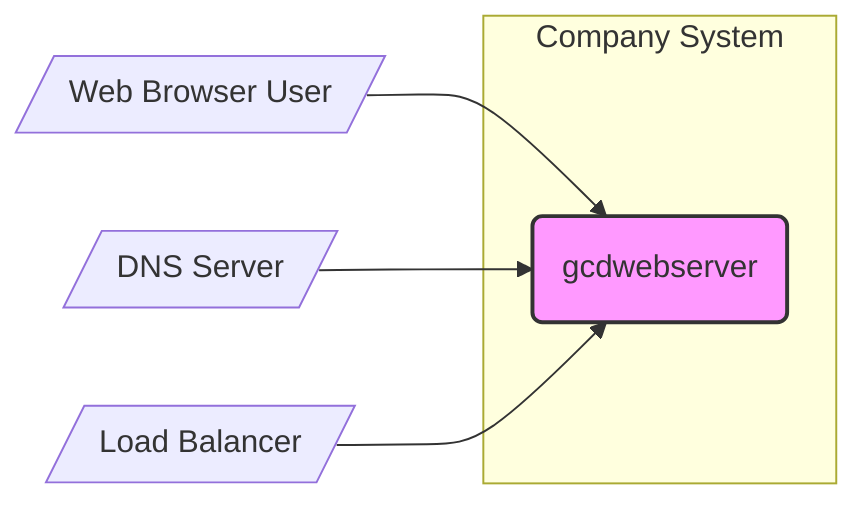
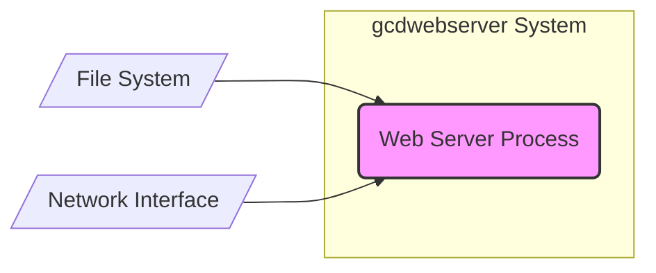
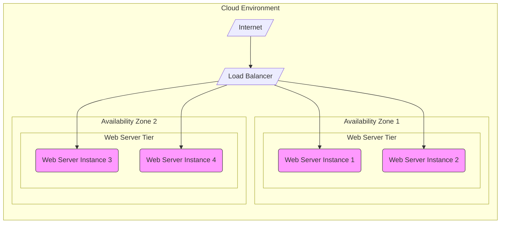

# BUSINESS POSTURE

- Business Priorities and Goals:
  - Provide a lightweight, embeddable web server solution for applications requiring static content delivery.
  - Offer a performant and resource-efficient web server option, leveraging Grand Central Dispatch (GCD) for concurrency.
  - Enable developers to easily integrate web server functionality into their C-based applications.
  - Support open-source community by providing a freely available and customizable web server.
- Business Risks:
  - Security vulnerabilities in the web server code could lead to data breaches or service disruption.
  - Lack of comprehensive documentation or community support could hinder adoption and increase development costs for users.
  - Performance bottlenecks under high load could negatively impact user experience.
  - Compatibility issues with different operating systems or environments could limit the server's applicability.
  - Dependence on GCD and C language skills might restrict the developer pool contributing to or using the project.

# SECURITY POSTURE

- Existing Security Controls:
  - security control: HTTPS support can be implemented by the user of the library, leveraging external libraries like OpenSSL. (Implementation responsibility of the user, not part of core gcdwebserver).
  - security control: Input validation is expected to be implemented by the user of the library when handling request parameters and file paths. (Implementation responsibility of the user, not part of core gcdwebserver).
  - accepted risk: Vulnerabilities in underlying libraries (e.g., libc, GCD) are an accepted risk, relying on OS vendor patching.
  - accepted risk: Configuration errors by users embedding the library are an accepted risk.
  - accepted risk: Denial of Service attacks due to resource exhaustion if not properly configured and deployed.

- Recommended Security Controls:
  - security control: Implement automated static analysis security testing (SAST) in the build process to identify potential code vulnerabilities.
  - security control: Encourage and facilitate security audits of the codebase by independent security experts.
  - security control: Provide secure configuration guidelines and best practices for users embedding the library.
  - security control: Implement rate limiting and connection limits to mitigate basic Denial of Service (DoS) attacks at the application level (as a configurable option).
  - security control: Offer examples and documentation on how to securely integrate HTTPS using recommended libraries.

- Security Requirements:
  - Authentication:
    - Requirement: Authentication is not a built-in feature of gcdwebserver core. Applications embedding gcdwebserver might need to implement authentication mechanisms if required.
    - Requirement: Document best practices for implementing authentication when embedding gcdwebserver, suggesting standard approaches like API keys, JWT, or integration with existing authentication services.
  - Authorization:
    - Requirement: Authorization is not a built-in feature of gcdwebserver core. Applications embedding gcdwebserver are responsible for implementing authorization logic to control access to resources served by the web server.
    - Requirement: Provide guidance on implementing authorization, emphasizing the principle of least privilege and secure access control mechanisms.
  - Input Validation:
    - Requirement: gcdwebserver must handle potentially malicious inputs safely to prevent vulnerabilities like path traversal or buffer overflows.
    - Requirement: Document clearly the expected input formats and any built-in input validation performed by gcdwebserver.
    - Requirement: Emphasize the responsibility of the embedding application to perform thorough input validation on data received from clients before processing it within the web server context.
  - Cryptography:
    - Requirement: gcdwebserver itself does not need to implement cryptography directly for core functionality.
    - Requirement: If HTTPS is required, the documentation should guide users on how to integrate TLS/SSL libraries (like OpenSSL) securely with gcdwebserver.
    - Requirement: Avoid storing sensitive data within gcdwebserver itself. If necessary, recommend secure storage mechanisms and encryption practices for the embedding application.

# DESIGN

## C4 CONTEXT



- Context Diagram Elements:
  - - Name: gcdwebserver
    - Type: Software System
    - Description: A lightweight, embeddable C web server based on GCD, designed for serving static content.
    - Responsibilities:
      - Receive HTTP requests from web clients.
      - Process requests and serve static files from the file system.
      - Handle basic HTTP functionalities like headers and response codes.
    - Security controls:
      - Security controls are primarily the responsibility of the embedding application and the deployment environment. gcdwebserver itself provides basic functionalities and relies on users for secure configuration and integration.
  - - Name: Web Browser User
    - Type: Person
    - Description: End-users accessing web applications or static content served by gcdwebserver.
    - Responsibilities:
      - Initiate HTTP requests to access web resources.
      - Render web pages and content received from the server.
    - Security controls:
      - Web browsers implement various security controls like same-origin policy, content security policy, and protection against common web vulnerabilities.
  - - Name: DNS Server
    - Type: External System
    - Description: Domain Name System server that resolves domain names to IP addresses, enabling users to access gcdwebserver via domain names.
    - Responsibilities:
      - Translate domain names into IP addresses.
      - Ensure availability and correct resolution of domain names.
    - Security controls:
      - DNSSEC (Domain Name System Security Extensions) to prevent DNS spoofing and cache poisoning.
  - - Name: Load Balancer
    - Type: Infrastructure Component
    - Description: Distributes incoming HTTP requests across multiple instances of gcdwebserver for scalability and high availability. (Optional, depending on deployment).
    - Responsibilities:
      - Distribute traffic evenly across backend servers.
      - Perform health checks on backend servers.
      - Improve application availability and performance.
    - Security controls:
      - TLS termination to offload encryption from backend servers.
      - DDoS protection to mitigate distributed denial-of-service attacks.
      - Access control lists (ACLs) to restrict traffic based on source IP addresses.

## C4 CONTAINER



- Container Diagram Elements:
  - - Name: Web Server Process
    - Type: Process
    - Description: The main process of gcdwebserver, responsible for handling HTTP requests and serving static files. It's a single container in this simple architecture.
    - Responsibilities:
      - Listen for incoming HTTP requests on a specified port via the Network Interface.
      - Parse HTTP requests.
      - Retrieve requested static files from the File System.
      - Construct HTTP responses and send them back to clients via the Network Interface.
      - Handle basic error conditions and logging.
    - Security controls:
      - Security controls are largely inherited from the host operating system and the embedding application's environment.
      - Input validation (responsibility of embedding application, but the web server process must be designed to handle inputs safely).
      - Access control to the File System (OS level permissions).
      - Resource limits (OS level process limits).
  - - Name: File System
    - Type: Data Store
    - Description: The local file system where static files served by gcdwebserver are stored.
    - Responsibilities:
      - Store static files (HTML, CSS, JavaScript, images, etc.).
      - Provide access to files for the Web Server Process.
      - Manage file permissions and access control.
    - Security controls:
      - File system permissions to restrict access to static files.
      - Encryption at rest (optional, depending on sensitivity of static content and OS/infrastructure capabilities).
  - - Name: Network Interface
    - Type: Infrastructure Component
    - Description: The network interface used by the Web Server Process to communicate over the network.
    - Responsibilities:
      - Send and receive network packets.
      - Establish network connections.
    - Security controls:
      - Firewall rules to control network access to the web server port.
      - Network segmentation to isolate the web server from other less trusted networks.

## DEPLOYMENT



- Deployment Diagram Elements:
  - - Name: Web Server Instance (Web Server Instance 1, Web Server Instance 2, Web Server Instance 3, Web Server Instance 4)
    - Type: Compute Instance (e.g., Virtual Machine, Container)
    - Description: Instances of the Web Server Process running on compute infrastructure in a cloud environment. Each instance runs gcdwebserver embedded within an application.
    - Responsibilities:
      - Run the Web Server Process.
      - Serve static content from their local file system.
      - Handle HTTP requests forwarded by the Load Balancer.
    - Security controls:
      - Operating system hardening.
      - Security patches and updates.
      - Instance-level firewalls (security groups).
      - Intrusion detection/prevention systems (IDS/IPS) at the infrastructure level.
  - - Name: Load Balancer
    - Type: Network Load Balancer
    - Description: A cloud-based load balancer distributing traffic across multiple Web Server Instances in different Availability Zones for high availability and scalability.
    - Responsibilities:
      - Distribute incoming traffic across healthy Web Server Instances.
      - Perform health checks on Web Server Instances.
      - Terminate TLS/SSL connections (optional).
      - Provide a single point of entry for web traffic.
    - Security controls:
      - DDoS protection.
      - Web Application Firewall (WAF) capabilities (optional, depending on Load Balancer features).
      - Access control lists (ACLs).
  - - Name: Availability Zone 1, Availability Zone 2
    - Type: Cloud Infrastructure Zone
    - Description: Isolated locations within a cloud region, providing redundancy and fault tolerance. Deploying Web Server Instances across multiple Availability Zones increases resilience.
    - Responsibilities:
      - Provide isolated infrastructure for running Web Server Instances.
      - Ensure physical and network isolation between Availability Zones.
    - Security controls:
      - Physical security of data centers.
      - Redundant power and network infrastructure.
      - Network segmentation and isolation.
  - - Name: Internet
    - Type: Public Network
    - Description: The public internet through which users access the web application served by gcdwebserver.
    - Responsibilities:
      - Provide connectivity for users to access the application.
    - Security controls:
      - No direct security controls managed by the project. Rely on network security best practices and controls implemented by ISPs and end-users.

## BUILD

```mermaid
flowchart LR
    A[/"Developer"/] --> B{/"Code Repository (GitHub)"/}
    B --> C[/"CI/CD Pipeline (GitHub Actions)"/]
    C --> D{/"Build Environment"/}
    D --> E[/"Compilation & Linking"/]
    E --> F[/"Static Analysis Security Testing (SAST)"/]
    F --> G[/"Build Artifacts"/]
    G --> H[/"Artifact Repository"/]
    style A fill:#ccf,stroke:#333,stroke-width:1px
    style B fill:#eee,stroke:#333,stroke-width:1px
    style C fill:#eee,stroke:#333,stroke-width:1px
    style D fill:#eee,stroke:#333,stroke-width:1px
    style E fill:#eee,stroke:#333,stroke-width:1px
    style F fill:#eee,stroke:#333,stroke-width:1px
    style G fill:#eee,stroke:#333,stroke-width:1px
    style H fill:#eee,stroke:#333,stroke-width:1px
```

- Build Process Elements:
  - - Name: Developer
    - Type: Person
    - Description: Software developers who write, modify, and commit code to the code repository.
    - Responsibilities:
      - Write secure and functional code.
      - Perform local testing and code reviews.
      - Commit code changes to the repository.
    - Security controls:
      - Secure coding training.
      - Code review processes.
      - Access control to the code repository (authentication and authorization).
  - - Name: Code Repository (GitHub)
    - Type: Version Control System
    - Description: GitHub repository hosting the source code of gcdwebserver.
    - Responsibilities:
      - Store and manage source code.
      - Track code changes and versions.
      - Trigger CI/CD pipeline on code commits.
    - Security controls:
      - Access control (authentication and authorization) to the repository.
      - Branch protection rules.
      - Audit logs of code changes.
  - - Name: CI/CD Pipeline (GitHub Actions)
    - Type: Automation System
    - Description: GitHub Actions workflow automating the build, test, and potentially deployment process.
    - Responsibilities:
      - Automate the build process.
      - Run tests and security checks.
      - Package build artifacts.
      - Potentially deploy artifacts to environments.
    - Security controls:
      - Secure pipeline configuration (least privilege, secrets management).
      - Pipeline code review and version control.
      - Audit logs of pipeline executions.
  - - Name: Build Environment
    - Type: Compute Environment (e.g., GitHub Actions runner)
    - Description: The environment where the build process is executed.
    - Responsibilities:
      - Provide necessary tools and dependencies for building the project.
      - Execute build steps defined in the CI/CD pipeline.
    - Security controls:
      - Secure build environment configuration.
      - Isolation of build environments.
      - Regular patching and updates of build environment.
  - - Name: Compilation & Linking
    - Type: Build Step
    - Description: The step where source code is compiled and linked to create executable binaries or libraries.
    - Responsibilities:
      - Convert source code into machine code.
      - Link compiled code with necessary libraries.
    - Security controls:
      - Use of secure compiler flags.
      - Dependency management and vulnerability scanning of dependencies.
  - - Name: Static Analysis Security Testing (SAST)
    - Type: Security Check
    - Description: Automated security scanning of the source code to identify potential vulnerabilities.
    - Responsibilities:
      - Analyze source code for security weaknesses (e.g., buffer overflows, injection flaws).
      - Generate reports of identified vulnerabilities.
    - Security controls:
      - Regularly updated SAST tools and rulesets.
      - Integration of SAST results into the CI/CD pipeline and developer workflow.
  - - Name: Build Artifacts
    - Type: Software Package
    - Description: The output of the build process, typically compiled binaries or libraries.
    - Responsibilities:
      - Package the compiled software.
      - Prepare artifacts for distribution or deployment.
    - Security controls:
      - Integrity checks (e.g., checksums, signatures) of build artifacts.
  - - Name: Artifact Repository
    - Type: Storage System
    - Description: A repository for storing and managing build artifacts.
    - Responsibilities:
      - Securely store build artifacts.
      - Provide access to artifacts for deployment or distribution.
    - Security controls:
      - Access control (authentication and authorization) to the artifact repository.
      - Integrity protection of stored artifacts.
      - Audit logs of artifact access.

# RISK ASSESSMENT

- Critical Business Processes:
  - Serving static web content to users. This is the primary function. Disruption impacts content delivery and potentially dependent applications.
- Data to Protect:
  - Static content files (HTML, CSS, JavaScript, images, etc.). Sensitivity depends on the nature of the content. Public website content is less sensitive than internal documentation or application code served as static files.
  - Server configuration data. Less sensitive in this case as it's a simple web server, but misconfiguration can lead to vulnerabilities.
  - Logs. Can contain information about requests and potential issues, but generally low sensitivity unless logging sensitive data (which should be avoided).
- Data Sensitivity:
  - Static content: Low to Medium (depending on content).
  - Server configuration: Low.
  - Logs: Low.

# QUESTIONS & ASSUMPTIONS

- Questions:
  - What is the intended use case for gcdwebserver? Is it for public-facing websites, internal applications, or embedded systems? (Assumption: General purpose static content server).
  - What are the performance requirements? (Assumption: Performance is important, hence the use of GCD).
  - Are there any specific compliance requirements (e.g., GDPR, HIPAA)? (Assumption: No specific compliance requirements mentioned, assuming general security best practices are sufficient).
  - What is the expected scale of deployment? (Assumption: Scalable deployment, hence considering load balancer and multiple instances).
  - Are there any existing security policies or standards that need to be followed? (Assumption: Following general security best practices and recommendations).

- Assumptions:
  - BUSINESS POSTURE: The project aims to provide a useful, lightweight web server for various applications. Security and performance are important but balanced with ease of use and development effort.
  - SECURITY POSTURE: Security is considered important, but the primary responsibility for secure usage lies with the embedding application developer. Basic security controls are expected, and recommendations for enhanced security are valuable.
  - DESIGN: The design is relatively simple, focusing on serving static content efficiently. Deployment is assumed to be in a cloud environment for scalability and availability. Build process includes basic security checks like SAST.