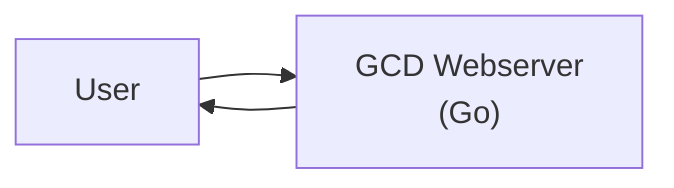
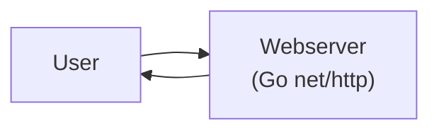
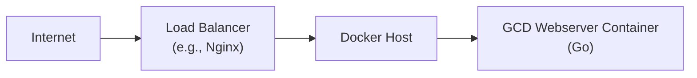
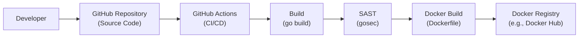

Okay, let's create a design document for the `gcdwebserver` project.

# BUSINESS POSTURE

Business Priorities and Goals:

*   Provide a simple, functional web service that calculates the greatest common divisor (GCD) of two integers.
*   Demonstrate basic Go programming concepts, including HTTP handling, JSON encoding/decoding, and error management.
*   Offer a readily deployable example for learning and experimentation.
*   The project is primarily educational and demonstrative. It's not intended for high-traffic, mission-critical production use.

Most Important Business Risks:

*   While not designed for production, any publicly accessible service, even a simple one, carries inherent risks. Denial of service, resource exhaustion, and potential exploitation of unforeseen vulnerabilities are concerns.
*   Incorrect GCD calculations (due to bugs) could mislead users relying on the service for accurate results, although the impact is likely low given the project's educational nature.
*   Exposure of internal implementation details (e.g., through error messages) could aid attackers in finding vulnerabilities.

# SECURITY POSTURE

Existing Security Controls:

*   security control: Basic input validation: The code checks if the input JSON payload can be successfully decoded into the `Numbers` struct. ( `gcd.go`, line 47)
*   security control: Error handling: The code includes error handling for JSON decoding and GCD calculation, returning appropriate HTTP status codes and error messages. ( `gcd.go`, line 50, 63)
*   security control: Use of standard library: The code utilizes Go's built-in `net/http` package, which is generally well-maintained and vetted for security issues.

Accepted Risks:

*   accepted risk: The service does not implement authentication or authorization. It is assumed that the service will be deployed behind a reverse proxy or API gateway that handles these concerns if required.
*   accepted risk: The service does not implement TLS encryption. It is assumed that a reverse proxy will handle HTTPS termination if needed.
*   accepted risk: The service does not implement rate limiting or other DoS protection mechanisms. It is assumed that the deployment environment will provide these features if necessary.
*   accepted risk: The service does not have comprehensive input validation beyond basic JSON structure checks. It does not explicitly guard against excessively large numbers that could lead to performance issues.
*   accepted risk: The service does not implement structured logging.

Recommended Security Controls:

*   security control: Implement stricter input validation: Check for excessively large numbers to prevent potential resource exhaustion.
*   security control: Implement structured logging: Use a logging library to record events in a consistent, machine-readable format for easier monitoring and auditing.
*   security control: Consider adding a health check endpoint: This allows monitoring tools to easily determine the service's status.
*   security control: Harden error messages: Avoid exposing internal implementation details in error responses. Return generic error messages to the client.
*   security control: Implement deployment using containers.

Security Requirements:

*   Authentication: Not required for the core functionality. If authentication is needed, it should be handled by an external component (e.g., reverse proxy).
*   Authorization: Not required for the core functionality.
*   Input Validation:
    *   Ensure the input is valid JSON.
    *   Ensure the JSON payload contains two numbers.
    *   Limit the size/magnitude of the input numbers to prevent resource exhaustion.
*   Cryptography: Not directly required for the GCD calculation. TLS should be used for transport security if sensitive data is transmitted (handled externally).

# DESIGN

## C4 CONTEXT

Element Description:

*   User:
    *   Name: User
    *   Type: Person
    *   Description: A person interacting with the GCD Webserver.
    *   Responsibilities: Sends requests to the GCD Webserver to calculate the greatest common divisor of two numbers. Receives the result or error messages.
    *   Security controls: None (client-side).

*   GCD Webserver:
    *   Name: GCD Webserver
    *   Type: Software System
    *   Description: A simple web service that calculates the greatest common divisor (GCD) of two integers.
    *   Responsibilities: Receives requests, validates input, calculates GCD, returns results or errors.
    *   Security controls: Basic input validation, error handling, use of standard library.

## C4 CONTAINER

Element Description:

*   Webserver:
    *   Name: Webserver
    *   Type: Web Application
    *   Description: A Go web application using the `net/http` package.
    *   Responsibilities: Handles HTTP requests, parses JSON input, calls the GCD calculation function, formats the response (JSON or error).
    *   Security controls: Basic input validation, error handling, use of standard library (`net/http`).

## DEPLOYMENT

Possible deployment solutions:

1.  Bare-metal server/VM: Deploy the compiled Go binary directly onto a server.
2.  Containerized deployment (Docker): Package the application into a Docker container and deploy it to a container orchestration platform (e.g., Kubernetes, Docker Swarm) or a single host running Docker.
3.  Cloud provider's managed service (e.g., AWS Elastic Beanstalk, Google App Engine, Azure App Service): Deploy the application to a platform-as-a-service (PaaS) offering.

Chosen solution (for detailed description): Containerized deployment (Docker).

Element Description:

*   Internet:
    *   Name: Internet
    *   Type: External
    *   Description: The public internet.
    *   Responsibilities: Routing traffic to the load balancer.
    *   Security controls: None (handled by infrastructure).

*   Load Balancer:
    *   Name: Load Balancer
    *   Type: Infrastructure
    *   Description: A load balancer (e.g., Nginx, HAProxy) that distributes traffic across multiple instances of the GCD Webserver container.
    *   Responsibilities: Distributes traffic, potentially handles TLS termination, provides health checks.
    *   Security controls: TLS termination, access control lists (ACLs), DDoS protection (depending on the specific load balancer).

*   Docker Host:
    *   Name: Docker Host
    *   Type: Infrastructure
    *   Description: A server (physical or virtual) running Docker Engine.
    *   Responsibilities: Hosts and runs the GCD Webserver container.
    *   Security controls: Firewall, operating system security hardening, Docker security best practices.

*   GCD Webserver Container:
    *   Name: GCD Webserver Container
    *   Type: Container
    *   Description: A Docker container running the compiled GCD Webserver application.
    *   Responsibilities: Receives requests from the load balancer, calculates GCD, returns results.
    *   Security controls: Minimal attack surface (single process), container security best practices (e.g., non-root user).

## BUILD

The build process involves compiling the Go source code into an executable binary and then packaging it into a Docker container.

Build Process Description:

1.  Developer: The developer writes and commits code to the GitHub repository.
2.  GitHub Repository: The source code is stored in a GitHub repository.
3.  GitHub Actions: A GitHub Actions workflow is triggered on code push (or pull request).
4.  Build: The `go build` command compiles the Go source code into an executable binary.
5.  SAST: A static application security testing (SAST) tool, such as `gosec`, is run to analyze the code for potential security vulnerabilities.
6.  Docker Build: If the build and SAST steps are successful, a Docker image is built using a `Dockerfile`. The `Dockerfile` specifies the base image (e.g., a minimal Go runtime image), copies the compiled binary into the image, and sets the entrypoint.
7.  Docker Registry: The built Docker image is pushed to a Docker registry (e.g., Docker Hub, a private registry).

Security Controls in Build Process:

*   security control: SAST (gosec): Static analysis to identify potential vulnerabilities in the code.
*   security control: Minimal base image: Using a small, well-defined base image (e.g., `golang:alpine`) reduces the attack surface.
*   security control: Docker security best practices: Following Dockerfile best practices (e.g., avoiding running as root, using COPY instead of ADD, etc.) enhances container security.
*   security control: Dependency management: Using Go modules (`go.mod`, `go.sum`) ensures consistent and verifiable dependencies.
*   security control: Build automation (GitHub Actions): Automating the build process ensures consistency and reduces the risk of manual errors.

# RISK ASSESSMENT

Critical Business Processes:

*   Providing the GCD calculation service. While not mission-critical, the service should be reliable and accurate within its intended scope.

Data Protection:

*   Data Sensitivity: The service handles integer inputs, which are not inherently sensitive. However, if the service were to be used in a context where the inputs represent sensitive information (e.g., financial data, cryptographic keys – highly unlikely in this specific case), then the data would need to be protected accordingly.
*   Data to Protect: The primary data to protect are the input numbers. Since the service is stateless and doesn't store any data, the focus is on protecting the data in transit (if required, by using TLS) and ensuring the integrity of the calculation.

# QUESTIONS & ASSUMPTIONS

Questions:

*   What is the expected load (requests per second) for this service? This helps determine if additional scaling or performance optimization is needed.
*   Is there a specific deployment environment in mind (e.g., cloud provider, on-premise)? This influences the deployment diagram and security considerations.
*   Are there any specific compliance requirements (e.g., GDPR, HIPAA) that apply to this service? Although unlikely given the nature of the service, it's important to confirm.
*   What is the process for updating the service (e.g., rolling updates, blue/green deployments)?

Assumptions:

*   BUSINESS POSTURE: The service is primarily for educational/demonstrative purposes and not for high-security, mission-critical applications.
*   SECURITY POSTURE: The service will be deployed behind a reverse proxy or load balancer that handles TLS termination and potentially other security features (authentication, authorization, rate limiting).
*   DESIGN: The service is stateless and does not require persistent storage. The provided Go code is the complete application logic. The deployment environment will provide basic infrastructure security (firewall, network segmentation).