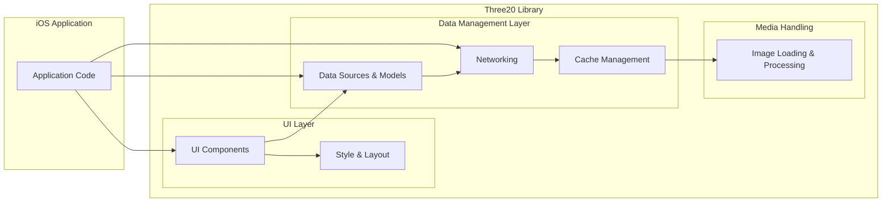
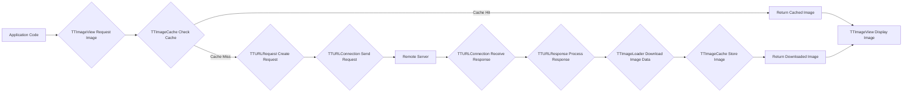

## Project Design Document: Three20 iOS Library (Improved)

**Project Repository:** https://github.com/facebookarchive/three20

**Date:** October 26, 2023

**Version:** 1.1

**Prepared By:** Gemini (AI Language Model)

### 1. Project Overview

Three20 is an Objective-C library that provides a collection of user interface components and utilities for iOS development. Originally developed by Facebook, its primary aim was to accelerate iOS development by offering pre-built, reusable components and simplifying common tasks. While the project is now archived, its architectural design remains relevant for understanding legacy iOS systems and for educational purposes, particularly in the context of threat modeling. This document provides an enhanced overview of Three20's architecture, focusing on components and data flows critical for security analysis.

### 2. Goals and Objectives

The overarching goals of Three20 were to:

*   **Accelerate iOS Development:** Provide a rich set of pre-built UI components and utilities.
*   **Promote Code Reusability:** Offer modular components that could be easily integrated into different projects.
*   **Simplify Common Tasks:** Abstract away complexities related to networking, image loading, and data management.
*   **Enhance Developer Productivity:** Reduce boilerplate code and provide a more consistent development experience.

For the specific purpose of threat modeling, the objectives of this document are to:

*   Clearly delineate the boundaries of the Three20 library and its interactions with the host application and external systems.
*   Provide a detailed breakdown of key components and their functionalities.
*   Illustrate critical data flows within the library, highlighting potential points of interaction and data transformation.
*   Identify potential security considerations based on the architectural design.

### 3. Target Audience

This document is primarily intended for:

*   **Security Engineers:** Conducting threat modeling exercises on applications utilizing the Three20 library.
*   **Developers:** Maintaining, debugging, or migrating legacy codebases that incorporate Three20.
*   **Software Architects:** Analyzing the design patterns and architectural choices made in Three20.
*   **Security Researchers:** Investigating potential vulnerabilities within the library.

### 4. High-Level Architecture

The Three20 library is structured around several interconnected modules, each responsible for a specific set of functionalities. The following diagram provides a more detailed view of the high-level architecture:



**Key Modules:**

*   **UI Layer:**
    *   **UI Components:**  Contains a library of custom UI elements (e.g., buttons, tables, photo viewers, web views).
    *   **Style & Layout:** Provides mechanisms for defining the visual appearance and layout of UI components.
*   **Data Management Layer:**
    *   **Data Sources & Models:** Offers classes and protocols for managing and accessing data, often used to populate UI components.
    *   **Networking:** Handles network communication, including making HTTP requests and processing responses.
    *   **Cache Management:** Implements caching strategies for network responses and images to improve performance and reduce network load.
*   **Media Handling:**
    *   **Image Loading & Processing:**  Provides asynchronous loading and processing of images from local and remote sources, including caching.

### 5. Key Components and Their Functionality

This section provides a more detailed description of significant components within the Three20 library:

*   **`TTButton`:** A highly customizable button class supporting various states and styling options.
*   **`TTTableView` and `TTTableViewController`:** Enhanced table view components with features like data source management, pagination, and asynchronous loading.
*   **`TTImageView`:** An asynchronous image view that handles loading images from URLs, caching them, and displaying placeholders.
*   **`TTURLRequest`, `TTURLResponse`, and `TTURLConnection`:** Classes responsible for creating, sending, and receiving HTTP requests.
*   **`TTURLCache`:**  A class implementing a caching mechanism for network responses, storing data based on request URLs.
*   **`TTImageCache`:**  A dedicated cache for storing downloaded and processed images, optimizing image loading performance.
*   **`TTModel`, `TTListModel`, and `TTURLRequestModel`:** Base classes for representing data models, lists of data, and models that fetch data from URLs.
*   **`TTURLJSONResponse`, `TTXMLParser`, and `TTMultipartFormAdditions`:** Classes for parsing JSON and XML data from network responses and for constructing multipart form data for uploads.
*   **`TTStyle`, `TTLayout`, and `TTShape`:** Classes used to define the visual style, layout, and shapes of UI elements.
*   **`TTNavigator` and `TTURLMap`:** A URL-based navigation system that allows navigating between different parts of the application using URLs.
*   **`TTWebController` and related classes:**  Provide components for displaying web content, potentially using `UIWebView` or `WKWebView` under the hood.

### 6. Data Flow

This section illustrates two key data flow scenarios within an application using Three20: fetching and displaying an image, and fetching and displaying data in a table view.

**Data Flow: Fetching and Displaying an Image**



**Data Flow: Fetching and Displaying Data in a Table View**

```mermaid
graph LR
    A["Application Code"] --> B{"TTTableViewController Request Data"};
    B --> C{"TTURLRequestModel Initiate Load"};
    C --> D{"TTURLRequest Create Request"};
    D --> E{"TTURLConnection Send Request"};
    E --> F["Remote Server"];
    F --> G{"TTURLConnection Receive Response"};
    G --> H{"TTURLResponse Process Response"};
    H --> I{"TTURLJSONResponse Parse JSON Data" OR "TTXMLParser Parse XML Data"};
    I --> J{"TTListModel Update Data"};
    J --> K["TTTableView Reload Data"];
    K --> L["TTTableView Display Data"];
```

### 7. Security Considerations (Pre-Threat Modeling)

Based on the architecture and components, several security considerations are apparent:

*   **Network Security:**
    *   **Cleartext Communication:**  If `TTURLRequest` is not configured to use HTTPS, sensitive data transmitted over the network could be intercepted.
    *   **Certificate Pinning:** Lack of certificate pinning makes the application vulnerable to man-in-the-middle attacks.
    *   **Insecure Protocols:**  The library might support older, less secure protocols.
*   **Data Security:**
    *   **Insecure Cache Storage:** Cached data (images, network responses) might be stored unencrypted on the device's file system, potentially exposing sensitive information.
    *   **Data Injection Vulnerabilities:** If data received from external sources (e.g., through `TTURLJSONResponse` or `TTXMLParser`) is not properly sanitized before being used in UI components (especially `TTWebController`), it could lead to cross-site scripting (XSS) vulnerabilities.
*   **Image Handling:**
    *   **Denial of Service (DoS):** Processing extremely large or malformed images fetched by `TTImageView` could consume excessive resources and potentially crash the application.
    *   **Image Format Vulnerabilities:**  Vulnerabilities in the underlying image decoding libraries could be exploited.
*   **URL Handling (TTNavigator):**
    *   **Deep Linking Exploits:**  Improperly validated URLs passed to `TTNavigator` could be used to navigate to unintended parts of the application or trigger malicious actions.
    *   **Open Redirects:**  If `TTNavigator` is used to handle external URLs without proper validation, it could be exploited for phishing attacks.
*   **Web View Security (TTWebController):**
    *   **JavaScript Injection:** If using `UIWebView`, vulnerabilities in the web content or improper handling of JavaScript could lead to security issues.
    *   **Insecure Content Loading:**  Loading content from untrusted sources without proper security measures can expose the application to risks.
*   **Dependency Management:**
    *   **Vulnerable Dependencies:**  Three20 itself might rely on other libraries with known security vulnerabilities.

### 8. Deployment Model

Three20 is typically integrated into an iOS application as a static library. This means the Three20 code is compiled directly into the application's executable. Alternatively, it could be integrated using dependency managers like CocoaPods or Carthage, which manage the library's inclusion and linking process. The deployment model influences how updates and security patches for Three20 (if they were still being released) would be managed.

### 9. Assumptions and Dependencies

*   The application is running on a standard iOS device or simulator with a compatible iOS version.
*   Network connectivity is available when using network-related features.
*   The developer integrating Three20 understands the security implications of using external libraries and follows secure coding practices.
*   The underlying iOS operating system and its frameworks (e.g., UIKit, Foundation) are functioning as expected.

### 10. Out of Scope

This design document focuses on the architecture and potential security considerations of the Three20 library itself. The following are explicitly considered out of scope:

*   Specific implementations of applications that utilize the Three20 library.
*   Security measures implemented within the host application that are independent of Three20.
*   Detailed code-level vulnerability analysis of the Three20 library's source code.
*   Backend services or APIs that the application might interact with.
*   Operating system-level security features and vulnerabilities.

This improved design document provides a more comprehensive understanding of the Three20 library's architecture, highlighting key components, data flows, and potential security considerations. This information is crucial for effectively performing threat modeling and identifying potential vulnerabilities in applications that utilize this library.