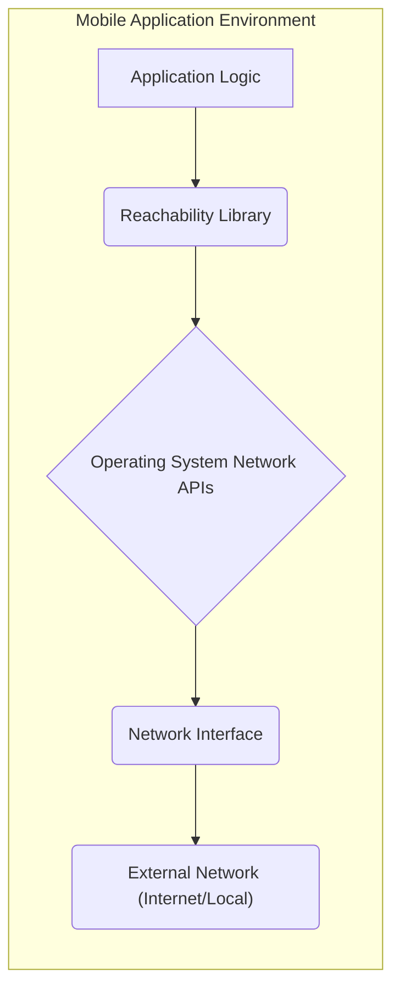
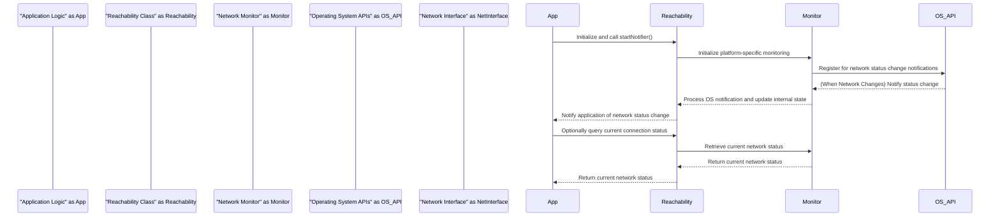

# Project Design Document: Reachability Library Integration - Improved

**Document Version:** 1.1
**Date:** October 26, 2023
**Author:** AI Software Architect

## 1. Introduction

This document provides an enhanced and more detailed design for the integration of the `Reachability` library (specifically the repository found at [https://github.com/tonymillion/Reachability](https://github.com/tonymillion/Reachability)) into a hypothetical mobile application. This revised document aims to provide a stronger foundation for subsequent threat modeling activities by offering a more granular understanding of the system architecture, component interactions, data flow, and key security considerations related to the library's usage.

## 2. Project Goals

*   Clearly define the architecture and components involved in using the `Reachability` library with greater detail on internal mechanisms.
*   Illustrate the data flow and interactions between the library, the application, and the operating system with more precision.
*   Identify potential areas of security concern for future threat modeling, providing more specific examples and potential attack vectors.
*   Provide a comprehensive and easily understandable description of the system for security analysis and development teams.

## 3. System Overview

The `Reachability` library is a crucial third-party component integrated into a mobile application (assumed to be a native iOS or Android application for this design). The core function of this library is to provide timely and accurate updates on the device's network connectivity status. The application leverages this information to dynamically adjust its behavior, such as gracefully handling network outages by displaying informative offline messages, intelligently disabling network-dependent features to prevent errors, or proactively attempting to re-establish connections when network access is restored.

*   **Application Logic:** Represents the core functionality and business logic of the mobile application. It initiates and consumes the network status information provided by the `Reachability` library.
*   **Reachability Library:** The external, reusable component responsible for the complex task of monitoring and reporting network connectivity changes.
*   **Operating System Network APIs:**  The platform-specific interfaces (e.g., `SCNetworkReachability` on iOS, `ConnectivityManager` on Android) that the `Reachability` library utilizes to interact with the underlying network subsystem.
*   **Network Interface:** The physical or virtual interface on the device that enables network communication (e.g., Wi-Fi adapter, cellular modem, Ethernet adapter).
*   **External Network (Internet/Local):** The network the device is attempting to connect to, which could be the public internet or a local area network.

## 4. Detailed Design

### 4.1. Component Description

*   **Reachability Class:** The primary interface provided by the library for application interaction. It offers methods to:
    *   `startNotifier()`: Initiates the network monitoring process.
    *   `stopNotifier()`: Halts the network monitoring.
    *   `connection`:  A property or method to retrieve the current network connection status (e.g., `.unavailable`, `.wifi`, `.cellular`).
    *   Provides notifications or closures to inform the application about network status changes.
    *   Internally manages the lifecycle of the `Network Monitor`.
*   **Network Monitor (Internal to Reachability):**  An abstraction layer within the library that encapsulates the platform-specific logic for detecting network changes.
    *   **iOS (using `SCNetworkReachability`):**  Leverages the System Configuration framework to monitor changes in network reachability flags. This involves setting up a run loop source and a callback function that gets invoked when network status changes.
    *   **Android (using `ConnectivityManager`):** Utilizes the `ConnectivityManager.NetworkCallback` to listen for network connectivity events. This involves registering a callback that receives notifications about network availability, loss, and changes in network capabilities.
    *   Abstracts away the platform differences, providing a consistent interface for the rest of the library.
*   **Notification Handling Mechanism (Application Side):** The method by which the application receives and processes network status updates from the `Reachability` library.
    *   **Notification Center (iOS):** The application registers as an observer for specific notifications posted by the `Reachability` library (e.g., a notification with a predefined name).
    *   **Delegate Pattern:** The application implements a protocol defined by the `Reachability` library and sets itself as the delegate of the `Reachability` object. The library then calls methods on the delegate to report status changes.
    *   **Closure/Callback:** The application provides a closure or a function pointer to the `Reachability` library, which the library executes when a network status change occurs. This is a more modern approach for handling asynchronous events.

### 4.2. Data Flow

The following diagram provides a more detailed illustration of the information flow related to network reachability:

*   **Initialize and call `startNotifier()`:** The application logic instantiates the `Reachability` class and calls the `startNotifier()` method to begin monitoring.
*   **Initialize platform-specific monitoring:** The `Reachability` class initializes the appropriate `Network Monitor` based on the operating system.
*   **Register for network status change notifications:** The `Network Monitor` uses the relevant operating system APIs (e.g., `SCNetworkReachabilityCreateWithAddress` and `SCNetworkReachabilitySetCallback` on iOS, `ConnectivityManager.registerDefaultNetworkCallback` on Android) to register for network status change notifications.
*   **(When Network Changes) Notify status change:** The operating system detects a change in network connectivity and notifies the registered callback or listener within the `Network Monitor`.
*   **Process OS notification and update internal state:** The `Network Monitor` receives the notification from the OS, interprets the network status, and updates the internal state of the `Reachability` class.
*   **Notify application of network status change:** The `Reachability` class notifies the application logic about the network status change using the configured notification mechanism (Notification Center, delegate, or closure).
*   **Optionally query current connection status:** The application can directly call a method on the `Reachability` object (e.g., accessing the `connection` property) to get the current network status.
*   **Retrieve current network status:** The `Reachability` class internally asks the `Network Monitor` for the current network status.
*   **Return current network status:** The `Network Monitor` returns the current network status.
*   **Return current network status:** The `Reachability` class returns the current network status to the application.

### 4.3. Key Interactions

*   **Application Lifecycle Management:** The application should carefully manage the lifecycle of the `Reachability` object, starting and stopping the notifier appropriately (e.g., in `viewWillAppear`/`viewWillDisappear` or application foreground/background events) to conserve resources and avoid memory leaks.
*   **Background Monitoring Considerations:**  On mobile platforms, background network monitoring might be subject to operating system restrictions. The application needs to be aware of these limitations and handle potential interruptions in background updates.
*   **Error Handling:** The application should gracefully handle potential errors during the initialization or monitoring process of the `Reachability` library. This might involve checking for nil objects or catching exceptions.
*   **UI Updates:** When the network status changes, the application often needs to update the user interface. These updates should be performed on the main thread to avoid UI inconsistencies or crashes.

## 5. Security Considerations

This section expands on the potential security considerations related to the integration of the `Reachability` library, providing more specific examples and potential attack vectors for threat modeling.

*   **Information Disclosure:**
    *   **Detailed Network Information:** While the library primarily reports reachability, the underlying OS APIs might expose more detailed network information (e.g., SSID of the connected Wi-Fi network, IP address). If the `Reachability` library or the application logs or transmits this information, it could be a privacy concern.
    *   **Timing Attacks:** Observing the timing of reachability status changes could potentially reveal patterns of user activity or location. For example, frequent disconnections might indicate travel through areas with poor connectivity.
*   **Man-in-the-Middle (MITM) Attacks:**
    *   **False Reachability Reports:** An attacker on a compromised network could potentially manipulate network traffic to make the device believe it has network connectivity when it doesn't, or vice versa. This could lead the application to perform actions it shouldn't (e.g., attempting to send data over a non-existent connection) or prevent it from functioning correctly.
    *   **DNS Spoofing:** If the `Reachability` library checks reachability against a specific hostname, an attacker could use DNS spoofing to redirect that hostname to a malicious server, potentially leading to incorrect reachability assessments.
*   **Denial of Service (DoS):**
    *   **Resource Exhaustion:** Rapidly toggling the network connection could force the `Reachability` library and the application to repeatedly handle status changes, potentially consuming CPU and battery resources. While unlikely to be a full DoS, it could impact performance.
    *   **Exploiting Underlying OS Vulnerabilities:**  While less direct, vulnerabilities in the operating system's network monitoring APIs could potentially be exploited to cause crashes or other issues.
*   **Data Integrity:**
    *   **Compromised Reachability Library:** If the `Reachability` library itself is compromised (e.g., through a supply chain attack), it could provide false or manipulated reachability information to the application.
    *   **Interference by Other Applications:** On some platforms, other applications might interfere with the network monitoring process, potentially leading to inaccurate reachability reports.
*   **Dependency Vulnerabilities:**
    *   **Outdated Library:** Using an outdated version of the `Reachability` library with known security vulnerabilities could expose the application to risks. Regular updates are crucial.
*   **Improper Error Handling:**
    *   **Uncaught Exceptions:** If the application doesn't properly handle exceptions thrown by the `Reachability` library, it could lead to crashes or unexpected behavior.
    *   **Logic Errors Based on Faulty Status:**  If the application's logic relies heavily on the reachability status and doesn't account for potential inaccuracies, it could make incorrect decisions with security implications (e.g., failing to perform security checks when it incorrectly believes it's offline).
*   **Privacy Implications:**
    *   **Correlation with Location Data:** Combining network connectivity information with location data could create a more detailed profile of user movements and habits.

## 6. Deployment Considerations

*   **Library Integration Methods:**
    *   **CocoaPods/Swift Package Manager (iOS):**  Specify the dependency in the `Podfile` or `Package.swift` file and use the respective dependency management tools to download and integrate the library.
    *   **Gradle (Android):** Add the dependency to the `build.gradle` file for the application module.
*   **Permissions Management:**
    *   **iOS:** Ensure the `Access WiFi Information` capability is properly configured in the Xcode project if needed for more detailed network information.
    *   **Android:** The application typically requires the `ACCESS_NETWORK_STATE` permission in the `AndroidManifest.xml` file.
*   **Platform-Specific Behavior:** Be aware of potential subtle differences in how network monitoring works on iOS and Android and test thoroughly on both platforms.
*   **Code Signing:** Ensure the application and all its dependencies, including the `Reachability` library, are properly code-signed to prevent tampering.

## 7. Future Considerations

*   **Reactive Programming Integration:** Explore integrating the `Reachability` library with reactive programming frameworks (e.g., RxSwift, Combine on iOS; RxJava, Kotlin Coroutines Flow on Android) to provide a more streamlined and declarative way of handling network status changes.
*   **Advanced Network Diagnostics:** Consider incorporating more advanced network diagnostic tools or libraries to provide more detailed information about network issues beyond simple reachability (e.g., latency, packet loss).
*   **Customizable Reachability Targets:** Allow the application to dynamically configure the hosts or services used to determine reachability, providing more flexibility.
*   **Integration with Backend Monitoring:** Explore ways to integrate the client-side reachability information with backend monitoring systems to get a more holistic view of network connectivity issues affecting users.

This improved design document provides a more in-depth understanding of the `Reachability` library integration, offering a stronger foundation for identifying and mitigating potential security threats.
