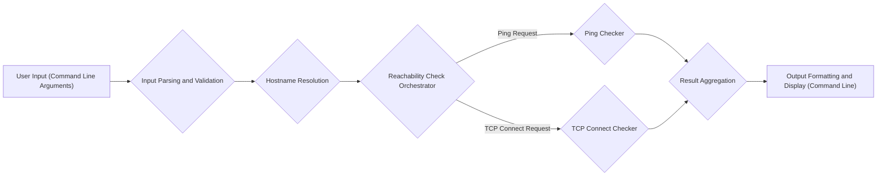
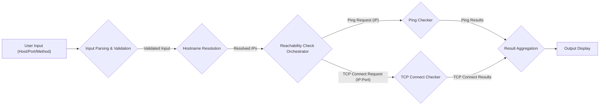

# Project Design Document: Reachability - Improved

**Version:** 1.1
**Date:** October 26, 2023
**Author:** Gemini (AI Language Model)

## 1. Introduction

This document provides an enhanced and more detailed design overview of the `reachability` project, a command-line tool designed for verifying network connectivity to specified hosts and ports. This revised document aims to provide a clearer understanding of the system's architecture, individual components, the flow of data, and deployment considerations. It is specifically crafted to serve as a robust foundation for subsequent threat modeling activities.

## 2. Goals and Objectives

*   Provide a user-friendly and efficient command-line interface for checking network reachability.
*   Enable users to specify target hosts using both hostnames and IP addresses.
*   Allow users to define specific port numbers to test connectivity.
*   Offer multiple methods for assessing reachability, including ICMP (ping) and TCP connection attempts.
*   Present clear, unambiguous output indicating the success or failure of reachability checks, along with relevant details.
*   Maintain cross-platform compatibility across major operating systems.
*   Minimize external dependencies to simplify deployment and reduce potential attack surface.

## 3. System Overview

The `reachability` tool operates as a command-line application. It accepts user-defined target information (host and port) and executes network checks to determine if the target is reachable. The tool orchestrates hostname resolution, initiates network connections using chosen methods, and then aggregates and presents the results to the user.

## 4. Component Design

This section provides a more detailed breakdown of the key components within the `reachability` tool.

*   **Input Parsing and Validation:**
    *   **Responsibility:**  Receives and processes command-line arguments supplied by the user.
    *   **Functionality:**
        *   Parses arguments to extract target host(s), port(s), and the desired check method.
        *   Validates the format of the input:
            *   Checks if hostnames are syntactically valid.
            *   Verifies if IP addresses are in the correct format (IPv4 or IPv6).
            *   Ensures port numbers are within the valid range (1-65535).
            *   Confirms the selected check method is supported.
        *   Handles invalid input by displaying informative error messages to the user and exiting gracefully.

*   **Hostname Resolution:**
    *   **Responsibility:** Translates human-readable hostnames into IP addresses that can be used for network communication.
    *   **Functionality:**
        *   Performs DNS lookups for provided hostnames.
        *   Handles cases where a hostname resolves to multiple IP addresses (e.g., for load balancing).
        *   Manages scenarios where hostname resolution fails (e.g., due to DNS server issues or incorrect hostname).

*   **Reachability Check Orchestrator:**
    *   **Responsibility:**  Manages the execution of different reachability check methods.
    *   **Functionality:**
        *   Determines which reachability checker(s) to invoke based on user input or default settings.
        *   Provides the target IP address and port information to the selected checker.
        *   Handles potential errors during the check execution (e.g., timeouts).

*   **Ping Checker:**
    *   **Responsibility:**  Utilizes the ICMP protocol to determine if a host is responsive.
    *   **Functionality:**
        *   Sends ICMP Echo Request packets to the target IP address.
        *   Listens for ICMP Echo Reply packets from the target.
        *   Calculates round-trip time (RTT) if a reply is received.
        *   Reports success if a reply is received within a defined timeout period.

*   **TCP Connect Checker:**
    *   **Responsibility:** Attempts to establish a TCP connection to a specific port on the target host.
    *   **Functionality:**
        *   Initiates a TCP handshake with the target IP address and port.
        *   Reports success if the connection is established.
        *   Reports failure if the connection attempt times out or is refused.

*   **Result Aggregation:**
    *   **Responsibility:** Collects and organizes the results from the individual reachability checks.
    *   **Functionality:**
        *   Stores the status (reachable/unreachable) and any relevant details (e.g., RTT for ping, error messages for connection failures) for each target.
        *   Associates the results with the corresponding host and port.

*   **Output Formatting and Display:**
    *   **Responsibility:** Presents the aggregated results to the user in a clear and understandable format.
    *   **Functionality:**
        *   Formats the output to display the target host, port, the method used for the check, and the reachability status.
        *   May include additional information like response times or specific error messages.
        *   Outputs the formatted results to the command line (standard output).

## 5. Data Flow

This section details the movement of data between the components of the `reachability` tool during a typical execution.

1. The user provides target host(s) and port(s), along with any optional parameters, as command-line arguments.
2. The **Input Parsing and Validation** component receives these arguments, validates their format and content, and extracts the necessary information.
3. For each unique hostname provided, the **Hostname Resolution** component performs a DNS lookup to obtain the corresponding IP address(es).
4. The **Reachability Check Orchestrator** receives the target IP address(es) and port(s). Based on the selected method (or default), it instructs either the **Ping Checker** or the **TCP Connect Checker** to perform the reachability test.
    *   For a ping check, the **Ping Checker** sends ICMP Echo Requests and receives replies.
    *   For a TCP connect check, the **TCP Connect Checker** attempts to establish a TCP connection.
5. The **Ping Checker** or **TCP Connect Checker** sends the results of their checks (success/failure, RTT, error messages) to the **Result Aggregation** component.
6. The **Result Aggregation** component collects and organizes the results for each target.
7. Finally, the **Output Formatting and Display** component takes the aggregated results and presents them to the user on the command line.

## 6. Deployment Considerations

The `reachability` tool is intended to be deployed as a standalone command-line utility.

*   **Installation:** Distribution can be achieved through various methods, including:
    *   Directly as an executable binary.
    *   Via package managers specific to the programming language used (e.g., `pip` for Python, `npm` for Node.js).
    *   As part of a larger software package.
*   **Dependencies:**  Efforts should be made to minimize external dependencies. Reliance on standard libraries available across most operating systems is preferred. Any necessary external libraries should be clearly documented.
*   **Operating Systems:** The tool should be designed for cross-platform compatibility, targeting major operating systems such as Linux, macOS, and Windows. Platform-specific considerations (e.g., network interface handling) should be addressed.
*   **Execution Environment:**  The tool is executed directly from the command line or within scripts and automation workflows.
*   **Permissions:** The tool will require network access permissions to perform reachability checks.
    *   Ping operations might require raw socket access, which often necessitates elevated privileges (e.g., running as root or with `sudo` on Linux/macOS). This should be clearly documented.
    *   TCP connect operations generally require standard user-level network permissions.

## 7. Security Considerations

This section expands on the potential security considerations relevant to the `reachability` tool, providing a more detailed perspective for threat modeling.

*   **Input Validation Vulnerabilities:**
    *   **Malicious Hostnames/IPs:**  Insufficient validation could allow users to input malicious hostnames or IP addresses that could trigger unexpected behavior in the DNS resolver or network libraries.
    *   **Command Injection via Hostname:** While less likely in direct hostname resolution, if the hostname is used in any system calls without proper sanitization, it could be a vector for command injection.
    *   **Port Range Exploitation:**  Allowing arbitrary port ranges without limits could be abused to scan large port ranges, potentially violating network policies or causing performance issues.
    *   **Format String Bugs:** If input is directly used in formatting functions without proper handling, format string vulnerabilities could be introduced.

*   **Command Injection Risks:**
    *   **External `ping` Utility:** If the tool relies on calling the system's `ping` utility, improper handling of hostnames or parameters could lead to command injection. For example, `reachability "evil.com; rm -rf /"` could be dangerous if not properly sanitized.
    *   **Other System Calls:** Any use of `system()` or similar functions to execute external commands needs careful scrutiny and input sanitization.

*   **Information Disclosure:**
    *   **Internal Network Information:**  The output of the tool might inadvertently reveal internal network configurations or IP addresses that could be valuable to attackers.
    *   **Error Messages:**  Verbose error messages could leak information about the system's internal workings or dependencies.

*   **Denial of Service (DoS) Potential:**
    *   **Rapid Probing:**  If the tool allows for very rapid checks against multiple targets without any rate limiting, it could be misused to perform DoS attacks.
    *   **Resource Exhaustion:**  Processing a very large number of targets or ports simultaneously could exhaust the resources of the machine running the tool.

*   **Dependency Vulnerabilities:**
    *   **Third-Party Libraries:**  If the tool utilizes external libraries for network operations or other functionalities, vulnerabilities in those libraries could be exploited. Regular dependency checks and updates are crucial.

*   **Privilege Escalation Risks:**
    *   **Setuid/Setgid Binaries:** If the tool requires elevated privileges for certain operations (like raw socket ping) and is implemented as a setuid/setgid binary, vulnerabilities could lead to privilege escalation.
    *   **Improper Privilege Management:**  Even without setuid/setgid, if the tool doesn't properly drop privileges after performing privileged operations, vulnerabilities could be exploited.

## 8. Future Enhancements (Out of Scope for Initial Threat Model)

These are potential future features that are not included in the current design but could be considered for future development.

*   Support for additional network protocols (e.g., UDP).
*   Integration with network monitoring and management systems.
*   More sophisticated reporting options, including saving results to files in various formats.
*   A graphical user interface (GUI) for users who prefer a visual interface.
*   Advanced filtering and sorting of results.
*   Configuration options for timeouts, retry attempts, and other parameters.
*   Support for authentication when checking reachability to services that require it.

This improved design document provides a more comprehensive and detailed understanding of the `reachability` project. It is intended to be a valuable resource for identifying and analyzing potential security threats during the threat modeling process.