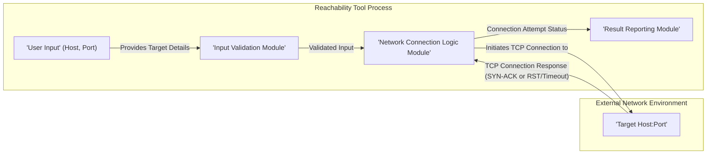
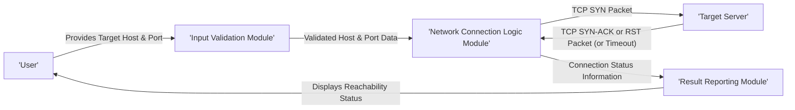

## Project Design Document: Reachability Checker

**Project Name:** Reachability

**Project Repository:** https://github.com/tonymillion/reachability

**Version:** 1.1

**Date:** October 26, 2023

**Author:** AI Software Architect

### 1. Project Overview

The Reachability project is a command-line utility designed to determine the network reachability of a specified host and port. It operates by attempting to establish a Transmission Control Protocol (TCP) connection to the given network endpoint. The tool then reports the outcome of this connection attempt, indicating success or failure. This functionality is valuable for basic network troubleshooting, verifying the availability of network services, and confirming network connectivity.

### 2. Goals

* Provide a straightforward and efficient mechanism for verifying network endpoint reachability.
* Accept the target host, specified as either a hostname or an Internet Protocol (IP) address, as input.
* Accept the target port number as input.
* Clearly communicate the result of the connection attempt to the user (success or failure).
* Provide informative, albeit basic, error messages in the event of a connection failure.

### 3. Non-Goals

* Implementing support for network protocols beyond basic TCP connection attempts (e.g., Internet Control Message Protocol (ICMP) ping, User Datagram Protocol (UDP) checks, HTTP requests).
* Providing advanced network diagnostic capabilities, such as detailed route tracing or latency measurements.
* Incorporating any form of user authentication or authorization mechanisms.
* Offering extensive configuration options beyond the target host and port (e.g., custom timeout values, source port selection).
* Generating comprehensive logs or detailed reports of reachability checks.
* Developing a graphical user interface (GUI) for the tool.
* Functioning as a persistent, long-running network monitoring service.

### 4. Architecture Overview

The Reachability tool employs a simple, single-process architecture. The execution flow involves a series of sequential steps performed by distinct logical components within the application.

### 5. Component Details

* **User Input (Host, Port):**
    * This represents the entry point for user interaction, typically through command-line arguments.
    * The user provides the target network endpoint's details: the hostname or IP address of the server and the port number of the service.
    * The expected input format is a string for the host and an integer for the port.

* **Input Validation Module:**
    * This module is responsible for ensuring the integrity and validity of the user-provided input.
    * It performs checks to determine if the provided host string is a syntactically valid hostname or IP address.
    * It verifies that the provided port is a valid integer within the standard port range (1 to 65535).
    * In case of invalid input, this module generates an appropriate error message and terminates the program execution gracefully.

* **Network Connection Logic Module:**
    * This is the core component that implements the network reachability check.
    * It utilizes the operating system's networking capabilities, typically through socket programming interfaces.
    * The module creates a TCP socket and attempts to establish a connection to the specified host and port.
    * It incorporates a timeout mechanism to prevent the program from hanging indefinitely if the target is unreachable.
    * This module handles various potential network errors that may occur during the connection attempt, such as "connection refused," "host not found," or network timeouts.

* **Result Reporting Module:**
    * This module is responsible for presenting the outcome of the reachability check to the user.
    * If the network connection is successfully established within the timeout period, a success message is displayed.
    * If the connection attempt fails due to network errors or timeouts, an informative error message indicating the reason for failure is displayed.
    * The output is typically directed to the standard output stream (stdout).

### 6. Data Flow

The flow of data within the Reachability tool is sequential, starting with user input and culminating in the reporting of the connection status.

### 7. Technology Stack

* **Programming Language:**  Likely Python (inferred from the linked GitHub repository).
* **Standard Libraries:**  The tool likely leverages standard library modules provided by the chosen programming language for network operations. For Python, this would include the `socket` module.
* **Operating System Compatibility:**  Designed to be compatible with common operating systems that support the chosen programming language and its networking capabilities (e.g., Linux, macOS, Windows).

### 8. Deployment Model

The Reachability tool is intended to be deployed as a standalone, command-line executable.

* **Distribution Method:**  Likely distributed as a source code script or a packaged executable file.
* **Execution Environment:**  Executed directly from the command line or terminal by the user.
* **Dependencies:**  Designed to have minimal external dependencies, primarily relying on the standard library of the chosen programming language to simplify deployment.

### 9. Security Considerations (Detailed)

This section expands upon the initial security considerations, providing more specific potential threats and vulnerabilities. This information will be crucial for the subsequent threat modeling process.

* **Insufficient Input Validation:**
    * **Threat:** Malicious users could provide crafted input (e.g., excessively long hostnames, hostnames containing special characters, negative or out-of-range port numbers) to cause unexpected behavior, program crashes, or potentially exploit underlying system vulnerabilities.
    * **Mitigation:** Implement robust input validation to sanitize and verify all user-provided data before it is used by the application.

* **Verbose Error Handling and Information Disclosure:**
    * **Threat:** Overly detailed error messages could inadvertently reveal sensitive information about the internal workings of the application, the network configuration of the system running the tool, or the existence of internal network infrastructure.
    * **Mitigation:** Ensure error messages are informative but avoid disclosing sensitive technical details. Log detailed error information securely for debugging purposes, but do not expose it directly to the user.

* **Unintended Network Interactions:**
    * **Threat:** Although the tool is designed for simple TCP connection attempts, vulnerabilities in the underlying networking libraries or the tool's implementation could potentially be exploited to initiate unintended network interactions or bypass security controls.
    * **Mitigation:** Adhere to secure coding practices when implementing network functionalities. Regularly update dependencies to patch known vulnerabilities.

* **Denial of Service (DoS) Potential:**
    * **Threat:** While the tool itself is simple, if not properly implemented, rapid or repeated execution with a large number of targets could potentially contribute to a DoS attack against the network or target systems, especially if the tool does not implement appropriate rate limiting or resource management.
    * **Mitigation:** Implement reasonable timeouts and resource limits to prevent excessive resource consumption. Educate users on responsible usage of the tool.

* **Dependency Vulnerabilities (If Applicable):**
    * **Threat:** If the tool relies on external libraries (though unlikely for this simple tool), vulnerabilities in those libraries could be exploited.
    * **Mitigation:** Regularly audit and update all dependencies to ensure they are patched against known security vulnerabilities. Employ dependency management tools to track and manage dependencies effectively.

* **Code Injection (Less Likely but Possible):**
    * **Threat:** In highly unlikely scenarios, if user input is not properly sanitized and is used in a way that allows code execution (e.g., through shell commands), it could lead to code injection vulnerabilities.
    * **Mitigation:** Avoid executing external commands based on user input. If necessary, use safe and well-vetted methods for interacting with the operating system.

### 10. Assumptions and Constraints

* **Basic Network Connectivity:** The tool assumes that the system running it has fundamental network connectivity and is capable of initiating outbound TCP connections.
* **Target System Availability:** The successful operation of the tool depends on the availability and responsiveness of the target host and port.
* **Network Firewalls and Security Groups:** Network firewalls and security group configurations on both the client and target networks can impact the tool's ability to establish a connection. These are external factors beyond the tool's control.
* **Focus on Simplicity:** The design prioritizes simplicity and ease of use, limiting the scope of features and complexity.
* **Single Concurrent User:** The tool is designed for single-user execution at a time and does not incorporate mechanisms for handling concurrent requests.

This improved design document provides a more detailed and refined description of the Reachability project, offering a stronger foundation for subsequent threat modeling activities by elaborating on potential security concerns and providing a clearer understanding of the system's architecture and functionality.