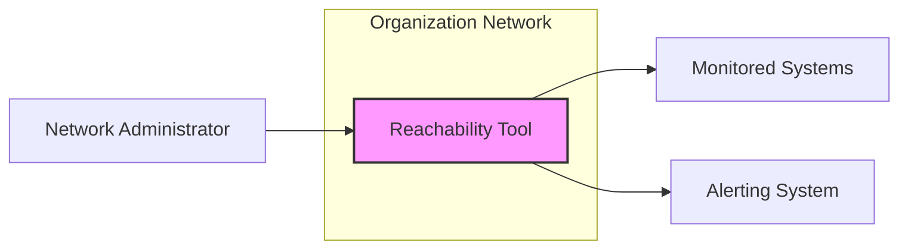
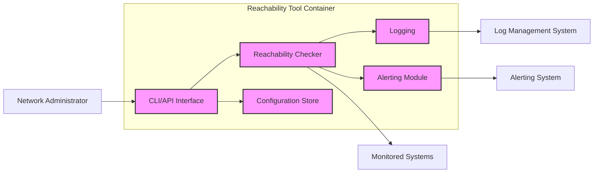
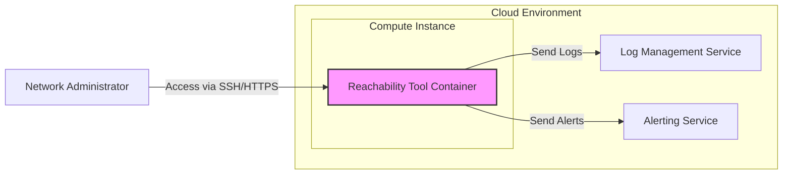
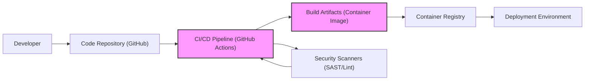

# BUSINESS POSTURE

This project, `reachability`, provides a network reachability checking tool. The primary business goal for such a tool is to ensure the reliability and availability of network services and infrastructure. Businesses rely on network connectivity for critical operations, and downtime can lead to significant financial and reputational damage.

- Business Priorities:
  - Ensure high availability of critical network services.
  - Minimize downtime and service disruptions.
  - Provide timely alerts for network connectivity issues.
  - Enable efficient network troubleshooting and diagnostics.

- Business Goals:
  - Proactively monitor network reachability of key infrastructure components and services.
  - Reduce mean time to resolution (MTTR) for network outages.
  - Improve overall network stability and performance.
  - Provide data-driven insights into network health and trends.

- Business Risks:
  - False negatives: The tool fails to detect an actual network outage, leading to prolonged downtime and service disruption.
  - False positives: The tool incorrectly reports a network outage, causing unnecessary alerts and wasted resources on investigation.
  - Data breaches: If the tool collects and stores sensitive network information (e.g., IP addresses, network configurations) and this data is compromised.
  - Availability of the reachability tool itself: If the monitoring tool becomes unavailable, it cannot perform its function, leading to a blind spot in network monitoring.
  - Performance impact: The reachability checks might consume excessive network resources, impacting the performance of monitored systems.

# SECURITY POSTURE

- Security Controls:
  - security control: Input validation on target hostnames/IP addresses to prevent command injection or other input-based vulnerabilities. (Implemented in code, needs review).
  - security control: Principle of least privilege for the tool's execution environment. (Deployment dependent, needs definition).
  - security control: Logging of reachability checks and any errors encountered. (Implemented in code, needs review).

- Accepted Risks:
  - accepted risk: Potential for information disclosure if error messages or logs contain sensitive network details. (Mitigation: Review logs and error handling).
  - accepted risk: Reliance on underlying network security for the reachability checks themselves. (Mitigation: Ensure network infrastructure is secured).

- Recommended Security Controls:
  - security control: Implement authentication and authorization for accessing the reachability tool's configuration and results, especially if exposed via an API or web interface.
  - security control: Encrypt sensitive data at rest and in transit if the tool stores or transmits network information.
  - security control: Regularly scan the codebase for vulnerabilities using SAST and DAST tools.
  - security control: Implement a secure software development lifecycle (SSDLC) including security reviews and testing.
  - security control: Automate security checks in the build pipeline (e.g., linters, vulnerability scanners).
  - security control: Implement monitoring and alerting for the reachability tool itself to ensure its availability and integrity.

- Security Requirements:
  - Authentication:
    - Requirement: If the reachability tool is exposed via an interface (API, web UI), it must require authentication to prevent unauthorized access to configuration and results.
    - Requirement: Authentication mechanism should be strong and resistant to common attacks (e.g., brute-force, credential stuffing).

  - Authorization:
    - Requirement: Implement role-based access control (RBAC) to restrict access to specific functionalities and data based on user roles.
    - Requirement: Ensure that only authorized users can modify the tool's configuration or access sensitive monitoring data.

  - Input Validation:
    - Requirement: All inputs, especially target hostnames/IP addresses and ports, must be thoroughly validated to prevent injection attacks (e.g., command injection, DNS rebinding).
    - Requirement: Input validation should be applied on both client-side and server-side (if applicable).

  - Cryptography:
    - Requirement: If sensitive network data is stored or transmitted, it must be encrypted using strong cryptographic algorithms.
    - Requirement: Securely manage cryptographic keys and certificates.
    - Requirement: Use HTTPS for all communication if the tool exposes a web interface or API.

# DESIGN

## C4 CONTEXT

- C4 Context Elements:
  - - Name: Reachability Tool
    - Type: Software System
    - Description: A tool to check the network reachability of specified hosts and ports. It performs network probes and reports the status.
    - Responsibilities:
      - Accept target hostnames or IP addresses and ports as input.
      - Perform network reachability checks (e.g., ping, TCP connect).
      - Report reachability status (reachable/unreachable).
      - Log results and errors.
      - Optionally trigger alerts based on reachability status.
    - Security controls:
      - security control: Input validation on target hostnames/IP addresses.
      - security control: Principle of least privilege execution.
      - security control: Logging of activities.

  - - Name: Network Administrator
    - Type: Person
    - Description: Users who operate and maintain the network infrastructure. They use the Reachability Tool to monitor network health and troubleshoot issues.
    - Responsibilities:
      - Configure the Reachability Tool with target systems to monitor.
      - Review reachability reports and alerts.
      - Investigate and resolve network connectivity issues.
    - Security controls:
      - security control: Authentication to access the Reachability Tool's interface (if applicable).
      - security control: Authorization to manage configurations and view results.

  - - Name: Monitored Systems
    - Type: Software Systems / Infrastructure
    - Description: The network devices, servers, applications, and services that are being monitored for reachability by the Reachability Tool.
    - Responsibilities:
      - Respond to network probes from the Reachability Tool.
      - Provide network services to users and other systems.
    - Security controls:
      - security control: Network firewalls to control inbound and outbound traffic.
      - security control: Intrusion detection and prevention systems (IDS/IPS).
      - security control: Security hardening of operating systems and applications.

  - - Name: Alerting System
    - Type: Software System
    - Description: A system that receives alerts from the Reachability Tool when reachability issues are detected and notifies network administrators.
    - Responsibilities:
      - Receive reachability alerts from the Reachability Tool.
      - Notify network administrators via email, SMS, or other channels.
      - Manage alert escalation and acknowledgement.
    - Security controls:
      - security control: Secure API for receiving alerts from the Reachability Tool.
      - security control: Authentication and authorization for accessing alert information.

## C4 CONTAINER

- C4 Container Elements:
  - - Name: CLI/API Interface
    - Type: Application Interface
    - Description: Provides a command-line interface (CLI) and potentially an API for users (Network Administrators) to interact with the Reachability Tool. This includes configuring targets, initiating checks, and retrieving results.
    - Responsibilities:
      - Accept user commands and API requests.
      - Validate user inputs.
      - Delegate tasks to the Reachability Checker.
      - Present results to the user.
      - Manage user authentication and authorization (if API is exposed).
    - Security controls:
      - security control: Input validation for all user inputs.
      - security control: Authentication and authorization for API access.
      - security control: Rate limiting to prevent abuse of API.

  - - Name: Reachability Checker
    - Type: Application Component
    - Description: The core component responsible for performing the network reachability checks. It uses network protocols (e.g., ICMP, TCP) to probe target systems.
    - Responsibilities:
      - Receive target information from the CLI/API Interface.
      - Perform network reachability checks using appropriate protocols.
      - Determine reachability status (reachable/unreachable).
      - Generate reachability results.
    - Security controls:
      - security control: Secure coding practices to prevent vulnerabilities in network probing logic.
      - security control: Limit network privileges required for probing.

  - - Name: Configuration Store
    - Type: Data Store
    - Description: Stores the configuration of the Reachability Tool, including the list of target systems to monitor, check intervals, and alerting thresholds. This could be a file, database, or configuration management system.
    - Responsibilities:
      - Persist configuration data.
      - Provide configuration data to other components.
      - Ensure data integrity and availability.
    - Security controls:
      - security control: Access control to restrict access to configuration data.
      - security control: Encryption of sensitive configuration data at rest (if applicable).
      - security control: Backup and recovery mechanisms.

  - - Name: Logging
    - Type: Application Component
    - Description: Handles logging of all activities of the Reachability Tool, including reachability checks, errors, and configuration changes. Logs are used for auditing, troubleshooting, and monitoring.
    - Responsibilities:
      - Collect log data from other components.
      - Format and store log data.
      - Provide access to logs for authorized users or systems.
    - Security controls:
      - security control: Secure storage of log data.
      - security control: Access control to restrict access to logs.
      - security control: Log rotation and retention policies.
      - security control: Protection against log injection attacks.

  - - Name: Alerting Module
    - Type: Application Component
    - Description: Responsible for generating and sending alerts based on reachability check results. It integrates with an external Alerting System to notify administrators of issues.
    - Responsibilities:
      - Monitor reachability check results.
      - Detect reachability failures based on configured thresholds.
      - Generate alerts.
      - Send alerts to the Alerting System.
    - Security controls:
      - security control: Secure communication channel to the Alerting System.
      - security control: Rate limiting of alerts to prevent alert flooding.

## DEPLOYMENT

Deployment Option: Containerized Deployment on Cloud Infrastructure (e.g., AWS, Azure, GCP)

- Deployment Elements:
  - - Name: Reachability Tool Container
    - Type: Container
    - Description: A Docker container image containing the Reachability Tool application and its dependencies. This container is deployed and run on a compute instance in the cloud environment.
    - Responsibilities:
      - Run the Reachability Tool application.
      - Execute reachability checks.
      - Generate logs and alerts.
      - Expose CLI/API interface (if configured).
    - Security controls:
      - security control: Container image built from a secure base image.
      - security control: Regular vulnerability scanning of the container image.
      - security control: Principle of least privilege for container runtime.
      - security control: Network policies to restrict container network access.

  - - Name: Compute Instance
    - Type: Infrastructure
    - Description: A virtual machine (VM) or container instance in the cloud environment where the Reachability Tool Container is deployed.
    - Responsibilities:
      - Provide compute resources for the Reachability Tool Container.
      - Manage network connectivity for the container.
      - Provide storage for container data (if needed).
    - Security controls:
      - security control: Security hardening of the compute instance operating system.
      - security control: Network security groups/firewalls to control access to the instance.
      - security control: Regular patching and updates of the operating system.
      - security control: Access control to the compute instance (e.g., SSH key management).

  - - Name: Log Management Service
    - Type: Cloud Service
    - Description: A cloud-based log management service (e.g., AWS CloudWatch Logs, Azure Monitor Logs, GCP Cloud Logging) used to collect, store, and analyze logs from the Reachability Tool Container.
    - Responsibilities:
      - Receive logs from the Reachability Tool Container.
      - Store and index logs.
      - Provide search and analysis capabilities for logs.
      - Ensure log data durability and availability.
    - Security controls:
      - security control: Secure API for receiving logs.
      - security control: Access control to log data.
      - security control: Encryption of log data at rest and in transit.
      - security control: Data retention policies.

  - - Name: Alerting Service
    - Type: Cloud Service
    - Description: A cloud-based alerting service (e.g., AWS SNS, Azure Event Grid, GCP Cloud Pub/Sub) used to receive alerts from the Reachability Tool Container and notify network administrators.
    - Responsibilities:
      - Receive alerts from the Reachability Tool Container.
      - Route alerts to configured notification channels (e.g., email, SMS, Slack).
      - Manage alert subscriptions and notifications.
    - Security controls:
      - security control: Secure API for receiving alerts.
      - security control: Authentication and authorization for managing alerts.
      - security control: Encryption of alert data in transit.

## BUILD

- Build Process Elements:
  - - Name: Developer
    - Type: Person
    - Description: Software developers who write and maintain the code for the Reachability Tool.
    - Responsibilities:
      - Write and commit code changes to the code repository.
      - Follow secure coding practices.
      - Participate in code reviews.
    - Security controls:
      - security control: Secure development environment.
      - security control: Code review process.
      - security control: Security awareness training.

  - - Name: Code Repository (GitHub)
    - Type: Code Repository
    - Description: A version control system (GitHub) used to store and manage the source code of the Reachability Tool.
    - Responsibilities:
      - Store and version control source code.
      - Manage code branches and merges.
      - Trigger CI/CD pipelines on code changes.
    - Security controls:
      - security control: Access control to the repository.
      - security control: Branch protection rules.
      - security control: Audit logging of repository activities.

  - - Name: CI/CD Pipeline (GitHub Actions)
    - Type: Automation System
    - Description: A continuous integration and continuous delivery (CI/CD) pipeline implemented using GitHub Actions. It automates the build, test, security scanning, and deployment processes.
    - Responsibilities:
      - Automate build process.
      - Run unit and integration tests.
      - Perform static analysis security testing (SAST) and linting.
      - Build container images.
      - Push container images to the container registry.
      - Trigger deployment to target environments.
    - Security controls:
      - security control: Secure configuration of CI/CD pipeline.
      - security control: Use of secure credentials management for CI/CD.
      - security control: Isolation of build environments.
      - security control: Audit logging of CI/CD activities.

  - - Name: Security Scanners (SAST/Lint)
    - Type: Security Tool
    - Description: Static analysis security testing (SAST) tools and linters integrated into the CI/CD pipeline to automatically scan the codebase for potential vulnerabilities and code quality issues.
    - Responsibilities:
      - Analyze source code for security vulnerabilities and code defects.
      - Generate reports of identified issues.
      - Fail the build pipeline if critical vulnerabilities are found.
    - Security controls:
      - security control: Regularly updated vulnerability signatures.
      - security control: Configuration of scanners to match security policies.

  - - Name: Build Artifacts (Container Image)
    - Type: Artifact
    - Description: The output of the build process, which is a Docker container image containing the Reachability Tool application.
    - Responsibilities:
      - Package the application and its dependencies.
      - Be immutable and reproducible.
      - Be scanned for vulnerabilities.
    - Security controls:
      - security control: Signed container images to ensure integrity.
      - security control: Minimal container image size to reduce attack surface.

  - - Name: Container Registry
    - Type: Artifact Repository
    - Description: A container registry (e.g., Docker Hub, AWS ECR, Azure ACR, GCP GCR) used to store and manage container images.
    - Responsibilities:
      - Store container images securely.
      - Provide access control to container images.
      - Distribute container images to deployment environments.
    - Security controls:
      - security control: Access control to the registry.
      - security control: Vulnerability scanning of stored images.
      - security control: Image signing and verification.

  - - Name: Deployment Environment
    - Type: Environment
    - Description: The target environment (e.g., cloud environment, on-premises infrastructure) where the Reachability Tool is deployed and run.
    - Responsibilities:
      - Run the Reachability Tool application.
      - Provide necessary infrastructure and resources.
      - Ensure the availability and security of the deployed application.
    - Security controls:
      - security control: Security hardening of the deployment environment.
      - security control: Network security controls in the deployment environment.
      - security control: Monitoring and logging of deployed application.

# RISK ASSESSMENT

- Critical Business Processes:
  - Monitoring network infrastructure availability.
  - Alerting on network outages to minimize downtime.
  - Network troubleshooting and diagnostics.

- Data to Protect and Sensitivity:
  - Configuration data (target hosts, ports, check intervals): Low to Medium sensitivity. Exposure could reveal monitoring targets.
  - Reachability check results (logs, alerts): Low to Medium sensitivity. Could reveal network status and potential vulnerabilities if detailed error messages are exposed.
  - Potentially, if authentication is implemented, user credentials: High sensitivity. Must be protected with strong encryption and access controls.

# QUESTIONS & ASSUMPTIONS

- Questions:
  - Is there a need for user authentication and authorization for the Reachability Tool? If yes, what level of access control is required?
  - Is there a requirement to store historical reachability data? If yes, what is the retention period and sensitivity of this data?
  - What are the performance requirements for the Reachability Tool? How many targets need to be monitored and at what frequency?
  - What alerting channels are required (e.g., email, SMS, Slack, PagerDuty)?
  - What is the intended deployment environment (cloud, on-premises, hybrid)?
  - Are there any specific compliance requirements (e.g., GDPR, HIPAA, PCI DSS) that the Reachability Tool needs to adhere to?

- Assumptions:
  - BUSINESS POSTURE: The primary business goal is to improve network availability and reduce downtime. The organization values proactive network monitoring.
  - SECURITY POSTURE: Currently, security controls are basic, focusing on input validation and logging. There is a need to enhance security posture, especially around authentication, authorization, and secure development practices.
  - DESIGN: The Reachability Tool will be deployed as a containerized application in a cloud environment. It will have a CLI/API interface and integrate with existing log management and alerting systems. The build process will be automated using CI/CD and include basic security checks.