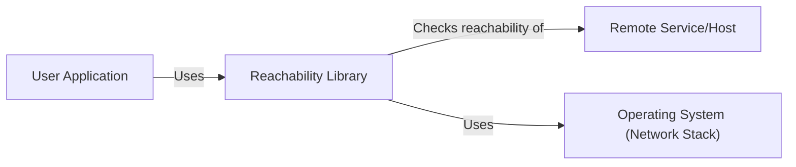
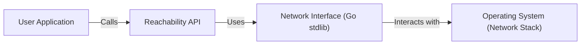
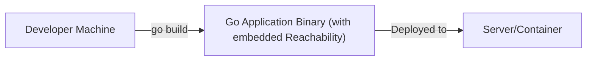
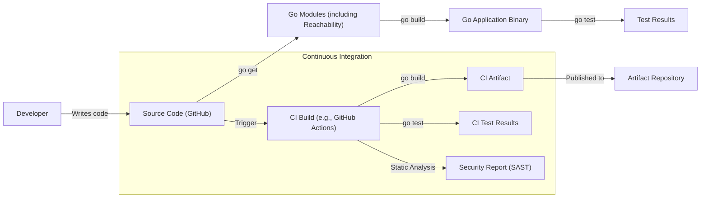

Okay, let's create a design document for the `reachability` project.

# BUSINESS POSTURE

Business Priorities and Goals:

*   Provide a simple, lightweight, and reliable way to check network reachability from within a Go application.
*   Offer a cross-platform solution that works consistently across different operating systems.
*   Minimize external dependencies to reduce the risk of supply chain attacks and simplify deployment.
*   Enable developers to easily integrate network reachability checks into their applications, improving the robustness and user experience of their software.
*   The project is a small utility library, suggesting a focus on simplicity, maintainability, and ease of use over extensive feature sets.

Most Important Business Risks:

*   Inaccurate reachability results, leading to incorrect application behavior. This could manifest as the application believing a service is unavailable when it is, or vice versa.
*   Security vulnerabilities within the library itself, potentially allowing attackers to exploit applications that use it. Given its low-level network access, even minor vulnerabilities could have significant consequences.
*   Compatibility issues with different operating systems or network configurations, limiting the library's usefulness.
*   Performance bottlenecks, especially if the reachability checks are performed frequently or block application execution.
*   Lack of maintainability, making it difficult to fix bugs, add features, or adapt to changes in underlying operating system APIs.

# SECURITY POSTURE

Existing Security Controls:

*   security control: Limited external dependencies. The project appears to rely primarily on the Go standard library, reducing the attack surface. (Described in `go.mod` and source code).
*   security control: Use of standard Go libraries for network operations. Leveraging well-vetted, built-in Go functionality is generally safer than using third-party networking libraries. (Described in source code).
*   security control: The project is open-source, allowing for community review and scrutiny of the code for potential vulnerabilities. (Described in GitHub repository).

Accepted Risks:

*   accepted risk: Potential for false positives/negatives in reachability checks due to network conditions or misconfigurations. This is inherent to network diagnostics and is acknowledged.
*   accepted risk: The library uses `syscall` which, if used incorrectly, can introduce vulnerabilities.

Recommended Security Controls:

*   security control: Implement fuzz testing to identify potential vulnerabilities related to unexpected input or edge cases.
*   security control: Integrate static analysis tools (e.g., `go vet`, `staticcheck`, `gosec`) into the build process to automatically detect potential security issues.
*   security control: Consider adding a security policy to the repository to provide clear guidelines for reporting vulnerabilities.
*   security control: Regularly update dependencies (if any are added) to address known vulnerabilities.
*   security control: Implement unit tests to ensure the correctness and robustness of the code.

Security Requirements:

*   Authentication: Not applicable, as this is a library for checking network reachability, not for authenticating users or services.
*   Authorization: Not applicable, as the library does not manage access control.
*   Input Validation: The library takes hostnames/IP addresses as input.
    *   Requirement: Validate input to ensure it conforms to expected formats (e.g., valid hostname or IP address).
    *   Requirement: Sanitize input to prevent potential injection attacks, although the risk is low given the library's functionality.
*   Cryptography: Not directly applicable, as the library does not handle encryption or cryptographic operations. However, if the library were to be extended to support protocols like HTTPS, then appropriate cryptographic controls would be necessary.

# DESIGN

## C4 CONTEXT

Element Descriptions:

*   Element:
    *   Name: User Application
    *   Type: Software System
    *   Description: Any application that utilizes the Reachability library to check network connectivity.
    *   Responsibilities:
        *   Integrates the Reachability library.
        *   Calls the Reachability library's functions to perform reachability checks.
        *   Handles the results of the reachability checks (e.g., displaying error messages, retrying connections).
    *   Security controls:
        *   Input validation of hostnames/IP addresses passed to the Reachability library.
        *   Secure handling of any errors returned by the Reachability library.

*   Element:
    *   Name: Reachability Library
    *   Type: Library
    *   Description: The `reachability` Go library itself.
    *   Responsibilities:
        *   Provides functions for checking network reachability.
        *   Abstracts away platform-specific details of network connectivity checks.
        *   Returns results indicating whether a host is reachable.
    *   Security controls:
        *   Input validation (as described in Security Requirements).
        *   Limited external dependencies.
        *   Use of standard Go libraries.

*   Element:
    *   Name: Remote Service/Host
    *   Type: External System
    *   Description: The remote service or host whose reachability is being checked.
    *   Responsibilities:
        *   Responds to network requests (e.g., ICMP pings, TCP connection attempts).
    *   Security controls:
        *   Dependent on the specific remote service/host. The Reachability library has no control over this.

*   Element:
    *   Name: Operating System (Network Stack)
    *   Type: External System
    *   Description: The underlying operating system's network stack.
    *   Responsibilities:
        *   Provides the low-level network functionality used by the Reachability library (e.g., sockets, ICMP).
    *   Security controls:
        *   Dependent on the operating system's security features and configuration.

## C4 CONTAINER

Element Descriptions:

*   Element:
    *   Name: User Application
    *   Type: Software System
    *   Description:  The application using the reachability library.
    *   Responsibilities:
        *   Initiates reachability checks.
        *   Processes results.
    *   Security controls:
        *   Handles results securely.

*   Element:
    *   Name: Reachability API
    *   Type: API
    *   Description: The public interface of the reachability library.
    *   Responsibilities:
        *   Exposes functions for checking reachability.
        *   Validates input parameters.
    *   Security controls:
        *   Input validation.

*   Element:
    *   Name: Network Interface (Go stdlib)
    *   Type: Library
    *   Description:  Go standard library components used for network operations (e.g., `net` package).
    *   Responsibilities:
        *   Provides low-level network functions.
    *   Security controls:
        *   Relies on the security of the Go standard library.

*   Element:
    *   Name: Operating System (Network Stack)
    *   Type: External System
    *   Description: The underlying OS network stack.
    *   Responsibilities:
        *   Handles network communication.
    *   Security controls:
        *   OS-level security controls.

## DEPLOYMENT

Possible Deployment Solutions:

1.  **Embedded Library:** The most likely scenario is that `reachability` is used as a library directly embedded within other Go applications.  The library's code becomes part of the application's binary.
2.  **Standalone Service (Unlikely):**  It's less likely, but theoretically, the reachability logic *could* be packaged as a standalone network service (e.g., a simple daemon that responds to reachability requests). This is not the intended use case based on the repository.

Chosen Solution (1. Embedded Library):

Element Descriptions:

*   Element:
    *   Name: Developer Machine
    *   Type: Workstation
    *   Description: The developer's computer where the code is written and built.
    *   Responsibilities:
        *   Code development.
        *   Building the application binary.
    *   Security controls:
        *   Developer machine security (e.g., antivirus, firewall).

*   Element:
    *   Name: Go Application Binary (with embedded Reachability)
    *   Type: Executable
    *   Description: The compiled Go application, which includes the `reachability` library code.
    *   Responsibilities:
        *   Runs the application logic, including reachability checks.
    *   Security controls:
        *   Security controls implemented within the application and the `reachability` library.

*   Element:
    *   Name: Server/Container
    *   Type: Runtime Environment
    *   Description: The server or container where the Go application is deployed.
    *   Responsibilities:
        *   Provides the environment for the application to run.
    *   Security controls:
        *   Server/container security (e.g., OS hardening, network segmentation, container security policies).

## BUILD

Build Process Description:

1.  **Development:** A developer writes code and pushes it to the GitHub repository.
2.  **Dependency Management:** The `go get` command fetches the necessary dependencies, including the `reachability` library (if used as a dependency in another project).
3.  **Build:** The `go build` command compiles the source code into an executable binary.
4.  **Testing:** The `go test` command runs unit tests to ensure the code's correctness.
5.  **Continuous Integration (CI):** A CI system (e.g., GitHub Actions) is triggered by changes to the repository.
    *   The CI system performs the same build and test steps as above.
    *   **Security Checks:**
        *   **Static Analysis (SAST):** A static analysis tool (e.g., `gosec`, `staticcheck`) scans the code for potential security vulnerabilities. The results are reported.
        *   **Dependency Scanning:** If external dependencies are used, a dependency scanner (e.g., `snyk`, `dependabot`) checks for known vulnerabilities in those dependencies.
6.  **Artifact Publication:** If the build and tests are successful, the CI system may publish the resulting artifact (e.g., the Go binary) to an artifact repository.

Security Controls in Build Process:

*   security control: Use of a CI system to automate builds and tests, ensuring consistency and repeatability.
*   security control: Static analysis (SAST) to identify potential security vulnerabilities in the code.
*   security control: Dependency scanning (if applicable) to detect known vulnerabilities in external dependencies.
*   security control: Code review process (through pull requests) to ensure that code changes are reviewed by other developers before being merged.

# RISK ASSESSMENT

Critical Business Processes:

*   The primary business process is providing accurate network reachability information to applications. This enables applications to make informed decisions about connecting to remote services, handling network errors gracefully, and providing a better user experience.

Data Protection:

*   Data Sensitivity: The `reachability` library itself does not handle sensitive data directly. It primarily deals with hostnames/IP addresses, which may be considered metadata. However, the *applications* using this library might handle sensitive data, and the reachability information could indirectly influence the security of that data (e.g., by preventing an application from connecting to a compromised service).
*   Data to Protect: While the library doesn't directly handle sensitive data, the *integrity* of the reachability information is crucial. If an attacker could manipulate the results, they might be able to redirect traffic or cause the application to behave incorrectly.

# QUESTIONS & ASSUMPTIONS

Questions:

*   Are there any specific network environments or configurations that the library needs to be particularly aware of (e.g., firewalls, proxies, VPNs)?
*   What level of error handling and reporting is expected from the library? Should it provide detailed error messages, or just simple boolean results?
*   Are there any performance requirements or constraints? How frequently will the reachability checks be performed?
*   Are there plans to extend the library's functionality in the future (e.g., supporting different protocols, adding more sophisticated diagnostic capabilities)?

Assumptions:

*   BUSINESS POSTURE: The primary goal is to provide a simple, reliable, and secure way to check network reachability.
*   BUSINESS POSTURE: The library is intended to be used as a dependency within other Go applications, rather than as a standalone service.
*   SECURITY POSTURE: The developers prioritize security and are willing to implement recommended security controls.
*   SECURITY POSTURE: The library will be used in environments where basic network connectivity is expected (i.e., not in highly restricted or unusual network setups).
*   DESIGN: The Go standard library provides sufficient functionality for the library's needs, and there is no need for external dependencies.
*   DESIGN: The library will be used in a synchronous manner (i.e., the application will wait for the reachability check to complete before proceeding).
*   DESIGN: The library is designed to be lightweight and have minimal performance overhead.