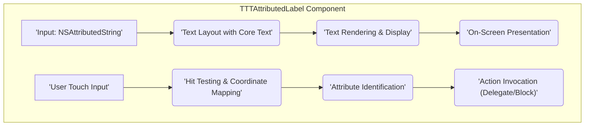
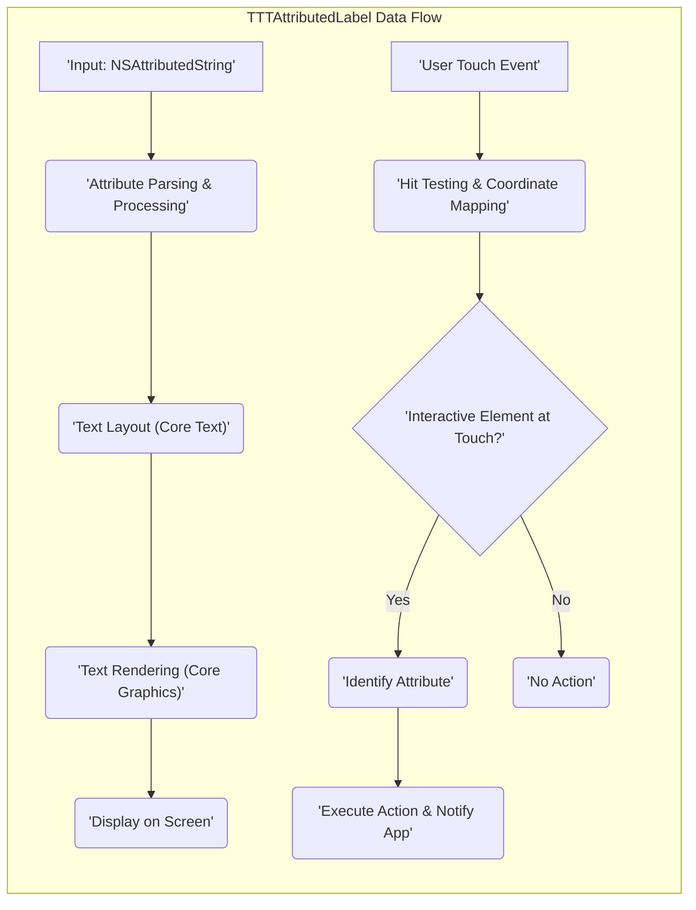

## Project Design Document: TTTAttributedLabel (Improved)

**1. Introduction**

This document provides an enhanced design overview of the `TTTAttributedLabel` project, an open-source iOS library hosted on GitHub at [https://github.com/TTTAttributedLabel/TTTAttributedLabel](https://github.com/TTTAttributedLabel/TTTAttributedLabel). The purpose of this document is to clearly articulate the library's architecture, data flow, and key components, specifically to facilitate comprehensive threat modeling.

**2. Goals**

The primary design goals of the `TTTAttributedLabel` library are:

* **Rich Text Rendering:** To offer a robust and efficient mechanism for displaying attributed strings with diverse formatting options within iOS applications.
* **Interactive Text Elements:** To seamlessly integrate interactive elements within text, including tappable links, automatically detected data (phone numbers, dates, etc.), and custom defined attributes.
* **Customization and Performance:** To provide a highly customizable and performant solution for rendering complex text layouts without impacting application responsiveness.
* **Simplified User Interaction:** To abstract the complexities of handling user interactions with specific elements within attributed text.

**3. Non-Goals**

This design document explicitly excludes details concerning:

* **Core Text Implementation Internals:** The specific low-level implementation details of Apple's Core Text framework, which `TTTAttributedLabel` utilizes.
* **Integrating Application UI:** The specific user interface implementation within applications that incorporate `TTTAttributedLabel`.
* **Network Data Retrieval:** The processes involved in fetching data that might be subsequently displayed using the library.
* **Data Persistence Mechanisms:** How attributed strings or related data are stored or persisted.

**4. Architectural Overview**

`TTTAttributedLabel` is fundamentally a custom UI component, extending the standard `UILabel` to provide advanced text rendering and interaction capabilities powered by Apple's Core Text framework. The core architectural elements are illustrated below:

**Key Architectural Components:**

* **`TTTAttributedLabel` Class:** The central class, inheriting from `UILabel`, responsible for managing the attributed string, orchestrating text layout using Core Text, handling rendering, and managing user interactions.
* **`NSAttributedString` Input:** The primary data source, an `NSAttributedString` object containing the text content and associated formatting attributes (fonts, colors, hyperlinks, custom attributes, etc.).
* **Core Text Integration (Layout Engine):**  Leverages Apple's Core Text framework to perform complex text layout calculations, including line breaking, glyph positioning, handling bidirectional text, and managing text containers.
* **Rendering Engine (Core Graphics):**  Utilizes Core Graphics to draw the laid-out text onto the screen, rendering individual glyphs and applying specified styles.
* **Touch Handling and Hit Testing:** Implements logic to capture user touch events within the label's bounds and perform hit testing to determine if the touch intersects with any interactive elements.
* **Attribute Detection Logic:**  Code responsible for identifying the specific attribute at a given touch point, enabling the library to determine if a link, data detector, or custom attribute was tapped.
* **Action Handling Mechanisms:** Provides mechanisms (typically delegate methods or completion blocks) to notify the integrating application when an interactive element is activated, allowing the application to perform the appropriate action (e.g., opening a URL).
* **Data Detector Integration:** Functionality to automatically scan the text for predefined data types (URLs, phone numbers, dates, addresses) and apply corresponding attributes for interactive behavior.
* **Link Handling Subsystem:** Specific logic for managing and responding to user taps on URL links embedded within the attributed text.
* **Custom Attribute Handling:**  The capability to define and process custom attributes within the attributed string, enabling developers to create application-specific interactive elements.

**5. Data Flow Description**

The typical flow of data within the `TTTAttributedLabel` library proceeds as follows:

1. **Attributed String Provision:** An `NSAttributedString` object is set as the content of the `TTTAttributedLabel` instance. This string can be programmatically constructed or loaded from external sources.
2. **Attribute Parsing and Processing:** The library analyzes the provided `NSAttributedString` to identify and process the various attributes it contains, such as font styles, colors, embedded links, and data detector patterns.
3. **Text Layout Calculation:** The Core Text engine is invoked to perform text layout based on the attributed string's content and the label's constraints (e.g., frame size, number of lines). This involves determining line breaks, glyph placement, and handling text wrapping.
4. **Text Rendering to Context:** The laid-out text is rendered onto the label's drawing context using Core Graphics. This involves drawing individual glyphs with their associated styles and attributes.
5. **Display on Screen:** The rendered content is displayed within the bounds of the `TTTAttributedLabel` on the user's device screen.
6. **User Interaction (Touch Input):** When a user interacts with the label (e.g., taps), touch events are captured by the underlying `UIView` infrastructure.
7. **Hit Testing and Coordinate Mapping:** The library performs hit testing to determine the precise location of the touch within the label's coordinate system.
8. **Attribute Identification at Touch Location:** If a touch is detected, the library identifies the specific attribute (if any) present at the touched location. This determines if the user interacted with a link, data detector, or custom attribute.
9. **Action Execution and Notification:** Based on the identified attribute, the corresponding action is triggered. For instance, tapping a URL link might initiate the process of opening the URL in a web browser. The integrating application is typically notified of these actions through delegate methods or completion blocks.

**6. Dependencies**

The `TTTAttributedLabel` library relies on the following core Apple frameworks:

* **Foundation Framework:** Provides fundamental data types and system services, including `NSString`, `NSAttributedString`, URL handling classes, and notification mechanisms.
* **UIKit Framework:**  Offers the essential building blocks for iOS applications, including `UIView`, `UILabel`, touch event handling, and drawing infrastructure.
* **Core Text Framework:** Apple's powerful text layout and rendering engine, providing fine-grained control over typography and text manipulation.
* **Core Graphics Framework:** Apple's 2D drawing engine, used for rendering text, shapes, and images.

**7. Security Considerations (Detailed)**

A thorough threat model will be conducted separately; however, key preliminary security considerations for `TTTAttributedLabel` include:

* **Maliciously Crafted Attributed Strings:** An attacker could potentially construct a specially crafted `NSAttributedString` designed to exploit vulnerabilities in the text layout or rendering process. This could lead to:
    * **Buffer Overflows:**  Exploiting potential weaknesses in memory management when handling extremely large or complex attributed strings.
    * **Denial of Service (DoS):**  Crafting strings that consume excessive processing power or memory, leading to application unresponsiveness or crashes.
    * **Unexpected Rendering Behavior:**  Causing the library to render text in unintended ways, potentially obscuring UI elements or displaying misleading information.
* **Vulnerabilities in URL Handling:** Improper handling of URLs embedded within attributed strings could expose the application to:
    * **Phishing Attacks:** Displaying deceptive URLs that redirect users to malicious websites designed to steal credentials or sensitive information.
    * **URL Injection Attacks:**  Crafting URLs that, when opened, execute unintended actions within the application or on the user's device. This could involve exploiting custom URL schemes.
    * **Man-in-the-Middle (MitM) Attacks:** If the library doesn't enforce secure URL schemes (HTTPS), it could be vulnerable to MitM attacks where an attacker intercepts and modifies network traffic.
* **Exploitation of Data Detectors:**  Flaws in the data detection logic could allow attackers to craft text that triggers incorrect identification of data types, potentially leading to:
    * **Unintended Actions:**  Triggering phone calls, sending emails, or opening map locations based on maliciously crafted text.
    * **Information Disclosure:**  Potentially revealing sensitive information if data detectors inadvertently highlight or interact with private data.
* **Memory Safety Issues:** Bugs within the library's code related to memory management could lead to:
    * **Crashes:**  Causing the application to terminate unexpectedly.
    * **Memory Corruption:**  Potentially allowing attackers to overwrite memory and gain control of the application.
* **Regular Expression Vulnerabilities (Related to Data Detectors):** If regular expressions are used for data detection, poorly written or complex expressions could be vulnerable to Regular Expression Denial of Service (ReDoS) attacks.
* **Input Validation and Sanitization:**  Lack of proper input validation and sanitization within the library could allow malicious attributed strings to be processed without adequate security checks.

**8. Deployment Considerations**

`TTTAttributedLabel` is typically integrated into iOS applications as a third-party dependency. Security considerations during deployment include:

* **Secure Integration Practices:** Developers must ensure they are using the library correctly and not introducing vulnerabilities in their own code when handling attributed strings or user interactions. This includes proper handling of delegate methods and completion blocks.
* **Input Sanitization at the Application Level:** Applications should sanitize or validate any user-provided text before displaying it using `TTTAttributedLabel` to mitigate the risk of displaying malicious content.
* **Dependency Management and Updates:** Regularly updating the library to the latest version is crucial to benefit from bug fixes and security patches. Utilizing secure dependency management practices is essential.
* **iOS Security Features:** Relying on iOS security features like sandboxing can help limit the impact of potential vulnerabilities within the library.
* **Code Signing:** Ensuring the application and its dependencies are properly code-signed helps verify their integrity and origin.

**9. Future Considerations**

This improved design document provides a solid foundation for subsequent threat modeling efforts. Future steps will involve:

* **Formal Threat Modeling:** Conducting a structured threat modeling exercise using methodologies like STRIDE to systematically identify potential threats and vulnerabilities.
* **Security Code Review:** Performing a thorough review of the library's source code to identify potential security flaws.
* **Penetration Testing:**  Conducting security testing to actively probe for vulnerabilities and assess the library's resilience against attacks.
* **Adherence to Secure Coding Principles:**  Ensuring that ongoing development and maintenance of the library adhere to established secure coding best practices.
* **Vulnerability Disclosure and Response:** Establishing a clear process for reporting and addressing security vulnerabilities discovered in the library.
