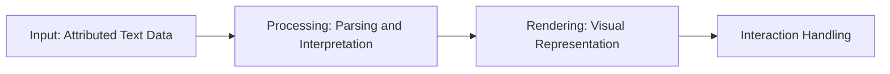
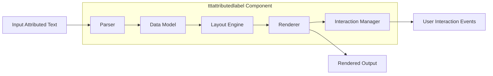
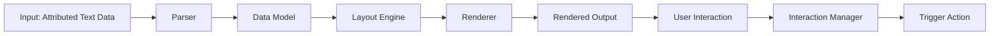

# Project Design Document: tttattributedlabel

**Version:** 1.1
**Date:** October 26, 2023
**Author:** AI Software Architect

## 1. Introduction

This document details the design of the `tttattributedlabel` project, a software component designed for rendering and managing attributed text. Attributed text refers to text where specific portions have associated styling, interactivity (like hyperlinks), or other metadata. This design document serves as a foundational resource for understanding the system's architecture, individual components, and the flow of data within it, which is essential for subsequent threat modeling and security analysis.

## 2. Goals and Objectives

*   To provide a clear and in-depth explanation of the `tttattributedlabel` component's architecture and its intended functionality.
*   To precisely identify the key internal components of the system and clearly define their interactions with each other.
*   To thoroughly describe the path data takes as it moves through the component, from input to rendered output and user interaction.
*   To explicitly highlight potential security vulnerabilities and considerations that are critical for effective threat modeling.
*   To act as a definitive reference point for development teams, security auditors, testers, and other stakeholders involved with the `tttattributedlabel` project.

## 3. Target Audience

This document is primarily intended for:

*   Software developers who are actively working on the `tttattributedlabel` project or integrating it into other applications.
*   Cybersecurity engineers responsible for performing threat modeling, security assessments, and penetration testing of the component.
*   Product owners, project managers, and other stakeholders who require a comprehensive technical understanding of the component's design and potential security implications.

## 4. System Overview

The `tttattributedlabel` component is envisioned as a mechanism for taking structured data representing attributed text and transforming it into a visually rendered output. This output would display the text with the specified styles and enable any defined interactive elements. For instance, it could render a sentence where some words are bold, others are hyperlinked, and the rest are displayed in a standard font. The core responsibilities include:

*   Accepting attributed text data as input.
*   Interpreting the attributes and the text content.
*   Generating the visual representation of the attributed text for display.
*   Handling user interactions with interactive elements within the rendered text.

## 5. Architectural Design

### 5.1. High-Level Architecture

At a high level, the component operates through a sequence of distinct stages:

*   **Input Reception:** The component receives the attributed text data, likely in a structured format.
*   **Data Processing:** This stage involves parsing and interpreting the input data to understand the text content and its associated attributes.
*   **Visual Rendering:** The processed data is then used to generate the visual representation of the attributed text, ready for display.
*   **Interaction Management:** This stage handles any user interactions with the rendered text, such as clicking on a hyperlink.

### 5.2. Detailed Architecture

Internally, the `tttattributedlabel` component is likely composed of several interacting modules, each with a specific responsibility:

*   **Data Model:** This module defines the internal representation of attributed text. It might consist of objects or data structures that store the text content alongside information about attributes (like font, color, link) applied to specific ranges of that text. For example, it might represent a sentence as a list of segments, where each segment has text and a set of applied attributes.
*   **Parser:** The Parser is responsible for taking the input attributed text data (which could be in formats like JSON, XML, or a custom format) and transforming it into the component's internal Data Model representation. This involves understanding the structure of the input and extracting the text and attribute information.
*   **Layout Engine:** This module takes the structured data from the Data Model and determines how the text and its attributes should be arranged visually. This includes tasks like calculating line breaks, handling text wrapping within available space, and positioning inline elements.
*   **Renderer:** The Renderer takes the layout information generated by the Layout Engine and produces the actual visual elements that will be displayed on the screen. This could involve drawing text with specific fonts and colors, creating interactive elements for hyperlinks, and applying other visual styles as defined by the attributes.
*   **Interaction Manager:** This module handles user interactions with the rendered text. It listens for events like mouse clicks or touch inputs and determines if the interaction occurred with an interactive element (e.g., a hyperlink). If so, it triggers the appropriate action, such as navigating to a URL.

## 6. Data Flow

The flow of data within the `tttattributedlabel` component follows a specific sequence:

1. **Input of Attributed Text Data:** The process begins when the component receives attributed text data. This data could be a string with embedded formatting instructions, a structured data object (like a JSON object), or a custom data structure. The specific format will influence how the Parser handles the input.
2. **Parsing by the Parser Module:** The Parser module takes the raw input data and analyzes its structure and content. It validates the input to ensure it conforms to the expected format and extracts the text content and associated attribute information.
3. **Storage in the Data Model:** The Parser transforms the extracted information into the component's internal Data Model representation. This structured representation organizes the text and its attributes in a way that is easily accessible and manipulable by other components.
4. **Layout Calculation by the Layout Engine:** The Layout Engine takes the Data Model as input and determines the optimal visual arrangement of the text. It considers factors such as font sizes, line lengths, available display area, and any layout-related attributes.
5. **Rendering by the Renderer:** The Renderer utilizes the layout information to generate the actual visual output. This involves drawing the text with the specified styles (fonts, colors, etc.) and creating any interactive elements, such as clickable hyperlinks.
6. **Display of Rendered Output:** The generated visual representation is then displayed to the user.
7. **Capture of User Interactions:** When a user interacts with the rendered output (e.g., clicks on a link), the Interaction Manager captures these interaction events.
8. **Processing by the Interaction Manager:** The Interaction Manager determines the specific element that was interacted with and the type of interaction.
9. **Triggering of Actions:** Based on the interaction, the Interaction Manager triggers the appropriate action. For example, if a hyperlink is clicked, it might initiate navigation to the specified URL.

## 7. Components

This section provides a more detailed description of each key component within the `tttattributedlabel` project.

*   **Data Model:**
    *   Serves as the central repository for the structured representation of attributed text within the component.
    *   May be implemented using classes or data structures that represent text segments and their corresponding attributes (e.g., a `TextSpan` object with `text` and `attributes` properties).
    *   Should be designed for efficient access and modification by other components, particularly the Layout Engine and Renderer.
*   **Parser:**
    *   Acts as the gateway for external attributed text data entering the component.
    *   Must be capable of handling various input formats (e.g., JSON, XML, custom formats) and gracefully handle malformed or invalid input.
    *   May employ techniques like lexical analysis and syntactic analysis to break down the input into meaningful parts and build the Data Model.
*   **Layout Engine:**
    *   Responsible for the crucial task of determining how the attributed text will be visually arranged on the screen.
    *   Takes into account factors like font metrics, available width, and line-breaking rules to produce a visually appealing and readable layout.
    *   Might implement algorithms for hyphenation, justification, and handling of different writing directions.
*   **Renderer:**
    *   The component responsible for translating the abstract layout information into concrete visual elements.
    *   Interacts directly with the underlying graphics or UI framework to draw text, apply styles (bold, italics, colors), and create interactive elements (like clickable spans for links).
    *   Needs to be performant to ensure smooth rendering, especially for large amounts of attributed text.
*   **Interaction Manager:**
    *   Handles all user interactions with the rendered attributed text.
    *   Needs to accurately determine which part of the text was interacted with (e.g., by performing hit-testing on the rendered elements).
    *   Manages the execution of actions associated with interactive elements, such as opening a URL when a hyperlink is clicked or triggering a custom callback function.

## 8. Security Considerations

This section outlines critical security considerations that must be addressed during the development and deployment of the `tttattributedlabel` component. These considerations are paramount for effective threat modeling.

*   **Input Validation and Sanitization:** The Parser must implement robust input validation to prevent injection attacks. Failure to do so could allow malicious actors to inject:
    *   **Cross-Site Scripting (XSS) payloads:** If the component renders HTML or allows embedding of script-like attributes, unsanitized input could lead to the execution of arbitrary JavaScript in the user's browser.
    *   **Denial of Service (DoS) attacks:** By providing extremely large, deeply nested, or computationally expensive input, attackers could overwhelm the parsing process and cause the application to crash or become unresponsive.
    *   **Format String Vulnerabilities:** If the parsing logic uses format strings without proper sanitization, attackers could potentially read from or write to arbitrary memory locations.
*   **Data Model Integrity:** Mechanisms should be in place to protect the Data Model from unauthorized modification. If an attacker can manipulate the Data Model, they could potentially alter the rendered output or the behavior of interactive elements in malicious ways.
*   **Rendering Security:** The Renderer must be designed to prevent vulnerabilities arising from the rendering of untrusted content. This includes:
    *   **Preventing malicious URL schemes:** The component should validate URLs before attempting to open them to prevent execution of arbitrary code or redirection to malicious sites.
    *   **Handling potentially dangerous attributes:** If the attribute set includes properties that could be exploited (e.g., embedding iframes or objects), these must be handled with extreme caution or disallowed.
*   **Interaction Handling Security:** The Interaction Manager needs to carefully validate user interactions to prevent unintended actions or security breaches. This includes:
    *   **Ensuring that only intended links are opened:**  Preventing link spoofing or the execution of malicious code through seemingly benign links.
    *   **Securely handling callbacks:** If the component allows for custom callbacks to be triggered by interactions, these callbacks must be handled in a secure manner to prevent the execution of arbitrary code.
*   **Dependency Management:**  The component's dependencies on external libraries and frameworks should be meticulously managed. Regular security audits and updates of these dependencies are crucial to address known vulnerabilities.
*   **Regular Expression Denial of Service (ReDoS):** If regular expressions are used within the Parser or other components, they must be carefully designed to avoid ReDoS vulnerabilities, where specially crafted input can cause the regex engine to consume excessive resources.
*   **Information Disclosure:** The component should not inadvertently expose sensitive information through the rendered output or during interaction handling. For example, error messages should not reveal internal details that could be useful to attackers.

## 9. Assumptions and Constraints

*   The input attributed text data will adhere to a predefined format (the specific format needs to be explicitly defined).
*   The component is assumed to be used within a reasonably trusted environment, although security measures must still be robust.
*   The underlying rendering framework provides a baseline level of security, but the `tttattributedlabel` component must implement its own security measures on top of this.
*   Performance is a key consideration, and the component should be designed to efficiently handle realistically sized attributed text inputs without significant performance degradation.

## 10. Future Considerations

*   Expansion of supported attribute types to include more complex elements like embedded images, videos, or custom interactive widgets.
*   Implementation of robust internationalization (i18n) and localization (l10n) support to handle text in various languages and cultural contexts.
*   Incorporation of accessibility (a11y) features to ensure the rendered attributed text is usable by individuals with disabilities.
*   Development of theming and customization options to allow developers to easily style the rendered attributed text to match the look and feel of their applications.

This improved design document provides a more detailed and comprehensive understanding of the `tttattributedlabel` project. The enhanced descriptions and expanded security considerations offer a stronger foundation for subsequent threat modeling activities, ensuring a more secure and robust component.
