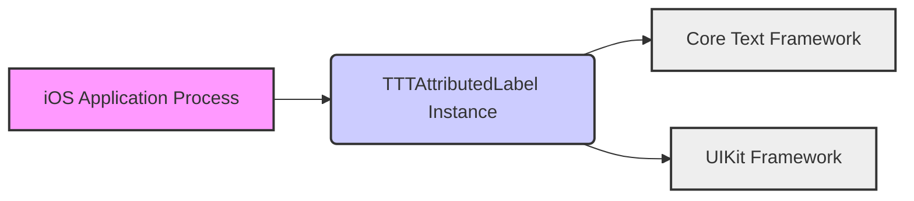
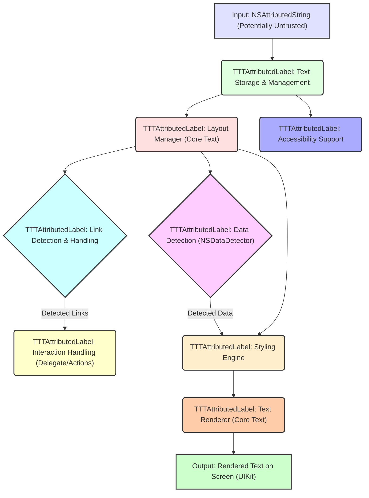

## Project Design Document: TTTAttributedLabel (Improved)

**1. Introduction**

This document provides an enhanced and detailed design overview of the `TTTAttributedLabel` project, a library for rendering attributed text on iOS. This document is specifically tailored to serve as a robust foundation for subsequent threat modeling activities. It comprehensively outlines the project's purpose, scope, architecture, components, data flow, and critically, its key security considerations with a focus on potential vulnerabilities.

**2. Project Overview**

* **Project Name:** TTTAttributedLabel
* **Project Repository:** [https://github.com/tttattributedlabel/tttattributedlabel](https://github.com/tttattributedlabel/tttattributedlabel)
* **Project Description:** `TTTAttributedLabel` is presented as a direct, drop-in replacement for the standard `UILabel` class within the UIKit framework. Its core functionality lies in its ability to render text styled with attributes provided by `NSAttributedString`. This empowers developers to effortlessly create labels displaying richly formatted text, incorporating features such as tappable links, automatically detected data (like phone numbers and dates), and a wide array of customizable styles.
* **Primary Goal:** The primary objective of `TTTAttributedLabel` is to offer iOS developers a highly flexible and performant solution for displaying visually rich and interactive text content within their applications.
* **Target Users:** The intended audience for this library is iOS software engineers and developers who require the ability to present richly formatted and interactive textual information within the user interfaces of their iOS applications.

**3. High-Level Architecture**

The `TTTAttributedLabel` library operates as a client-side component, tightly integrated within the lifecycle of an iOS application. It extends the capabilities of the fundamental `UILabel` class provided by Apple's UIKit framework.

* **iOS Application Process:** Represents the runtime environment of the iOS application that incorporates and utilizes the `TTTAttributedLabel` library. This is the context where the library's code is executed.
* **TTTAttributedLabel Instance:**  A specific instance of the `TTTAttributedLabel` class within the application's view hierarchy. This object is responsible for rendering a particular piece of attributed text.
* **Core Text Framework:** Apple's foundational framework dedicated to advanced text layout and rendering. `TTTAttributedLabel` heavily leverages Core Text's capabilities for precise text manipulation and display.
* **UIKit Framework:** Apple's essential framework providing the fundamental building blocks for constructing iOS user interfaces. This includes base UI elements like `UILabel`, which `TTTAttributedLabel` extends.

**4. Component Details**

The `TTTAttributedLabel` library is composed of several interconnected components, each with specific responsibilities:

* **Text Storage & Management:**
    * **Responsibility:**  Manages the underlying `NSAttributedString` object. This object holds the actual text content along with all associated formatting attributes (e.g., font, color, links). It acts as the single source of truth for the text's content and style.
    * **Security Relevance:**  Vulnerabilities here could involve improper handling of maliciously crafted attributed strings leading to crashes or unexpected behavior. Input validation at this stage is crucial.
* **Layout Management (Core Text Integration):**
    * **Responsibility:**  Utilizes Apple's Core Text framework to perform the complex task of text layout. This involves determining how the text should be arranged within the label's defined boundaries, handling line breaking, text wrapping, truncation (e.g., adding "..."), and calculating the precise positions and dimensions of individual glyphs and lines.
    * **Security Relevance:**  Exploits in Core Text's layout engine (though less likely to originate directly from `TTTAttributedLabel`) could potentially be triggered by specific attributed string configurations. Resource exhaustion attacks could target the layout process with extremely complex layouts.
* **Text Rendering (Core Text Drawing):**
    * **Responsibility:**  Responsible for the actual drawing of the text onto the screen. It uses Core Text drawing primitives to render each glyph according to the attributes defined in the `NSAttributedString`. This includes applying fonts, colors, and various text styles.
    * **Security Relevance:**  While primarily a rendering function, vulnerabilities in Core Text's drawing routines could theoretically be triggered. More likely, issues could arise from custom drawing or rendering logic within `TTTAttributedLabel` if not implemented securely.
* **Link Detection and Handling:**
    * **Responsibility:**  Detects and manages interactive links embedded within the attributed text. This involves recognizing URLs, phone numbers, dates, and other data types based on specific attributes applied to portions of the text. It provides mechanisms for responding to user taps on these links, typically by invoking delegate methods or using action handlers.
    * **Security Relevance:** This is a critical area for security. Potential threats include:
        * **Malicious URL Injection:**  If the attributed text source is untrusted, attackers could inject links to phishing sites or malware.
        * **Unexpected URL Schemes:**  Improper handling of custom URL schemes could lead to unintended actions or privilege escalation if the application interacts with external applications based on these schemes.
        * **Bypassing Security Measures:**  Cleverly crafted links might bypass security checks or filters.
* **Data Detection (Leveraging `NSDataDetector`):**
    * **Responsibility:**  Utilizes Apple's `NSDataDetector` class to automatically identify and style specific types of data within the text (e.g., URLs, phone numbers, dates, addresses). This simplifies the process of making these elements interactive.
    * **Security Relevance:** While `NSDataDetector` is a system component, potential risks include:
        * **Unexpected Data Interpretation:**  Subtle variations in text could lead to misinterpretation by the data detector, potentially triggering unintended actions.
        * **Exploiting `NSDataDetector` Vulnerabilities:** Although less common, vulnerabilities within `NSDataDetector` itself could be exploited if the library doesn't handle its output carefully.
* **Styling Engine & Attribute Application:**
    * **Responsibility:**  Interprets and applies the various attributes contained within the `NSAttributedString`. This engine translates the abstract attributes (e.g., `NSFontAttributeName`, `NSForegroundColorAttributeName`) into concrete visual styles for the text.
    * **Security Relevance:**  Improper handling of certain attributes, especially custom ones (if supported), could lead to unexpected behavior or even security issues if they interact with other parts of the system in unforeseen ways.
* **Accessibility Support (UIAccessibility Protocol):**
    * **Responsibility:**  Implements the `UIAccessibility` protocol to provide information about the rendered text and interactive elements to assistive technologies like VoiceOver. This ensures the content is accessible to visually impaired users.
    * **Security Relevance:**  While primarily about usability, incorrect accessibility implementation could inadvertently expose sensitive information or create unexpected interaction patterns that could be exploited.

**5. Data Flow (Detailed)**

The process of rendering attributed text using `TTTAttributedLabel` involves a more detailed data flow:

1. **Input (NSAttributedString - Potentially Untrusted):** The process begins with an `NSAttributedString` object. It's crucial to recognize that this input could originate from various sources, some of which might be untrusted (e.g., user-provided content, data from external APIs).
2. **Text Storage & Management:** The `NSAttributedString` is received and managed. This is the first point where input validation and sanitization should be considered.
3. **Layout Manager (Core Text):** The Layout Manager uses Core Text to determine the visual layout of the text.
4. **Link Detection & Handling:** During layout, the Link Detection component analyzes the attributed text for potential links based on applied attributes.
5. **Data Detection (NSDataDetector):** Simultaneously, the Data Detection component uses `NSDataDetector` to identify specific data types.
6. **Interaction Handling:** When links are detected and the user interacts with them (e.g., taps), the Interaction Handling component takes over, typically invoking delegate methods or action handlers defined by the application developer.
7. **Styling Engine:** The Styling Engine interprets and applies the attributes to prepare the text for rendering.
8. **Text Renderer (Core Text):** The Text Renderer uses Core Text to draw the styled text onto the screen.
9. **Output (Rendered Text on Screen - UIKit):** The final rendered text is displayed within the iOS application's UI.
10. **Accessibility Support:** Throughout the process, information is prepared for accessibility services.

**6. Security Considerations (Expanded)**

Building upon the initial considerations, here's a more detailed breakdown of potential security risks:

* **Malicious Attributed String Payloads:**
    * **Cross-Site Scripting (XSS) via Data URLs:** If the library allows rendering of `data:` URLs within link attributes, this could be exploited to inject and execute arbitrary JavaScript within the context of the application (though iOS sandboxing limits the impact).
    * **Resource Exhaustion through Complex Attributes:**  Extremely large or deeply nested attribute structures could potentially consume excessive memory or CPU during processing and rendering, leading to denial-of-service.
    * **Font Rendering Exploits:** While rare, vulnerabilities in the underlying font rendering libraries (part of Core Text) could be triggered by specific font attributes or font files referenced in the attributed string.
* **Link Handling Vulnerabilities (Detailed):**
    * **Phishing Attacks:**  Injecting links that visually appear legitimate but redirect to malicious websites to steal credentials or sensitive information.
    * **URL Scheme Abuse:**  Crafting URLs with custom schemes that could trigger unintended actions within the application or other installed applications (e.g., making phone calls, sending emails without user consent).
    * **Man-in-the-Middle (MITM) Attacks on Link Destinations:** While not a vulnerability in the library itself, if the application doesn't enforce secure connections (HTTPS) for links, users could be vulnerable to MITM attacks when interacting with those links.
* **Data Detector Exploits (Specific Examples):**
    * **Locale-Specific Vulnerabilities:**  `NSDataDetector`'s behavior might vary across different locales, potentially leading to unexpected parsing or misinterpretation of data in certain regions.
    * **Regular Expression Denial of Service (ReDoS):** If `NSDataDetector` internally uses regular expressions for pattern matching, carefully crafted input strings could cause catastrophic backtracking, leading to CPU exhaustion.
* **Input Validation and Sanitization:**
    * **Lack of Input Validation:** If the library doesn't perform sufficient validation on the input `NSAttributedString`, it could be susceptible to various attacks.
    * **Insufficient Sanitization:**  Failing to sanitize or escape potentially harmful characters or attributes could lead to vulnerabilities.
* **Memory Management Issues:**
    * **Memory Leaks:** Improper memory management within the library could lead to memory leaks if attributed strings or related objects are not deallocated correctly, potentially causing application crashes over time.
    * **Buffer Overflows:** Although less likely with modern Objective-C and Swift, vulnerabilities related to buffer overflows could theoretically exist if the library performs manual memory management in certain areas.
* **Third-Party Dependencies (If Any):** While the document currently lists only Apple frameworks, if future versions introduce external dependencies, vulnerabilities in those dependencies could impact `TTTAttributedLabel`.

**7. Deployment**

`TTTAttributedLabel` is typically deployed as a static library or through a dependency manager (like CocoaPods or Swift Package Manager) and is directly linked into the iOS application's bundle. It executes within the security context and sandbox of the host iOS application. Its runtime environment is the standard iOS operating system on the user's device.

**8. Dependencies**

* **Foundation Framework (Apple):** Provides fundamental data types, collections, and operating system services.
* **UIKit Framework (Apple):**  Essential for building the user interface of iOS applications, including the base `UILabel` class.
* **Core Text Framework (Apple):**  Provides low-level text layout and rendering capabilities.

**9. Future Considerations (Security Focused)**

* **Implementing Input Sanitization:**  Adding options or mechanisms to sanitize input `NSAttributedString` objects to remove or escape potentially harmful attributes or content.
* **Content Security Policy (CSP) for Attributed Text:** Exploring the feasibility of implementing a form of CSP for attributed text to restrict the types of resources (e.g., images, scripts) that can be loaded or executed.
* **Secure Link Handling Options:** Providing developers with more granular control over how links are handled, including options to enforce HTTPS, validate URL schemes, or implement custom link filtering.
* **Regular Security Audits:**  Conducting regular security audits and penetration testing to identify and address potential vulnerabilities in the library.
* **Staying Up-to-Date with Core Text Security Patches:**  Monitoring and incorporating security updates and patches released by Apple for the Core Text framework.
* **Consideration of Sandboxing Implications:**  Understanding how the library interacts with the iOS sandbox and ensuring it doesn't inadvertently create avenues for sandbox escape.

This improved design document provides a more comprehensive and security-focused view of the `TTTAttributedLabel` project, making it a more effective tool for threat modeling and security analysis.