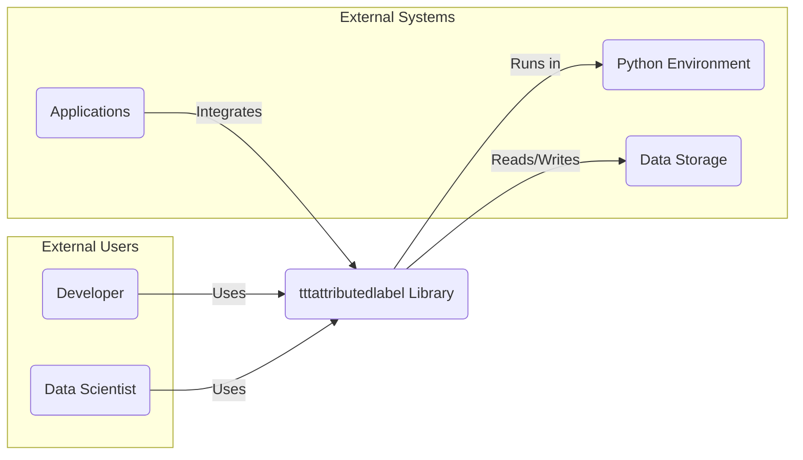
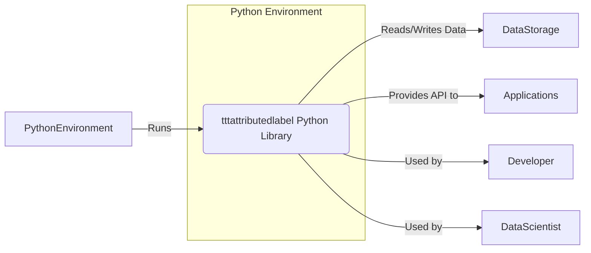
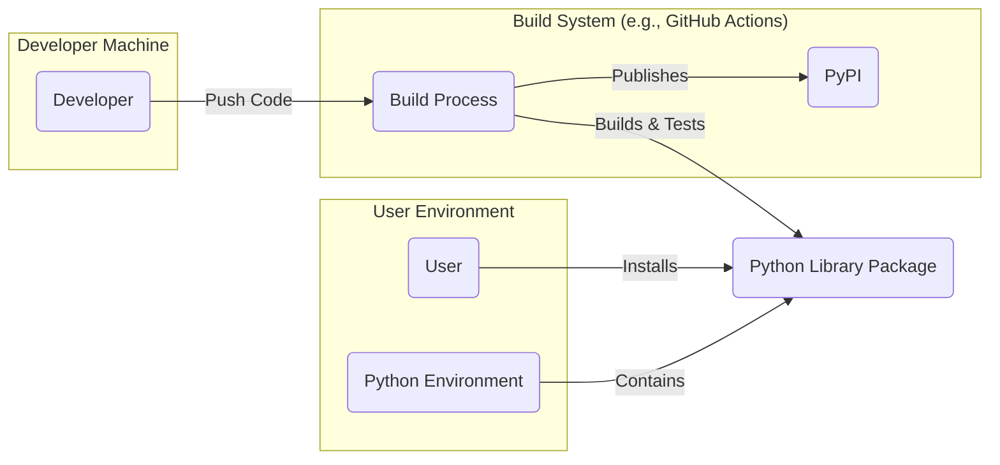
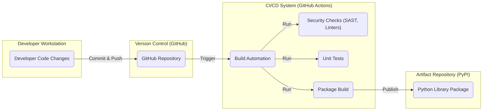

# BUSINESS POSTURE

This project, `tttattributedlabel`, provides a Python library for attributing labels to text. The primary business goal is to offer a reusable and efficient tool for developers and data scientists who need to work with labeled text data. This library aims to simplify the process of managing and applying labels to textual content, potentially for tasks like natural language processing, machine learning, or data analysis.

Business Priorities and Goals:
- Provide a functional and reliable Python library for text labeling.
- Ensure the library is easy to use and integrate into existing projects.
- Maintain the library's quality and address bug fixes or feature requests.
- Potentially expand the library's features based on user needs and community contributions.

Business Risks:
- Lack of adoption by the target audience if the library is not user-friendly or feature-rich enough.
- Bugs or vulnerabilities in the library could lead to incorrect data labeling or security issues in applications using the library.
- Poor documentation or lack of maintenance could deter users and limit the library's lifespan.
- Dependency conflicts with other libraries could hinder integration and usability.

# SECURITY POSTURE

Existing Security Controls:
- security control: GitHub repository hosting with standard GitHub security features (access control, vulnerability scanning). Implemented by: GitHub platform.
- security control: Open-source project with community review potential. Implemented by: Open-source nature of the project.

Accepted Risks:
- accepted risk: Reliance on open-source dependencies, which may have their own vulnerabilities.
- accepted risk: Security vulnerabilities inherent in software code, requiring ongoing maintenance and updates.
- accepted risk: Potential for misuse of the library in unintended or insecure ways by end-users.

Recommended Security Controls:
- recommended security control: Implement automated security scanning (SAST/DAST) in the CI/CD pipeline to detect potential vulnerabilities early in the development process.
- recommended security control: Regularly update dependencies to patch known vulnerabilities.
- recommended security control: Provide clear documentation on secure usage practices and potential security considerations for users of the library.
- recommended security control: Implement input validation within the library to handle unexpected or malicious input gracefully and prevent potential issues in applications using the library.

Security Requirements:
- Authentication: Not applicable for a library. Authentication is the responsibility of the applications that use this library.
- Authorization: Not applicable for a library. Authorization is the responsibility of the applications that use this library.
- Input Validation: The library should perform input validation to ensure that the data it processes is in the expected format and range. This is crucial to prevent unexpected behavior or potential vulnerabilities when the library is used with untrusted input. Validation should be applied to all external inputs to the library's functions.
- Cryptography: Cryptography is likely not a core requirement for this library as it primarily deals with text labeling. However, if future features involve handling sensitive data or secure communication, appropriate cryptographic measures should be considered. For now, no specific cryptographic requirements are identified.

# DESIGN

## C4 CONTEXT

### Context Diagram Elements

- Name: Developer
  - Type: Person
  - Description: Software developers who will use the `tttattributedlabel` library to integrate text labeling functionality into their applications or scripts.
  - Responsibilities: Integrate the library into their projects, provide input data to the library, and handle the output labels.
  - Security controls: Responsible for securely integrating the library and handling data within their own applications.

- Name: Data Scientist
  - Type: Person
  - Description: Data scientists who will use the `tttattributedlabel` library for data analysis, machine learning model training, and other data-related tasks involving labeled text.
  - Responsibilities: Utilize the library for data labeling tasks, analyze labeled data, and potentially contribute to the library's development or provide feedback.
  - Security controls: Responsible for using the library in a secure manner within their data science workflows and ensuring data privacy and integrity.

- Name: tttattributedlabel Library
  - Type: Software System
  - Description: The Python library itself, providing functionalities for attributing labels to text. It is the central component of this design document.
  - Responsibilities: Provide functions for creating, managing, and applying labels to text data. Ensure the library is functional, reliable, and performs as expected.
  - Security controls: Input validation, dependency management, and adherence to secure coding practices.

- Name: Python Environment
  - Type: Container
  - Description: The runtime environment where the `tttattributedlabel` library will be executed. This includes Python interpreter and any necessary dependencies.
  - Responsibilities: Provide a stable and secure environment for running Python code. Manage dependencies and ensure compatibility.
  - Security controls: Managed by the user or organization deploying the library. Security controls depend on the specific Python environment setup (virtual environments, containerization, etc.).

- Name: Data Storage
  - Type: External System
  - Description: External systems where text data and labels might be stored. This could be databases, file systems, cloud storage, or other data repositories.
  - Responsibilities: Store and retrieve text data and associated labels. Ensure data persistence and availability.
  - Security controls: Data encryption at rest and in transit, access control mechanisms, backup and recovery procedures. Security controls are external to the library and depend on the specific data storage solution used.

- Name: Applications
  - Type: External System
  - Description: Various applications or scripts that will integrate and utilize the `tttattributedlabel` library to add text labeling capabilities.
  - Responsibilities: Utilize the library's functionalities to enhance their own features. Handle data flow and integration with the library.
  - Security controls: Security controls are specific to each application and are the responsibility of the application developers. Applications should securely integrate and use the library, handling data appropriately.

## C4 CONTAINER

### Container Diagram Elements

- Name: tttattributedlabel Python Library
  - Type: Container - Library
  - Description: This is the core Python library that contains all the code and logic for text labeling. It is designed to be imported and used by other Python applications or scripts.
  - Responsibilities: Implement text labeling functionalities, manage label attributes, provide API for developers and data scientists to interact with the library.
  - Security controls: Input validation within library functions, secure coding practices, dependency management, and potentially SAST scanning during development.

- Name: Python Environment
  - Type: Container - Runtime Environment
  - Description: The Python runtime environment where the library is executed. This includes the Python interpreter, standard libraries, and any installed dependencies.
  - Responsibilities: Execute the Python library code, manage dependencies, provide necessary system resources.
  - Security controls: Security of the Python environment depends on how it is set up and managed by the user. Best practices include using virtual environments, keeping Python and dependencies updated, and securing the underlying operating system.

- Name: Data Storage
  - Type: External System
  - Description: External data storage systems used to persist text data and labels. This could be files, databases, or cloud storage.
  - Responsibilities: Store and retrieve text data and labels. Ensure data persistence and availability.
  - Security controls: Data encryption at rest and in transit, access control mechanisms, backup and recovery procedures. Security controls are external to the library and depend on the specific data storage solution used.

- Name: Applications
  - Type: External System
  - Description: Applications that import and use the `tttattributedlabel` library to add text labeling features.
  - Responsibilities: Integrate and utilize the library's API to perform text labeling tasks within their own functionality.
  - Security controls: Application-specific security controls. Applications are responsible for securely using the library and handling data appropriately.

- Name: Developer
  - Type: Person
  - Description: Developers who interact with the library during development, testing, and integration phases.
  - Responsibilities: Develop and integrate applications using the library, contribute to the library's development, and ensure proper usage.
  - Security controls: Secure development practices, code reviews, and adherence to security guidelines when using and extending the library.

- Name: Data Scientist
  - Type: Person
  - Description: Data scientists who use the library for data analysis and machine learning tasks.
  - Responsibilities: Utilize the library for data labeling, analyze labeled data, and provide feedback on the library's usability and features.
  - Security controls: Secure data handling practices, responsible use of the library in data science workflows, and awareness of data privacy and security considerations.

## DEPLOYMENT

Deployment Solution: Python Package Distribution (PyPI)

### Deployment Diagram Elements

- Name: Developer
  - Type: Person
  - Description: Software developer who develops and maintains the `tttattributedlabel` library.
  - Responsibilities: Write code, test the library, and prepare releases for deployment.
  - Security controls: Secure coding practices, code reviews, and secure access to development environments and build systems.

- Name: Build Process (e.g., GitHub Actions)
  - Type: Automation System
  - Description: Automated system used to build, test, and package the Python library. This could be GitHub Actions, Jenkins, or other CI/CD tools.
  - Responsibilities: Automate the build process, run tests, create distribution packages, and publish releases.
  - Security controls: Secure CI/CD pipeline configuration, access control to build system, secrets management for publishing credentials, and security scanning during the build process.

- Name: Python Library Package
  - Type: Software Artifact
  - Description: The packaged Python library (e.g., a wheel or sdist file) ready for distribution.
  - Responsibilities: Contain all necessary code and metadata for users to install and use the library.
  - Security controls: Digital signatures or checksums to ensure package integrity, vulnerability scanning of dependencies during the build process.

- Name: PyPI (Python Package Index)
  - Type: Package Registry
  - Description: Public repository for Python packages where the `tttattributedlabel` library will be published.
  - Responsibilities: Host and distribute Python packages, provide package management tools (pip).
  - Security controls: PyPI's own security measures to protect against malicious packages and ensure package integrity.

- Name: User
  - Type: Person
  - Description: End-users (developers, data scientists) who will install and use the `tttattributedlabel` library.
  - Responsibilities: Install the library using pip or other package managers, integrate it into their projects, and use its functionalities.
  - Security controls: User's responsibility to install packages from trusted sources and manage their Python environment securely.

- Name: Python Environment
  - Type: Runtime Environment
  - Description: The Python environment on the user's machine where the library is installed and executed.
  - Responsibilities: Provide a runtime environment for the library to run.
  - Security controls: User's responsibility to secure their Python environment, keep packages updated, and follow security best practices.

## BUILD

### Build Process Elements

- Name: Developer Code Changes
  - Type: Artifact
  - Description: Code changes made by developers to the `tttattributedlabel` library.
  - Responsibilities: Implement new features, fix bugs, and improve the library's code.
  - Security controls: Code reviews, secure coding practices, and developer workstation security.

- Name: GitHub Repository
  - Type: Version Control System
  - Description: GitHub repository hosting the source code of the `tttattributedlabel` library.
  - Responsibilities: Store and manage code versions, track changes, and facilitate collaboration.
  - Security controls: Access control, branch protection, and GitHub's security features.

- Name: Build Automation (GitHub Actions)
  - Type: CI/CD System
  - Description: GitHub Actions workflow configured to automate the build, test, and release process.
  - Responsibilities: Automate build steps, run tests, perform security checks, and package the library.
  - Security controls: Secure workflow configuration, secrets management, and access control to GitHub Actions.

- Name: Security Checks (SAST, Linters)
  - Type: Security Tool
  - Description: Static Application Security Testing (SAST) tools and linters used to automatically analyze the code for potential vulnerabilities and code quality issues.
  - Responsibilities: Identify potential security flaws and code quality problems early in the development process.
  - Security controls: Regularly updated security rules and linters, integration into the CI/CD pipeline to enforce checks.

- Name: Unit Tests
  - Type: Testing Framework
  - Description: Automated unit tests to verify the functionality of individual components of the library.
  - Responsibilities: Ensure code correctness and prevent regressions.
  - Security controls: Well-designed tests that cover security-relevant aspects of the library's functionality.

- Name: Package Build
  - Type: Build Tool
  - Description: Tools used to package the Python library into distributable formats (e.g., wheel, sdist).
  - Responsibilities: Create installable packages of the library.
  - Security controls: Ensure build process integrity and prevent tampering with the package.

- Name: Python Library Package
  - Type: Build Artifact
  - Description: The final packaged Python library ready for distribution on PyPI.
  - Responsibilities: Be the distributable artifact for users to install and use.
  - Security controls: Digital signatures or checksums to ensure package integrity, vulnerability scanning of dependencies included in the package.

# RISK ASSESSMENT

Critical Business Processes:
- Providing a functional and reliable text labeling library to users.
- Maintaining the quality and usability of the library over time.
- Ensuring the library is secure and does not introduce vulnerabilities into user applications.

Data to Protect and Sensitivity:
- The library itself (source code): Moderate sensitivity. Integrity and availability are important to maintain the project. Confidentiality is less critical as it is open source.
- User data processed by the library: Sensitivity depends entirely on the context of use. The library itself does not store or manage user data, but applications using it will. The library should be designed to handle data securely, regardless of sensitivity.
- Build and release artifacts: Moderate sensitivity. Integrity is important to ensure users download and install a trustworthy and untampered library.

# QUESTIONS & ASSUMPTIONS

Questions:
- What are the primary use cases for this library? Understanding the use cases will help prioritize security requirements and design considerations.
- Are there any specific compliance requirements or industry standards that the library needs to adhere to?
- What is the expected scale of usage for this library? Will it be used in small projects or large-scale applications?
- Are there any specific performance requirements for the library?
- What is the process for reporting and addressing security vulnerabilities in the library?

Assumptions:
- BUSINESS POSTURE: The primary goal is to provide a useful open-source library for the Python community.
- SECURITY POSTURE: Basic security practices are expected, but no specific high-security requirements are explicitly stated. Security focus should be on preventing common vulnerabilities and ensuring data integrity within the library's scope.
- DESIGN: The library is intended to be a standalone Python package distributed via PyPI and used by other Python applications. The deployment model is standard Python package distribution. The build process will utilize common Python build tools and CI/CD practices.