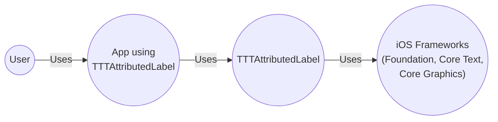
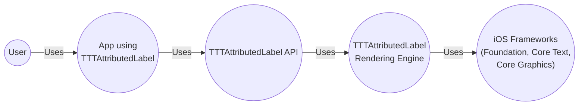
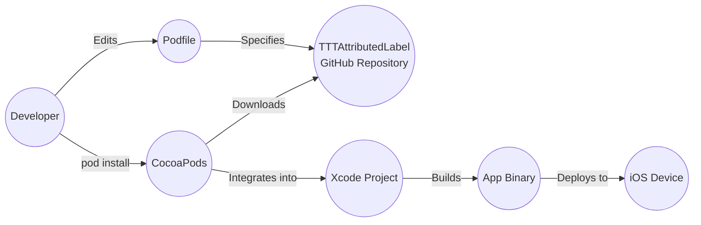
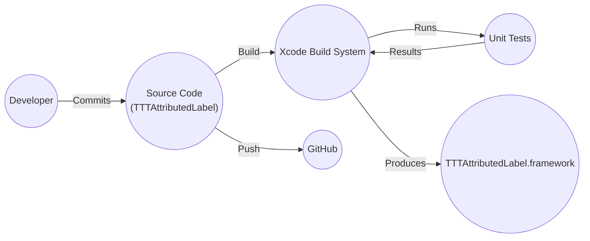

Okay, let's create a design document for the `TTTAttributedLabel` project.

# BUSINESS POSTURE

Business Priorities and Goals:

*   Provide a drop-in replacement for `UILabel` that supports attributed strings.
*   Enable developers to easily display text with various attributes (links, colors, fonts, etc.) without complex manual rendering.
*   Offer a lightweight and performant solution.
*   Maintain high code quality and test coverage.
*   Provide good documentation and examples.
*   Support a wide range of iOS versions.

Business Risks:

*   Rendering issues or crashes on specific iOS versions or devices could lead to negative user experiences in apps using the library.
*   Security vulnerabilities, such as those related to handling untrusted attributed strings, could potentially be exploited.
*   Performance bottlenecks could impact the responsiveness of apps, especially with large or complex attributed strings.
*   Lack of maintainability or extensibility could hinder future development and bug fixes.
*   Incompatibility with other libraries or frameworks could limit adoption.

# SECURITY POSTURE

Existing Security Controls:

*   security control: The project is open-source, allowing for community review and contributions, which can help identify and address security issues. (GitHub repository)
*   security control: The project includes unit tests, which can help prevent regressions and catch potential vulnerabilities. (Test suite in the repository)
*   security control: The project uses Automatic Reference Counting (ARC), reducing the risk of memory management issues. (Implicit in Objective-C code)

Accepted Risks:

*   accepted risk: The library may be vulnerable to denial-of-service (DoS) attacks if extremely large or maliciously crafted attributed strings are processed. This is a common risk with text rendering libraries.
*   accepted risk: The library relies on the underlying iOS frameworks (Foundation, Core Text, Core Graphics) for rendering, and any vulnerabilities in those frameworks could potentially affect the library.

Recommended Security Controls:

*   security control: Implement input validation to limit the size and complexity of attributed strings that are processed.
*   security control: Consider adding fuzz testing to identify potential vulnerabilities related to attributed string parsing and rendering.
*   security control: If the library handles URLs, ensure proper URL validation and sanitization to prevent potential injection attacks.
*   security control: Regularly update dependencies to address any known security vulnerabilities.

Security Requirements:

*   Authentication: Not applicable, as this is a UI component library.
*   Authorization: Not applicable, as this is a UI component library.
*   Input Validation:
    *   The library should validate the input attributed strings to ensure they are well-formed and do not contain any malicious content.
    *   The library should limit the size and complexity of attributed strings to prevent denial-of-service attacks.
    *   If the library handles URLs, it should validate and sanitize them to prevent injection attacks.
*   Cryptography: Not directly applicable, but if the library handles sensitive data (which it shouldn't, as a UI component), encryption should be considered.

# DESIGN

## C4 CONTEXT

Element Descriptions:

*   Element:
    *   Name: User
    *   Type: Person
    *   Description: The end-user interacting with an application that utilizes TTTAttributedLabel.
    *   Responsibilities: Interacts with the UI of the application.
    *   Security controls: None directly applicable to this element in the context of TTTAttributedLabel.

*   Element:
    *   Name: App using TTTAttributedLabel
    *   Type: Software System
    *   Description: An iOS application that integrates the TTTAttributedLabel library.
    *   Responsibilities: Provides application-specific functionality and UI. Uses TTTAttributedLabel to display attributed text.
    *   Security controls: Application-specific security controls, including input validation, data protection, and secure communication.

*   Element:
    *   Name: TTTAttributedLabel
    *   Type: Software System (Library)
    *   Description: The TTTAttributedLabel library itself.
    *   Responsibilities: Provides an API for creating and displaying attributed labels. Handles rendering of attributed strings.
    *   Security controls: Input validation for attributed strings, size and complexity limits, URL validation (if applicable).

*   Element:
    *   Name: iOS Frameworks (Foundation, Core Text, Core Graphics)
    *   Type: Software System (Operating System)
    *   Description: The underlying iOS frameworks used by TTTAttributedLabel.
    *   Responsibilities: Provides low-level text rendering and graphics capabilities.
    *   Security controls: Security controls implemented by Apple within the iOS operating system.

## C4 CONTAINER

Since TTTAttributedLabel is a relatively simple library, the container diagram is essentially an extension of the context diagram.

Element Descriptions:

*   Element:
    *   Name: User
    *   Type: Person
    *   Description: The end-user interacting with an application.
    *   Responsibilities: Interacts with the UI.
    *   Security controls: None directly applicable.

*   Element:
    *   Name: App using TTTAttributedLabel
    *   Type: Software System
    *   Description: An iOS application integrating TTTAttributedLabel.
    *   Responsibilities: Provides application logic and UI.
    *   Security controls: Application-specific security controls.

*   Element:
    *   Name: TTTAttributedLabel API
    *   Type: API
    *   Description: The public interface of the TTTAttributedLabel library.
    *   Responsibilities: Exposes methods for creating, configuring, and displaying attributed labels.
    *   Security controls: Input validation.

*   Element:
    *   Name: TTTAttributedLabel Rendering Engine
    *   Type: Component
    *   Description: The internal component responsible for rendering attributed strings.
    *   Responsibilities: Handles text layout, attribute processing, and drawing.
    *   Security controls: Input validation, size limits.

*   Element:
    *   Name: iOS Frameworks (Foundation, Core Text, Core Graphics)
    *   Type: Software System (Operating System)
    *   Description: Underlying iOS frameworks.
    *   Responsibilities: Low-level text and graphics rendering.
    *   Security controls: OS-level security controls.

## DEPLOYMENT

Deployment Solutions:

1.  CocoaPods:  A dependency manager for Cocoa projects.  Developers add `TTTAttributedLabel` to their `Podfile`, and CocoaPods handles downloading and integrating the library.
2.  Carthage:  A decentralized dependency manager.  Developers add `TTTAttributedLabel` to their `Cartfile`, and Carthage builds the framework.
3.  Swift Package Manager:  Integrated into the Swift build system.  Developers add `TTTAttributedLabel` as a dependency in their `Package.swift` file.
4.  Manual Integration:  Developers can manually download the source code and add it to their Xcode project.

Chosen Solution (CocoaPods):

Element Descriptions:

*    Element:
    *   Name: Developer
    *   Type: Person
    *   Description: The developer integrating TTTAttributedLabel into their app.
    *   Responsibilities: Writes code, manages dependencies.
    *   Security controls: Secure coding practices.

*    Element:
    *   Name: Podfile
    *   Type: File
    *   Description:  The file that specifies project dependencies for CocoaPods.
    *   Responsibilities: Lists the required libraries, including TTTAttributedLabel.
    *   Security controls:  None directly applicable.

*    Element:
    *   Name: CocoaPods
    *   Type: Tool
    *   Description: The CocoaPods dependency manager.
    *   Responsibilities: Downloads, builds, and integrates dependencies.
    *   Security controls:  Verifies the integrity of downloaded packages (if configured).

*    Element:
    *   Name: TTTAttributedLabel GitHub Repository
    *   Type: Source Code Repository
    *   Description: The Git repository hosting the TTTAttributedLabel source code.
    *   Responsibilities: Stores the source code, tracks changes.
    *   Security controls:  Access controls, code review processes.

*    Element:
    *   Name: Xcode Project
    *   Type: Project
    *   Description: The developer's Xcode project.
    *   Responsibilities: Contains the application code and build settings.
    *   Security controls:  Project-specific security settings.

*    Element:
    *   Name: App Binary
    *   Type: Executable
    *   Description: The compiled application binary.
    *   Responsibilities: Runs the application on the device.
    *   Security controls:  Code signing, runtime protections.

*    Element:
    *   Name: iOS Device
    *   Type: Device
    *   Description: The iPhone or iPad running the application.
    *   Responsibilities: Executes the application.
    *   Security controls:  iOS security features (sandboxing, code signing enforcement).

## BUILD

Build Process Description:

1.  Developer commits code changes to the local Git repository.
2.  The code is pushed to the remote GitHub repository.
3.  The Xcode build system (either locally or through a CI system like GitHub Actions) compiles the `TTTAttributedLabel` source code.
4.  Unit tests are executed as part of the build process.
5.  If the build and tests are successful, a `TTTAttributedLabel.framework` file (or equivalent) is produced. This is the build artifact.
6.  The framework can then be distributed via CocoaPods, Carthage, Swift Package Manager, or manual integration.

Security Controls:

*   security control: Unit tests are run during the build process to ensure code quality and prevent regressions.
*   security control: Code review (through pull requests on GitHub) helps identify potential security vulnerabilities before they are merged into the main branch.
*   security control: Static analysis (using tools like Clang Static Analyzer, integrated into Xcode) can be used to detect potential bugs and vulnerabilities.
*   security control: Dependency management tools (CocoaPods, Carthage, SPM) can be configured to verify the integrity of downloaded dependencies.

# RISK ASSESSMENT

Critical Business Processes:

*   Displaying attributed text correctly and efficiently within applications.
*   Maintaining a stable and reliable library for developers to use.

Data Protection:

*   TTTAttributedLabel itself does not handle sensitive data directly. It primarily deals with presentation logic. However, the *content* of the attributed strings displayed by applications using the library could contain sensitive data. The *application* using TTTAttributedLabel is responsible for protecting any sensitive data it displays.
*   Data Sensitivity: The sensitivity of the data depends entirely on the application using TTTAttributedLabel. The library itself should be treated as handling potentially untrusted input (the attributed strings).

# QUESTIONS & ASSUMPTIONS

Questions:

*   Are there any specific performance requirements or limitations for the library? (e.g., maximum string length, expected number of attributes)
*   Are there any specific iOS versions that must be supported?
*   Does the library need to handle any custom attributes or drawing beyond what is provided by Core Text?
*   Are there any plans to support other platforms (e.g., macOS, watchOS)?

Assumptions:

*   BUSINESS POSTURE: The primary goal is to provide a reliable and easy-to-use library for displaying attributed text on iOS.
*   SECURITY POSTURE: The library will follow secure coding practices and address any identified vulnerabilities promptly. Input validation will be a key security control.
*   DESIGN: The library will be designed to be lightweight and performant, leveraging the underlying iOS frameworks efficiently. The library will be well-documented and easy to integrate.