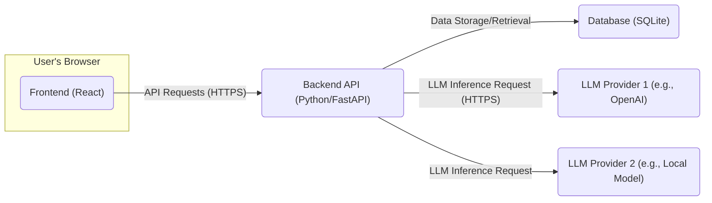
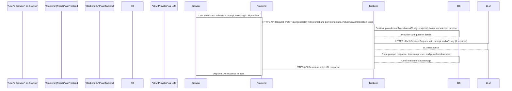
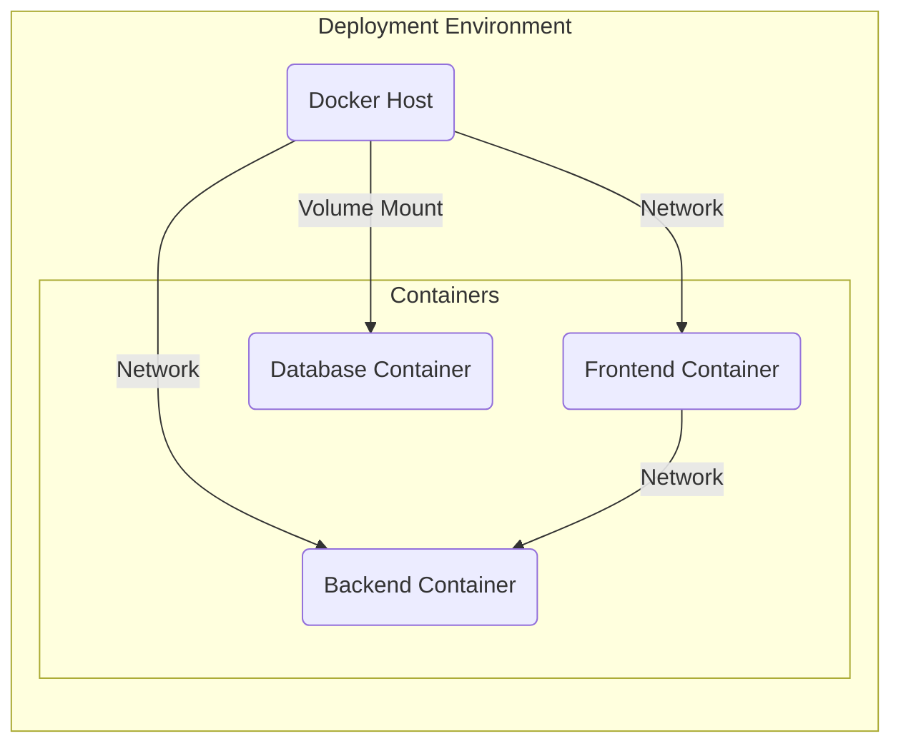

## Project Design Document: Chameleon - Self-Hosted LLM Experimentation Platform

**Document Version:** 1.1
**Date:** October 26, 2023
**Author:** AI Software Architect

### 1. Introduction

This document provides an enhanced and more detailed design overview of the Chameleon project, a self-hosted platform for experimenting with Large Language Models (LLMs). This document builds upon the initial design, providing further clarity on the system's architecture, components, and data flow. It will serve as a robust foundation for understanding the system and will be used as a key input for subsequent threat modeling activities. The project aims to deliver a user-centric interface for interacting with diverse LLMs, efficiently managing prompts, and thoroughly reviewing responses, all within a secure, self-hosted environment. This design is based on the publicly available information from the Chameleon GitHub repository: [https://github.com/vicc/chameleon](https://github.com/vicc/chameleon).

### 2. Goals

The primary goals of the Chameleon project are:

*   To establish a secure and private self-hosted platform for LLM interaction.
*   To offer an intuitive and efficient web interface for comprehensive prompt management and response visualization.
*   To facilitate seamless integration with multiple LLM providers, including both cloud-based services and locally deployed models.
*   To empower users with effective tools for organizing, categorizing, and managing their prompts.
*   To enable rigorous experimentation and comparative analysis across different LLM models and configurations.

### 3. High-Level Architecture

The Chameleon platform employs a distinct client-server architecture, characterized by a dynamic web-based frontend and a robust backend API.

**Components:**

*   **Frontend (React):** A sophisticated single-page application meticulously crafted with React, responsible for delivering a rich and interactive user experience. This encompasses features for intuitive prompt creation, seamless submission, detailed response viewing, and comprehensive settings management.
*   **Backend API (Python/FastAPI):** A resilient RESTful API meticulously developed using Python and the high-performance FastAPI framework. This critical component manages user authentication, enforces authorization policies, handles prompt lifecycle management, orchestrates communication with diverse LLM providers, and ensures persistent data storage.
*   **Database (SQLite):** A lightweight yet reliable file-based database, SQLite, is utilized for persistent storage of application-specific data. This includes user account details, prompt content, and generated responses.
*   **LLM Providers:** External services, accessed via secure APIs, or locally hosted model deployments that perform the computationally intensive LLM inference tasks. This can encompass cloud-based offerings like the OpenAI API or locally executed models.

### 4. Detailed Component Design

#### 4.1. Frontend (React)

*   **Technology:** React, JavaScript (ES6+), HTML5, CSS3, potentially state management libraries (e.g., Redux or Zustand), and UI component libraries (e.g., Material UI or Ant Design).
*   **Responsibilities:**
    *   Dynamically rendering the user interface components and ensuring a responsive design across various devices.
    *   Handling all user interactions, including form submissions, button clicks, and data input.
    *   Asynchronously communicating with the backend API via HTTPS for data retrieval and manipulation.
    *   Presenting data received from the backend in a clear and user-friendly manner.
    *   Managing the application's state, including user sessions and authentication status.
*   **Key Features:**
    *   Secure user login and registration functionalities.
    *   An intuitive interface for creating, editing, and organizing prompts.
    *   A mechanism for selecting and configuring different LLM providers.
    *   Asynchronous submission of prompts to the backend API for processing.
    *   Real-time display of LLM responses.
    *   A comprehensive history of submitted prompts and corresponding responses.
    *   User-configurable settings and preferences.

#### 4.2. Backend API (Python/FastAPI)

*   **Technology:** Python 3.x, FastAPI, Pydantic for data validation, SQLAlchemy or similar ORM for database interaction, potentially libraries for interacting with specific LLM APIs (e.g., `openai` Python library), and security libraries (e.g., `passlib` for password hashing).
*   **Responsibilities:**
    *   Receiving and processing API requests from the frontend, ensuring secure communication over HTTPS.
    *   Implementing robust user authentication (e.g., JWT-based) and authorization mechanisms to control access to resources.
    *   Performing rigorous data validation and sanitization to prevent injection attacks and ensure data integrity.
    *   Interacting with the SQLite database for persistent storage and retrieval of application data.
    *   Establishing secure connections and communicating with configured LLM providers' APIs.
    *   Securely managing API keys or access tokens required for authenticating with LLM providers, potentially using environment variables or a secrets management system.
    *   Optionally implementing caching mechanisms (e.g., using Redis or in-memory caching) to improve performance and reduce redundant calls to LLM providers.
*   **Key Endpoints (Examples):**
    *   `/api/auth/register` (POST): Securely register a new user account.
    *   `/api/auth/login` (POST): Authenticate an existing user and return a secure session token (e.g., JWT).
    *   `/api/prompts` (GET, POST): Retrieve a paginated list of user's prompts, create a new prompt.
    *   `/api/prompts/{prompt_id}` (GET, PUT, DELETE): Retrieve, update, or delete a specific prompt, ensuring proper authorization.
    *   `/api/generate` (POST): Securely submit a prompt to a designated LLM provider and retrieve the generated response.
    *   `/api/providers` (GET): Retrieve a list of available and configured LLM providers.

#### 4.3. Database (SQLite)

*   **Technology:** SQLite (version 3.x).
*   **Responsibilities:**
    *   Persistently storing user account information, including usernames, securely hashed passwords (using a strong hashing algorithm like bcrypt), and potentially other user-related data.
    *   Storing the content of user-created prompts, along with metadata such as user association, creation timestamp, and any relevant tags or categories.
    *   Storing LLM-generated responses, linking them back to the originating prompt, the LLM provider used, and the timestamp of generation.
    *   Storing configuration data for LLM providers, such as API endpoint URLs and potentially encrypted API keys or access tokens.
*   **Data Entities (Examples):**
    *   `Users`: Stores user credentials and profile information.
    *   `Prompts`: Stores the text and metadata of user-created prompts.
    *   `Responses`: Stores the generated text from LLM providers, linked to the corresponding prompt.
    *   `Providers`: Stores configuration details for different LLM providers.

#### 4.4. LLM Providers

*   **Technology:** Varies significantly depending on the provider. Cloud-based providers typically expose RESTful APIs accessed over HTTPS. Locally hosted models might be accessed through Python libraries or other interfaces.
*   **Responsibilities:**
    *   Receiving prompts from the backend API, typically via a secure API call.
    *   Performing the core LLM inference task based on the received prompt and the provider's specific model.
    *   Returning the generated response to the backend API in a structured format (e.g., JSON).
*   **Examples:**
    *   OpenAI API (using their REST API).
    *   Hugging Face Inference API (using their REST API).
    *   Locally hosted models accessed via libraries like `transformers` or `llama-cpp-python`.

### 5. Data Flow

The typical data flow for a user submitting a prompt and receiving a response is detailed below:

**Detailed Steps:**

1. The user interacts with the frontend through their web browser, composing a prompt and selecting the desired LLM provider from the available options.
2. The frontend sends a secure HTTPS API request (typically a POST request to `/api/generate`) to the backend API. This request includes the prompt text, the identifier of the selected LLM provider, and the user's authentication token.
3. The backend API receives the request, authenticates the user using the provided token, and authorizes the action.
4. The backend retrieves the necessary configuration details for the selected LLM provider from the database. This includes the provider's API endpoint URL and any required authentication credentials (e.g., API keys).
5. The backend constructs a secure HTTPS request to the LLM provider's API, including the user's prompt and the necessary authentication credentials.
6. The LLM provider processes the received prompt using its underlying model and generates a response.
7. The LLM provider sends the generated response back to the backend API over HTTPS.
8. The backend API receives the LLM's response and stores the original prompt, the received response, a timestamp, the user's identifier, and the LLM provider's identifier in the database.
9. The backend sends a secure HTTPS API response back to the frontend, containing the LLM's generated response.
10. The frontend receives the response from the backend and dynamically updates the user interface to display the LLM's output to the user in their browser.

### 6. Security Considerations

This section expands upon the initial security considerations, providing more specific details relevant to each component and the overall architecture.

*   **Authentication and Authorization:**
    *   Employ strong password hashing algorithms (e.g., bcrypt) for storing user credentials in the database.
    *   Implement JWT (JSON Web Tokens) for stateless authentication and authorization of API requests.
    *   Enforce the principle of least privilege, ensuring users only have access to the resources they need.
    *   Protect against common authentication vulnerabilities like brute-force attacks and credential stuffing through rate limiting and account lockout mechanisms.
*   **API Security:**
    *   Enforce HTTPS for all communication between the frontend and backend to encrypt data in transit.
    *   Implement robust input validation and sanitization on the backend to prevent injection attacks (e.g., SQL injection, cross-site scripting).
    *   Utilize rate limiting to prevent denial-of-service attacks and abuse of API endpoints.
    *   Implement Cross-Origin Resource Sharing (CORS) policies to restrict which domains can access the API.
    *   Protect against Cross-Site Request Forgery (CSRF) attacks using appropriate tokens or headers.
*   **Data Security:**
    *   Encrypt sensitive data at rest, such as LLM provider API keys, using appropriate encryption techniques. Consider using a dedicated secrets management solution.
    *   Securely manage database credentials and restrict access to the database server.
    *   Regularly back up the database to prevent data loss.
*   **LLM Provider API Key Management:**
    *   Avoid storing LLM provider API keys directly in the codebase. Utilize environment variables or a dedicated secrets management service.
    *   Restrict access to the environment where API keys are stored.
    *   Implement logging and monitoring of API key usage to detect any unauthorized access.
*   **Input Sanitization:**
    *   Sanitize user inputs on both the frontend and backend to prevent injection attacks when interacting with LLM providers. Be mindful of potential prompt injection vulnerabilities.
*   **Rate Limiting:**
    *   Implement rate limiting on API endpoints to prevent abuse and excessive calls to LLM providers, which could incur costs.
*   **Dependency Management:**
    *   Regularly audit and update project dependencies to patch known security vulnerabilities. Utilize dependency scanning tools.
*   **Self-Hosting Security:**
    *   Provide clear documentation and guidance to users on securing their self-hosted environment, including network security, firewall configurations, and access controls.

### 7. Deployment Architecture

The Chameleon project is designed for flexible deployment in self-hosted environments, leveraging containerization for ease of setup and management.

*   **Containerization (Docker):** The application components (frontend, backend) are packaged as Docker containers, ensuring consistent execution across different environments.
*   **Container Orchestration (Docker Compose):** Docker Compose is the recommended tool for orchestrating the multi-container application, simplifying the deployment and management of the frontend, backend, and database services.
*   **Deployment Environment Options:** Users have the flexibility to deploy Chameleon on various infrastructure options, including:
    *   Local development machines for testing and experimentation.
    *   Virtual Private Servers (VPS) or dedicated servers.
    *   Cloud computing platforms (e.g., AWS, Azure, Google Cloud) using container orchestration services like Kubernetes (optional for more complex deployments).

**Deployment Steps (Conceptual using Docker Compose):**

1. Build Docker images for the frontend and backend applications. This typically involves creating `Dockerfile`s for each component.
2. Define the application's services, networks, and volumes in a `docker-compose.yml` file. This file specifies how the containers should be built, linked, and configured.
3. Configure environment variables required by the backend (e.g., database connection details, LLM provider API keys) within the `docker-compose.yml` file or through external `.env` files. Ensure sensitive information is handled securely.
4. Run the command `docker-compose up -d` to build and start the application containers in detached mode.
5. Access the application through the port exposed by the frontend container (typically port 3000).

### 8. Future Considerations

*   **Enhanced LLM Provider Integration:** Expanding support for a broader range of LLM providers, including specialized or open-source models, and providing a more flexible configuration interface.
*   **Advanced Prompt Engineering Features:** Implementing features like prompt templates with variables, prompt versioning and history, and collaborative prompt management.
*   **Granular User Roles and Permissions:** Introducing more fine-grained control over user access and data, enabling features like shared prompts or organizational workspaces.
*   **Comprehensive Logging and Monitoring:** Integrating robust logging and monitoring solutions to track application performance, identify potential errors, and monitor resource utilization.
*   **Scalability and Performance Optimizations:** Designing the architecture to handle a larger number of concurrent users and requests, potentially involving database optimizations or horizontal scaling of the backend.
*   **Integration with External Tools and Services:** Exploring integrations with other development, productivity, or data analysis tools to enhance the platform's capabilities.
*   **Support for Different Database Backends:** Providing options to use other database systems besides SQLite for users with different requirements (e.g., PostgreSQL or MySQL for larger-scale deployments).

This enhanced document provides a more detailed and comprehensive design overview of the Chameleon project. It serves as a valuable resource for understanding the system's architecture, components, and security considerations, and will be instrumental in the subsequent threat modeling process.
