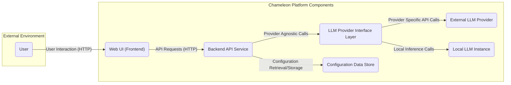
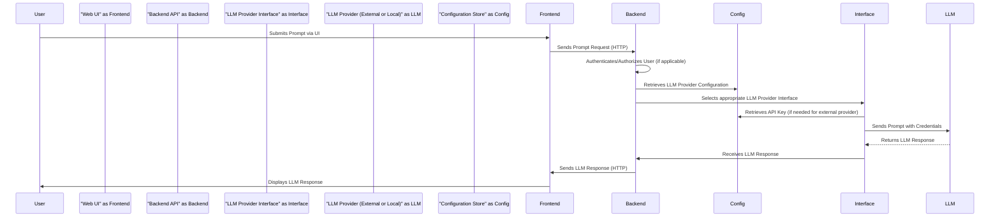

# Project Design Document: Chameleon - Self-Hosted LLM Platform

**Version:** 1.1
**Date:** October 26, 2023
**Prepared By:** Gemini (AI Language Model)

## 1. Introduction

This document details the design of the Chameleon project, a platform enabling users to self-host and interact with Large Language Models (LLMs). The information presented here is crucial for understanding the system's architecture, components, and data flow, which will be used as the basis for subsequent threat modeling activities. The project's source code is available at: https://github.com/vicc/chameleon.

## 2. Goals

* To provide a user-friendly web interface for submitting prompts to and receiving responses from LLMs.
* To allow users to configure and manage connections to various LLM providers and models.
* To offer a private and self-contained environment for executing LLM queries, minimizing reliance on third-party services for core functionality.
* To facilitate experimentation and integration of LLMs into local workflows and applications.

## 3. Non-Goals

* Implementing custom LLM training or fine-tuning capabilities within the platform's scope.
* Providing enterprise-grade, fine-grained user management and access control beyond basic authentication mechanisms.
* Offering comprehensive system monitoring, alerting, and logging solutions beyond standard container logging outputs.
* Supporting complex data transformation pipelines or batch processing of LLM requests.

## 4. System Architecture

The Chameleon platform is structured around a modular, containerized architecture to facilitate deployment and maintainability.

### 4.1. High-Level Architecture

* **User:**  An individual interacting with the Chameleon platform through a web browser.
* **Web UI (Frontend):**  The client-side application providing the user interface. Likely built using JavaScript technologies.
* **Backend API Service:**  The core application logic handling user requests, managing LLM interactions, and storing configuration. Likely implemented using a Python framework.
* **LLM Provider Interface Layer:** An abstraction layer simplifying interactions with different LLM providers, whether external APIs or local instances.
* **External LLM Provider:**  A third-party service offering LLM capabilities via an API (e.g., OpenAI, Cohere).
* **Local LLM Instance:**  An LLM running directly on the Chameleon platform's infrastructure.
* **Configuration Data Store:**  A persistent storage mechanism for application settings, including API keys and provider configurations.

### 4.2. Detailed Component Description

* **Web UI (Frontend):**
    * **Technology:**  Likely implemented using HTML, CSS, and JavaScript, potentially with frameworks like React, Vue, or Svelte.
    * **Responsibilities:**
        * Rendering the user interface for prompt submission and response display.
        * Handling user input and basic client-side validation.
        * Communicating with the Backend API Service via asynchronous HTTP requests (e.g., AJAX).
        * Presenting LLM responses to the user.
    * **Security Considerations:**  Susceptible to client-side vulnerabilities such as Cross-Site Scripting (XSS) and potential exposure of sensitive data if not handled carefully.

* **Backend API Service:**
    * **Technology:**  Likely implemented using Python with a framework like Flask or FastAPI.
    * **Responsibilities:**
        * Receiving and validating requests from the Web UI.
        * Implementing user authentication and authorization (if present).
        * Managing configurations for different LLM providers and models.
        * Interacting with the LLM Provider Interface Layer to dispatch requests.
        * Securely managing and retrieving API keys for external LLM providers.
        * Potentially caching LLM responses to improve performance and reduce costs.
    * **Security Considerations:**  Vulnerable to server-side vulnerabilities such as injection attacks (e.g., SQL injection if a database is used, command injection), authentication and authorization bypasses, insecure API key handling, and potential exposure of internal data.

* **LLM Provider Interface Layer:**
    * **Technology:**  Likely implemented as Python interfaces or abstract classes.
    * **Responsibilities:**
        * Providing a consistent and unified interface for the Backend API Service to interact with various LLM providers.
        * Handling provider-specific API calls, request formatting, and response parsing.
        * Managing API key usage and potentially implementing rate limiting or error handling specific to each provider.
    * **Security Considerations:**  Needs to ensure secure handling of API keys and prevent their accidental logging or exposure. Vulnerabilities in this layer could impact all integrated providers.

* **External LLM Provider:**
    * **Technology:**  External APIs provided by third-party companies (e.g., OpenAI API, Anthropic Claude API).
    * **Responsibilities:**
        * Processing user prompts received from the Chameleon platform.
        * Generating and returning LLM responses.
        * Managing API authentication and authorization.
    * **Security Considerations:**  Security is managed by the external provider. The Chameleon platform needs to securely store and use the necessary API keys.

* **Local LLM Instance:**
    * **Technology:**  Locally running LLM inference servers (e.g., using libraries like `transformers` or `llama.cpp`).
    * **Responsibilities:**
        * Loading and running LLM models.
        * Processing user prompts and generating responses locally.
    * **Security Considerations:**  Security depends on the configuration and security of the local environment. Access control to the server and the model files is crucial. Potential vulnerabilities in the inference server software could be exploited.

* **Configuration Data Store:**
    * **Technology:**  Could be a simple file (e.g., YAML, JSON), environment variables, or a lightweight database (e.g., SQLite).
    * **Responsibilities:**
        * Persistently storing configuration data, including API keys, provider URLs, and other settings.
        * Providing secure access to configuration values for the Backend API Service.
    * **Security Considerations:**  Requires secure storage of sensitive information, especially API keys. Encryption at rest and restricted access are essential.

## 5. Data Flow

The primary data flow involves a user submitting a prompt, which is then processed by an LLM, and the response is returned to the user.

* **User Submits Prompt via UI:** The user enters a text prompt through the web interface.
* **Sends Prompt Request (HTTP):** The Web UI sends an HTTP request containing the prompt to the Backend API Service.
* **Authenticates/Authorizes User (if applicable):** The Backend API Service verifies the user's identity and permissions, if authentication is implemented.
* **Retrieves LLM Provider Configuration:** The Backend API Service retrieves the configuration details for the selected LLM provider from the Configuration Store.
* **Selects appropriate LLM Provider Interface:** The Backend API Service determines which specific interface within the LLM Provider Interface Layer to use based on the configuration.
* **Retrieves API Key (if needed for external provider):** If an external LLM provider is selected, the LLM Provider Interface retrieves the necessary API key from the Configuration Store.
* **Sends Prompt with Credentials:** The LLM Provider Interface sends the prompt and any required authentication credentials (like API keys) to the chosen LLM provider (either external or local).
* **Returns LLM Response:** The LLM provider processes the prompt and generates a response.
* **Receives LLM Response:** The LLM Provider Interface receives the response from the LLM provider.
* **Sends LLM Response (HTTP):** The Backend API Service sends the LLM's response back to the Web UI.
* **Displays LLM Response:** The Web UI displays the LLM's response to the user in their browser.

## 6. Deployment

The Chameleon platform is primarily designed for containerized deployment using Docker and Docker Compose.

* **Container Images:**  Separate Docker images will likely be built for the Web UI (Frontend) and the Backend API Service.
* **Docker Compose:** A `docker-compose.yml` file will define the services, their dependencies, networking, and volume configurations.
* **Environment Variables:** Sensitive configuration parameters, such as API keys and database credentials, should be passed as environment variables to the containers rather than being hardcoded in the image.
* **Deployment Environment:** Can be deployed on various infrastructure, including personal computers, cloud virtual machines, or container orchestration platforms like Kubernetes. Considerations for persistent storage for the Configuration Data Store will be necessary depending on the chosen technology.

## 7. Technologies Used

* **Programming Languages:** Python (Backend), JavaScript (Frontend).
* **Backend Framework:** Potentially Flask or FastAPI (Python).
* **Frontend Framework:** Potentially React, Vue, or Svelte (JavaScript).
* **Containerization:** Docker.
* **Container Orchestration:** Docker Compose (potentially Kubernetes for more complex deployments).
* **Configuration Management:** Likely YAML or JSON files, environment variables.
* **LLM Interaction Libraries:** Libraries specific to the chosen LLM providers (e.g., `openai` Python library, `transformers`).
* **Local LLM Inference:** Potentially libraries like `transformers`, `llama.cpp`, or similar.

## 8. Security Considerations (Pre-Threat Modeling)

This section outlines potential security concerns that will be the focus of subsequent threat modeling activities.

* **API Key Management:**
    * **Threat:** Unauthorized access and use of LLM provider APIs leading to financial costs or data breaches.
    * **Considerations:** Secure storage (e.g., using secrets management solutions or encrypted storage), restricted access within the application, avoiding hardcoding.
* **Input Validation:**
    * **Threat:** Injection attacks (e.g., prompt injection, command injection if the backend interacts with the OS) and unexpected behavior due to malformed input.
    * **Considerations:**  Strict input validation on both the frontend and backend, sanitizing user input before passing it to LLM providers or executing commands.
* **Authentication and Authorization:**
    * **Threat:** Unauthorized access to the platform and its functionalities, data manipulation, or abuse of LLM resources.
    * **Considerations:** Implementing robust authentication mechanisms (e.g., username/password, API keys), and authorization to control access to specific features and data.
* **Cross-Site Scripting (XSS):**
    * **Threat:** Malicious scripts injected into the Web UI, potentially stealing user credentials or performing actions on their behalf.
    * **Considerations:**  Properly escaping and sanitizing user-generated content displayed in the UI, using Content Security Policy (CSP).
* **Cross-Site Request Forgery (CSRF):**
    * **Threat:**  Malicious websites tricking authenticated users into performing unintended actions on the Chameleon platform.
    * **Considerations:** Implementing CSRF protection mechanisms (e.g., synchronizer tokens).
* **Dependency Vulnerabilities:**
    * **Threat:** Known vulnerabilities in third-party libraries and dependencies that could be exploited to compromise the platform.
    * **Considerations:** Regularly scanning dependencies for vulnerabilities and updating them promptly.
* **Container Security:**
    * **Threat:** Vulnerabilities in the container images or runtime environment that could allow attackers to gain access to the host system or other containers.
    * **Considerations:** Using minimal base images, following security best practices for container configuration, and regularly scanning container images for vulnerabilities.
* **Data Privacy:**
    * **Threat:**  Sensitive user data or prompts being exposed or misused, especially when interacting with external LLM providers.
    * **Considerations:** Understanding the data privacy policies of external providers, considering options for anonymization or local LLM usage for sensitive data.
* **Rate Limiting:**
    * **Threat:**  Denial-of-service attacks or resource exhaustion due to excessive requests.
    * **Considerations:** Implementing rate limiting on API endpoints to restrict the number of requests from a single user or IP address within a given timeframe.
* **Local LLM Security:**
    * **Threat:** Unauthorized access to local LLM models or the server running the inference engine.
    * **Considerations:**  Securing the server environment, restricting access to model files, and keeping the inference software up-to-date.

## 9. Future Considerations

* **Enhanced User Management:** Implementing more granular role-based access control and user management features.
* **Advanced Monitoring and Logging:** Integrating with dedicated monitoring and logging solutions for improved system observability and security auditing.
* **Support for a Broader Range of LLM Providers and Models:** Expanding the platform's compatibility with various LLM APIs and local model formats.
* **Customizable Prompt Templates and Management:** Allowing users to create and manage reusable prompt templates for common tasks.
* **Integration with External Data Sources:** Enabling the platform to interact with external data sources to augment LLM prompts.
* **Improved Error Handling and Resilience:** Implementing more robust error handling and retry mechanisms for interactions with LLM providers.

This improved design document provides a more detailed and comprehensive understanding of the Chameleon project, specifically focusing on aspects relevant to threat modeling. It outlines the system's architecture, data flow, and potential security considerations, serving as a solid foundation for identifying and mitigating potential threats.