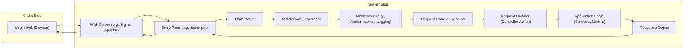
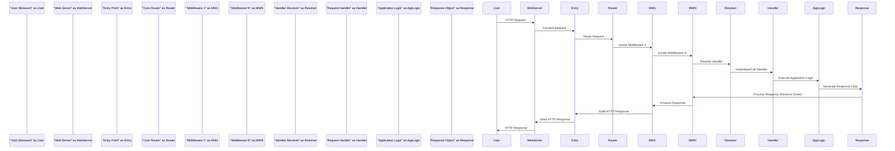

## Project Design Document: Chameleon (Improved)

**Project URL:** https://github.com/vicc/chameleon

**Version:** 1.1
**Date:** October 26, 2023
**Author:** AI Software Architect

### 1. Introduction

This document provides an enhanced design overview of the Chameleon project, an open-source project available on GitHub. This iteration aims to provide greater clarity and detail regarding the system's architecture, components, data flow, and crucial security considerations. This refined design will serve as a more robust foundation for subsequent threat modeling activities.

### 2. Goals and Objectives

The primary goal of the Chameleon project, as inferred from the GitHub repository, is to offer a streamlined and adaptable web framework or library. Key objectives appear to be:

*   **Ease of Use:** Provide a straightforward and intuitive API for developers.
*   **Extensibility:**  Enable developers to easily add custom functionality and adapt the framework to specific project needs.
*   **Performance:** Maintain a lightweight footprint and minimize performance overhead.
*   **Component Reusability:** Design components that can be utilized independently or within the larger framework.
*   **Developer Productivity:**  Facilitate rapid development and reduce boilerplate code.

### 3. System Architecture

The Chameleon project exhibits a modular architecture, likely built around a central routing mechanism and support for request processing pipelines. Based on the project structure and common web framework patterns, the architecture can be visualized as follows:

**Components:**

*   **User (Web Browser):** The entity interacting with the application via a web browser, sending requests and receiving responses.
*   **Web Server (e.g., Nginx, Apache):**  The software responsible for receiving HTTP requests from clients and forwarding them to the application's entry point.
*   **Entry Point (e.g., index.php):** The initial PHP script executed by the web server upon receiving a request. This script initializes the Chameleon framework and begins the request processing lifecycle.
*   **Core Router:**  The component responsible for analyzing the incoming HTTP request (URL, method) and mapping it to the appropriate request handler. This often involves defining routes and patterns.
*   **Middleware Dispatcher:**  Manages the execution of the middleware pipeline. It ensures that each middleware component is invoked in the correct order.
*   **Middleware (e.g., Authentication, Logging):**  Individual functions or classes that intercept and process requests before they reach the request handler, and potentially process responses before they are sent. Examples include:
    *   Authentication middleware to verify user credentials.
    *   Logging middleware to record request details.
    *   Request modification middleware to alter request data.
*   **Request Handler Resolver:**  Determines the specific request handler to execute based on the route matched by the router. This might involve instantiating a controller class and calling a specific method.
*   **Request Handler (Controller Action):**  A function or method responsible for handling a specific type of request. This is where the core application logic for a particular endpoint resides.
*   **Application Logic (Services, Models):**  The custom code developed by the user of the Chameleon framework to implement business rules, interact with databases, call external APIs, and perform other application-specific tasks. This often follows patterns like Model-View-Controller (MVC) or similar.
*   **Response Object:**  A structured representation of the HTTP response that will be sent back to the client. This includes headers, body content, and status codes.

### 4. Data Flow

A typical request-response cycle within a Chameleon-based application can be illustrated as follows:

**Detailed Steps:**

1. **User Initiates Request:** The user interacts with the web application, triggering an HTTP request (e.g., navigating to a URL, submitting a form).
2. **Request Received by Web Server:** The web server (e.g., Nginx, Apache) receives the incoming HTTP request.
3. **Request Forwarded to Entry Point:** The web server forwards the request to the application's entry point script (e.g., `index.php`).
4. **Routing:** The entry point initializes the Chameleon framework and passes the request information to the core router. The router matches the request URL and method against defined routes.
5. **Middleware Pipeline Execution:** The router invokes the middleware dispatcher, which executes the configured middleware components in a predefined order. Each middleware can inspect or modify the request and response.
6. **Request Handler Resolution:** Once middleware processing is complete, the request handler resolver determines the appropriate request handler to execute based on the matched route.
7. **Request Handler Invocation:** The resolver instantiates the request handler (e.g., a controller) and calls the relevant action method.
8. **Application Logic Execution:** The request handler executes the application-specific logic required to fulfill the request. This may involve interacting with models, services, databases, or external APIs.
9. **Response Generation:** The application logic generates the data for the response and populates the response object.
10. **Response Middleware Processing:** The response object is passed back through the middleware pipeline in reverse order, allowing middleware components to perform actions on the response (e.g., adding headers, logging).
11. **HTTP Response Construction:** The entry point uses the response object to construct the final HTTP response, including headers and body.
12. **Response Sent to Web Server:** The entry point sends the HTTP response back to the web server.
13. **Response Delivered to User:** The web server sends the HTTP response back to the user's web browser.

### 5. Security Considerations

Several security considerations are paramount for applications built using the Chameleon framework:

*   **Robust Input Validation:**  All user-provided input must be rigorously validated on the server-side to prevent injection attacks such as:
    *   SQL Injection: Sanitizing database queries to prevent malicious SQL code execution.
    *   Cross-Site Scripting (XSS): Encoding output to prevent the execution of malicious scripts in the user's browser.
    *   Command Injection:  Avoiding direct execution of user-provided data as system commands.
*   **Secure Output Encoding:** Data displayed to users should be properly encoded based on the output context (HTML, JavaScript, URL) to mitigate XSS vulnerabilities.
*   **Authentication and Authorization Mechanisms:** Implement secure mechanisms to:
    *   Authenticate users: Verify the identity of users attempting to access the application.
    *   Authorize access: Control which resources and actions authenticated users are permitted to access. Middleware is often used for these tasks.
*   **Secure Session Management:** Employ secure practices for managing user sessions to prevent:
    *   Session Hijacking: Protecting session identifiers from being stolen.
    *   Session Fixation: Preventing attackers from forcing a user to use a known session ID.
*   **Cross-Site Request Forgery (CSRF) Protection:** Implement CSRF tokens to prevent malicious websites from making unauthorized requests on behalf of authenticated users. This typically involves synchronizer tokens or double-submit cookies.
*   **Security Headers Configuration:**  Properly configure HTTP security headers to enhance client-side security:
    *   Content-Security-Policy (CSP): Controls the sources from which the browser is allowed to load resources.
    *   Strict-Transport-Security (HSTS): Enforces HTTPS connections.
    *   X-Frame-Options: Prevents clickjacking attacks.
    *   X-Content-Type-Options: Prevents MIME sniffing vulnerabilities.
*   **Comprehensive Error Handling and Logging:** Implement robust error handling to prevent the exposure of sensitive information in error messages. Maintain detailed logs for security auditing and incident response.
*   **Dependency Vulnerability Management:** Regularly update the Chameleon framework and all third-party dependencies to patch known security vulnerabilities. Utilize dependency scanning tools.
*   **Secure Configuration Practices:** Ensure that configuration files do not contain sensitive information (e.g., database credentials) and are properly secured. Utilize environment variables for sensitive configuration.
*   **Transport Layer Security (TLS):**  Enforce the use of HTTPS to encrypt all communication between the user's browser and the server, protecting data in transit.

### 6. Deployment

Deploying a Chameleon-based application typically involves the following components and considerations:

*   **Web Server:**  A production-ready web server such as Nginx or Apache is essential for handling incoming traffic, serving static assets, and proxying requests to the PHP interpreter. Configuration should be optimized for security and performance.
*   **PHP Interpreter:**  A properly configured PHP interpreter (e.g., PHP-FPM) is required to execute the application's code. Ensure the PHP version is up-to-date and security patches are applied.
*   **Application Files:**  The Chameleon framework files and the application-specific codebase need to be deployed to the server's file system.
*   **Database System (Optional):** If the application interacts with a database, a compatible database server (e.g., MySQL, PostgreSQL) needs to be installed and configured. Secure access credentials and proper database security practices are crucial.
*   **Configuration Management:**  Manage configuration settings for the web server, PHP, the application, and any other services. Utilize environment variables for sensitive settings.
*   **Deployment Environments:**  Applications can be deployed in various environments:
    *   **Traditional Servers (Physical or Virtual):**  Deploying directly onto physical or virtual machines. Requires manual configuration and management.
    *   **Cloud Platforms (IaaS):** Utilizing Infrastructure-as-a-Service (IaaS) offerings like AWS EC2, Google Compute Engine, or Azure Virtual Machines. Provides more control over the infrastructure.
    *   **Containerization (Docker, Kubernetes):** Packaging the application and its dependencies into containers for consistent deployment across different environments. Kubernetes can be used for orchestration and scaling.
    *   **Platform-as-a-Service (PaaS):**  Leveraging PaaS offerings like Heroku or AWS Elastic Beanstalk, which abstract away much of the infrastructure management.

### 7. Technologies Used (Inferred)

Based on the GitHub repository and common web development practices in the PHP ecosystem, the following technologies are highly likely to be involved:

*   **Programming Language:** PHP
*   **Web Server:**  Likely Apache or Nginx
*   **Markup Language:** HTML
*   **Styling Language:** CSS
*   **Client-Side Scripting Language:** JavaScript
*   **Potential Libraries/Frameworks:** While Chameleon itself is a framework, applications built with it might utilize other common PHP libraries for tasks like:
    *   Database interaction (e.g., PDO, Doctrine, Eloquent)
    *   Templating (e.g., Twig, Blade)
    *   Form handling and validation
    *   Security (e.g., password hashing libraries)

### 8. Future Considerations

Potential future enhancements and considerations for the Chameleon project include:

*   **Enhanced Documentation and Examples:**  More comprehensive documentation, including tutorials and practical examples, would significantly improve developer adoption.
*   **Built-in Security Features:**  Integrating more security features directly into the framework core, such as built-in CSRF protection or input sanitization helpers, could improve the security posture of applications built with Chameleon.
*   **Improved Testing Framework Integration:**  Providing a more opinionated or integrated testing framework would encourage better testing practices.
*   **Active Community Building:** Fostering a strong and active community around the project is crucial for its long-term success.
*   **Integration with Modern PHP Standards:**  Ensuring compatibility and adherence to modern PHP standards and best practices.
*   **Performance Optimization Tools:**  Providing tools or guidance for optimizing the performance of Chameleon-based applications.

This improved design document offers a more detailed and refined understanding of the Chameleon project's architecture, data flow, and security considerations. This enhanced information will be invaluable for conducting a more thorough and effective threat model.