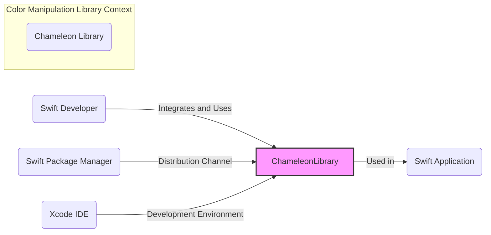
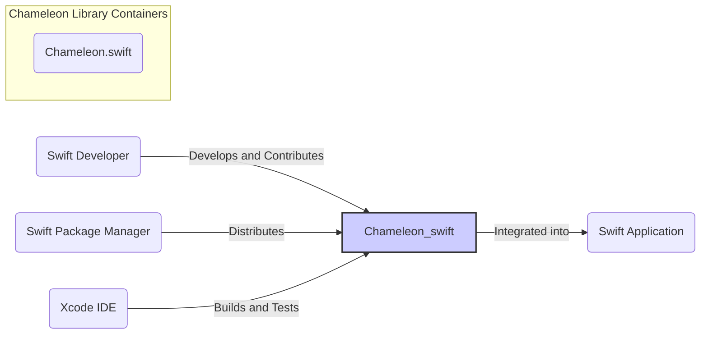
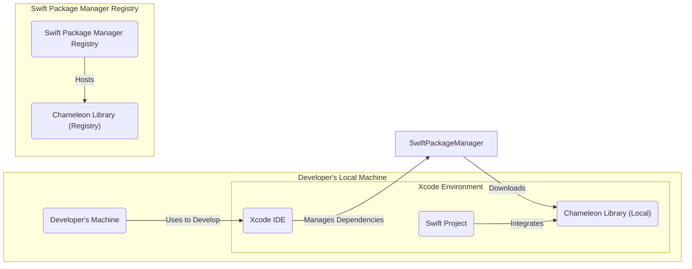

# BUSINESS POSTURE

This project, named 'chameleon', is a Swift library designed for color manipulation. The primary business goal is to provide Swift developers with a robust, efficient, and easy-to-use tool for working with colors in their applications. This aims to improve developer productivity and potentially enhance the visual appeal and user experience of Swift-based applications.

Key business priorities include:
- Ease of use and integration for Swift developers.
- Performance and efficiency of color manipulations.
- Reliability and correctness of color calculations.
- Maintainability and extensibility of the library.
- Community adoption and positive developer feedback.

Most important business risks to address:
- Low adoption rate due to lack of features, poor documentation, or competition from other libraries.
- Bugs or inaccuracies in color calculations leading to incorrect application behavior and negative user experience.
- Performance bottlenecks impacting application responsiveness.
- Security vulnerabilities in the library that could be exploited by malicious actors in applications using the library.
- Lack of community support and contributions leading to stagnation and eventual obsolescence.

# SECURITY POSTURE

Existing security controls:
- security control: Code is hosted on GitHub, providing version control and transparency. (Implemented: GitHub repository)
- security control: Open-source license (MIT License) allows for community review and contributions. (Implemented: LICENSE file in repository)

Accepted risks:
- accepted risk: Reliance on community contributions for security vulnerability identification and patching.
- accepted risk: Potential for vulnerabilities to be introduced during development.

Recommended security controls:
- security control: Implement automated static analysis security testing (SAST) in the CI/CD pipeline to identify potential code-level vulnerabilities.
- security control: Introduce dependency scanning to identify and manage vulnerabilities in any external dependencies (though this library seems to have minimal dependencies).
- security control: Establish a clear process for reporting and handling security vulnerabilities, including a security policy and contact information.
- security control: Conduct regular code reviews with a focus on security best practices.
- security control: Provide documentation and examples that promote secure usage of the library, especially regarding input validation if the library processes external color inputs.

Security requirements:
- Authentication: Not applicable for a library. Authentication is relevant for systems that use this library, not the library itself.
- Authorization: Not applicable for a library. Authorization is relevant for systems that use this library, not the library itself.
- Input validation: The library should perform input validation on any color parameters it accepts to prevent unexpected behavior or crashes due to malformed input. This is especially important if color inputs can originate from external sources in applications using the library.
- Cryptography: Cryptography is likely not a core requirement for a color manipulation library. However, if there are features involving secure color representation or manipulation (which is unlikely), appropriate cryptographic measures should be considered. For now, cryptography is not considered a primary security requirement.

# DESIGN

## C4 CONTEXT

### Context Diagram Elements

- Name: Swift Developer
  - Type: Person
  - Description: Software developers who use the Chameleon library to manipulate colors in their Swift applications.
  - Responsibilities: Integrate the Chameleon library into their Swift projects, utilize its API to perform color manipulations, and report issues or contribute improvements.
  - Security controls: Developers are responsible for using the library securely within their applications, including proper input validation and handling of color data in their application's context.

- Name: Swift Package Manager
  - Type: Software System
  - Description: Apple's dependency management tool for Swift projects. Used to distribute and integrate the Chameleon library into Swift applications.
  - Responsibilities: Package and distribute the Chameleon library, manage library versions, and facilitate integration into Swift projects.
  - Security controls: Swift Package Manager relies on code signing and checksums to ensure the integrity of packages. Security controls are primarily managed by the Swift Package Manager infrastructure.

- Name: Xcode IDE
  - Type: Software System
  - Description: Apple's Integrated Development Environment used by Swift developers to develop, build, and test Swift applications, including those using the Chameleon library.
  - Responsibilities: Provide a development environment for creating and testing Swift code that utilizes the Chameleon library.
  - Security controls: Xcode provides security features such as code signing and sandboxing for development environments. Security controls are primarily managed by the Xcode environment and developer's macOS system.

- Name: Swift Application
  - Type: Software System
  - Description: Applications built using Swift that integrate and utilize the Chameleon library for color manipulation functionalities.
  - Responsibilities: Utilize the Chameleon library to provide color-related features to end-users. The security of the Swift Application is the responsibility of the application developers.
  - Security controls: Security controls for the Swift Application are application-specific and are the responsibility of the application developers. This includes secure coding practices, input validation, authorization, and other relevant security measures within the application itself.

- Name: Chameleon Library
  - Type: Software System
  - Description: The 'chameleon' Swift library itself, providing functionalities for color manipulation.
  - Responsibilities: Provide reliable, efficient, and secure color manipulation functionalities to Swift applications.
  - Security controls: Security controls for the Chameleon library include secure coding practices, input validation within the library, static analysis, dependency scanning (if applicable), and a process for handling security vulnerabilities.

## C4 CONTAINER

### Container Diagram Elements

- Name: Chameleon.swift
  - Type: Library (Swift Source Code)
  - Description: The Swift source code files that constitute the Chameleon library. This includes Swift classes, structs, functions, and protocols for color manipulation.
  - Responsibilities: Implement the core logic for color manipulation, provide a well-defined API for developers, and ensure code quality and security.
  - Security controls: Security controls are focused on secure coding practices within the Swift code, input validation within the library's functions, and adherence to secure development guidelines. Static analysis and code reviews are important security controls for this container.

- Name: Swift Developer
  - Type: Person
  - Description: Same as in Context Diagram.
  - Responsibilities: Same as in Context Diagram, but at the container level, they are responsible for contributing secure and well-tested code to the Chameleon.swift container.
  - Security controls: Developers should follow secure coding guidelines and participate in code reviews to ensure the security of the Chameleon.swift container.

- Name: Swift Package Manager
  - Type: Software System
  - Description: Same as in Context Diagram.
  - Responsibilities: Same as in Context Diagram, but at the container level, it distributes the compiled and packaged Chameleon.swift library.
  - Security controls: Same as in Context Diagram.

- Name: Xcode IDE
  - Type: Software System
  - Description: Same as in Context Diagram.
  - Responsibilities: Same as in Context Diagram, but at the container level, it provides tools for building, testing, and analyzing the Chameleon.swift container.
  - Security controls: Same as in Context Diagram.

- Name: Swift Application
  - Type: Software System
  - Description: Same as in Context Diagram.
  - Responsibilities: Same as in Context Diagram, but at the container level, it integrates the compiled Chameleon.swift library into its application binary.
  - Security controls: Same as in Context Diagram.

## DEPLOYMENT

Deployment for a library is different from a standalone application. The "deployment" in this context refers to how the library is made available to developers for integration into their projects. The primary deployment method is through the Swift Package Manager.

### Deployment Diagram Elements

- Name: Developer's Machine
  - Type: Infrastructure (Physical/Virtual Machine)
  - Description: The local computer used by a Swift developer for software development.
  - Responsibilities: Provides the environment for development, including Xcode and Swift toolchain.
  - Security controls: Security controls are the responsibility of the developer and include operating system security, endpoint protection, and physical security of the machine.

- Name: Xcode Environment
  - Type: Software Environment
  - Description: The development environment provided by Xcode, including the IDE, build tools, and debugging capabilities.
  - Responsibilities: Provide a platform for developing and testing Swift applications and libraries.
  - Security controls: Xcode provides some security features like code signing and sandboxing. The security of the Xcode environment also depends on the security of the underlying macOS.

- Name: Swift Project
  - Type: Software Component (Directory/Project Files)
  - Description: The Swift project being developed by the developer, which will integrate the Chameleon library.
  - Responsibilities: To utilize the Chameleon library and provide application-specific functionalities.
  - Security controls: Security controls are application-specific and are the responsibility of the application developer.

- Name: Chameleon Library (Local)
  - Type: Software Component (Local Copy of Library)
  - Description: A local copy of the Chameleon library downloaded and managed by Swift Package Manager within the developer's Swift project.
  - Responsibilities: Provide color manipulation functionalities to the Swift Project.
  - Security controls: Integrity of the local copy is ensured by Swift Package Manager through checksums and potentially code signing.

- Name: Swift Package Manager Registry
  - Type: Infrastructure (Server/Service)
  - Description: A remote registry (like the official Swift Package Registry or a private registry) that hosts Swift packages, including the Chameleon library.
  - Responsibilities: Host and distribute Swift packages, ensure package integrity and availability.
  - Security controls: Security controls are managed by the Swift Package Manager registry provider and include infrastructure security, access control, and package integrity verification.

- Name: Chameleon Library (Registry)
  - Type: Software Component (Package in Registry)
  - Description: The Chameleon library package as hosted in the Swift Package Manager registry.
  - Responsibilities: To be available for download and integration by Swift developers through Swift Package Manager.
  - Security controls: Security controls are managed by the Swift Package Manager registry provider and include package integrity verification and access control to the registry.

## BUILD

### Build Diagram Elements

- Name: Developer
  - Type: Person
  - Description: A software developer contributing to the Chameleon library.
  - Responsibilities: Write code, run local tests, and commit changes to the GitHub repository.
  - Security controls: Developers are responsible for secure coding practices and ensuring their development environment is secure.

- Name: Commit Code to GitHub
  - Type: Process
  - Description: The action of committing and pushing code changes to the GitHub repository.
  - Responsibilities: Version control and code sharing.
  - Security controls: GitHub provides version control and access control to the repository.

- Name: GitHub Actions CI
  - Type: Software System (CI/CD)
  - Description: GitHub's built-in CI/CD service used to automate the build, test, and publishing process for the Chameleon library.
  - Responsibilities: Automate the build, test, security checks, and publishing of the library upon code changes.
  - Security controls: GitHub Actions provides a secure environment for running CI/CD pipelines. Security controls include access control to workflows, secrets management, and isolation of build environments.

- Name: Build & Test
  - Type: Process (Build Stage)
  - Description: The stage in the CI/CD pipeline where the Swift code is compiled, and unit tests are executed.
  - Responsibilities: Compile the Swift code into a library and ensure code quality through automated tests.
  - Security controls: Build environment security, dependency management, and test execution.

- Name: SAST & Security Checks
  - Type: Process (Security Stage)
  - Description: The stage in the CI/CD pipeline where static analysis security testing (SAST) and other security checks (like dependency scanning) are performed on the codebase.
  - Responsibilities: Identify potential security vulnerabilities in the code and dependencies.
  - Security controls: SAST tools, dependency scanning tools, and configuration of these tools to detect relevant security issues.

- Name: Build Artifacts (Package)
  - Type: Software Artifact
  - Description: The packaged and compiled Chameleon library, ready for distribution.
  - Responsibilities: Represent the distributable version of the library.
  - Security controls: Code signing of the package, checksum generation to ensure integrity.

- Name: Publish to Swift Package Manager Registry
  - Type: Process (Publish Stage)
  - Description: The stage in the CI/CD pipeline where the build artifacts are published to the Swift Package Manager Registry, making the library available to Swift developers.
  - Responsibilities: Distribute the library to the Swift developer community.
  - Security controls: Secure publishing process, authentication and authorization for publishing to the registry, and integrity of the published package in the registry.

# RISK ASSESSMENT

Critical business process: Providing a reliable and secure color manipulation library to Swift developers.

Data we are trying to protect:
- Source code of the Chameleon library: Sensitivity - High. Confidentiality and integrity of the source code are important to prevent unauthorized modifications and intellectual property theft.
- Build artifacts (packaged library): Sensitivity - Medium. Integrity of the build artifacts is crucial to ensure that developers are using a safe and untampered library.
- Developer credentials and secrets used in the build process: Sensitivity - High. Confidentiality of these credentials is vital to prevent unauthorized access to the build and publishing pipeline.

Data sensitivity classification:
- Source code: Confidential, Integrity-sensitive.
- Build artifacts: Integrity-sensitive.
- Developer credentials/secrets: Confidential, Integrity-sensitive.

# QUESTIONS & ASSUMPTIONS

Questions:
- What is the intended scope and complexity of color manipulations that the library aims to support?
- Are there any specific performance requirements or constraints for the library?
- Is there a plan for long-term maintenance and support of the library, including security updates?
- Are there any specific types of applications or industries that are the primary target users of this library?
- Are there any external dependencies that the library relies on, or is it designed to be dependency-free?

Assumptions:
- BUSINESS POSTURE: The primary goal is to provide a useful and reliable open-source library for the Swift developer community. Adoption and positive community feedback are key success metrics.
- SECURITY POSTURE: Security is important, but not the absolute highest priority for an open-source utility library. Focus should be on preventing common vulnerabilities and ensuring basic security hygiene. The library is assumed to be used in a variety of applications with varying security requirements, so it should be robust against common input-related vulnerabilities.
- DESIGN: The library is designed to be lightweight and modular, focusing on core color manipulation functionalities. It is intended to be distributed via Swift Package Manager and integrated into standard Swift development workflows. The build process is assumed to be automated using GitHub Actions or a similar CI/CD system.