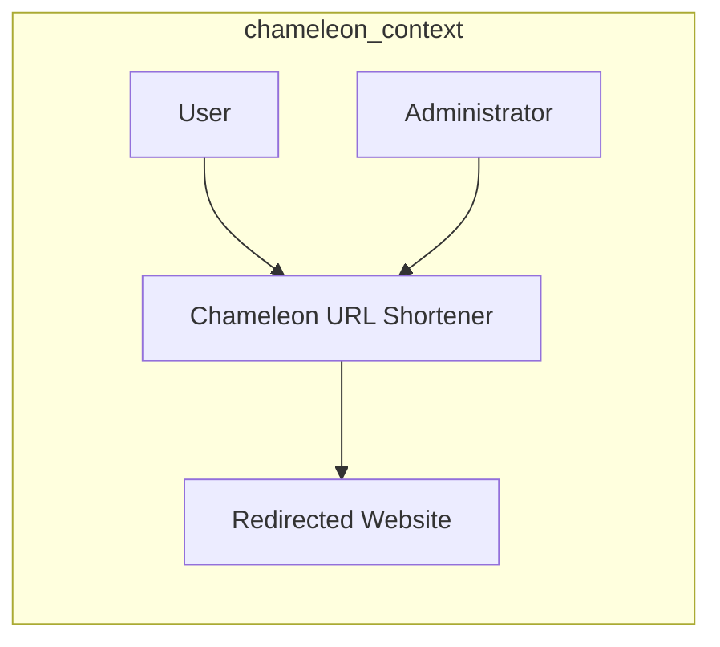
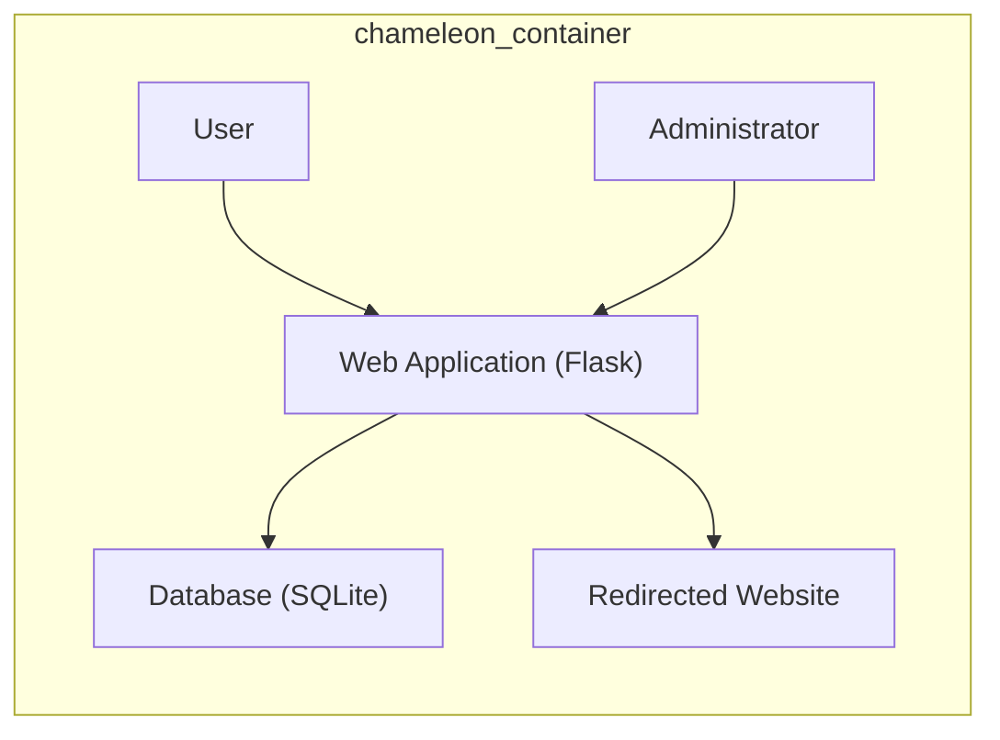
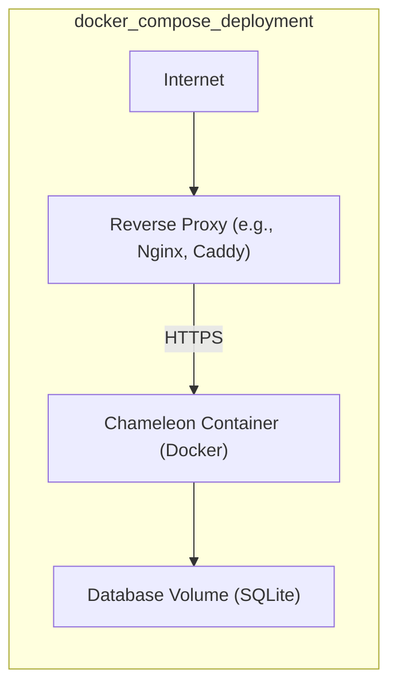
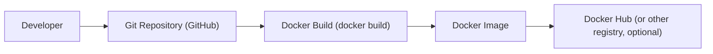

Okay, let's create a detailed design document for the Chameleon project, focusing on aspects relevant for threat modeling.

# BUSINESS POSTURE

Chameleon appears to be a personal or small-team project focused on providing a simple, self-hosted, and customizable URL shortening service.  The primary business goals likely revolve around:

*   Providing a functional and reliable URL shortening service.
*   Allowing users to customize short URLs (brands, keywords).
*   Offering a degree of control over data and privacy (self-hosted).
*   Potentially, gathering basic analytics on link usage (though this isn't explicitly stated, it's a common feature of such services).
*   Ease of deployment and maintenance.

Given the likely small scale and personal/small-team nature, the risk appetite might be higher than a large enterprise.  However, certain risks are still critical:

*   _Data Loss/Corruption_: Loss of the URL mapping data would render the service unusable.
*   _Service Unavailability_: Downtime would directly impact users relying on the shortened links.
*   _Malicious Use_: The service could be abused to mask malicious URLs, potentially harming users and damaging the reputation of the service/host.
*   _Unauthorized Access_:  An attacker gaining administrative access could modify or delete links, or redirect them to malicious destinations.
*   _Data Breach_: While the data stored might not be highly sensitive (primarily URLs), a breach could still expose user-created links and potentially some usage patterns.

# SECURITY POSTURE

Based on the repository, the following security controls and accepted risks can be identified:

*   _security control_: Basic Authentication: The application uses basic authentication (username/password) for the admin interface, as seen in the `app.py` and `templates/admin.html`.
*   _security control_: Limited Input Validation: There's some basic input validation for URLs in `app.py`, checking for a valid URL format.
*   _security control_: SQLite Database: The use of SQLite simplifies deployment and reduces external dependencies, but requires careful consideration of file permissions and backup strategies.
*   _security control_: Docker Deployment: The provided Dockerfile and docker-compose.yml simplify deployment and ensure consistent environments.
*   _security control_: No HTTPS by default: The application, as provided, does not enforce HTTPS. This is a significant security concern.
*   _accepted risk_: Limited Rate Limiting: There's no apparent rate limiting, making the service potentially vulnerable to abuse and denial-of-service attacks.
*   _accepted risk_: No CSRF Protection: There's no apparent protection against Cross-Site Request Forgery (CSRF) attacks.
*   _accepted risk_: No Input Sanitization: There is no sanitization of user input, making the service potentially vulnerable to Cross-Site Scripting (XSS) attacks.
*   _accepted risk_: Basic Authentication: Basic authentication sends credentials in plain text if HTTPS is not used.
*   _accepted risk_: Hardcoded Secret Key: The Flask secret key is hardcoded in `app.py`. This is a major security vulnerability.
*   _accepted risk_: No Audit Logging: There is no audit logging.

Recommended Security Controls (High Priority):

*   _Implement HTTPS_: Enforce HTTPS using a reverse proxy (like Nginx or Caddy) with a valid SSL/TLS certificate. This is crucial for protecting credentials and data in transit.
*   _Implement CSRF Protection_: Use a library like Flask-WTF to protect against CSRF attacks.
*   _Implement Input Sanitization_: Sanitize all user input to prevent XSS attacks.
*   _Implement Rate Limiting_: Implement rate limiting to prevent abuse and denial-of-service attacks.
*   _Secure Secret Key Management_:  Do not hardcode the secret key. Use environment variables or a dedicated secret management solution.
*   _Implement Stronger Password Hashing_: Use a strong password hashing algorithm (e.g., bcrypt, scrypt) instead of storing passwords in plain text or using weak hashing.
*   _Implement Regular Backups_: Implement a robust backup strategy for the SQLite database.
*   _Implement Audit Logging_: Implement audit logging to track user actions and potential security events.

Security Requirements:

*   _Authentication_:
    *   The system MUST use strong password hashing for storing user credentials.
    *   The system MUST enforce HTTPS to protect credentials in transit.
    *   The system SHOULD implement multi-factor authentication (MFA) for administrative access.

*   _Authorization_:
    *   The system MUST restrict access to administrative functions to authorized users only.
    *   The system SHOULD implement role-based access control (RBAC) if different user roles are required.

*   _Input Validation_:
    *   The system MUST validate all user input to ensure it conforms to expected formats and lengths.
    *   The system MUST reject any input that contains potentially malicious characters or patterns.

*   _Cryptography_:
    *   The system MUST use HTTPS for all communication.
    *   The system MUST use a strong, randomly generated secret key for Flask.
    *   The system SHOULD use a cryptographically secure random number generator for generating short URLs.

*   _Output Encoding_:
    *   The system MUST encode all output to prevent XSS attacks.

# DESIGN

## C4 CONTEXT

Element Descriptions:

*   Element:
    *   Name: User
    *   Type: Person
    *   Description: A person who clicks on a shortened URL created by Chameleon.
    *   Responsibilities: Clicks on shortened URLs.
    *   Security controls: None (relies on the security of Chameleon and the Redirected Website).

*   Element:
    *   Name: Chameleon URL Shortener
    *   Type: Software System
    *   Description: The URL shortening application.
    *   Responsibilities: Stores URL mappings, redirects users to the original URLs, provides an administrative interface.
    *   Security controls: Basic Authentication, Input Validation, Docker Deployment.

*   Element:
    *   Name: Redirected Website
    *   Type: Software System
    *   Description: The website that the user is ultimately redirected to.
    *   Responsibilities: Serving the content requested by the user.
    *   Security controls: Not controlled by Chameleon (relies on the security of the external website).

*   Element:
    *   Name: Administrator
    *   Type: Person
    *   Description: A person who manages the Chameleon service.
    *   Responsibilities: Creates and manages short URLs, configures the application.
    *   Security controls: Basic Authentication (access to the admin interface).

## C4 CONTAINER

Element Descriptions:

*   Element:
    *   Name: User
    *   Type: Person
    *   Description: A person who clicks on a shortened URL.
    *   Responsibilities: Clicks on shortened URLs.
    *   Security controls: None (relies on the security of the Web Application and the Redirected Website).

*   Element:
    *   Name: Administrator
    *   Type: Person
    *   Description: A person who manages the Chameleon service.
    *   Responsibilities: Creates and manages short URLs, configures the application.
    *   Security controls: Basic Authentication (access to the admin interface).

*   Element:
    *   Name: Web Application (Flask)
    *   Type: Web Application
    *   Description: The core application logic, built using the Flask framework.
    *   Responsibilities: Handles HTTP requests, interacts with the database, renders templates, performs redirects.
    *   Security controls: Basic Authentication, Input Validation.

*   Element:
    *   Name: Database (SQLite)
    *   Type: Database
    *   Description: Stores the URL mappings (short URL and original URL).
    *   Responsibilities: Persistently stores data.
    *   Security controls: File system permissions (managed by the operating system and Docker).

*   Element:
    *   Name: Redirected Website
    *   Type: Software System
    *   Description: The website that the user is ultimately redirected to.
    *   Responsibilities: Serving the content requested by the user.
    *   Security controls: Not controlled by Chameleon (relies on the security of the external website).

## DEPLOYMENT

Possible deployment solutions:

1.  Docker Compose (as provided in the repository): Simplest for local development and small-scale deployments.
2.  Docker Swarm: For higher availability and scalability.
3.  Kubernetes: For more complex deployments with advanced features like auto-scaling and rolling updates.
4.  Cloud-based container services (e.g., AWS ECS, Google Cloud Run, Azure Container Instances): Managed container services that simplify deployment and scaling.
5.  Traditional VM deployment: Deploying the application directly on a virtual machine (less recommended due to increased management overhead).

Chosen solution (for detailed description): Docker Compose

Element Descriptions:

*   Element:
    *   Name: Internet
    *   Type: External
    *   Description: The public internet.
    *   Responsibilities: Routing traffic to the server.
    *   Security controls: Relies on network-level security (firewalls, etc.).

*   Element:
    *   Name: Reverse Proxy (e.g., Nginx, Caddy)
    *   Type: Web Server
    *   Description: A reverse proxy server that handles HTTPS termination and forwards requests to the Chameleon container.
    *   Responsibilities: Handling HTTPS, caching, load balancing (potentially), providing SSL/TLS certificates.
    *   Security controls: HTTPS configuration, certificate management, potentially Web Application Firewall (WAF) rules.

*   Element:
    *   Name: Chameleon Container (Docker)
    *   Type: Container
    *   Description: The Docker container running the Chameleon application.
    *   Responsibilities: Running the Flask application.
    *   Security controls: Container isolation, limited privileges (if configured correctly).

*   Element:
    *   Name: Database Volume (SQLite)
    *   Type: Data Volume
    *   Description: A Docker volume that stores the SQLite database file.
    *   Responsibilities: Persisting the database data.
    *   Security controls: File system permissions (managed by Docker and the host operating system).

## BUILD

The project uses a simple build process based on Docker.

*   Developer writes code and commits it to the Git repository.
*   The `docker build` command is used to create a Docker image. This command uses the `Dockerfile` in the repository.
*   The Dockerfile specifies the base image (Python 3.9-slim-buster), copies the application code, installs dependencies (using `pip`), and sets the command to run the application.
*   The resulting Docker image can be pushed to a container registry (like Docker Hub) for distribution.
*   No CI is used.
*   No SAST scanners are used.
*   No linters are used.

Security Controls in Build Process:

*   _security control_: Dependency Management: The `requirements.txt` file lists the project's dependencies.  It's important to regularly check for vulnerabilities in these dependencies.
*   _security control_: Docker Image Security: Using a slim base image (`python:3.9-slim-buster`) reduces the attack surface compared to larger images.

Recommended Improvements:

*   _Implement CI/CD_: Use a CI/CD platform (like GitHub Actions, GitLab CI, Jenkins) to automate the build, test, and deployment process.
*   _Integrate SAST_: Integrate Static Application Security Testing (SAST) tools into the build process to identify potential vulnerabilities in the code.
*   _Integrate SCA_: Integrate Software Composition Analysis (SCA) tools to scan dependencies for known vulnerabilities.
*   _Use Linters_: Use linters (like `flake8` for Python) to enforce code style and identify potential errors.
*   _Sign Docker Images_: Digitally sign Docker images to ensure their integrity and authenticity.

# RISK ASSESSMENT

*   _Critical Business Processes_:
    *   URL Redirection: The core functionality of the service.
    *   URL Management: The ability to create, modify, and delete short URLs.

*   _Data to Protect_:
    *   _URL Mappings_: (short URL, original URL, creation date, potentially user ID/metadata). Sensitivity: Medium (loss of this data would break the service; exposure could reveal user link patterns).
    *   _User Credentials_ (if stored): Sensitivity: High (compromise would allow unauthorized access).  Currently, basic authentication is used, which is highly insecure without HTTPS.
    *   _Application Configuration_: Sensitivity: Medium (exposure could reveal vulnerabilities or misconfigurations).

# QUESTIONS & ASSUMPTIONS

*   _Questions_:
    *   Are there any plans for user registration or more granular access control?
    *   Is there a need for detailed analytics on link usage?
    *   What is the expected traffic volume and scaling requirements?
    *   What is the backup and recovery strategy for the database?
    *   Is there any existing infrastructure (e.g., reverse proxy, monitoring) that can be leveraged?
    *   Are there any regulatory or compliance requirements that need to be considered?

*   _Assumptions_:
    *   _BUSINESS POSTURE_: The project is intended for personal or small-team use, with a relatively high risk tolerance.
    *   _SECURITY POSTURE_: The current security posture is minimal, with several significant vulnerabilities. HTTPS is not enforced, and basic authentication is used.
    *   _DESIGN_: The application is relatively simple, with a single Flask application and an SQLite database. The deployment is assumed to be using Docker Compose, with a reverse proxy for HTTPS termination. The build process is manual, using `docker build`.