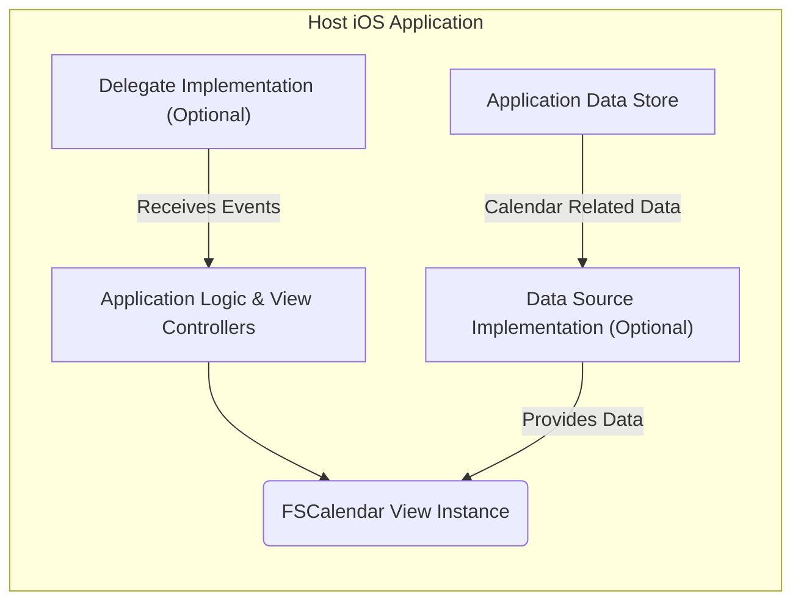
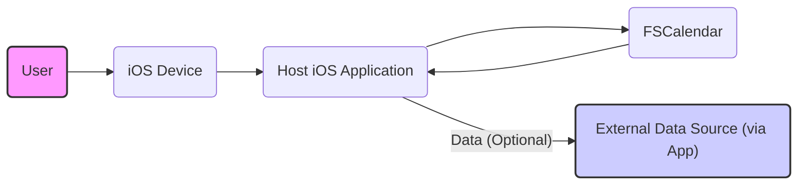

## Project Design Document: FSCalendar (Improved)

**1. Introduction**

This document provides an enhanced and more detailed design overview of the FSCalendar project, an open-source calendar control for iOS applications. Building upon the previous version, this document aims to provide a clearer and more comprehensive understanding of the system's architecture, components, data flow, and interactions. This detailed design serves as a robust foundation for subsequent threat modeling activities.

**2. Project Overview**

*   **Project Name:** FSCalendar
*   **Project Repository:** [https://github.com/WenchaoD/FSCalendar](https://github.com/WenchaoD/FSCalendar)
*   **Description:** FSCalendar is a highly customizable and feature-rich calendar library for iOS, written in Objective-C. It offers a variety of calendar display styles (month, week, custom ranges), supports features like event marking with custom indicators, date selection with single and multi-selection modes, programmatic control over the calendar's state, and extensive appearance customization options.
*   **Primary Goal:** To provide iOS developers with a flexible, performant, and visually appealing calendar UI component that can be easily integrated into their applications.
*   **Target Users:** iOS developers seeking to incorporate calendar functionality into their applications with a high degree of customization and control.

**3. System Architecture**

The FSCalendar library operates primarily as a client-side UI component deeply integrated within the lifecycle of the host iOS application. It does not inherently involve server-side components or initiate external network communication for its core calendar rendering and interaction logic. Data persistence and retrieval are the responsibility of the integrating application.



*   **Host iOS Application:** The encompassing iOS application that instantiates and utilizes the FSCalendar library. This includes the application's logic, view controllers, and data management layers.
*   **FSCalendar View Instance:** A specific instance of the `FSCalendarView` class, added as a subview within the host application's view hierarchy. This is the visual representation of the calendar.
*   **Data Source Implementation (Optional):**  An optional component within the host application that conforms to the `FSCalendarDataSource` protocol. It is responsible for providing dynamic data to the calendar, such as indicators for events on specific dates.
*   **Delegate Implementation (Optional):** An optional component within the host application that conforms to the `FSCalendarDelegate` protocol. It receives notifications from the calendar about user interactions and state changes, such as date selections or page changes.
*   **Application Data Store:** Represents the host application's mechanism for storing and retrieving data, which may include calendar-related information used by the Data Source.

**4. Data Flow**

The data flow within FSCalendar centers around the exchange of information between the host application and the calendar view, primarily driven by the data source and delegate protocols.

*   **Initialization and Configuration:** The host application creates and configures an instance of `FSCalendarView`, setting properties like display mode, locale, and appearance.
*   **Data Provision (Optional - via Data Source):**
    *   When the calendar needs to display information about specific dates (e.g., event indicators), it calls methods defined in the `FSCalendarDataSource` protocol implemented by the host application.
    *   The host application retrieves the necessary data from its data store or other sources and returns it to the calendar.
*   **User Interaction Handling:**
    *   User interactions (taps, swipes) on the `FSCalendarView` are captured by the calendar.
    *   The calendar updates its internal state based on the interaction (e.g., selecting a date, changing the displayed month).
*   **Event Notification (Optional - via Delegate):**
    *   When significant events occur within the calendar (e.g., a date is selected, the current page changes), the calendar calls methods defined in the `FSCalendarDelegate` protocol implemented by the host application.
    *   The host application receives these notifications and can perform actions accordingly (e.g., updating other UI elements, fetching data for the selected date).
*   **Programmatic Control:** The host application can directly manipulate the state of the `FSCalendarView` programmatically, such as setting the current displayed month or selecting specific dates.

```mermaid
graph LR
    subgraph "FSCalendar"
        A["FSCalendar View"]
        B["Calendar Logic & State Management"]
        C["Rendering & Layout Engine"]
    end
    subgraph "Host Application"
        D["Application Logic"]
        E["Data Source Implementation (Optional)"]
        F["Delegate Implementation (Optional)"]
    end

    D -- "Initialize & Configure" --> A
    E -- "Data Request (Dates)" --> B
    B -- "Data Response (Indicators, etc.)" --> A
    A -- "User Interaction (Taps, Swipes)" --> B
    B -- "Event Notification (Date Selected, Page Changed)" --> F
    D -- "Programmatic Control (Set Page, Select Date)" --> A
    A --> C
    C --> "Display on Screen"
```

*   **FSCalendar View:** The visual component, responsible for rendering the calendar and handling direct user interactions.
*   **Calendar Logic & State Management:**  The internal logic within FSCalendar that manages the calendar's state, date calculations, and responds to user interactions.
*   **Rendering & Layout Engine:**  The part of FSCalendar responsible for drawing the calendar elements on the screen based on the current state and appearance settings.
*   **Application Logic:** The core business logic of the host application that orchestrates the interaction with FSCalendar.
*   **Data Source Implementation:** Provides dynamic data to the calendar upon request.
*   **Delegate Implementation:** Receives notifications about events occurring within the calendar.

**5. Components**

*   **`FSCalendarView` (UIView subclass):**
    *   The central view component responsible for displaying the calendar UI.
    *   Manages the layout and rendering of individual date cells, weekday headers, and navigation controls.
    *   Handles user input events (touches, gestures) for date selection and navigation.
    *   Acts as the primary interface for configuring the calendar's appearance and behavior.
    *   Communicates with the optional `FSCalendarDataSource` to retrieve data for display.
    *   Notifies the optional `FSCalendarDelegate` about significant events.
*   **`FSCalendarDataSource` (Protocol):**
    *   Defines the contract for providing data to the `FSCalendarView`.
    *   Methods allow the host application to specify:
        *   The number of event indicators for a given date.
        *   Whether a specific date has any associated events.
        *   Optional subtitles or images to display on date cells.
*   **`FSCalendarDelegate` (Protocol):**
    *   Defines the contract for receiving notifications from the `FSCalendarView`.
    *   Methods inform the host application about:
        *   When a date is selected by the user.
        *   When the currently displayed month or week changes.
        *   Opportunities to customize the visual presentation of individual date cells.
*   **`FSCalendarAppearance` (NSObject):**
    *   Encapsulates the visual styling properties of the calendar.
    *   Provides a wide range of customizable attributes, including:
        *   Colors for various calendar elements (text, background, selection).
        *   Font styles for dates and weekdays.
        *   Border styles and corner radii.
        *   Image settings for event indicators.
*   **Internal Date Handling and Calculation Logic:**
    *   Manages the internal representation and manipulation of dates.
    *   Handles calculations for determining the layout of days within weeks and months, taking into account the current calendar identifier and locale.
    *   Provides methods for converting between dates and calendar component representations.
*   **Gesture Recognizers:**
    *   Utilizes built-in iOS gesture recognizers (e.g., `UISwipeGestureRecognizer`, `UITapGestureRecognizer`) to handle user interactions for navigation and date selection.
*   **Drawing and Rendering Subviews:**
    *   Internally manages subviews (e.g., labels for dates, weekday headers) responsible for rendering individual calendar elements.
    *   Leverages Core Graphics for custom drawing of certain visual elements.

**6. External Interactions**

*   **Host iOS Application:** The primary external entity. The host application manages the lifecycle of the `FSCalendarView`, provides data through the data source, and reacts to events through the delegate.
*   **User Input:** Users interact with the calendar via touch events on the iOS device's screen, triggering actions like date selection and navigation.
*   **Operating System (iOS):** FSCalendar relies on the iOS operating system for fundamental services:
    *   View management and rendering.
    *   Event handling and gesture recognition.
    *   Date and time services (e.g., `NSCalendar`, `NSDate`).
    *   Memory management and resource allocation.
    *   Accessibility features (VoiceOver, etc.).
*   **Accessibility Services:** FSCalendar likely integrates with iOS accessibility features to provide a usable experience for users with disabilities. This involves providing semantic information about calendar elements.



*   **User:** Interacts with the calendar through touch and potentially voice input.
*   **iOS Device:** Provides the hardware and software platform for the application.
*   **Host iOS Application:** Integrates, configures, and utilizes the FSCalendar library. Acts as an intermediary for data from external sources.
*   **FSCalendar:** The calendar UI component itself.
*   **External Data Source (via App):**  Represents external sources of calendar-related data (e.g., remote APIs, local databases) accessed and provided to FSCalendar by the host application.

**7. Security Considerations (Initial)**

Given its nature as a client-side UI component, FSCalendar's direct security vulnerabilities are primarily concerned with how it processes data provided by the host application and how it prevents unexpected or malicious behavior.

*   **Data Injection via Data Source:**
    *   The calendar relies on the host application to provide valid and safe data through the `FSCalendarDataSource`. Malicious or unexpected data (e.g., excessively long strings, unexpected data types) could potentially lead to unexpected behavior, crashes, or UI rendering issues.
    *   The calendar should ideally have some internal validation to mitigate basic data integrity issues, but the primary responsibility lies with the host application.
*   **Denial of Service through Excessive Data:**
    *   If the data source provides an extremely large number of events or complex data structures, it could potentially impact the performance of the calendar and the host application, leading to a denial-of-service scenario on the UI thread.
*   **Information Disclosure through UI:**
    *   If the host application displays sensitive information within the calendar (e.g., event details), it's crucial to ensure appropriate data sanitization and access controls are in place at the application level. FSCalendar itself does not provide mechanisms for data masking or encryption.
*   **Memory Management Vulnerabilities:**
    *   Bugs in FSCalendar's memory management could lead to crashes or memory leaks within the host application. Regular code reviews and testing are essential to mitigate these risks.
*   **Input Validation of User Interactions:**
    *   While less likely, vulnerabilities could arise if user input handling within the calendar is not robust, potentially leading to unexpected state changes or crashes.
*   **Accessibility Exploits:**
    *   Care must be taken to ensure accessibility features do not introduce new attack vectors. For example, if accessibility labels expose sensitive information unintentionally.
*   **Third-Party Dependencies:**
    *   Although FSCalendar appears to have minimal external dependencies, any dependencies should be regularly reviewed for known security vulnerabilities.

**8. Deployment**

FSCalendar is typically deployed by integrating it into an iOS application project. Common methods include:

*   **CocoaPods:** Adding the FSCalendar dependency to the project's `Podfile` and running `pod install`.
*   **Swift Package Manager:** Adding the FSCalendar repository URL as a package dependency in Xcode.
*   **Manual Integration:** Downloading the source code and adding the necessary files to the project.

Once integrated, developers can instantiate and configure the `FSCalendarView` within their view controllers.

**9. Future Considerations**

*   **Comprehensive Threat Modeling:** This design document will be used as the foundation for a thorough threat modeling exercise to identify potential security vulnerabilities and develop appropriate mitigation strategies.
*   **Regular Security Audits and Code Reviews:** Periodic security audits and code reviews are crucial for identifying and addressing potential security flaws in the FSCalendar codebase.
*   **Security Testing:** Implementing automated and manual security testing practices to proactively identify vulnerabilities.
*   **Staying Updated with Security Best Practices:** Continuously monitoring and adopting current security best practices for iOS development.

This improved design document provides a more detailed and nuanced understanding of the FSCalendar project, enhancing its value as a resource for threat modeling and security analysis.