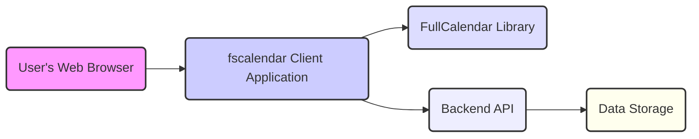
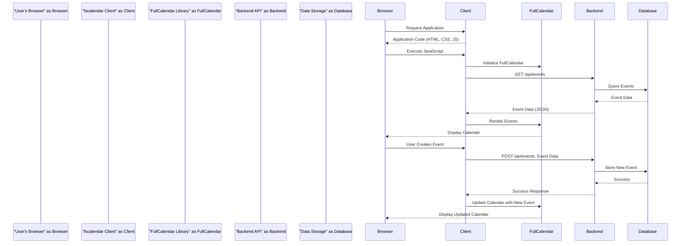

# Project Design Document: fscalendar

**Version:** 1.1
**Date:** October 26, 2023
**Author:** AI Software Architect

## 1. Introduction

This document provides an enhanced design specification for the `fscalendar` project, a client-side web application leveraging the FullCalendar JavaScript library for calendar functionality. This revised design document aims for greater clarity and detail, specifically tailored for effective threat modeling. It outlines the system's architecture, component interactions, and data flow with a stronger emphasis on security considerations.

## 2. Goals

*   Present a refined and more detailed overview of the `fscalendar` application's architecture.
*   Clearly define the roles and interactions of key components.
*   Provide a comprehensive description of data flow within the application, considering potential backend interactions.
*   Sharpen the focus on potential security vulnerabilities to facilitate thorough threat modeling.

## 3. Scope

This design document encompasses the architecture and functionality of the `fscalendar` application as represented in the provided GitHub repository. It primarily focuses on the front-end implementation but explicitly addresses the necessity of a backend for a fully functional calendar application and outlines its assumed functionalities for threat modeling purposes.

## 4. System Overview

The `fscalendar` project is fundamentally a client-side web application that utilizes the FullCalendar JavaScript library to render and manage calendar events within a user's web browser. A crucial understanding for threat modeling is the inherent need for a backend system to provide data persistence, user management, and potentially other features. This design explicitly incorporates a hypothetical backend to provide a complete picture for security analysis.

### 4.1. Key Components

*   **User's Web Browser:** The primary interface for user interaction with the `fscalendar` application.
*   **fscalendar Client Application:** The collection of HTML, CSS, and JavaScript code forming the front-end. This includes:
    *   HTML structures defining the page layout and elements.
    *   CSS stylesheets for visual presentation and styling.
    *   JavaScript logic to handle user interactions, manipulate data, and communicate with the FullCalendar library and the backend API.
*   **FullCalendar Library:** A third-party JavaScript library responsible for rendering the calendar UI and providing core calendar functionalities like event display, navigation, and user interaction handlers.
*   **Backend API:** A server-side application (assumed for full functionality) responsible for:
    *   Persistent storage and retrieval of calendar event data.
    *   User authentication and authorization.
    *   Management of user accounts and preferences.
    *   Potentially other business logic related to calendar events.
*   **Data Storage:** The persistent storage mechanism (e.g., a database) used by the backend API to store calendar event data.

## 5. Detailed Design

### 5.1. Client-Side Architecture

The client-side application follows standard web development practices.

*   **HTML (e.g., `index.html`):**  Provides the structural foundation of the web page, including the container element where the FullCalendar instance is rendered.
*   **CSS (e.g., stylesheets):**  Handles the visual styling of the application, potentially including customizations to the default FullCalendar appearance.
*   **JavaScript (e.g., `scripts.js`):** Implements the core application logic:
    *   Initialization and configuration of the FullCalendar instance with specific settings.
    *   Handling events emitted by FullCalendar (e.g., `dateClick`, `eventClick`).
    *   Implementing the logic to fetch event data from the backend API.
    *   Implementing the logic to create, update, and delete events by communicating with the backend API.
    *   Managing user interface updates based on user interactions and backend responses.

### 5.2. FullCalendar Integration

The `fscalendar` application's core functionality relies on the FullCalendar library.

*   **Initialization:** JavaScript code initializes a FullCalendar instance, configuring options such as:
    *   `initialView`: Sets the default calendar view (e.g., `dayGridMonth`, `timeGridWeek`).
    *   `events`:  Specifies the source of event data, which could be a static array or a function that fetches data from the backend.
    *   `editable`: Determines if users can drag and resize events.
    *   `selectable`: Enables users to select date/time ranges on the calendar.
    *   Event handlers (callbacks) for responding to user interactions like `dateClick`, `eventClick`, `eventDrop`, and `eventResize`.
*   **Event Management:** The application utilizes FullCalendar's API to manage events:
    *   Displaying events retrieved from the designated data source (typically a backend API).
    *   Handling user interactions that trigger event creation, modification, or deletion.
    *   Dynamically updating the calendar display based on user actions and data changes.

### 5.3. Backend Interaction (Assumed)

For a functional calendar application, interaction with a backend API is essential. The client-side application would communicate with the backend via HTTP requests.

*   **Fetching Events:** The client-side JavaScript would make HTTP GET requests to a specific backend API endpoint (e.g., `/api/events`) to retrieve calendar events. The backend would respond with event data, typically in JSON format.
*   **Creating Events:** When a user creates a new event, the client-side would send an HTTP POST request to a backend API endpoint (e.g., `/api/events`) with the event details included in the request body (e.g., as JSON).
*   **Updating Events:** Modifying an existing event would involve sending an HTTP PUT or PATCH request to a backend API endpoint (e.g., `/api/events/{eventId}`) with the updated event data in the request body.
*   **Deleting Events:** Deleting an event would involve sending an HTTP DELETE request to a backend API endpoint (e.g., `/api/events/{eventId}`), identifying the event to be removed.
*   **Authentication and Authorization:** The backend API would be responsible for verifying user identities and ensuring they have the necessary permissions to access and modify calendar data. This might involve mechanisms like session cookies, JWTs, or other authentication protocols.

### 5.4. Data Flow

The typical data flow within the application follows these patterns:

1. **Initial Application Load and Event Retrieval:**
    *   The user's web browser requests the `fscalendar` application files (HTML, CSS, JavaScript).
    *   The web server responds with the application code.
    *   The browser renders the HTML and executes the JavaScript.
    *   The JavaScript initializes the FullCalendar instance.
    *   The client-side application makes an asynchronous HTTP GET request to the backend API (e.g., `/api/events`).
    *   The backend API queries the data storage for calendar events.
    *   The data storage returns the event data to the backend API.
    *   The backend API sends the event data (e.g., as JSON) back to the client-side application.
    *   The client-side application uses the received data to populate the FullCalendar instance.
    *   FullCalendar renders the calendar with the fetched events.

2. **User Creates a New Event:**
    *   The user interacts with the calendar UI (e.g., clicks on a time slot or uses a "create event" button).
    *   The client-side JavaScript captures the user's input for the new event.
    *   The client-side application makes an asynchronous HTTP POST request to the backend API (e.g., `/api/events`) with the event data in the request body.
    *   The backend API receives the request, validates the data, and stores the new event in the data storage.
    *   The data storage confirms successful storage to the backend API.
    *   The backend API sends a success response back to the client-side application.
    *   The client-side application updates the FullCalendar instance to display the newly created event, potentially without a full page reload.

## 6. Security Considerations (For Threat Modeling)

This section outlines potential security vulnerabilities and considerations that are crucial for threat modeling.

*   **Client-Side Security Risks:**
    *   **Cross-Site Scripting (XSS):** If the application renders user-provided data (e.g., event titles, descriptions) without proper sanitization, malicious scripts could be injected and executed in other users' browsers. This includes both reflected and stored XSS.
    *   **DOM-based XSS:** Vulnerabilities arising from client-side JavaScript manipulating the DOM based on attacker-controlled input.
    *   **Insecure Third-Party Dependencies:** Vulnerabilities within the FullCalendar library or other client-side libraries could be exploited. Regular updates and security audits of dependencies are essential.
    *   **Sensitive Data Exposure:**  Accidental exposure of sensitive information within client-side code or browser storage.

*   **Backend Security Risks (Assumed):**
    *   **Authentication and Authorization Failures:** Weak or missing authentication mechanisms could allow unauthorized users to access the application. Insufficient authorization could allow users to perform actions they shouldn't.
    *   **SQL Injection:** If the backend uses a relational database and user input is not properly sanitized before being used in SQL queries, attackers could manipulate the database.
    *   **API Security Vulnerabilities:** Lack of proper input validation on API endpoints, insufficient rate limiting, and insecure API design can lead to various attacks.
    *   **Insecure Data Storage:**  Data at rest should be encrypted, and access to the database should be strictly controlled.
    *   **Cross-Site Request Forgery (CSRF):** If the backend doesn't properly verify the origin of requests, attackers could trick users into performing unintended actions.

*   **Communication Security Risks:**
    *   **Man-in-the-Middle (MITM) Attacks:** If communication between the client and the backend is not encrypted using HTTPS, attackers could intercept and potentially modify data in transit.

*   **General Security Best Practices:**
    *   **Input Validation:** Implement robust input validation on both the client-side and the backend to prevent injection attacks and ensure data integrity.
    *   **Output Encoding:** Properly encode data before rendering it in the browser to prevent XSS vulnerabilities.
    *   **Principle of Least Privilege:** Grant users and components only the necessary permissions to perform their tasks.
    *   **Regular Security Audits and Penetration Testing:** Conduct regular security assessments to identify and address potential vulnerabilities.

## 7. Assumptions and Dependencies

*   The application is designed to run on modern web browsers with JavaScript enabled.
*   The FullCalendar library is correctly included and configured within the project.
*   A secure and functional backend API exists for data persistence, user management, and authentication (even if not explicitly detailed in the provided code).
*   Communication between the client and the backend API is assumed to be secured using HTTPS.

## 8. Future Considerations

*   **Implementation of User Authentication and Authorization:**  Adding a secure system for user login, registration, and role-based access control.
*   **Development of the Backend API:**  Building the server-side application responsible for data management and business logic.
*   **Real-time Event Updates:**  Implementing features for real-time synchronization of calendar events across multiple users or devices.
*   **Internationalization (i18n) and Localization (l10n):**  Supporting multiple languages and regional date/time formats.
*   **Accessibility (A11y):**  Ensuring the application is usable by people with disabilities, adhering to accessibility guidelines.