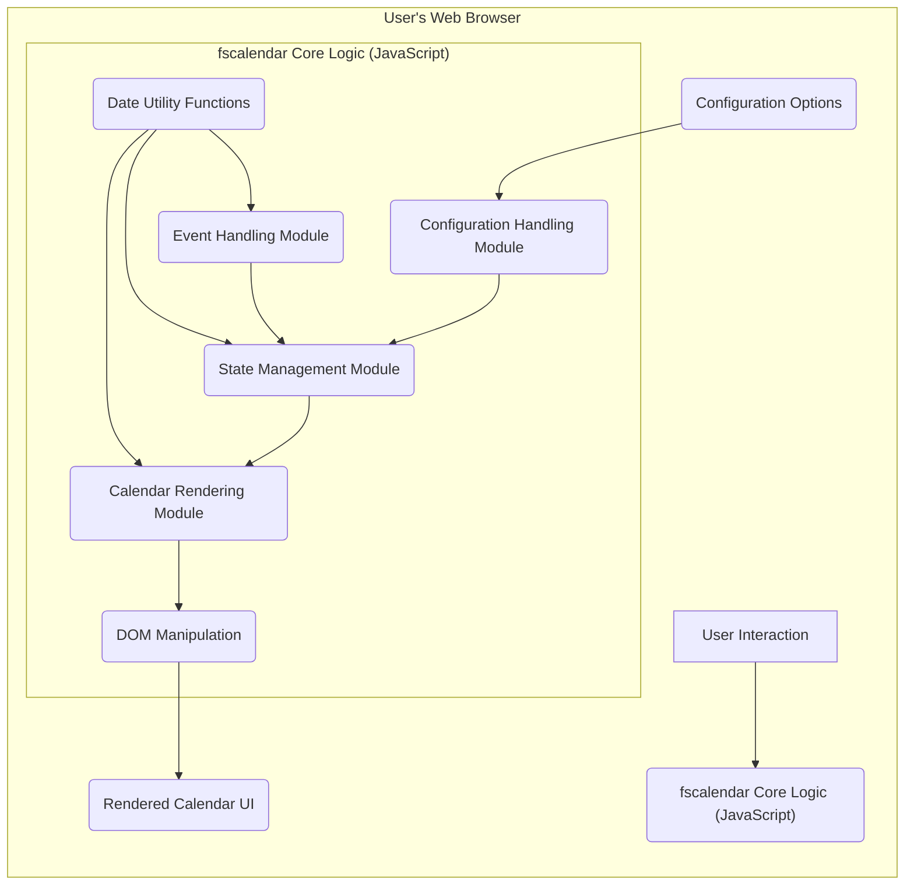
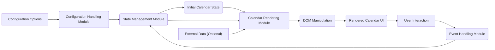

# Project Design Document: fscalendar

**Version:** 1.1
**Date:** October 26, 2023
**Author:** Gemini (AI Language Model)
**Project:** fscalendar - Full Screen Calendar Component

## 1. Introduction

This document provides an enhanced and more detailed design overview of the `fscalendar` project, a JavaScript-based full-screen calendar component available on GitHub at [https://github.com/wenchaod/fscalendar](https://github.com/wenchaod/fscalendar). This revised document aims to provide a clearer and more comprehensive articulation of the component's architecture, functionality, and data flow to facilitate a more effective and granular threat modeling process. It further elaborates on the key components, their interactions, and the overall system design.

## 2. Project Overview

The `fscalendar` project is a front-end JavaScript component designed to render an immersive, full-screen calendar interface within a web browser. Based on the repository structure and common front-end development practices, it likely utilizes standard web technologies such as HTML, CSS, and JavaScript, potentially leveraging a framework or library like React or a similar component-based approach. The component's primary purpose is to offer a visually engaging and interactive method for users to view and potentially interact with calendar-related information. It is designed as a self-contained unit, suggesting it's intended for integration into various web applications.

## 3. System Architecture

The `fscalendar` component operates exclusively within the client-side environment of a web browser. No server-side components appear to be involved based on the provided GitHub repository.

Key architectural elements include:

*   **User's Web Browser:** The runtime environment where the `fscalendar` component executes. This environment provides:
    *   A rendering engine for interpreting HTML and CSS.
    *   A JavaScript engine for executing the component's logic.
    *   The Document Object Model (DOM) for manipulating the web page structure.
*   **fscalendar Core Logic (JavaScript):** This encompasses the set of JavaScript modules and functions responsible for the component's behavior. This can be further broken down into:
    *   **Calendar Rendering Module:**  Responsible for generating the visual structure of the calendar (days, weeks, months, headers, navigation elements).
    *   **State Management Module:** Manages the internal state of the calendar, such as the currently displayed month, selected dates, and potentially any loaded data.
    *   **Event Handling Module:**  Handles user interactions like clicks on navigation buttons, date selections, and potentially other interactive elements.
    *   **Configuration Handling Module:** Processes and applies the configuration options provided to the component.
    *   **Date Utility Functions:**  Functions for date calculations, formatting, and manipulation.
*   **HTML Structure (Dynamic):** The HTML elements that are dynamically created and manipulated by the JavaScript code to represent the calendar interface. This includes:
    *   Container elements for the overall calendar.
    *   Elements for displaying month and year headers.
    *   Grids or tables (though not in this document's format) to represent days and weeks.
    *   Interactive elements like navigation buttons.
*   **CSS Styling (External and Inline):** CSS rules that define the visual presentation of the calendar. This includes:
    *   External CSS files for consistent styling.
    *   Potentially inline styles applied dynamically by JavaScript.
*   **Configuration Options (Input):**  JavaScript objects or attributes passed to the component to customize its behavior and appearance. Examples include:
    *   `initialDate`: The date the calendar should initially display.
    *   `locale`: Settings for language and date formatting.
    *   `theme`: Options for visual styling.
    *   `data`:  Potentially an array of events or data points to display on the calendar.
    *   `callbacks`: Functions to be executed on specific user interactions (e.g., date selection).
*   **DOM (Document Object Model):** The interface through which the `fscalendar` component interacts with the web page to render and update the calendar's visual representation.

## 4. Data Flow

The data flow within the `fscalendar` component is initiated by the provision of configuration options and subsequently driven by user interactions.

1. **Initialization Phase:**
    *   The embedding web application provides configuration options (e.g., `initialDate`, `locale`, `data`) to the `fscalendar` component, typically during its instantiation.
    *   The **Configuration Handling Module** within the JavaScript logic processes these options, validating and storing them in the component's internal state.
    *   The **State Management Module** initializes the calendar's internal state based on the processed configuration (e.g., setting the initial month and year).
2. **Initial Rendering:**
    *   The **Calendar Rendering Module** utilizes the current state information to dynamically generate the initial HTML structure representing the calendar for the determined month and year.
    *   CSS styles are applied to these HTML elements to define their visual appearance.
    *   The **DOM Manipulation** logic updates the browser's DOM with the generated HTML, making the calendar visible to the user.
3. **User Interaction and Event Handling:**
    *   The user interacts with the rendered calendar UI (e.g., clicking navigation arrows to change months, selecting a specific date).
    *   These interactions trigger corresponding browser events (e.g., `click` events).
    *   The **Event Handling Module** listens for these events and executes the appropriate handlers.
4. **State Update:**
    *   Event handlers update the internal state of the calendar via the **State Management Module**. For example, clicking the "next month" button updates the currently displayed month in the state.
5. **Re-rendering (Conditional):**
    *   Based on the updated state, the **Calendar Rendering Module** regenerates the relevant parts of the calendar UI.
    *   The **DOM Manipulation** logic updates the DOM to reflect the changes, such as displaying the next month's dates.
6. **Data Input and Display (Optional):**
    *   If the component is configured to display external data (e.g., events), this data is either provided during initialization or potentially updated through external methods.
    *   The **Calendar Rendering Module** integrates this data into the calendar display, for example, by highlighting days with events or displaying event details.

## 5. Security Considerations (For Threat Modeling)

Given its nature as a client-side component, `fscalendar`'s security considerations primarily focus on potential vulnerabilities within its code and how it handles external input and interacts with the browser environment.

*   **Cross-Site Scripting (XSS) Vulnerabilities:**
    *   **Scenario:** If the component renders user-provided data (e.g., event titles, custom labels from the `data` configuration) without proper sanitization, malicious scripts could be injected.
    *   **Impact:** Execution of arbitrary JavaScript code within the user's browser, potentially leading to session hijacking, data theft, or defacement.
    *   **Example:**  A malicious event title like `` could trigger an alert.
*   **DOM-based XSS:**
    *   **Scenario:** Vulnerabilities arise if the JavaScript code manipulates the DOM in an unsafe manner based on user input or configuration options.
    *   **Impact:** Similar to reflected XSS, leading to the execution of malicious scripts.
    *   **Example:** If a configuration option directly sets the `innerHTML` of an element based on user input without sanitization.
*   **Configuration Injection Attacks:**
    *   **Scenario:** If configuration options are not strictly validated, malicious input could lead to unexpected behavior or potentially compromise the component's logic.
    *   **Impact:** Could lead to the component behaving in unintended ways, potentially exposing sensitive information or creating vulnerabilities.
    *   **Example:** Providing a malicious callback function that performs unintended actions.
*   **Dependency Vulnerabilities:**
    *   **Scenario:** If `fscalendar` relies on external JavaScript libraries (e.g., for date manipulation), vulnerabilities in those libraries could be exploited.
    *   **Impact:**  The component could inherit vulnerabilities from its dependencies, potentially allowing attackers to exploit known flaws.
    *   **Mitigation:** Regular updates and security audits of dependencies are crucial.
*   **Client-Side Data Handling Risks:**
    *   **Scenario:** If the component stores or processes sensitive data client-side (e.g., user-specific event details), improper handling could lead to exposure.
    *   **Impact:** Sensitive data could be accessible through browser developer tools or other client-side means.
    *   **Note:** Based on the basic structure, this seems less likely, but should be considered if future features involve more complex data handling.
*   **Code Injection (Less Probable but Possible):**
    *   **Scenario:** Although less likely in a purely front-end component, vulnerabilities in the build process or how the component is integrated into a larger application could theoretically lead to code injection.
    *   **Impact:**  Malicious code could be injected into the component's codebase.
*   **Client-Side Denial of Service (DoS):**
    *   **Scenario:** Maliciously crafted input or interactions could cause the component to consume excessive browser resources, leading to performance issues or a crash.
    *   **Impact:**  The calendar could become unresponsive, impacting the user experience.
    *   **Example:** Providing an extremely large dataset for the calendar to render.
*   **Insecure Handling of Callbacks:**
    *   **Scenario:** If the component allows users to provide callback functions for events (e.g., `onDateClick`), and these callbacks are not handled securely, malicious callbacks could be injected.
    *   **Impact:**  Arbitrary code execution within the context of the web page.

## 6. Assumptions and Constraints

*   **Target Environment:** The component is designed to function correctly in modern web browsers that adhere to web standards and support necessary JavaScript features and DOM APIs.
*   **No Direct Server Interaction:** The core functionality of `fscalendar` is assumed to be entirely client-side, without direct communication with a backend server for its primary operations. Data fetching, if required, would likely be handled by the embedding application.
*   **Integration via Standard Web Technologies:** The component is intended to be integrated into web applications by including its JavaScript and CSS files, and potentially through a module bundler.
*   **Primary Focus on UI Presentation:** The main responsibility of the component is to provide a user interface for displaying calendar information. Data management and persistence are likely handled by the integrating application.

## 7. Future Considerations

*   **Enhanced Data Integration Capabilities:**  Future development could involve adding more sophisticated mechanisms for integrating with external data sources, such as:
    *   Support for fetching event data from APIs.
    *   Options for different data formats and structures.
    *   Real-time data updates.
*   **Advanced Customization Options:** Expanding the available configuration options could increase the component's versatility, including:
    *   More granular control over styling and appearance.
    *   Options for different calendar views (e.g., agenda view).
    *   Customizable event rendering.
*   **Improved Accessibility Features:**  Future iterations should prioritize adherence to accessibility standards (WCAG) to ensure usability for individuals with disabilities, including:
    *   Keyboard navigation improvements.
    *   Screen reader compatibility.
    *   Semantic HTML structure.
*   **Performance Optimizations:** As the component's features and complexity grow, performance optimization will be crucial, especially when handling large datasets or complex rendering logic:
    *   Techniques like virtual DOM or efficient DOM updates.
    *   Code splitting and lazy loading.
*   **Theming and Styling Enhancements:** Providing more robust theming capabilities, potentially through CSS variables or a dedicated theming API, would allow for easier customization.
*   **Internationalization (i18n) and Localization (l10n):**  Expanding support for different languages and regional date/time formats would broaden the component's applicability.

This enhanced design document provides a more detailed and nuanced understanding of the `fscalendar` project's architecture, data flow, and potential security considerations. This information will be invaluable for conducting a more thorough and effective threat model, enabling the identification of a wider range of potential vulnerabilities and the implementation of more targeted mitigation strategies.