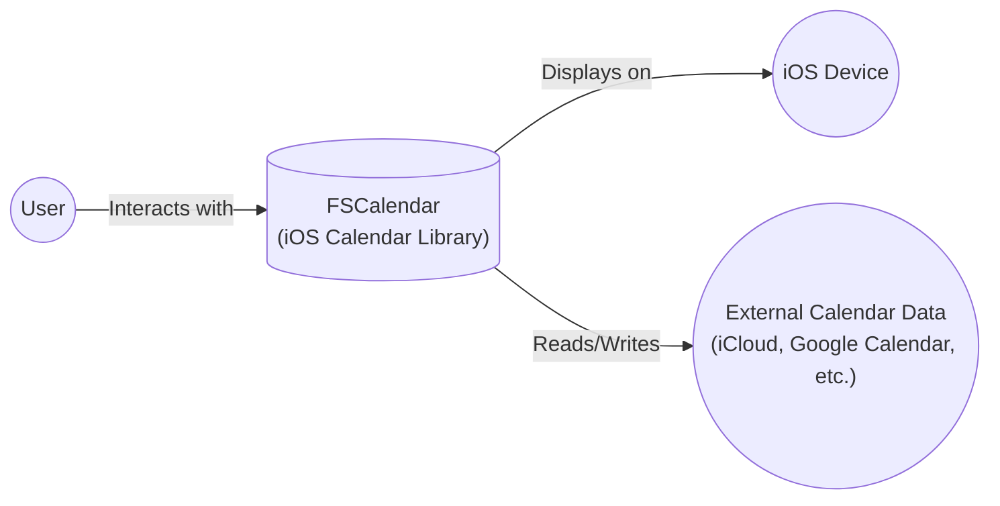
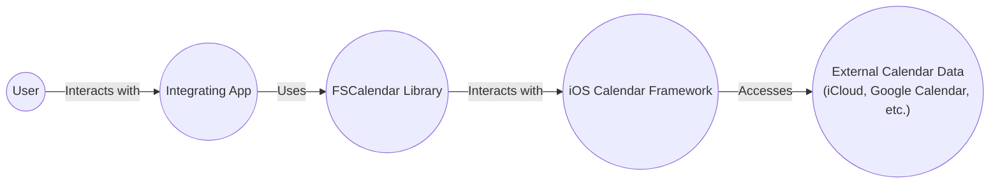
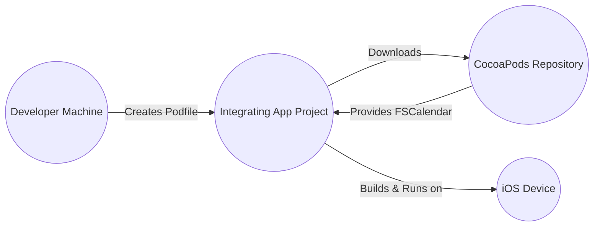
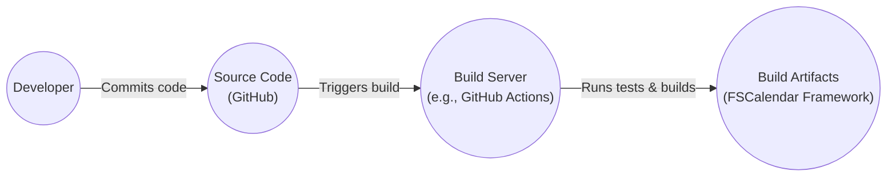

Okay, let's create a design document for the FSCalendar project.

# BUSINESS POSTURE

Business Priorities and Goals:

*   Provide a highly customizable, full-featured calendar library for iOS applications.
*   Offer a drop-in solution for developers to easily integrate calendar functionality.
*   Maintain a well-documented and easy-to-use API.
*   Support a wide range of iOS versions and device sizes.
*   Ensure high performance and responsiveness.
*   Foster an active open-source community for contributions and support.

Most Important Business Risks:

*   Data privacy violations if user calendar data is mishandled.
*   Application instability or crashes due to bugs in the library.
*   Negative user reviews and reputation damage due to poor usability or performance.
*   Security vulnerabilities that could be exploited by malicious actors.
*   Lack of adoption due to insufficient features or poor documentation.
*   Inability to keep up with new iOS releases and features.

# SECURITY POSTURE

Existing Security Controls:

*   security control: The project is open-source, allowing for community review and contributions to identify and fix potential security issues. (Described in the project's README and contribution guidelines).
*   security control: The library primarily deals with displaying calendar data and handling user interactions, minimizing the risk of sensitive data handling. (Implicit in the library's functionality).
*   security control: Standard iOS development practices and platform-provided security features are utilized. (Implicit in the use of Xcode and iOS SDK).

Accepted Risks:

*   accepted risk: The library relies on the security of the underlying iOS platform and its calendar data storage mechanisms.
*   accepted risk: The library may be vulnerable to common iOS application vulnerabilities if not used correctly by the integrating application.
*   accepted risk: The library's customization options could potentially introduce security risks if misused by developers.

Recommended Security Controls:

*   security control: Implement a comprehensive suite of unit and UI tests to ensure code quality and prevent regressions.
*   security control: Conduct regular security audits and code reviews to identify potential vulnerabilities.
*   security control: Provide clear documentation and guidelines on secure usage of the library, including best practices for handling user data.
*   security control: Establish a process for handling security vulnerability reports and releasing timely updates.
*   security control: Consider integrating static analysis tools into the build process to detect potential security issues early.

Security Requirements:

*   Authentication:
    *   The library itself does not handle user authentication. Authentication is the responsibility of the integrating application.
*   Authorization:
    *   The library does not implement specific authorization mechanisms. Access control to calendar data is managed by the iOS platform and the integrating application.
*   Input Validation:
    *   The library should validate user input to prevent unexpected behavior or crashes. This includes date ranges, event data, and configuration parameters.
*   Cryptography:
    *   The library does not directly handle cryptographic operations. Any encryption of calendar data is managed by the iOS platform and the integrating application.

# DESIGN

## C4 CONTEXT

Element Descriptions:

*   Element:
    *   Name: User
    *   Type: Person
    *   Description: The end-user interacting with the calendar.
    *   Responsibilities: View calendar, navigate dates, create/edit/delete events (if permitted by the integrating application).
    *   Security controls: None (handled by the integrating application).

*   Element:
    *   Name: FSCalendar
    *   Type: Software System
    *   Description: The iOS calendar library.
    *   Responsibilities: Display calendar views, handle user interactions, manage calendar data.
    *   Security controls: Input validation, reliance on iOS platform security.

*   Element:
    *   Name: iOS Device
    *   Type: Device
    *   Description: The physical iOS device running the application.
    *   Responsibilities: Provide the operating environment, display the UI, handle user input.
    *   Security controls: iOS platform security features.

*   Element:
    *   Name: External Calendar Data
    *   Type: External System
    *   Description: External calendar data sources, such as iCloud, Google Calendar, etc.
    *   Responsibilities: Store and manage calendar data.
    *   Security controls: Managed by the respective service providers.

## C4 CONTAINER

Element Descriptions:

*   Element:
    *   Name: User
    *   Type: Person
    *   Description: The end-user interacting with the calendar.
    *   Responsibilities: View calendar, navigate dates, create/edit/delete events (if permitted by the integrating application).
    *   Security controls: None (handled by the integrating application).

*   Element:
    *   Name: Integrating App
    *   Type: Application
    *   Description: The iOS application that integrates the FSCalendar library.
    *   Responsibilities: Handle user authentication, manage application-specific data, integrate FSCalendar for calendar functionality.
    *   Security controls: Authentication, authorization, data validation, secure communication.

*   Element:
    *   Name: FSCalendar Library
    *   Type: Library
    *   Description: The FSCalendar library code.
    *   Responsibilities: Provide calendar UI components, handle user interactions, manage calendar data display.
    *   Security controls: Input validation.

*   Element:
    *   Name: iOS Calendar Framework
    *   Type: Framework
    *   Description: The underlying iOS framework for accessing calendar data.
    *   Responsibilities: Provide APIs for interacting with the system calendar database.
    *   Security controls: iOS platform security features, access control to calendar data.

*   Element:
    *   Name: External Calendar Data
    *   Type: External System
    *   Description: External calendar data sources, such as iCloud, Google Calendar, etc.
    *   Responsibilities: Store and manage calendar data.
    *   Security controls: Managed by the respective service providers.

## DEPLOYMENT

Possible Deployment Solutions:

1.  CocoaPods: Dependency manager for Swift and Objective-C Cocoa projects.
2.  Carthage: Decentralized dependency manager for Cocoa.
3.  Swift Package Manager: Apple's built-in package manager.
4.  Manual Integration: Directly adding the library's source files to the project.

Chosen Solution: CocoaPods (most common and convenient)

Element Descriptions:

*   Element:
    *   Name: Developer Machine
    *   Type: Device
    *   Description: The developer's computer used for development.
    *   Responsibilities: Write code, manage dependencies, build the application.
    *   Security controls: Standard development environment security practices.

*   Element:
    *   Name: CocoaPods Repository
    *   Type: Repository
    *   Description: The central repository for CocoaPods packages.
    *   Responsibilities: Store and distribute CocoaPods packages.
    *   Security controls: Repository security measures (e.g., access control, integrity checks).

*   Element:
    *   Name: Integrating App Project
    *   Type: Project
    *   Description: The Xcode project of the integrating application.
    *   Responsibilities: Contain the application code, dependencies, and build settings.
    *   Security controls: Project-level security settings, code signing.

*   Element:
    *   Name: iOS Device
    *   Type: Device
    *   Description: The physical iOS device running the application.
    *   Responsibilities: Provide the operating environment, display the UI, handle user input.
    *   Security controls: iOS platform security features.

## BUILD

Build Process Description:

1.  Developer commits code changes to the GitHub repository.
2.  A build server (e.g., GitHub Actions, Travis CI, CircleCI) is triggered by the commit.
3.  The build server checks out the source code.
4.  The build server runs unit and UI tests.
5.  Static analysis tools (e.g., linters, SAST scanners) are executed to identify potential code quality and security issues.
6.  If all tests and checks pass, the build server builds the FSCalendar framework.
7.  The build artifacts (the framework) are created and stored.
8.  The artifacts can then be distributed via CocoaPods, Carthage, Swift Package Manager, or manual integration.

Security Controls:

*   security control: Automated build process ensures consistency and repeatability.
*   security control: Unit and UI tests verify code correctness and prevent regressions.
*   security control: Static analysis tools (SAST, linters) identify potential vulnerabilities and code quality issues.
*   security control: Dependency management tools (CocoaPods, Carthage, SPM) ensure that the correct versions of dependencies are used.
*   security control: Code signing (if applicable) ensures the integrity and authenticity of the built framework.

# RISK ASSESSMENT

Critical Business Processes:

*   Displaying calendar data accurately and efficiently.
*   Handling user interactions with the calendar smoothly.
*   Providing a customizable and easy-to-use API for developers.

Data Protection:

*   Data: Calendar event data (titles, descriptions, locations, times, attendees).
*   Sensitivity: Potentially sensitive, depending on the user's calendar content.  While FSCalendar itself doesn't store this data persistently, it *does* handle it in memory.  The integrating application is responsible for the long-term storage and security of this data, but FSCalendar must handle it responsibly while it's in use.

# QUESTIONS & ASSUMPTIONS

Questions:

*   Are there any specific compliance requirements (e.g., GDPR, HIPAA) that the integrating application must adhere to? This will influence recommendations for data handling.
*   What is the expected level of user interaction with calendar data (view-only, create/edit/delete)?
*   Are there any specific performance requirements or limitations?
*   What is the target audience for the integrating application (e.g., general public, enterprise users)?
*   What level of support is provided for older iOS versions?

Assumptions:

*   BUSINESS POSTURE: The primary goal is to provide a functional and user-friendly calendar component, with security being a secondary but important consideration.
*   SECURITY POSTURE: The integrating application is responsible for handling user authentication and authorization, as well as the secure storage of calendar data. FSCalendar relies on the security of the iOS platform and the integrating application.
*   DESIGN: The library is primarily used for displaying calendar data and handling user interactions, and does not directly interact with external calendar services. The integrating application handles synchronization with external services.