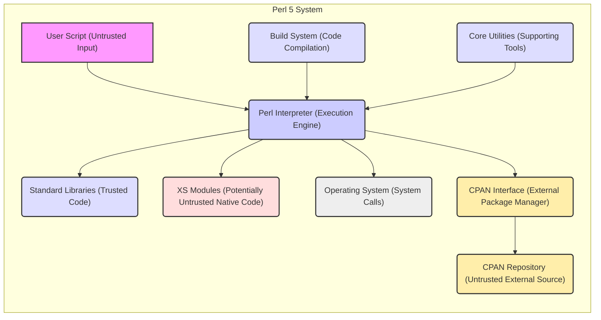
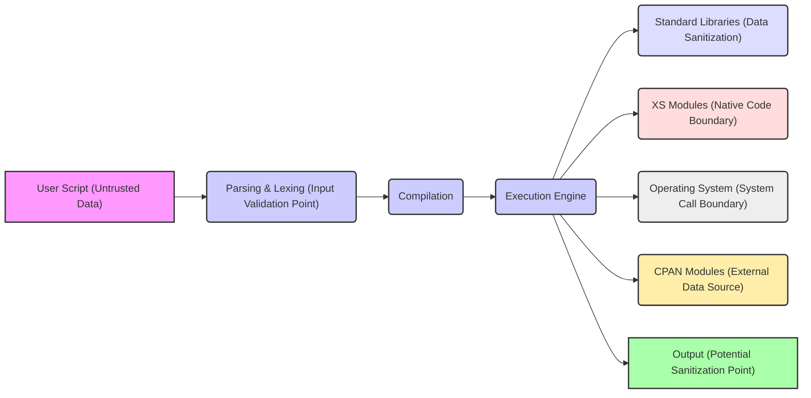

## Project Design Document: Perl 5 (Improved for Threat Modeling)

**Project Repository:** https://github.com/Perl/perl5

**Document Version:** 2.0
**Date:** October 26, 2023
**Author:** AI Software Architect

### 1. Introduction

This document provides an enhanced architectural design of the Perl 5 project, specifically tailored for threat modeling. It aims to provide a clear and detailed understanding of the system's components, their interactions, and data flow, with a strong focus on identifying potential security vulnerabilities and attack surfaces. This document will serve as the foundation for subsequent threat modeling activities, enabling a systematic approach to security analysis.

### 2. Project Overview

Perl 5 is a mature, high-level, general-purpose, interpreted, dynamic programming language. Its versatility makes it suitable for various tasks, from system administration and web development to network programming and bioinformatics. The `perl5` repository houses the core interpreter, standard libraries, and build tools. Understanding its architecture is crucial for identifying potential weaknesses that could be exploited.

### 3. System Architecture (Focus on Security Boundaries)

The Perl 5 system comprises several interconnected components, each with its own security considerations:

*   **Perl Interpreter (The Core):** This is the central component responsible for executing Perl code. Its security is paramount as any vulnerability here can have widespread impact.
*   **Standard Libraries (Trusted Code):** These modules are bundled with Perl and are generally considered trusted. However, vulnerabilities within them can still pose a risk.
*   **CPAN Interface (External Code Acquisition):** This interface allows interaction with the vast CPAN repository, introducing a significant external dependency and potential supply chain risks.
*   **XS Interface (Native Code Integration):** This mechanism allows the inclusion of C/C++ code, which can introduce vulnerabilities if not carefully implemented.
*   **Build System (Code Compilation and Packaging):** The integrity of the build system is critical to ensure the distributed binaries are not compromised.
*   **Core Utilities (Supporting Tools):** These utilities, built on Perl, can also be targets for attacks if they process untrusted input.

### 4. Data Flow (Identifying Trust Boundaries and Data Transformation)

Understanding how data flows through the system is crucial for identifying points where vulnerabilities might be introduced or exploited:

1. **Untrusted Script Input:** User-provided Perl scripts are the primary input and should be treated as untrusted.
2. **Parsing and Lexing:** The interpreter analyzes the script's syntax. Vulnerabilities here could allow malicious code to bypass checks.
3. **Compilation to Intermediate Representation:** The parsed script is converted into an internal format. Errors in this stage could lead to unexpected behavior.
4. **Execution and System Interaction:** The interpreter executes the compiled code, interacting with the OS, standard libraries, and potentially external modules. This is where many vulnerabilities manifest.
5. **Standard Library Calls:** Data passed to standard library functions needs to be validated to prevent issues like path traversal or injection attacks.
6. **XS Module Execution:** Data passed to and from XS modules needs careful handling to avoid memory corruption or other native code vulnerabilities.
7. **CPAN Module Installation and Usage:** Data received from CPAN should be treated with caution, as these are external, potentially untrusted sources.
8. **Output Generation:** Output generated by the script might need sanitization to prevent cross-site scripting (XSS) or other output-related vulnerabilities.

### 5. Key Components in Detail (Security Implications)

*   **Perl Interpreter (`perl` executable):**
    *   **Security Focus:**  The primary target for security audits. Vulnerabilities here can lead to arbitrary code execution with the privileges of the interpreter process.
    *   **Threats:** Buffer overflows, integer overflows, use-after-free vulnerabilities in the parsing, compilation, or execution logic.
    *   **Mitigation Strategies:** Rigorous code review, fuzzing, static analysis, address space layout randomization (ASLR), and data execution prevention (DEP).

*   **Standard Libraries (e.g., `IO::`, `File::`, `Socket::`):**
    *   **Security Focus:** While generally trusted, vulnerabilities can exist. Improper use of these modules in user scripts can also introduce risks.
    *   **Threats:** Path traversal vulnerabilities in file handling modules, injection vulnerabilities in database or network modules, denial-of-service vulnerabilities.
    *   **Mitigation Strategies:** Regular security audits of standard libraries, secure coding guidelines for developers using these libraries.

*   **CPAN Interface (`cpan` command-line tool, `CPAN` module):**
    *   **Security Focus:**  A significant supply chain risk. Modules on CPAN are contributed by various individuals and may contain vulnerabilities or malicious code.
    *   **Threats:** Installation of backdoored or vulnerable modules, dependency confusion attacks.
    *   **Mitigation Strategies:** Using trusted CPAN mirrors, verifying module signatures, employing dependency scanning tools, and practicing the principle of least privilege when running `cpan`.

*   **XS Interface:**
    *   **Security Focus:** Introduces the complexities and potential vulnerabilities of native code (C/C++). Memory management errors are common.
    *   **Threats:** Buffer overflows, dangling pointers, format string vulnerabilities, and other memory corruption issues in XS modules.
    *   **Mitigation Strategies:** Secure coding practices for XS module development, thorough testing and code review, and using memory-safe languages where possible.

*   **Build System (Makefiles, Configure scripts):**
    *   **Security Focus:**  Compromise of the build system can lead to the distribution of malicious binaries.
    *   **Threats:** Malicious modifications to build scripts to inject backdoors or vulnerabilities.
    *   **Mitigation Strategies:** Securing the build environment, verifying the integrity of build tools and dependencies, and using reproducible builds.

*   **Core Utilities (e.g., `perldoc`, `perlbug`):**
    *   **Security Focus:** These utilities, while often overlooked, can be vulnerable if they process untrusted input (e.g., command-line arguments, configuration files).
    *   **Threats:** Command injection vulnerabilities, path traversal vulnerabilities.
    *   **Mitigation Strategies:** Input validation and sanitization in core utilities.

### 6. External Dependencies (Security Risks)

The security posture of Perl 5 is also influenced by its external dependencies:

*   **Operating System:** The underlying OS provides the execution environment. OS vulnerabilities can be exploited by Perl scripts.
    *   **Risks:** Kernel vulnerabilities, insecure system configurations.
*   **C Library:**  Vulnerabilities in the system's C library can directly impact the Perl interpreter.
    *   **Risks:** Buffer overflows, format string vulnerabilities in `libc` functions.
*   **Build Tools (Compiler, Make):** Compromised build tools can lead to compromised Perl binaries.
    *   **Risks:** Backdoored compilers injecting malicious code.
*   **CPAN Repository Infrastructure:**  Security breaches of CPAN mirrors could lead to the distribution of malicious modules.
    *   **Risks:** Man-in-the-middle attacks, compromised package repositories.
*   **External Libraries (for XS modules):** Vulnerabilities in these libraries can be exploited through the XS interface.
    *   **Risks:** Any vulnerability present in the linked C/C++ libraries.

### 7. Security Considerations (Detailed Threat Landscape)

This section outlines potential security threats based on the architecture and data flow:

*   **Interpreter Vulnerabilities:**
    *   **Buffer Overflows:** In parsing, compilation, or execution stages.
    *   **Integer Overflows:** Leading to unexpected behavior or memory corruption.
    *   **Use-After-Free:** Exploiting dangling pointers for arbitrary code execution.
    *   **Format String Vulnerabilities:** If format strings are not handled correctly.
*   **Input Validation Failures:**
    *   **Command Injection:** Executing arbitrary system commands via user input.
    *   **SQL Injection:** Manipulating database queries through unsanitized input.
    *   **Path Traversal:** Accessing unauthorized files or directories.
    *   **Cross-Site Scripting (XSS):** If Perl is used for web development and output is not properly sanitized.
*   **Supply Chain Attacks (CPAN):**
    *   **Malicious Modules:** Intentionally designed to harm systems.
    *   **Vulnerable Modules:** Containing exploitable bugs.
    *   **Dependency Confusion:** Installing malicious packages from unintended sources.
*   **XS Module Vulnerabilities:**
    *   **Memory Corruption:** Buffer overflows, use-after-free, double-free.
    *   **Information Disclosure:** Leaking sensitive data through native code.
*   **Denial of Service (DoS):**
    *   **Regular Expression DoS (ReDoS):** Crafting regexes that consume excessive resources.
    *   **Resource Exhaustion:** Exploiting interpreter behavior to consume excessive memory or CPU.
*   **Build System Compromise:**
    *   **Backdoored Binaries:** Distributing Perl interpreters with malicious code.
*   **Privilege Escalation:**
    *   Exploiting vulnerabilities to gain higher privileges on the system.
*   **Side-Channel Attacks:**
    *   Exploiting timing differences or other observable behavior to infer sensitive information (less common in a high-level language like Perl but possible in XS modules).

### 8. Future Considerations

This design document provides a solid foundation for threat modeling. Future enhancements could include:

*   **More Granular Component Diagrams:**  Detailed diagrams of the interpreter's internal stages (parsing, compilation, execution).
*   **Detailed Data Flow Diagrams for Specific Use Cases:**  Illustrating data flow for common Perl applications (e.g., web applications, scripting).
*   **Integration with Threat Modeling Frameworks:** Mapping components and data flows to frameworks like STRIDE or PASTA.
*   **Identification of Security Controls:**  Documenting existing security mechanisms within the Perl interpreter and ecosystem.

This improved design document provides a more comprehensive and security-focused view of the Perl 5 project, making it a more effective tool for identifying and mitigating potential security threats.
