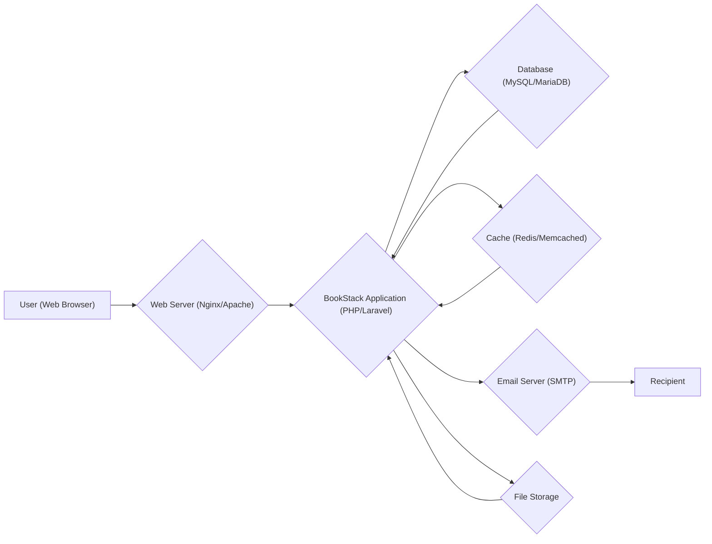
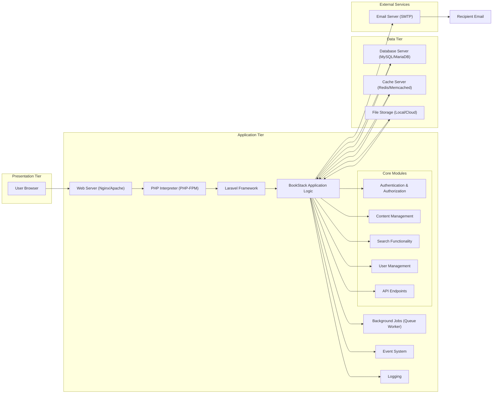
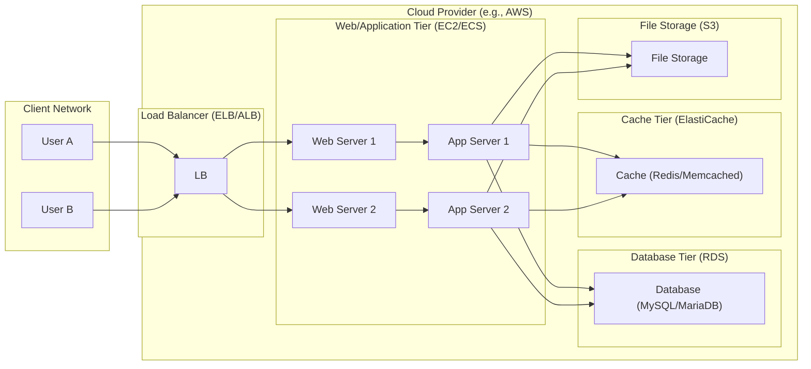

# Project Design Document: BookStack

**Version:** 1.1
**Date:** October 26, 2023
**Author:** AI Software Architect

## 1. Introduction

This document provides an enhanced design overview of the BookStack application, an open-source platform for organizing and sharing knowledge, as found on its GitHub repository: [https://github.com/BookStackApp/BookStack](https://github.com/BookStackApp/BookStack). This revised document aims to provide a more detailed and refined understanding of the system's architecture, components, and data flow, further strengthening the foundation for subsequent threat modeling activities.

## 2. Goals and Objectives

The primary goals of this design document are:

*   To clearly and concisely articulate the architecture and components of the BookStack application with improved detail.
*   To detail the interactions and data flow within the system, providing more specific examples.
*   To identify key areas and components relevant for security considerations and threat modeling, expanding on potential vulnerabilities.
*   To provide a structured and understandable representation of the system for a wider range of stakeholders, including technical and non-technical audiences.

## 3. System Architecture

BookStack adheres to a standard three-tier web application architecture, separating concerns for better maintainability and scalability:

*   **Presentation Tier (Client-Side):**  The user interface rendered and interacted with through web browsers, handling user input and displaying information.
*   **Application Tier (Server-Side):**  The core logic and processing engine of the application, responsible for handling requests, business logic, and data manipulation.
*   **Data Tier (Database & Storage):**  The persistent storage layer for application data, including structured data in the database and unstructured data in file storage.

### 3.1. High-Level Architecture Diagram

### 3.2. Detailed Architecture Diagram

## 4. Data Flow

The following outlines the typical data flow for common user interactions, providing more specific details:

*   **User Authentication:**
    1. User submits login credentials (username/email and password) via an HTML form in the web browser.
    2. The web browser sends an HTTP POST request to the web server.
    3. The web server forwards the request to the PHP interpreter and the BookStack application (specifically the authentication module).
    4. The authentication logic retrieves the submitted credentials.
    5. The application queries the database to retrieve the stored user credentials (hashed password).
    6. The application compares the submitted password (after hashing) with the stored hashed password.
    7. Upon successful authentication:
        *   A new session ID is generated.
        *   Session data (e.g., user ID) is stored in the session store (typically using cookies and server-side storage like files or Redis).
        *   An authentication cookie is set in the user's browser.
    8. The application redirects the user to the authenticated area, using an HTTP redirect response.

*   **Creating/Editing Content:**
    1. User interacts with the WYSIWYG or Markdown editor in the web browser.
    2. The browser sends an HTTP POST/PUT request to the web server, containing the content and metadata.
    3. The web server forwards the request to the BookStack application (content management module).
    4. The application:
        *   Authenticates and authorizes the user to perform the action.
        *   Validates and sanitizes the input data to prevent XSS and other injection attacks.
        *   Processes the content, potentially performing transformations or parsing.
        *   Stores the content and metadata in the database.
        *   If files are uploaded:
            *   Files are saved to the configured file storage.
            *   Database records are updated with file paths or references.
        *   Invalidates relevant cache entries.
    5. The application sends a success response back to the browser.

*   **Viewing Content:**
    1. User requests a specific page or content by clicking a link or entering a URL in the web browser.
    2. The web browser sends an HTTP GET request to the web server.
    3. The web server forwards the request to the BookStack application.
    4. The application:
        *   Identifies the requested content.
        *   Checks if the content is available in the cache. If yes, it returns the cached version.
        *   If not in the cache, it retrieves the content and associated metadata from the database.
        *   Retrieves associated files from the file storage if needed.
        *   Renders the content into HTML using templates.
        *   Stores the rendered HTML in the cache for future requests.
    5. The web server sends the HTML response back to the user's browser.
    6. The browser renders the HTML and displays the content to the user.

*   **Searching Content:**
    1. User enters a search query in the search bar in the web browser.
    2. The browser sends an HTTP GET request to the web server with the search query as a parameter.
    3. The web server forwards the request to the BookStack application (search functionality module).
    4. The application:
        *   Processes the search query.
        *   Queries the search index (if implemented) or performs a database search.
        *   Retrieves matching content from the database.
        *   Orders and ranks the search results.
    5. The application returns the search results (typically as an HTML list) to the user's browser.

## 5. Key Components

This section details the major components of the BookStack application with more specific descriptions:

*   **Web Server (Nginx/Apache):**
    *   The entry point for all HTTP requests.
    *   Handles static content serving (images, CSS, JavaScript).
    *   Performs reverse proxying to the application server.
    *   Can handle SSL/TLS termination, providing secure connections.
    *   May implement security features like request filtering and rate limiting.

*   **PHP Interpreter (PHP-FPM):**
    *   A FastCGI Process Manager for PHP, providing improved performance and process isolation compared to traditional CGI.
    *   Executes the PHP code of the BookStack application in isolated processes.

*   **Laravel Framework:**
    *   A robust PHP framework providing a structure for building web applications using the MVC (Model-View-Controller) architectural pattern.
    *   Offers features like routing, middleware, templating (Blade), database interaction (Eloquent ORM), and security features (CSRF protection, input validation).

*   **BookStack Application Logic:**
    *   The custom PHP code built on top of the Laravel framework that implements the specific features and functionality of BookStack.
    *   Organized into modules and controllers to handle different aspects of the application.

*   **Authentication & Authorization:**
    *   Handles user login, logout, and session management.
    *   Supports various authentication methods (local database, potentially social OAuth, LDAP/AD).
    *   Implements role-based access control (RBAC) to manage permissions for different users and actions.

*   **Content Management:**
    *   Provides the core functionality for creating, editing, organizing, and managing knowledge content (Books, Chapters, Pages).
    *   Supports different content editors (WYSIWYG and Markdown).
    *   Manages content revisions and version history, allowing users to revert to previous versions.

*   **Search Functionality:**
    *   Enables users to search for specific content within the BookStack instance.
    *   May utilize database full-text search capabilities or integrate with dedicated search engines like Elasticsearch or Algolia for more advanced features.

*   **User Management:**
    *   Provides administrative interfaces for managing user accounts, roles, and permissions.
    *   Handles user registration, password resets, and profile management.

*   **API Endpoints:**
    *   Exposes RESTful APIs for programmatic interaction with BookStack, allowing external applications to access and manipulate data.
    *   Enables integrations with other systems and automation of tasks.

*   **Background Jobs (Queue Worker):**
    *   Handles asynchronous tasks that don't need immediate processing, improving the responsiveness of the main application.
    *   Examples include sending emails, processing large imports/exports, and performing maintenance tasks.

*   **Event System:**
    *   Allows different parts of the application to communicate with each other by dispatching and listening for events.
    *   Enables loose coupling between components and facilitates extending the application's functionality.

*   **Logging:**
    *   Records application events, errors, and activities for debugging, monitoring, and auditing purposes.
    *   Logs can be stored in files, databases, or external logging services.

*   **Database Server (MySQL/MariaDB):**
    *   A relational database management system (RDBMS) used to store structured data, including user accounts, content, settings, and metadata.

*   **Cache Server (Redis/Memcached):**
    *   In-memory data stores used to cache frequently accessed data, reducing database load and improving application performance.
    *   Caches can store rendered HTML fragments, database query results, and other frequently accessed data.

*   **File Storage (Local/Cloud):**
    *   Stores uploaded files, such as images, attachments, and other media.
    *   Can be a local file system on the server or cloud-based object storage services like AWS S3, Google Cloud Storage, or Azure Blob Storage.

*   **Email Server (SMTP):**
    *   A Simple Mail Transfer Protocol (SMTP) server used to send outgoing emails, such as password reset emails, notifications, and invitations.

## 6. Security Considerations

This section expands on the security considerations, highlighting potential vulnerabilities and mitigation strategies:

*   **Authentication and Authorization:**
    *   **Vulnerabilities:** Brute-force attacks, credential stuffing, insecure password storage, privilege escalation.
    *   **Mitigations:** Strong password policies, multi-factor authentication (MFA), rate limiting on login attempts, secure password hashing algorithms (e.g., bcrypt), principle of least privilege.

*   **Input Validation and Sanitization:**
    *   **Vulnerabilities:** Cross-Site Scripting (XSS), SQL Injection, Command Injection, Path Traversal.
    *   **Mitigations:**  Strict input validation on all user-provided data, output encoding/escaping, parameterized queries for database interactions, avoiding direct execution of user-provided commands.

*   **Session Management:**
    *   **Vulnerabilities:** Session fixation, session hijacking, insecure session cookies.
    *   **Mitigations:**  Using secure and HTTP-only cookies, regenerating session IDs after login, implementing session timeouts, protecting against Cross-Site Request Forgery (CSRF) attacks.

*   **Data Protection:**
    *   **Vulnerabilities:** Data breaches, exposure of sensitive information.
    *   **Mitigations:**  Encrypting sensitive data at rest (database encryption, file system encryption) and in transit (HTTPS), following data minimization principles.

*   **File Upload Security:**
    *   **Vulnerabilities:**  Uploading malicious files (e.g., web shells), path traversal vulnerabilities.
    *   **Mitigations:**  Validating file types and sizes, sanitizing file names, storing uploaded files outside the web root, using virus scanning.

*   **Dependency Management:**
    *   **Vulnerabilities:** Exploiting known vulnerabilities in third-party libraries and dependencies.
    *   **Mitigations:**  Regularly updating dependencies, using dependency scanning tools to identify vulnerabilities.

*   **Rate Limiting:**
    *   **Vulnerabilities:** Denial-of-service (DoS) attacks, brute-force attacks.
    *   **Mitigations:**  Implementing rate limiting on critical endpoints (login, API requests).

*   **Content Security Policy (CSP):**
    *   **Vulnerabilities:**  XSS attacks.
    *   **Mitigations:**  Configuring a strict CSP to control the sources from which the browser is allowed to load resources.

## 7. Deployment Diagram (Enhanced Example)

This is a more realistic example of a potential deployment scenario in a cloud environment:

## 8. Future Considerations

*   **Scalability and Performance Enhancements:** Implementing horizontal scaling for web and application tiers, optimizing database queries, and leveraging caching strategies.
*   **High Availability and Disaster Recovery:** Implementing redundancy across all tiers, setting up database replication, and establishing backup and recovery procedures.
*   **Improved Search Capabilities:** Integrating with dedicated search engines for more advanced search features like faceted search and better relevance ranking.
*   **Enhanced Security Features:** Implementing features like intrusion detection/prevention systems (IDS/IPS), security information and event management (SIEM), and regular security audits.
*   **Theming and Customization:** Providing more options for customizing the look and feel of the application.
*   **Plugin/Extension System:** Allowing developers to extend the functionality of BookStack through plugins or extensions.
*   **Accessibility Improvements:** Ensuring the application is accessible to users with disabilities, adhering to accessibility standards (WCAG).

This enhanced document provides a more detailed and comprehensive design overview of the BookStack application, further strengthening its value as a foundation for threat modeling and providing a clearer understanding for all stakeholders.