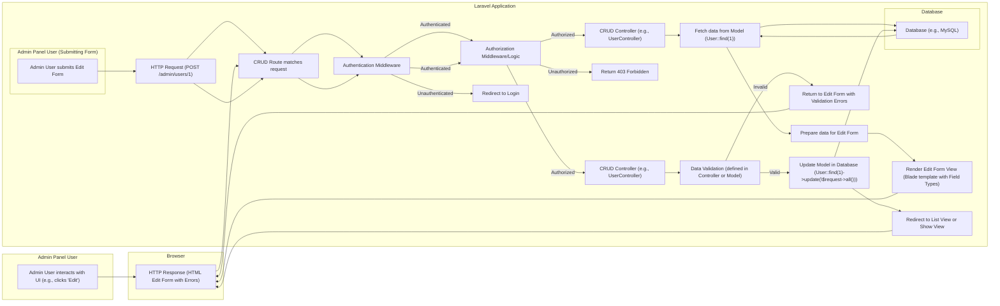

# Project Design Document: Laravel Backpack CRUD

**Version:** 1.1
**Date:** October 26, 2023
**Author:** AI Software Architect

## 1. Introduction

This document provides a detailed design overview of the Laravel Backpack CRUD package. It outlines the key components, architecture, and data flow within the system, with a specific focus on aspects relevant to security. This document serves as a foundation for subsequent threat modeling activities, enabling a comprehensive understanding of potential security vulnerabilities.

## 2. Goals

*   Provide a clear and concise description of the Laravel Backpack CRUD package's architecture and functionality.
*   Identify the key components and their interactions, emphasizing security-relevant aspects.
*   Illustrate the data flow within the system, highlighting points where security controls are applied or are potentially vulnerable.
*   Serve as a basis for identifying potential security threats and vulnerabilities during threat modeling sessions.

## 3. Scope

This document covers the core functionalities of the Laravel Backpack CRUD package, focusing on the aspects relevant to understanding its architecture, data flow, and security implications. It includes:

*   The user interface elements involved in managing CRUD operations.
*   The controllers and middleware responsible for handling requests and responses.
*   The models and database interactions for data persistence.
*   The configuration mechanisms that influence security settings.
*   The authentication and authorization processes within the context of CRUD operations.

This document does not cover:

*   The internal workings of the underlying Laravel framework in detail, unless directly relevant to Backpack CRUD's security.
*   Specific customizations or extensions made to the Backpack CRUD package in individual applications beyond general principles.
*   Line-by-line code implementation details.

## 4. Target Audience

This document is intended for:

*   Security engineers and architects responsible for performing threat modeling and security assessments.
*   Software developers working with or extending the Laravel Backpack CRUD package, particularly those responsible for security.
*   System administrators involved in deploying and maintaining applications that utilize Backpack CRUD.

## 5. System Overview

Laravel Backpack CRUD is a Laravel package designed to accelerate the development of administrative interfaces for managing application data. It automates the generation of standard CRUD (Create, Read, Update, Delete) operations for Eloquent models. It provides a customizable user interface with features such as data tables, forms, and filtering, significantly reducing the boilerplate code required for admin panel development. Security is a key consideration, relying on Laravel's built-in features and Backpack's own access control mechanisms.

## 6. Architectural Design

The Laravel Backpack CRUD package adheres to the Model-View-Controller (MVC) architectural pattern inherent in the Laravel framework. It extends Laravel's core functionalities and introduces its own components to streamline admin panel creation.

### 6.1. Key Components

*   **Admin Panel UI Components:**
    *   **List View (Index):** Displays data in a tabular format with features like pagination, sorting, and filtering.
    *   **Create Form:** Presents input fields for creating new records.
    *   **Edit Form:** Presents input fields for modifying existing records.
    *   **Show View:** Displays detailed information for a single record.
    *   **Delete Confirmation Modal:** A modal dialog to confirm the deletion of a record.
    *   **Bulk Actions:** Functionality to perform actions on multiple selected records.
    *   **Filters:** UI elements allowing users to filter the data displayed in the list view.
*   **CRUD Controllers (Extending Backpack's Base Controller):**
    *   Handle HTTP requests for CRUD operations (e.g., `index()`, `create()`, `store()`, `edit()`, `update()`, `destroy()`, `show()`).
    *   Implement authorization logic using Backpack's access control features or Laravel's policies.
    *   Handle data validation before saving to the database.
    *   Prepare data for views and process form submissions.
*   **CRUD Routes (Generated by Backpack):**
    *   Define the URLs that map to specific CRUD controller actions (e.g., `/admin/users`, `/admin/users/create`, `/admin/users/{id}/edit`).
    *   Typically protected by authentication middleware.
*   **Eloquent Models:**
    *   Represent the database tables being managed by Backpack CRUD.
    *   Define relationships, scopes, and potentially business logic.
    *   Used by the controllers to interact with the database.
*   **CRUD Configuration (within Controllers or Config Files):**
    *   Defines how each entity should be managed within the admin panel.
    *   Specifies fields for forms, columns for lists, validation rules, and authorization rules.
    *   Allows customization of UI elements and behavior.
*   **Field Types (Reusable Form Input Components):**
    *   Render specific input elements in create and edit forms (e.g., `Text`, `Select`, `Textarea`, `Image`, `Checkbox`).
    *   May include client-side validation or formatting.
    *   Crucial for preventing injection attacks if not handled correctly.
*   **Column Types (Reusable List View Display Components):**
    *   Define how data is displayed in the list view columns (e.g., `Text`, `Image`, `Boolean`, `Date`, ` отношений`).
    *   Responsible for rendering data from the model attributes.
*   **Operation Traits (Providing Core CRUD Logic):**
    *   `ListOperation`: Handles displaying the list view.
    *   `CreateOperation`: Handles displaying the create form and storing new data.
    *   `UpdateOperation`: Handles displaying the edit form and updating existing data.
    *   `DeleteOperation`: Handles deleting records.
    *   `ShowOperation`: Handles displaying the details of a single record.
*   **Authentication Middleware (Laravel's Built-in or Custom):**
    *   Ensures that only authenticated users can access the admin panel.
    *   Redirects unauthenticated users to the login page.
*   **Authorization Middleware and Logic (Backpack's or Laravel's Policies):**
    *   Controls access to specific CRUD operations based on user roles or permissions.
    *   Determines whether a user can create, read, update, or delete specific resources.
*   **Database Layer (Utilizing Laravel's Eloquent ORM):**
    *   Provides an interface for interacting with the underlying database system (e.g., MySQL, PostgreSQL).
    *   Handles database queries and data persistence.

### 6.2. Data Flow

**Data Flow Description:**

1. An **Admin User interacts with the Admin Panel UI**, for example, by clicking the "Edit" button for a specific record.
2. The **Browser sends an HTTP request** to the Laravel application.
3. The **Laravel Router matches the request** to a specific **CRUD Route**.
4. The request passes through **Authentication Middleware**, ensuring the user is logged in.
5. If authenticated, the request proceeds to **Authorization Middleware/Logic**, verifying the user has permission to perform the requested action.
6. If authorized, the request reaches the appropriate **CRUD Controller** action.
7. The controller **fetches data from the Eloquent Model**, which interacts with the **Database**.
8. The controller **prepares the data** and **renders the appropriate view** (e.g., the edit form), utilizing **Field Types** for form elements.
9. The **HTTP response (HTML)** is sent back to the **Browser**.
10. The **Admin User submits the form**.
11. The **Browser sends another HTTP request** (typically a POST request).
12. The request again goes through **Authentication and Authorization Middleware**.
13. If authorized, the **CRUD Controller** receives the request and performs **Data Validation**.
14. If the data is valid, the controller **updates the Model** in the **Database**.
15. If the data is invalid, the controller returns to the edit form with **validation errors**.
16. Upon successful update, the controller **redirects** the user to another page (e.g., the list view).

## 7. Security Considerations (For Threat Modeling)

Based on the architecture and data flow, here are specific security considerations to be explored during threat modeling:

*   **Authentication and Authorization:**
    *   **Brute-force attacks on login:**  Are there rate limiting mechanisms in place?
    *   **Weak password policies:**  Is there enforcement of strong passwords?
    *   **Session fixation/hijacking:**  Are sessions properly secured (e.g., using HTTPOnly and Secure flags)?
    *   **Insecure password reset mechanisms:**  Could an attacker gain access through a flawed password reset process?
    *   **Insufficient authorization checks:**  Can users access or modify data they shouldn't? Are there bypasses in the authorization logic?
    *   **Privilege escalation:** Can a user with limited privileges gain access to higher-level functionalities?
*   **Input Validation:**
    *   **Cross-Site Scripting (XSS):**  Is user-provided data properly sanitized and escaped before being displayed in views, especially within Field Types and Column Types?
    *   **SQL Injection:** Are database queries constructed securely, especially if using raw queries or accepting user input in `where` clauses without proper sanitization?
    *   **Mass assignment vulnerabilities:** Are Eloquent models protected against unexpected attribute updates from user input? Are `$fillable` or `$guarded` properties correctly configured?
    *   **Command Injection:** If user input is used in system commands, is it properly sanitized to prevent arbitrary command execution?
    *   **File upload vulnerabilities:** Are uploaded files validated for type and content to prevent malicious uploads (e.g., PHP scripts)? Are uploaded files stored securely and served with appropriate headers?
*   **Data Handling and Storage:**
    *   **Exposure of sensitive data:** Is sensitive data (e.g., passwords, API keys) encrypted at rest in the database and during transmission (HTTPS)?
    *   **Insecure storage of credentials:** Are database credentials and other secrets stored securely (e.g., using environment variables, vault)?
    *   **Data breaches:** What measures are in place to prevent unauthorized access to the database?
    *   **Insufficient logging and auditing:** Are security-related events logged for monitoring and incident response?
*   **Dependency Management:**
    *   **Vulnerabilities in third-party packages:** Are dependencies regularly updated to patch known security vulnerabilities? Is there a process for monitoring dependency vulnerabilities?
    *   **Supply chain attacks:** Are dependencies from trusted sources?
*   **Access Control:**
    *   **Insecure access to admin routes:** Is the admin panel adequately protected by authentication middleware?
    *   **Lack of role-based access control (RBAC):** Is access control implemented effectively to restrict actions based on user roles?
    *   **Bypassable authorization checks:** Can attackers find ways to circumvent authorization checks in the controllers or models?
*   **Cross-Site Request Forgery (CSRF):**
    *   Are CSRF tokens used for state-changing requests to prevent attackers from forging requests on behalf of authenticated users?
*   **Information Disclosure:**
    *   **Verbose error messages:** Do error messages reveal sensitive information about the application or database?
    *   **Debug mode in production:** Is debug mode disabled in production environments to prevent the disclosure of sensitive information?
    *   **Exposure of sensitive data in HTTP headers or responses:** Are there any unnecessary headers or response data that could leak information?

## 8. Dependencies

The Laravel Backpack CRUD package relies on the following key components and technologies:

*   **Laravel Framework (Specific Version):** The underlying PHP framework, with specific version requirements.
*   **PHP (Specific Version):** The programming language, with minimum version requirements.
*   **Composer:**  PHP dependency manager for installing and managing package dependencies.
*   **A Database System:** (e.g., MySQL, PostgreSQL, SQLite) compatible with Laravel.
*   **Specific Laravel Packages:**
    *   `backpack/theme-core`: The core theming package for Backpack.
    *   Potentially other Backpack add-ons or extensions.
    *   Common Laravel packages like `laravel/ui` or `laravel/fortify` for authentication scaffolding.

## 9. Deployment

Deploying an application using Laravel Backpack CRUD follows standard Laravel deployment practices, which include:

*   Installing the package via Composer during the build process.
*   Configuring the database connection details in the `.env` file or environment variables.
*   Running database migrations and seeders to set up the database schema and initial data.
*   Setting up authentication and authorization configurations.
*   Compiling front-end assets (CSS, JavaScript).
*   Configuring the web server (e.g., Apache, Nginx) to point to the application's public directory.
*   Ensuring proper file permissions for storage and bootstrap directories.
*   Setting up HTTPS for secure communication.

## 10. Future Considerations

*   Implementation of more granular permission management and auditing features within Backpack CRUD itself.
*   Integration with security scanning tools and static analysis tools for automated vulnerability detection.
*   Regular security audits and penetration testing to identify and address potential weaknesses.
*   Adoption of security best practices for all new features and updates.
*   Consideration of Content Security Policy (CSP) to mitigate XSS attacks.

This improved document provides a more detailed and security-focused design overview of the Laravel Backpack CRUD package. It aims to be a valuable resource for security professionals during threat modeling activities by highlighting potential vulnerabilities and areas of concern.
