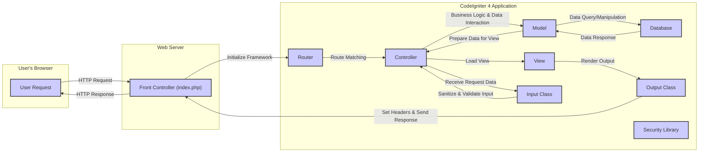

# Project Design Document: CodeIgniter 4

**Version:** 1.1
**Date:** October 26, 2023
**Author:** AI Software Architect

## 1. Introduction

This document provides an enhanced and detailed design overview of the CodeIgniter 4 framework, focusing on aspects relevant to threat modeling. It elaborates on the key architectural components, data flow, and security considerations. This document serves as a robust foundation for identifying potential threats and vulnerabilities within applications built using CodeIgniter 4.

## 2. Goals

*   Provide a comprehensive and in-depth architectural overview of CodeIgniter 4.
*   Clearly identify key components, their specific responsibilities, and their interactions.
*   Detail the typical request lifecycle within the framework with a focus on data transformation and security checkpoints.
*   Thoroughly highlight relevant security features, potential weaknesses, and recommended best practices.
*   Serve as a precise and actionable basis for identifying potential threats, attack vectors, and vulnerabilities during threat modeling exercises.

## 3. Architectural Overview

CodeIgniter 4 adheres to the Model-View-Controller (MVC) architectural pattern, promoting a clear separation of concerns and enhancing code organization, maintainability, and testability.

*   **Model:** Encapsulates the application's data structures, business logic related to data manipulation, and provides an interface for interacting with the data persistence layer (typically a database).
*   **View:**  Focuses on the presentation layer, responsible for rendering the user interface and displaying data to the user. Views should ideally contain minimal business logic.
*   **Controller:** Acts as an intermediary, handling incoming user requests, orchestrating interactions between Models and Views, and managing the application's workflow.

Beyond the core MVC pattern, CodeIgniter 4 incorporates several other essential components that contribute to its functionality and security.

## 4. Detailed Design

### 4.1. Key Components

*   **Front Controller (`public/index.php`):** The single entry point for all HTTP requests directed to the application. It bootstraps the framework, loads essential components, and dispatches the request for further processing.
*   **Router (`app/Config/Routes.php`):**  Responsible for interpreting the incoming HTTP request URI and mapping it to a specific controller and its corresponding method. It plays a crucial role in defining the application's API endpoints and URL structure. Route definitions can include parameters, wildcards, and HTTP verb restrictions.
*   **Controllers (`app/Controllers/`):**  Contain the core application logic. They receive requests from the Router, interact with Models to retrieve or modify data, perform business logic operations, and then select and load the appropriate View to generate the response. Controllers should handle input validation and authorization checks.
*   **Models (`app/Models/`):** Represent data entities and provide methods for interacting with the underlying data storage. They encapsulate database queries, data validation rules specific to the data domain, and business logic related to data manipulation. CodeIgniter 4 provides an Entity class to further structure data representation.
*   **Views (`app/Views/`):**  Responsible for rendering the user interface. They receive data passed from the Controller and generate the HTML, JSON, XML, or other output formats to be sent back to the user. Template engines are used to embed dynamic content within static templates.
*   **Database Abstraction Layer (Database Group):** Provides a consistent and secure interface for interacting with various database systems (e.g., MySQL, PostgreSQL, SQLite). It handles query building, execution, and result retrieval, mitigating the risk of SQL injection when used correctly with query builder methods.
*   **Input Class (`\CodeIgniter\HTTP\Request`):**  Manages incoming user data from various sources, including GET and POST parameters, headers, cookies, and uploaded files. It offers methods for retrieving, sanitizing, and validating user input. Proper use of input validation is critical for security.
*   **Output Class (`\CodeIgniter\HTTP\Response`):**  Handles the outgoing HTTP response sent to the user's browser. It allows setting headers (including security-related headers), managing caching, and sending the final output.
*   **Security Library (`\CodeIgniter\Security\Security`):**  Provides a suite of security-focused functionalities:
    *   **XSS Filtering:** Attempts to sanitize user-provided data to prevent Cross-Site Scripting attacks. While helpful, it should not be the sole defense against XSS.
    *   **CSRF Protection:** Generates and validates tokens to prevent Cross-Site Request Forgery attacks on state-changing requests (e.g., form submissions).
    *   **Content Security Policy (CSP):**  Allows developers to define and manage CSP headers, controlling the resources the browser is allowed to load for a given page, thus mitigating certain types of attacks.
    *   **Password Hashing:** Provides secure password hashing functions (using `password_hash` and `password_verify`) for storing user credentials securely.
*   **Session Management (`\CodeIgniter\Session\Session`):**  Provides mechanisms for managing user sessions, storing user-specific data across multiple requests. Session data can be stored in various ways (files, database, Redis, etc.). Secure session configuration is crucial.
*   **Encryption Library (`\CodeIgniter\Encryption\Encryption`):**  Offers functionalities for encrypting and decrypting data using various methods. Proper key management is essential for the security of encrypted data.
*   **Validation Library (`\CodeIgniter\Validation\Validation`):**  Provides a flexible and powerful way to define and enforce validation rules for user input. Validation rules can be defined in configuration files or directly within controllers.
*   **Autoloader:** Automatically loads necessary classes and files based on namespaces and defined paths, simplifying development and ensuring that classes are available when needed.
*   **Helpers (`app/Helpers/`):**  Collections of globally available, reusable functions that can be used throughout the application to perform common tasks.
*   **Libraries (`app/Libraries/`):**  Custom classes that extend the framework's functionality or integrate third-party services.
*   **Configuration Files (`app/Config/`):**  Store application-wide settings, including database credentials, routing rules, security configurations, and other environment-specific parameters. Secure storage and management of configuration data are important.

### 4.2. Data Flow

**Detailed Request Lifecycle:**

*   The user initiates a request from their browser (e.g., by clicking a link or submitting a form).
*   The **Web Server** receives the **HTTP Request** and directs it to the `public/index.php` file (the **Front Controller**).
*   The **Front Controller** initializes the CodeIgniter 4 framework, loading core components and configurations.
*   The **Router** examines the incoming request URI and matches it against the defined routes in `app/Config/Routes.php`. This determines which **Controller** and method should handle the request.
*   The **Controller** receives the request. It interacts with the **Input Class** to retrieve and potentially sanitize and validate user-provided data.
*   The **Controller** then executes the necessary business logic, often interacting with **Models** to retrieve or manipulate data from the **Database**.
*   **Models** execute database queries through the **Database Abstraction Layer**.
*   The **Database** returns the requested data to the **Model**.
*   The **Model** passes the data back to the **Controller**.
*   The **Controller** prepares the data for presentation and selects the appropriate **View**.
*   The **View** renders the output (e.g., HTML) using the provided data.
*   The rendered output is passed to the **Output Class**.
*   The **Output Class** sets necessary HTTP headers (including security headers) and sends the **HTTP Response** back to the **Web Server**.
*   The **Web Server** delivers the response to the **User's Browser**. The **Security Library** might be involved at various stages, such as during input processing or output generation.

## 5. Security Considerations

CodeIgniter 4 provides several built-in features and guidelines to enhance application security. However, developers must utilize these features correctly and be aware of potential vulnerabilities.

*   **Input Security:**
    *   **Validation:** The Validation Library should be used rigorously to ensure that user input conforms to expected formats and constraints, preventing data integrity issues and potential exploits.
    *   **Sanitization:** While the Input Class offers sanitization, it should be used cautiously and not relied upon as the primary defense against XSS. Context-specific output encoding is more effective.
    *   **SQL Injection Prevention:**  The Database Abstraction Layer, when used with query builder methods and prepared statements, effectively prevents SQL injection vulnerabilities. Avoid direct string concatenation in queries.
*   **Output Security:**
    *   **Output Encoding:**  Crucially important to prevent XSS attacks. Encode output data based on the context (HTML, JavaScript, URL, etc.) using CodeIgniter's escaping functions or template engine features.
    *   **Content Security Policy (CSP):**  Implementing a strict CSP can significantly reduce the risk of XSS and other client-side attacks.
*   **Cross-Site Request Forgery (CSRF):**  Enable CSRF protection in the application configuration and use the provided form helper to generate CSRF tokens for state-changing forms.
*   **Session Security:**
    *   **Secure Configuration:** Configure session settings appropriately, including using `httponly` and `secure` flags for cookies, and choosing a secure session storage mechanism.
    *   **Session Regeneration:** Regenerate session IDs after successful login to prevent session fixation attacks.
*   **Authentication and Authorization:** While CodeIgniter doesn't enforce a specific authentication library, it provides tools and guidelines for implementing secure authentication and authorization mechanisms. Consider using established libraries for these functionalities.
*   **Password Management:**  Utilize the Security Library's password hashing functions (`password_hash` and `password_verify`) for storing and verifying user passwords. Avoid storing plain text passwords.
*   **File Upload Security:**  Implement robust validation and sanitization for file uploads to prevent malicious file uploads. Store uploaded files outside the webroot and consider using a separate storage service.
*   **Error Handling and Logging:**  Configure error reporting and logging appropriately. Avoid displaying sensitive information in error messages in production environments.
*   **Security Headers:**  Leverage the Output Class to set security-related HTTP headers like `Strict-Transport-Security`, `X-Content-Type-Options`, and `X-Frame-Options` to enhance security.
*   **Dependency Management:**  Keep the CodeIgniter framework and its dependencies up-to-date to patch known security vulnerabilities. Use Composer to manage dependencies effectively.
*   **Regular Security Audits:**  Conduct regular security audits and penetration testing to identify potential vulnerabilities in the application.

## 6. Deployment

Deploying CodeIgniter 4 applications securely requires careful consideration of the environment and configuration.

*   **Web Server Configuration:**
    *   **HTTPS:**  Enforce HTTPS to encrypt all communication between the user's browser and the server. Obtain and configure an SSL/TLS certificate.
    *   **Document Root:**  Configure the web server's document root to point to the `public` directory of the CodeIgniter application, preventing direct access to application source code.
    *   **Web Server Hardening:**  Follow security best practices for configuring the web server (e.g., disabling unnecessary modules, setting appropriate permissions).
*   **PHP Configuration:**
    *   **`expose_php`:** Disable the `expose_php` directive in `php.ini` to prevent information disclosure.
    *   **`error_reporting`:** Configure error reporting appropriately for production environments (e.g., logging errors without displaying them).
    *   **Security Extensions:** Ensure necessary security-related PHP extensions are enabled and up-to-date.
*   **Database Security:**
    *   **Secure Credentials:** Store database credentials securely, preferably using environment variables.
    *   **Principle of Least Privilege:** Grant database users only the necessary permissions.
    *   **Network Security:** Restrict network access to the database server.
*   **File Permissions:**  Set appropriate file and directory permissions to prevent unauthorized access and modification.
*   **Environment Variables:**  Utilize environment variables to store sensitive configuration settings (e.g., database credentials, API keys) instead of hardcoding them in configuration files.
*   **Deployment Automation:**  Use secure deployment practices and automation tools to minimize manual errors and ensure consistent deployments.
*   **Cloud Platform Security:** When deploying on cloud platforms, leverage the platform's security features and follow their security best practices.

## 7. Dependencies

CodeIgniter 4 relies on the following key dependencies:

*   **PHP:** Requires a minimum PHP version (refer to the official CodeIgniter documentation for the specific version requirement). It's recommended to use the latest stable and supported PHP version for security and performance reasons.
*   **Composer:**  The primary dependency management tool for PHP. It's used to install and manage CodeIgniter 4 itself and any third-party libraries.
*   **PHP Extensions:**  Several PHP extensions are either required or highly recommended for optimal functionality and security:
    *   `intl`: For internationalization features.
    *   `mbstring`: For multibyte string handling.
    *   `json`: For JSON encoding and decoding.
    *   Database drivers (e.g., `pdo_mysql`, `pdo_pgsql`): For database connectivity.
    *   `curl`: For making HTTP requests.
    *   `xml`: For XML processing.
    *   `openssl`: For encryption and secure communication.
    *   `gd` or `imagick`: For image manipulation (if required).

## 8. Conclusion

This enhanced design document provides a more detailed and comprehensive overview of the CodeIgniter 4 framework, with a strong emphasis on aspects relevant to threat modeling. By understanding the architecture, component interactions, data flow, and security considerations outlined here, developers and security professionals can more effectively identify and mitigate potential threats and vulnerabilities in applications built with CodeIgniter 4. Continuous learning and adherence to security best practices are crucial for maintaining the security of web applications.