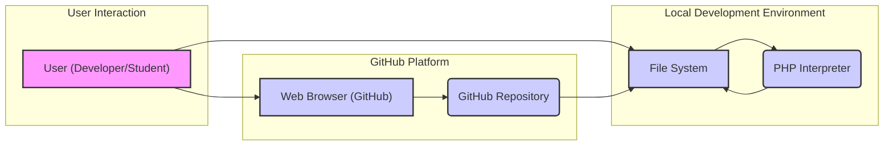
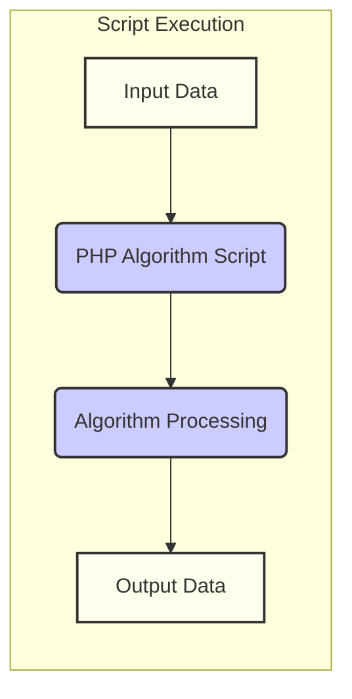

# Project Design Document: TheAlgorithms/PHP

**Version:** 1.1
**Date:** October 26, 2023
**Prepared By:** Gemini (AI Language Model)

## 1. Project Overview

The project "TheAlgorithms/PHP" is an open-source repository hosted on GitHub. It serves as a collection of computer science algorithm implementations written in the PHP programming language. The primary purpose is educational, providing clear and understandable code examples for developers and students learning about algorithms and their practical implementation in PHP. The repository is organized into directories based on algorithm categories, making it easy to navigate and find specific algorithm implementations.

## 2. Goals

*   To provide a readily accessible and comprehensive collection of algorithm implementations in PHP.
*   To offer clear, well-commented, and easy-to-understand PHP code for each algorithm.
*   To organize algorithms logically within a clear directory structure based on categories.
*   To serve as a valuable learning resource for developers, students, and educators interested in algorithms and PHP.
*   To maintain a consistent and high-quality coding style across all algorithm implementations.

## 3. Non-Goals

*   To provide highly optimized, production-ready implementations of all algorithms. The focus is on clarity and educational value over raw performance.
*   To develop a user interface or web application around these algorithms. The project is primarily a repository of PHP scripts.
*   To offer exhaustive unit testing or formal verification for every algorithm, although basic demonstration code might be included.
*   To implement every conceivable algorithm. The project focuses on fundamental and commonly used algorithms.
*   To create a reusable library or framework for integrating these algorithms into other PHP projects. It is primarily a demonstration and learning resource.

## 4. Target Audience

*   Software developers seeking to understand and learn about various algorithms.
*   Computer science students studying data structures and algorithms and looking for PHP examples.
*   PHP developers interested in seeing practical implementations of algorithms in their language of choice.
*   Educators who can use the code examples for teaching algorithms and data structures.
*   Contributors who wish to contribute new algorithm implementations or improve existing ones.

## 5. System Architecture

The project's architecture is centered around a collection of individual PHP files, primarily accessed through direct viewing on GitHub or local execution via the PHP interpreter.

**Description of Components:**

*   **User (Developer/Student):** The individual interacting with the project, either by browsing the code on the GitHub website or by cloning/downloading and executing the scripts locally.
*   **Web Browser (GitHub):** The application used to access and view the project's code and documentation on the GitHub platform.
*   **GitHub Repository:** The remote storage location for the project's source code, managed using Git version control.
*   **File System:** The local file system on a user's machine where the project's files are stored after cloning or downloading.
*   **PHP Interpreter:** The software that executes the PHP scripts. This is necessary for running the algorithm implementations locally.

**Interaction Flow:**

1. A user accesses the GitHub repository through a web browser.
2. The user can browse the code files and documentation directly on the GitHub website.
3. Alternatively, the user clones or downloads the repository to their local file system.
4. The user navigates to the desired algorithm's PHP file within their local file system.
5. The user executes the PHP script using the PHP interpreter, typically via the command line (e.g., `php sorting/bubble_sort.php`).
6. The PHP interpreter reads and executes the script, potentially producing output to the console.

## 6. Components

*   **Algorithm PHP Files:** Individual PHP files, each containing the implementation of a specific algorithm. These are the core components of the project.
    *   Typically include:
        *   Function definitions for the algorithm's logic.
        *   Comments explaining the algorithm's steps and implementation details.
*   **Example/Demonstration PHP Files (Potentially):** Some algorithms might have separate files demonstrating their usage with example input and output.
*   **Category Directories:** The organization of PHP files into directories based on algorithm categories (e.g., `sorting`, `searching`, `dynamic_programming`). This provides a logical structure for the repository.
*   **.gitignore File:** Specifies files and directories that Git should ignore, typically including temporary files or environment-specific configurations.
*   **LICENSE File:** Defines the licensing terms under which the project can be used, copied, modified, and distributed (e.g., MIT License).
*   **README.md File:** Provides an overview of the project, instructions for usage, contribution guidelines, and other relevant information. This is the primary entry point for understanding the project.
*   **Potentially: Composer Configuration (composer.json):** While less likely for basic algorithm implementations, the project might include a `composer.json` file if it depends on external PHP libraries for certain algorithms or testing.

## 7. Data Flow

The primary data flow involves providing input to the algorithm scripts and receiving output as the result of the algorithm's execution.

**Detailed Data Flow:**

1. **Input Data:** Algorithm scripts operate on input data. This data can originate from several sources:
    *   **Hardcoded Values:** Data directly embedded within the PHP script.
    *   **Command-Line Arguments:** Data passed to the script when executed from the command line.
    *   **Potentially: Reading from Files:** Some scripts might read input data from external files.
2. **PHP Algorithm Script:** The specific PHP file containing the algorithm implementation receives the input data.
3. **Algorithm Processing:** The core logic of the algorithm is executed, manipulating the input data according to the algorithm's steps.
4. **Output Data:** The algorithm produces output, representing the result of its execution. This output is typically:
    *   **Printed to the Console:** Using functions like `echo`, `print_r`, or `var_dump`.
    *   **Returned by Functions:** The result might be returned by a function within the script for further use or processing.

## 8. Security Considerations

While this project is primarily educational, considering potential security aspects is important, especially if the code were to be adapted or used in other contexts.

*   **Input Validation:** If the scripts were modified to accept external user input (e.g., through command-line arguments or web requests in a modified version), proper input validation would be crucial to prevent vulnerabilities like:
    *   **Code Injection:** Malicious input could be crafted to execute arbitrary code if not properly sanitized.
    *   **Cross-Site Scripting (XSS):** If output is displayed in a web context without proper encoding. (Less relevant for the current project scope but important to consider for potential extensions).
    *   **SQL Injection:** If the algorithms were integrated with a database and user input was used in SQL queries without sanitization. (Not applicable in the current scope).
*   **Output Encoding:** If the output of the scripts were to be displayed in a web browser, proper output encoding would be necessary to prevent XSS vulnerabilities.
*   **Resource Management:**  Inefficiently implemented algorithms or algorithms processing large datasets could lead to:
    *   **Denial of Service (DoS):**  Excessive consumption of CPU or memory resources could make the system unresponsive.
    *   **Timeouts:** Long-running algorithms might exceed execution time limits.
*   **Error Handling and Information Disclosure:**  Verbose error messages or stack traces could reveal sensitive information about the execution environment or the application's internal workings. Proper error handling and logging are important.
*   **Dependency Management (If Applicable):** If the project were to use external libraries managed by Composer, vulnerabilities in those dependencies could pose a security risk. Regularly updating dependencies and using security scanning tools is important.
*   **Access Control (Local Environment):** Ensuring that only authorized users can access and execute the scripts on the local file system is a fundamental security consideration. This is managed at the operating system level.
*   **Algorithmic Complexity Vulnerabilities:** An attacker could potentially provide input that exploits the worst-case time complexity of certain algorithms, causing them to run for an excessively long time and potentially leading to a denial of service.

## 9. Future Considerations

*   **Expanding Algorithm Coverage:**  Adding implementations for a wider range of algorithms and data structures.
*   **Improving Code Quality and Documentation:**  Enforcing stricter coding standards, adding more detailed comments, and potentially including visual aids or diagrams to explain complex algorithms.
*   **Adding Unit Tests:** Implementing comprehensive unit tests for each algorithm to ensure correctness and prevent regressions.
*   **Providing Performance Benchmarks and Analysis:**  Including performance measurements and analysis for different implementations to illustrate their efficiency and trade-offs.
*   **Exploring Different Implementation Paradigms:**  Showcasing different ways to implement the same algorithm (e.g., recursive vs. iterative, different data structures).
*   **Integration with Online Learning Platforms:**  Potentially integrating the project with online coding platforms or educational resources to enhance its accessibility and impact.
*   **Security Audits and Best Practices:**  Conducting security reviews of the code and incorporating secure coding practices to minimize potential vulnerabilities, even in an educational context. This could include static analysis tools.

This improved design document provides a more detailed and nuanced understanding of the TheAlgorithms/PHP project, making it more suitable for threat modeling and further development.