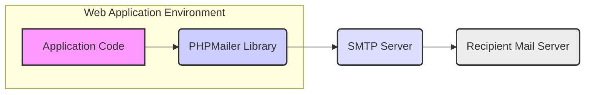

# Project Design Document: PHPMailer

**Version:** 1.1
**Date:** October 26, 2023
**Author:** AI Software Architect

## 1. Introduction

This document provides a detailed design overview of the PHPMailer library, a widely used open-source PHP library for sending emails. This document is intended to serve as a foundation for subsequent threat modeling activities, providing a clear understanding of the system's architecture, components, and data flow.

### 1.1. Purpose

The primary purpose of this document is to describe the design of PHPMailer in sufficient detail to facilitate effective threat modeling. It outlines the key components, their interactions, and the data handled by the library, focusing on aspects relevant to security analysis.

### 1.2. Scope

This document covers the core functionality of the PHPMailer library related to email composition and transmission. It includes:

*   Email composition (headers, body, attachments, alternative bodies).
*   Connection establishment and management with SMTP servers.
*   Implementation of various SMTP authentication mechanisms.
*   Handling of different email formats (plain text, HTML, MIME encoding).
*   Mechanisms for error handling, debugging, and logging.
*   Support for advanced features like DKIM signing and S/MIME encryption (at a high level).

This document does not cover:

*   In-depth analysis of specific code implementations within the PHPMailer codebase.
*   The user interface or the specific application code that integrates and utilizes PHPMailer.
*   The underlying operating system, network infrastructure, or the security of the PHP environment itself.

### 1.3. Target Audience

This document is intended for:

*   Security engineers and architects responsible for performing threat modeling and security assessments.
*   Software developers who need a high-level understanding of PHPMailer's architecture for integration and security considerations.

## 2. System Overview

PHPMailer is a PHP library designed to simplify and secure the process of sending emails from PHP applications. It abstracts away the complexities of the underlying email protocols and provides a user-friendly interface for constructing and sending email messages.

### 2.1. Key Features

*   **Comprehensive Email Composition:**  Allows detailed control over email construction, including setting multiple recipients (To, CC, BCC), defining subject and body content (both plain text and HTML with alternative views), adding various types of attachments, and setting custom headers.
*   **Robust SMTP Support:** Facilitates sending emails through SMTP servers with full support for various authentication methods (PLAIN, LOGIN, CRAM-MD5, NTLM, XOAUTH2), enabling secure communication with different mail server configurations.
*   **Flexible Mail Sending Options:** Provides the flexibility to send emails using either direct SMTP connections or by leveraging the PHP `mail()` function or a local sendmail binary.
*   **Secure Communication:** Supports establishing secure connections to SMTP servers using TLS/SSL encryption, ensuring the confidentiality and integrity of transmitted data.
*   **Character Encoding Management:**  Handles different character encodings (e.g., UTF-8) for email content, ensuring proper display of international characters.
*   **Detailed Error Handling and Reporting:** Offers mechanisms for detecting and reporting errors during the email sending process, aiding in debugging and troubleshooting.
*   **Debugging and Logging Capabilities:** Provides options for enabling detailed debugging output of SMTP communication and logging errors, which is useful for development and diagnosing issues.
*   **Support for Email Security Standards:** Includes features to support email security standards like DKIM (DomainKeys Identified Mail) for signing emails and SPF (Sender Policy Framework) by allowing configuration of relevant headers. Basic support for S/MIME for encryption and signing is also present.
*   **Internationalization:** Supports Internationalized Domain Names (IDN) in email addresses.

## 3. System Architecture

The following diagram illustrates the high-level architecture of PHPMailer within the context of a web application sending an email via an SMTP server:

### 3.1. Components

*   **'Application Code'**: This represents the PHP code within a web application, script, or system that initiates the email sending process. It's responsible for gathering email content, configuring PHPMailer, and triggering the send operation.
*   **'PHPMailer Library'**: This is the core of the system, encompassing the PHP classes and methods provided by the PHPMailer project. Its responsibilities include:
    *   Constructing the email message (headers, body, attachments) according to the provided data.
    *   Managing connections to SMTP servers, including establishing, maintaining, and closing connections.
    *   Implementing various SMTP authentication mechanisms to securely log in to mail servers.
    *   Encoding email content and attachments according to MIME standards.
    *   Handling secure communication using TLS/SSL.
    *   Providing error handling and debugging functionalities.
*   **'SMTP Server'**: A Mail Transfer Agent (MTA) that receives the composed email from PHPMailer. It is responsible for:
    *   Authenticating the sender (PHPMailer) based on provided credentials.
    *   Relaying the email to the recipient's mail server.
    *   Potentially performing spam filtering and other security checks.
*   **'Recipient Mail Server'**: The MTA responsible for receiving the email from the sending SMTP server and delivering it to the recipient's mailbox.

### 3.2. Data Flow

The typical data flow for sending an email using PHPMailer with an SMTP server is as follows:

1. The **'Application Code'** gathers all necessary information for the email, such as recipient addresses, subject, body (plain text and/or HTML), and any attachments.
2. The **'Application Code'** instantiates the **'PHPMailer Library'** and configures its properties, including SMTP server details (hostname, port, encryption), authentication credentials (username, password), sender address, and recipient information.
3. The **'Application Code'** utilizes the **'PHPMailer Library'**'s methods to set the email content, adding recipients, subject, body, and attachments.
4. The **'Application Code'** calls the **'PHPMailer Library'**'s `send()` method to initiate the email sending process.
5. The **'PHPMailer Library'** establishes a connection to the configured **'SMTP Server'**.
6. If required by the **'SMTP Server'**, the **'PHPMailer Library'** performs authentication using the specified method and credentials. This involves sending authentication commands and receiving responses from the **'SMTP Server'**.
7. The **'PHPMailer Library'** transmits the email message, formatted according to MIME standards (including headers and body), to the **'SMTP Server'** using the SMTP protocol.
8. The **'SMTP Server'** receives the email and proceeds to relay it to the **'Recipient Mail Server'**.
9. The **'Recipient Mail Server'** receives and stores the email for the intended recipient.
10. The **'PHPMailer Library'** receives a success or failure response from the **'SMTP Server'** indicating whether the email was successfully submitted for delivery. This response is then typically returned to the **'Application Code'**.

### 3.3. Dependencies

The PHPMailer library relies on the following components:

*   **PHP Interpreter:** The core PHP runtime environment.
*   **OpenSSL Extension (Recommended):** Used for establishing secure connections (TLS/SSL) with SMTP servers.
*   **cURL Extension (Optional):** Can be used for certain SMTP authentication methods like XOAUTH2 and for fetching remote images for embedding.
*   **MBstring Extension (Recommended):**  Essential for correctly handling multi-byte character sets in email content and headers.
*   **iconv Extension (Optional):** May be used for character set conversion in some scenarios.

### 3.4. Configuration

The behavior of PHPMailer is highly configurable through properties and methods within the library. Key configuration aspects include:

*   **SMTP Server Connection Details:**  Hostname or IP address of the SMTP server, the port number, and the encryption method to use (e.g., `tls`, `ssl`, or none).
*   **Authentication Settings:**  The authentication method to use (e.g., `login`, `plain`, `CRAM-MD5`) and the corresponding username and password.
*   **Sender Information:** The "From" email address and the sender's name.
*   **Recipient Information:**  "To", "CC", and "BCC" email addresses and associated names.
*   **Email Content:** The subject of the email, the HTML body, and the plain text alternative body.
*   **Attachments:**  Paths to files to be attached to the email, along with their names and MIME types.
*   **Character Encoding:** The character set used for the email content (e.g., `UTF-8`).
*   **Debug and Logging Options:**  Settings to enable debugging output of SMTP communication and to specify where errors should be logged.
*   **Mailer Type:**  Configuration to specify whether to use SMTP, the PHP `mail()` function, or sendmail for sending emails.
*   **DKIM and S/MIME Settings:**  Configuration options for specifying the DKIM selector, private key, and passphrase, as well as S/MIME signing certificate and encryption certificate.

## 4. Security Considerations

This section highlights key security considerations relevant to the design and use of PHPMailer. These points will be crucial for the subsequent threat modeling process.

*   **Secure Storage of SMTP Credentials:**  Storing SMTP server usernames and passwords securely is paramount. Avoid hardcoding credentials directly in the application code. Utilize environment variables, secure configuration files, or dedicated secrets management solutions.
*   **Input Validation and Sanitization:**  Thoroughly validate and sanitize all email-related inputs, including recipient addresses, subject, body content, and attachment filenames, to prevent injection attacks such as header injection or cross-site scripting (XSS) via HTML emails.
*   **Attachment Security:** Exercise caution when handling file attachments. Implement checks on file types and sizes to prevent malicious uploads. Consider using virus scanning on uploaded attachments before sending.
*   **Enforce Secure Connections:** Always configure PHPMailer to use TLS/SSL encryption for SMTP connections to protect the confidentiality and integrity of communication between the application and the mail server.
*   **Error Handling and Information Disclosure:** Avoid displaying detailed error messages in production environments, as these can reveal sensitive information about the system's configuration or internal workings. Log errors securely for debugging purposes.
*   **Dependency Management and Updates:** Regularly update the PHPMailer library and its dependencies to patch known security vulnerabilities. Utilize dependency management tools to track and manage updates.
*   **Rate Limiting and Abuse Prevention:** Implement rate limiting on email sending to prevent abuse, such as spamming or denial-of-service attacks.
*   **DKIM and SPF Configuration:** Properly configure DKIM signing and SPF records to improve email deliverability and reduce the likelihood of emails being flagged as spam or phishing attempts.
*   **S/MIME Implementation:** When handling sensitive information, consider utilizing S/MIME for encrypting email content to ensure confidentiality during transit and at rest. Securely manage the necessary certificates.
*   **XOAUTH2 Security:** When using XOAUTH2 for authentication, ensure the OAuth 2.0 flow is implemented securely, protecting access tokens and refresh tokens.

## 5. Deployment Scenarios

PHPMailer is commonly deployed in various scenarios:

*   **Web Applications for Transactional Emails:**  Used extensively by web applications to send automated transactional emails such as account verification emails, password reset requests, order confirmations, shipping notifications, and other system-generated alerts.
*   **Command-Line Interface (CLI) Scripts:** Integrated into CLI scripts for sending automated reports, system status updates, or notifications triggered by scheduled tasks or system events.
*   **Content Management Systems (CMS) and E-commerce Platforms:**  Utilized by CMS platforms and e-commerce systems to handle user registration emails, contact form submissions, order notifications, and marketing communications.
*   **Internal Tools and Applications:** Employed within organizations for sending internal notifications, alerts, and reports from custom-built tools and applications.
*   **Email Marketing (with caution):** While PHPMailer can be used for sending bulk emails, it's crucial to implement proper handling of mailing lists, opt-in/opt-out mechanisms, and adhere to anti-spam regulations. Dedicated email marketing services often provide more robust features and better deliverability for large-scale campaigns.

## 6. Data Flow Diagrams (Detailed)

The following diagram provides a more granular view of the data flow within the PHPMailer library when sending an email via SMTP, highlighting key method calls and interactions:

```mermaid
graph LR
    A["Application Code"] --> B("PHPMailer->setFrom()");
    B --> C("PHPMailer->addAddress()");
    C --> D("PHPMailer->Subject = ...");
    D --> E("PHPMailer->Body = ...");
    E --> F("PHPMailer->AltBody = ...");
    F --> G("PHPMailer->addAttachment()");
    G --> H("PHPMailer->isSMTP()");
    H -- Yes --> I("PHPMailer->connect()");
    I --> J{Is TLS/SSL Enabled?};
    J -- Yes --> K("SMTP->startTLS()");
    K --> L("SMTP->authenticate()");
    J -- No --> L;
    L --> M("SMTP->mail()");
    M --> N("SMTP->rcpt()");
    N --> O("SMTP->data()");
    O --> P("SMTP->quit()");
    I -- No --> Q("PHPMailer->mail()");
    P --> R("PHPMailer->send() - returns true/false");
    Q --> R
    style A fill:#f9f,stroke:#333,stroke-width:2px
    style B fill:#ccf,stroke:#333,stroke-width:2px
    style C fill:#ccf,stroke:#333,stroke-width:2px
    style D fill:#ccf,stroke:#333,stroke-width:2px
    style E fill:#ccf,stroke:#333,stroke-width:2px
    style F fill:#ccf,stroke:#333,stroke-width:2px
    style G fill:#ccf,stroke:#333,stroke-width:2px
    style H fill:#ccf,stroke:#333,stroke-width:2px
    style I fill:#ccf,stroke:#333,stroke-width:2px
    style J fill:#ddd,stroke:#333,stroke-width:2px
    style K fill:#ccf,stroke:#333,stroke-width:2px
    style L fill:#ccf,stroke:#333,stroke-width:2px
    style M fill:#ccf,stroke:#333,stroke-width:2px
    style N fill:#ccf,stroke:#333,stroke-width:2px
    style O fill:#ccf,stroke:#333,stroke-width:2px
    style P fill:#ccf,stroke:#333,stroke-width:2px
    style Q fill:#ccf,stroke:#333,stroke-width:2px
    style R fill:#ccf,stroke:#333,stroke-width:2px
```

**Explanation of Detailed Data Flow:**

1. The **'Application Code'** uses PHPMailer methods like `setFrom()`, `addAddress()`, `Subject`, `Body`, `AltBody`, and `addAttachment()` to configure the email.
2. `PHPMailer->isSMTP()` checks if SMTP is the selected mailer.
3. If SMTP is enabled, `PHPMailer->connect()` establishes a connection to the SMTP server.
4. A check is performed to determine if TLS/SSL is enabled.
5. If TLS/SSL is enabled, `SMTP->startTLS()` initiates the secure connection.
6. `SMTP->authenticate()` handles authentication with the SMTP server.
7. `SMTP->mail()` sends the MAIL FROM command.
8. `SMTP->rcpt()` sends the RCPT TO command for each recipient.
9. `SMTP->data()` initiates the email data transmission.
10. `SMTP->quit()` closes the connection to the SMTP server.
11. If SMTP is not enabled, `PHPMailer->mail()` uses the PHP `mail()` function.
12. Finally, `PHPMailer->send()` returns `true` on successful submission or `false` on failure.

## 7. Conclusion

This document provides a detailed design overview of the PHPMailer library, focusing on aspects relevant to security analysis and threat modeling. By outlining the architecture, components, data flow, and security considerations, this document serves as a valuable resource for understanding the potential attack surfaces and vulnerabilities associated with using PHPMailer. The detailed data flow diagrams further enhance this understanding by illustrating the internal processes involved in sending emails. This information is crucial for developing effective mitigation strategies and ensuring the secure use of PHPMailer in various applications.