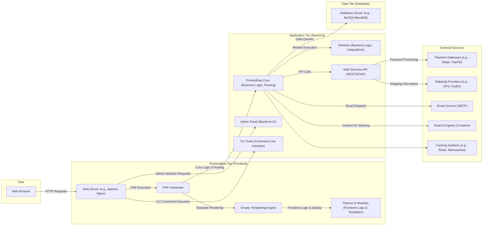

# Project Design Document: PrestaShop E-commerce Platform

**Document Version:** 1.1
**Date:** October 26, 2023
**Prepared By:** AI Software Architecture Expert

## 1. Introduction

This document provides a detailed architectural design overview of the PrestaShop e-commerce platform, focusing on aspects relevant to security threat modeling. It describes the key components, their interactions, data flows, and external dependencies. This document serves as the foundation for identifying potential security vulnerabilities and planning mitigation strategies.

## 2. Project Goal

The PrestaShop project aims to provide a robust, flexible, and open-source e-commerce platform empowering merchants to build and manage online stores of varying sizes and complexities. Key features include comprehensive product management, order processing, customer relationship management, marketing tools, and extensibility through modules and themes.

## 3. Target Audience

This document is intended for:

* Security engineers and architects responsible for threat modeling and security assessments.
* Development teams involved in the development, maintenance, and extension of PrestaShop.
* Operations teams responsible for the deployment, configuration, and monitoring of PrestaShop instances.
* Auditors assessing the security posture of PrestaShop deployments.

## 4. System Architecture

PrestaShop employs a modular, three-tier architecture, facilitating maintainability and extensibility.

* **Presentation Tier (Frontend):**  Responsible for rendering the user interface and handling user interactions.
* **Application Tier (Backend):**  Contains the core business logic, processes requests, and manages data interactions.
* **Data Tier (Database):**  Persistently stores application data.

## 5. Data Flow

Detailed examples of data flow within the PrestaShop system:

* **Anonymous User Browsing a Product:**
    * User's web browser sends an HTTP request to the web server for a product page.
    * The web server passes the request to the PHP interpreter.
    * PrestaShop Core, based on the URL, routes the request to the appropriate controller.
    * The controller interacts with backend modules and the database to retrieve product details, images, and related information.
    * The Smarty templating engine uses the retrieved data and the active theme to render the HTML for the product page.
    * The web server sends the HTML response back to the user's browser.
* **Authenticated Customer Placing an Order:**
    * User adds products to their cart, triggering updates to session data (or database for persistent carts).
    * During checkout, the user submits personal and shipping information via forms.
    * The backend validates the input data.
    * PrestaShop Core interacts with payment gateway modules to process payment information securely.
    * Upon successful payment, order details (customer information, products, payment details, shipping address) are stored in the database.
    * Notifications (order confirmation emails) are sent via the configured SMTP server.
    * Inventory levels are updated in the database.
* **Administrator Updating Product Information:**
    * Administrator logs into the Admin Panel via their web browser.
    * The browser sends authenticated requests to the web server.
    * The Admin Panel interface allows the administrator to modify product details.
    * Upon submission, the Admin Panel sends a request to the PrestaShop Core.
    * PrestaShop Core validates the administrator's permissions and the submitted data.
    * The updated product information is written to the database.
    * Caches (if configured) related to the product may be invalidated or updated.
* **External Application Accessing Data via API:**
    * An external application sends an authenticated request to the PrestaShop Web Services API endpoint.
    * The API authenticates the request (e.g., using API keys or OAuth).
    * PrestaShop Core processes the API request, potentially interacting with modules and the database.
    * Data is retrieved and formatted (e.g., as JSON or XML) according to the API request.
    * The API sends the response back to the external application.

## 6. Key Components

Detailed descriptions of the core components:

* **Web Server (e.g., Apache, Nginx):**  The entry point for all HTTP requests. Responsible for serving static content, routing requests to the PHP interpreter, and handling SSL/TLS termination. Configuration vulnerabilities in the web server can expose the application to attacks.
* **PHP Interpreter:** Executes the PHP code that forms the core of PrestaShop and its modules. Vulnerabilities in the PHP interpreter or its extensions can be exploited. Proper configuration and regular updates are crucial.
* **Smarty Templating Engine:**  Separates presentation logic from PHP code, enhancing maintainability. However, improper use of Smarty can lead to Server-Side Template Injection (SSTI) vulnerabilities.
* **PrestaShop Core (Business Logic, Routing):**  The heart of the application, responsible for handling business logic, routing requests, managing modules, interacting with the database, and enforcing access controls. Vulnerabilities here can have significant impact.
* **Modules (Backend Logic, Integrations):**  Extend PrestaShop's functionality. Modules can introduce vulnerabilities if not developed securely or if they are outdated. Security checks during module installation are important.
* **Web Services API (REST/SOAP):**  Provides programmatic access to PrestaShop's data and functionalities. Requires robust authentication and authorization mechanisms to prevent unauthorized access and data breaches. Rate limiting is also important to prevent abuse.
* **Admin Panel (Backend UI):**  A powerful interface for managing the store. Requires strong authentication and authorization to protect sensitive operations. Vulnerabilities in the Admin Panel can lead to complete compromise of the store.
* **CLI Tools (Command Line Interface):**  Used for administrative tasks. Access to the server and proper authentication for CLI tools are critical to prevent unauthorized actions.
* **Database Server (e.g., MySQL/MariaDB):**  Stores all persistent data. Requires strong security measures, including secure configuration, access controls, and encryption at rest. SQL injection vulnerabilities in the application can directly compromise the database.
* **Payment Gateways (e.g., Stripe, PayPal):**  External services for processing payments. Secure integration and adherence to PCI DSS standards are paramount. Vulnerabilities in the integration can lead to financial losses.
* **Shipping Providers (e.g., UPS, FedEx):**  External services for managing shipping logistics. Data exchanged with these providers should be secured.
* **Email Servers (SMTP):**  Used for sending transactional emails. Misconfiguration can lead to email spoofing or the exposure of sensitive information.
* **Search Engines (Crawlers):**  Index the store's content. While not a direct security risk, controlling what is indexed is important for information disclosure.
* **Caching Systems (e.g., Redis, Memcached):**  Improve performance by storing frequently accessed data. Security considerations include securing access to the cache and preventing cache poisoning.

## 7. External Dependencies

PrestaShop relies on various external services and technologies, each with its own security considerations:

* **Operating System (e.g., Linux, Windows):** The foundation upon which PrestaShop runs. OS vulnerabilities can be exploited to compromise the entire system. Regular patching is essential.
* **Web Server Software (e.g., Apache, Nginx):**  Handles incoming requests. Misconfigurations or vulnerabilities in the web server software can expose the application.
* **PHP:** The primary programming language. Keeping PHP updated and properly configured is crucial to mitigate known vulnerabilities.
* **Database Management System (e.g., MySQL/MariaDB):** Stores critical data. Secure configuration, strong passwords, and restricted access are vital.
* **Third-Party Modules:**  Extend functionality but can introduce vulnerabilities if not developed securely or kept up-to-date. A thorough review process for modules is recommended.
* **Payment Gateways:**  Handle sensitive financial transactions. Secure integration and adherence to PCI DSS are mandatory.
* **Shipping Providers:**  Exchange customer and order data. Secure communication channels should be used.
* **Email Servers (SMTP):**  Used for sending emails. Secure configuration is necessary to prevent abuse.
* **Caching Mechanisms (e.g., Redis, Memcached):**  Improve performance but require secure configuration to prevent unauthorized access or data manipulation.
* **Content Delivery Networks (CDNs):**  Serve static assets. While improving performance, ensure the CDN configuration is secure to prevent content injection or hijacking.

## 8. Security Considerations (Detailed)

This section outlines specific security considerations and potential threats:

* **Input Validation:**
    * **Threat:** SQL Injection, Cross-Site Scripting (XSS), Command Injection.
    * **Details:**  Insufficient validation of user inputs (e.g., form fields, URL parameters) can allow attackers to inject malicious code into database queries, scripts into web pages, or commands to the server.
* **Authentication and Authorization:**
    * **Threat:** Brute-force attacks, credential stuffing, privilege escalation, insecure password storage.
    * **Details:** Weak authentication mechanisms, lack of multi-factor authentication, and inadequate authorization checks can allow unauthorized access to sensitive data and functionalities.
* **Session Management:**
    * **Threat:** Session hijacking, session fixation.
    * **Details:**  Insecure session handling (e.g., predictable session IDs, lack of secure flags) can allow attackers to impersonate legitimate users.
* **Data Protection:**
    * **Threat:** Data breaches, exposure of Personally Identifiable Information (PII).
    * **Details:**  Lack of encryption for sensitive data at rest (database) and in transit (HTTPS) can lead to data breaches if systems are compromised.
* **Payment Security:**
    * **Threat:** Credit card theft, fraudulent transactions.
    * **Details:**  Insecure integration with payment gateways or failure to comply with PCI DSS can expose sensitive payment information.
* **Module Security:**
    * **Threat:** Vulnerabilities introduced by third-party modules.
    * **Details:**  Malicious or poorly coded modules can introduce vulnerabilities that can be exploited to compromise the store.
* **Access Control:**
    * **Threat:** Unauthorized access to sensitive files and directories.
    * **Details:**  Incorrect file permissions or web server configurations can allow unauthorized access to configuration files or other sensitive data.
* **Regular Updates and Patching:**
    * **Threat:** Exploitation of known vulnerabilities.
    * **Details:**  Failure to apply security updates to PrestaShop core, modules, and underlying infrastructure leaves the system vulnerable to known exploits.
* **Configuration Security:**
    * **Threat:** Information disclosure, unauthorized access.
    * **Details:**  Misconfigured web server, PHP, or database settings can expose sensitive information or create security loopholes.
* **Error Handling:**
    * **Threat:** Information leakage.
    * **Details:**  Verbose error messages can reveal sensitive information about the system's internal workings, aiding attackers.
* **CSRF Protection:**
    * **Threat:** Unauthorized actions performed on behalf of a legitimate user.
    * **Details:**  Lack of CSRF protection allows attackers to trick users into performing unintended actions.
* **Clickjacking Protection:**
    * **Threat:** Tricking users into clicking on unintended links or buttons.
    * **Details:**  Lack of clickjacking protection can allow attackers to overlay malicious content on legitimate pages.

## 9. Future Considerations

Potential future architectural changes and their security implications:

* **Microservices Architecture:**  Could improve scalability and resilience but introduces new challenges in inter-service communication security and distributed tracing.
* **Containerization (e.g., Docker):**  Enhances deployment consistency but requires careful management of container images and orchestration security.
* **Cloud-Native Deployment:**  Offers scalability and availability but necessitates understanding and implementing cloud-specific security best practices.
* **Enhanced API Security (e.g., OAuth 2.0):**  Strengthening API security is crucial for integrations and requires careful implementation and management of tokens and scopes.

This detailed design document provides a comprehensive overview of the PrestaShop architecture, serving as a valuable resource for conducting thorough threat modeling exercises and implementing appropriate security measures.
