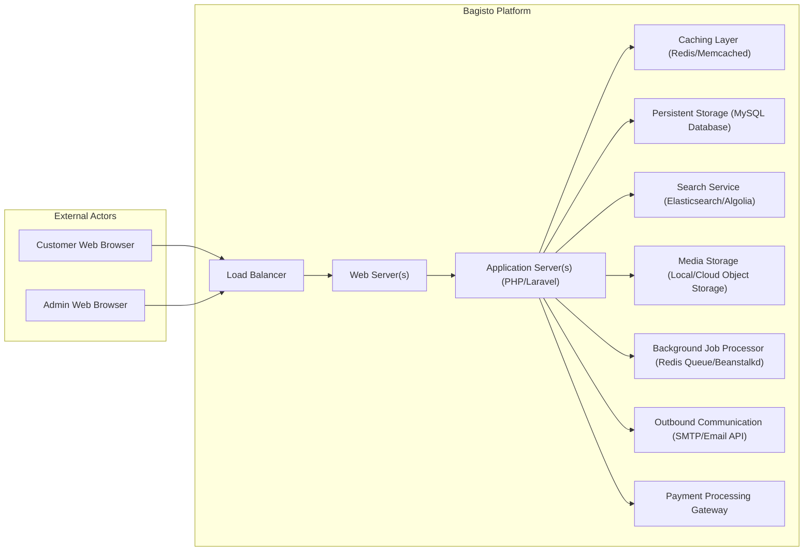
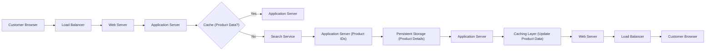
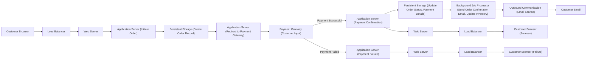
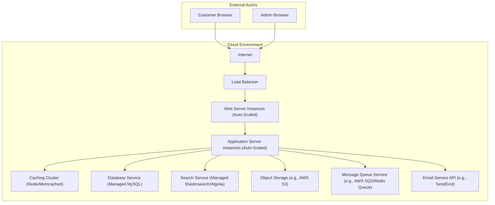

# Project Design Document: Bagisto E-commerce Platform

**Version:** 1.1
**Date:** October 26, 2023
**Author:** AI Software Architect

## 1. Introduction

This document provides an enhanced architectural design of the Bagisto e-commerce platform, based on the codebase at [https://github.com/bagisto/bagisto](https://github.com/bagisto/bagisto). This revision aims to provide greater clarity, detail, and a stronger focus on aspects relevant to threat modeling. It outlines the system's components, their interactions, and data flows with increased precision.

## 2. Goals and Objectives

The core objectives of the Bagisto platform are to:

* Deliver a robust and feature-rich e-commerce solution suitable for diverse business needs.
* Offer a highly adaptable and extensible platform leveraging its open-source nature and modular design.
* Empower merchants with comprehensive tools for managing product catalogs, processing orders, administering customer data, and executing marketing campaigns.
* Ensure the security and integrity of online transactions and sensitive data.
* Provide intuitive and efficient user interfaces for both customer storefront interactions and administrative tasks.

## 3. System Architecture

### 3.1. High-Level Architecture

This diagram illustrates the primary actors and the core components of the Bagisto platform.

### 3.2. Detailed Component Architecture

This section details the responsibilities of each key component within the Bagisto platform.

* **Web Server(s):**
    * Function: Handles incoming HTTP/HTTPS requests from clients (browsers). Performs initial request routing and may serve static content. Provides SSL/TLS termination.
    * Examples: Nginx, Apache.
* **Application Server(s) (PHP/Laravel):**
    * Function: Executes the core Bagisto application logic built on the Laravel framework. Manages routing, business logic, data processing, and interactions between components. Handles user authentication, authorization, and session management. Responsible for rendering dynamic content.
    * Key Responsibilities: Catalog management, order processing, customer management, user authentication, API handling (if enabled), event handling, and integration with other services.
* **Caching Layer (Redis/Memcached):**
    * Function: Stores frequently accessed data in-memory to reduce database load and improve response times. Used for caching database query results, session data, configuration settings, and other transient data.
* **Persistent Storage (MySQL Database):**
    * Function: Provides persistent storage for all application data, including product information, customer details, order history, user accounts, and system configurations. Ensures data integrity and availability.
* **Search Service (Elasticsearch/Algolia):**
    * Function: Enables fast and efficient searching of product catalogs and other relevant data. Indexes data from the database to provide optimized search results based on various criteria.
* **Media Storage (Local/Cloud Object Storage):**
    * Function: Stores media assets such as product images, videos, and downloadable files. Can be local file storage or cloud-based object storage services like AWS S3 or Google Cloud Storage, offering scalability and durability.
* **Background Job Processor (Redis Queue/Beanstalkd):**
    * Function: Manages asynchronous tasks that do not require immediate processing, such as sending emails, processing large data imports/exports, generating reports, and handling order fulfillment processes. Improves application responsiveness by offloading these tasks.
* **Outbound Communication (SMTP/Email API):**
    * Function: Handles sending transactional emails (e.g., order confirmations, password resets) and marketing emails to customers. Can utilize a direct SMTP server or integrate with third-party email service providers (e.g., SendGrid, Mailgun) for improved deliverability and features.
* **Payment Processing Gateway:**
    * Function: Integrates with external payment processors (e.g., PayPal, Stripe, Authorize.Net) to securely handle online payment transactions. Manages the communication with the payment gateway for authorization, capture, and refund processes. Sensitive data handling is typically offloaded to the payment gateway.

## 4. Data Flow

### 4.1. Customer Browsing Products with Search

### 4.2. Customer Placing an Order with Payment Processing

### 4.3. Admin Updating Product Information

```mermaid
flowchart LR
    A["Admin Browser"] --> B["Load Balancer"]
    B --> C["Web Server"]
    C --> D["Application Server (Authenticate Admin)"]
    D --> E["Application Server (Handle Product Update Request)"]
    E --> F["Persistent Storage (Update Product Data)"]
    F --> G["Search Service (Update Product Index)"]
    G --> H["Media Storage (Upload/Update Product Images)"]
    H --> I["Caching Layer (Invalidate Cached Product Data)"]
    I --> J["Application Server"]
    J --> K["Web Server"]
    K --> L["Load Balancer"]
    L --> M["Admin Browser"]
```

## 5. Security Considerations

This section outlines key security considerations for the Bagisto platform, providing a basis for threat modeling.

* **Authentication and Authorization:**
    * Considerations: Securely managing user credentials, implementing strong password policies, multi-factor authentication (MFA) for administrators, role-based access control (RBAC) to restrict access based on user roles.
    * Potential Threats: Brute-force attacks, credential stuffing, privilege escalation, unauthorized access to sensitive data and functionalities.
* **Input Validation and Output Encoding:**
    * Considerations: Rigorous validation of all user inputs on both the client and server-side to prevent injection attacks. Proper encoding of output data to prevent cross-site scripting (XSS) vulnerabilities.
    * Potential Threats: SQL injection, cross-site scripting (XSS), command injection, LDAP injection.
* **Session Management:**
    * Considerations: Securely managing user sessions using strong session IDs, HTTP-only and secure flags for cookies, session timeouts, and protection against session fixation and hijacking.
    * Potential Threats: Session hijacking, session fixation, unauthorized access due to compromised sessions.
* **Payment Security:**
    * Considerations: Adherence to PCI DSS standards if handling payment card data directly (strongly discouraged). Utilizing secure payment gateway integrations that handle sensitive payment information. Implementing HTTPS for all transactions.
    * Potential Threats: Credit card theft, man-in-the-middle attacks, unauthorized payment processing.
* **Data Protection:**
    * Considerations: Encryption of sensitive data at rest (e.g., using database encryption) and in transit (HTTPS). Secure storage and handling of personally identifiable information (PII) in compliance with privacy regulations.
    * Potential Threats: Data breaches, unauthorized access to sensitive data, compliance violations.
* **Access Control:**
    * Considerations: Implementing the principle of least privilege, restricting access to sensitive resources and functionalities based on user roles and permissions. Securely managing API keys and access tokens.
    * Potential Threats: Unauthorized access to administrative functions, data manipulation, system compromise.
* **Dependency Management:**
    * Considerations: Regularly updating third-party libraries and dependencies to patch known vulnerabilities. Utilizing dependency scanning tools to identify and address security risks in dependencies.
    * Potential Threats: Exploitation of known vulnerabilities in outdated libraries.
* **Rate Limiting and Throttling:**
    * Considerations: Implementing rate limiting on API endpoints and critical functionalities (e.g., login attempts, password reset) to prevent brute-force attacks and denial-of-service attempts.
    * Potential Threats: Brute-force attacks, denial-of-service (DoS) attacks.
* **Error Handling and Logging:**
    * Considerations: Implementing secure error handling to prevent information leakage through verbose error messages. Comprehensive logging of security-related events for auditing and incident response.
    * Potential Threats: Information disclosure through error messages, insufficient logging for security analysis.
* **Security Headers:**
    * Considerations: Implementing security-related HTTP headers (e.g., Content Security Policy, Strict-Transport-Security, X-Frame-Options) to enhance browser security.
    * Potential Threats: Clickjacking, XSS attacks, mixed content issues.

## 6. Deployment Diagram (Typical Cloud Deployment)

## 7. Technologies Used

This list details the primary technologies likely employed by the Bagisto platform.

* **Programming Language:** PHP
* **Framework:** Laravel (PHP Framework)
* **Database:** MySQL (Relational Database Management System)
* **Caching:** Redis or Memcached (In-memory Data Stores)
* **Search Engine:** Elasticsearch or Algolia (Distributed Search and Analytics Engine)
* **Frontend Technologies:** HTML, CSS, JavaScript (Likely utilizing a framework like Vue.js or similar within the Laravel ecosystem)
* **Templating Engine:** Blade (Laravel's Templating Engine)
* **Queue System:** Redis Queue or Beanstalkd (Asynchronous Task Queue)
* **Web Servers:** Nginx or Apache (HTTP Servers)
* **Package Manager (PHP):** Composer
* **Version Control System:** Git (Used for source code management, as seen in the GitHub repository)

## 8. Future Considerations

Potential future enhancements and architectural shifts for Bagisto could include:

* **Adoption of a Microservices Architecture:** Breaking down the monolithic application into smaller, independently deployable services to improve scalability, maintainability, and fault isolation.
* **Implementation of a Headless Commerce Approach:** Decoupling the frontend presentation layer from the backend commerce engine to enable greater flexibility in building diverse customer experiences across various channels.
* **Enhanced Progressive Web App (PWA) Support:** Further developing PWA capabilities for the storefront to provide a more app-like experience for users, including offline access and push notifications.
* **Integration with Advanced Analytics and Business Intelligence Platforms:** Providing richer data insights and reporting capabilities through integration with specialized analytics services.
* **Expansion of Payment Gateway Integrations:** Supporting a wider range of payment processors to cater to diverse geographical and business requirements.
* **Improved API Coverage and Documentation:** Developing comprehensive and well-documented APIs to facilitate integrations with third-party systems and mobile applications.
* **Continuous Performance Optimization:** Ongoing efforts to identify and address performance bottlenecks to ensure a fast and responsive user experience.

This revised design document provides a more detailed and security-focused overview of the Bagisto e-commerce platform's architecture, making it a more effective foundation for subsequent threat modeling activities. The enhanced component descriptions, data flow diagrams, and security considerations offer a clearer understanding of the system's potential attack surfaces and vulnerabilities.