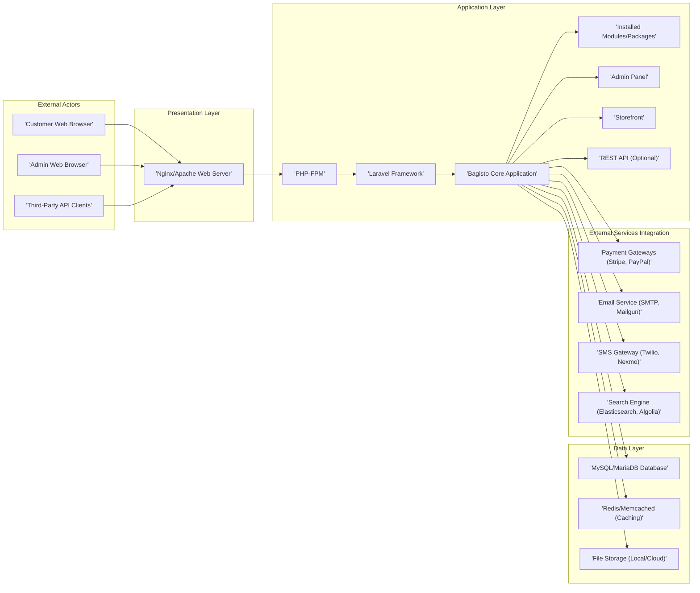

# Project Design Document: Bagisto E-commerce Platform

**Version:** 1.1
**Date:** October 26, 2023
**Prepared By:** Bard (AI Software Architecture Expert)

## 1. Introduction

This document provides an enhanced architectural design overview of the Bagisto e-commerce platform, based on the codebase available at [https://github.com/bagisto/bagisto](https://github.com/bagisto/bagisto). This revised document aims to provide a more detailed foundation for subsequent threat modeling activities. It elaborates on the key components, their interactions, and the underlying technologies, offering a deeper understanding of the system's structure.

## 2. Goals of this Document

*   Provide a clear, concise, and more detailed description of the Bagisto architecture.
*   Identify the major components and their specific responsibilities within the system.
*   Illustrate key data flow scenarios within the platform.
*   Highlight the core technologies and their roles.
*   Serve as a robust basis for identifying potential security threats and vulnerabilities across different layers of the application.

## 3. Target Audience

*   Security Engineers
*   Threat Modeling Teams
*   Software Development Team Members
*   DevOps and Operations Team Members

## 4. Architectural Overview

Bagisto is a comprehensive, open-source e-commerce platform built using the Laravel PHP framework. Adhering to the Model-View-Controller (MVC) architectural pattern, it offers a wide range of features necessary for developing and managing online stores, including product catalog management, order processing, customer management, and more.

## 5. System Architecture Diagram

## 6. Component Breakdown

This section provides a more detailed breakdown of the major components within the Bagisto platform.

*   **External Actors:**
    *   **Customer Web Browser:**  The primary interface for customers to browse products, add items to their cart, place orders, and manage their accounts.
    *   **Admin Web Browser:** The interface used by administrators to manage the store, including product listings, orders, customers, configurations, and marketing activities.
    *   **Third-Party API Clients:** External applications or services that may interact with Bagisto's optional REST API for data exchange or integration purposes.

*   **Presentation Layer (Nginx/Apache Web Server):**
    *   **Nginx/Apache Web Server:**  Serves as the entry point for all HTTP/HTTPS requests.
        *   Handles request routing and load balancing.
        *   Serves static content (images, CSS, JavaScript files).
        *   Manages SSL/TLS encryption and decryption.
        *   Acts as a reverse proxy, forwarding dynamic content requests to the application server.

*   **Application Layer (PHP-FPM, Laravel Framework, Bagisto Core Application, Installed Modules/Packages, Admin Panel, Storefront, REST API):**
    *   **PHP-FPM (FastCGI Process Manager):** Executes PHP scripts, providing a robust and efficient environment for the Laravel application.
    *   **Laravel Framework:** Provides the underlying structure and tools for building the web application, including:
        *   Routing mechanisms for handling incoming requests.
        *   Eloquent ORM for database interaction.
        *   Blade templating engine for rendering views.
        *   Authentication and authorization features.
        *   Security features like protection against CSRF and XSS.
    *   **Bagisto Core Application:** The heart of the e-commerce platform, implementing core functionalities:
        *   Product catalog management (categories, attributes, variants).
        *   Shopping cart and checkout process.
        *   Order management and fulfillment.
        *   Customer account management.
        *   User role and permission management.
        *   Event system for extending functionality.
    *   **Installed Modules/Packages:** Extend the core functionality with additional features:
        *   Payment gateway integrations (Stripe, PayPal, etc.).
        *   Shipping carrier integrations.
        *   Marketing and SEO tools.
        *   Inventory management enhancements.
    *   **Admin Panel:** A dedicated section of the application providing a user interface for administrators to manage the store's backend operations.
    *   **Storefront:** The public-facing part of the application that customers interact with to browse and purchase products.
    *   **REST API (Optional):**  Provides an interface for external applications to interact with Bagisto's data and functionalities. This may be used for mobile apps, integrations with other systems, or headless commerce implementations.

*   **Data Layer (MySQL/MariaDB Database, Redis/Memcached, File Storage):**
    *   **MySQL/MariaDB Database:** The primary persistent storage for all application data:
        *   Product information (details, pricing, inventory).
        *   Customer data (profiles, addresses, order history).
        *   Order details (items, shipping information, payment details).
        *   Configuration settings.
        *   Admin user accounts and permissions.
    *   **Redis/Memcached (Caching):**  In-memory data stores used to cache frequently accessed data to improve performance and reduce database load:
        *   Session data.
        *   Product catalog data.
        *   Configuration settings.
    *   **File Storage (Local/Cloud):** Stores uploaded files:
        *   Product images.
        *   User avatars.
        *   Other media assets.
        *   Can be local server storage or cloud-based object storage (e.g., AWS S3, Google Cloud Storage).

*   **External Services Integration (Payment Gateways, Email Service, SMS Gateway, Search Engine):**
    *   **Payment Gateways (Stripe, PayPal):** Third-party services for securely processing online payments, handling sensitive credit card or other payment information.
    *   **Email Service (SMTP, Mailgun):** Used for sending transactional emails (order confirmations, shipping updates, password resets) and potentially marketing communications.
    *   **SMS Gateway (Twilio, Nexmo):** Enables sending SMS messages for notifications (order updates, shipping notifications) or two-factor authentication.
    *   **Search Engine (Elasticsearch, Algolia):** Provides advanced search capabilities for the product catalog, allowing users to efficiently find products based on various criteria.

## 7. Data Flow Scenarios

This section outlines key data flow scenarios within the Bagisto platform.

*   **Customer Browsing Products:**
    1. A customer sends a request to view product listings from their **Customer Web Browser** to the **Nginx/Apache Web Server**.
    2. The **Web Server** forwards the request to **PHP-FPM**.
    3. The **Laravel Framework** routes the request to the appropriate controller in the **Bagisto Core Application** (**Storefront**).
    4. The **Bagisto Core** retrieves product data from the **MySQL/MariaDB Database**, potentially utilizing **Redis/Memcached** for cached data.
    5. The **Laravel Framework** renders the product listing view using the **Blade** templating engine.
    6. The rendered HTML is sent back through the **Web Server** to the **Customer Web Browser**.
    7. The **Customer Web Browser** may request static assets (images) from the **Web Server**.

*   **Admin User Creating a New Product:**
    1. An administrator interacts with the **Admin Panel** in their **Admin Web Browser**.
    2. The browser sends a request to create a new product to the **Nginx/Apache Web Server**.
    3. The **Web Server** forwards the request to **PHP-FPM**.
    4. The **Laravel Framework** routes the request to the appropriate controller in the **Bagisto Core Application** (**Admin Panel**).
    5. The **Bagisto Core** validates the input data.
    6. Product data is stored in the **MySQL/MariaDB Database**.
    7. If images are uploaded, they are stored in **File Storage**.
    8. The **Laravel Framework** renders a success message, sent back through the **Web Server** to the **Admin Web Browser**.

*   **Customer Placing an Order:**
    1. A customer adds products to their cart, updating session data (likely stored in **Redis/Memcached** or files).
    2. The customer proceeds to checkout and enters shipping and billing information.
    3. Upon confirming the order, the application interacts with a **Payment Gateway** to process the payment. This interaction typically involves secure server-to-server communication or client-side integration with the gateway's SDK.
    4. If payment is successful, the **Bagisto Core** creates a new order record in the **MySQL/MariaDB Database**.
    5. Order items, shipping details, and payment information are also stored in the database.
    6. The system sends order confirmation emails via the **Email Service**.
    7. Inventory levels are updated in the **MySQL/MariaDB Database**.
    8. Optionally, SMS notifications may be sent via the **SMS Gateway**.

## 8. Key Technologies

*   **Primary Programming Language:** PHP
*   **Web Application Framework:** Laravel
*   **Relational Database:** MySQL or MariaDB
*   **Caching Technologies:** Redis or Memcached
*   **Web Server Software:** Nginx or Apache
*   **Frontend Technologies:** HTML, CSS, JavaScript (likely utilizing frameworks/libraries)
*   **Templating Engine:** Blade (Laravel's default)
*   **Dependency Management:** Composer
*   **Version Control System:** Git

## 9. Security Considerations (Pre-Threat Modeling)

This section expands on the initial security considerations, providing more specific examples relevant to the Bagisto architecture.

*   **Presentation Layer Security:**
    *   **Web Server Hardening:** Secure configuration of Nginx/Apache to prevent common attacks.
    *   **TLS/SSL Configuration:** Ensuring strong encryption and proper certificate management for HTTPS.
    *   **Protection against DDoS attacks:** Implementing rate limiting and other mitigation strategies.

*   **Application Layer Security:**
    *   **Laravel Security Features:** Leveraging built-in protections against CSRF, XSS, and SQL Injection.
    *   **Secure Authentication and Authorization:** Robust mechanisms for user login, session management, and role-based access control for both customers and administrators.
    *   **Input Validation and Sanitization:** Thoroughly validating and sanitizing user inputs to prevent injection attacks.
    *   **Secure Password Storage:** Using strong hashing algorithms (e.g., bcrypt) for storing user passwords.
    *   **Vulnerability Management:** Regularly updating Laravel and all dependencies to patch known security vulnerabilities.
    *   **Admin Panel Security:** Protecting the admin panel with strong authentication and authorization measures.
    *   **API Security (if REST API is enabled):** Implementing authentication (e.g., OAuth 2.0), authorization, and rate limiting for API endpoints.

*   **Data Layer Security:**
    *   **Database Security:** Secure database configurations, strong passwords for database users, and restricting database access.
    *   **Data Encryption:** Encrypting sensitive data at rest in the database and during transmission.
    *   **Cache Security:** Ensuring that sensitive data is not inadvertently stored in the cache.
    *   **File Storage Security:** Implementing appropriate access controls and permissions for file storage to prevent unauthorized access or modification.

*   **External Services Integration Security:**
    *   **Secure Communication:** Using HTTPS for all communication with external services.
    *   **API Key Management:** Securely storing and managing API keys and secrets for third-party services.
    *   **Webhook Security:** Verifying the authenticity of webhooks received from external services.
    *   **Payment Gateway Integration Security:** Adhering to PCI DSS compliance if handling payment card data directly (though ideally, this is offloaded to the payment gateway).

*   **General Security Practices:**
    *   **Regular Security Audits and Penetration Testing:** Identifying potential vulnerabilities through proactive security assessments.
    *   **Security Logging and Monitoring:** Implementing robust logging and monitoring to detect and respond to security incidents.
    *   **Secure Development Practices:** Following secure coding guidelines and conducting code reviews.

## 10. Conclusion

This enhanced design document provides a more comprehensive understanding of the Bagisto e-commerce platform's architecture. By detailing the components, data flows, and technologies involved, it serves as a valuable resource for identifying and mitigating potential security threats. This document will be instrumental in guiding the subsequent threat modeling process, ensuring a more secure and reliable platform.
