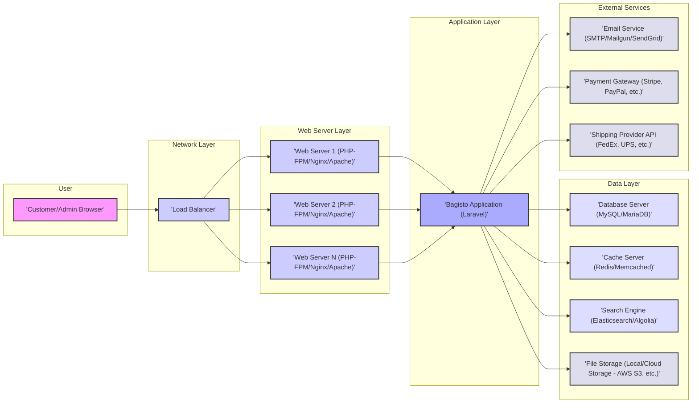
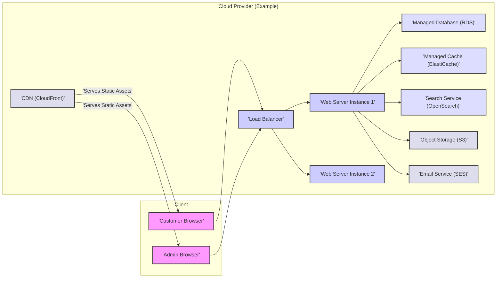

# Project Design Document: Bagisto E-commerce Platform

**Version:** 1.1
**Date:** October 26, 2023
**Author:** AI Software Architect

## 1. Introduction

This document provides an enhanced and more detailed design overview of the Bagisto e-commerce platform (as represented by the codebase at [https://github.com/bagisto/bagisto](https://github.com/bagisto/bagisto)). This iteration aims to provide a more granular understanding of the system's architecture, specifically tailored for effective threat modeling. It expands on the previous version by providing more detail on component interactions, data flows, and potential security considerations.

## 2. Goals and Objectives

The primary goals of the Bagisto project remain to provide a comprehensive and customizable open-source e-commerce platform. Key objectives include:

*   Empowering merchants to design and manage diverse online storefronts.
*   Delivering an intuitive and efficient shopping experience for end-users.
*   Supporting a wide array of product types, hierarchical categories, and customizable attributes.
*   Streamlining order lifecycle management, secure payment processing, and flexible shipping options.
*   Offering integrated marketing and promotional functionalities.
*   Maintaining a scalable and extensible architecture to accommodate growth and customization.

## 3. High-Level Architecture

Bagisto adheres to a Model-View-Controller (MVC) architectural pattern, built upon the robust Laravel PHP framework. The following diagram illustrates the high-level interaction between the core components.

## 4. Detailed Component Design

This section provides a more granular breakdown of the key components within the Bagisto application.

### 4.1. User Interface (Frontend)

*   **Customer Frontend Components:**
    *   **Product Listing and Detail Pages:** Display product information, images, pricing, and availability.
    *   **Category Navigation:** Allows users to browse products by category.
    *   **Search Functionality:** Enables users to search for specific products.
    *   **Shopping Cart:** Manages items the user intends to purchase.
    *   **Checkout Process:** Guides users through shipping, payment, and order confirmation.
    *   **Customer Account Management:** Allows users to manage their profiles, orders, and addresses.
    *   **Wishlist and Compare Features:** Enables users to save and compare products.
*   **Admin Panel Components:**
    *   **Dashboard:** Provides an overview of key store metrics.
    *   **Product Management Module:** Allows administrators to create, edit, and manage product listings, including attributes, images, and inventory.
    *   **Category Management Module:** Enables administrators to create and manage product categories and subcategories.
    *   **Order Management Module:** Provides tools to view, process, and manage customer orders.
    *   **Customer Management Module:** Allows administrators to manage customer accounts and information.
    *   **Marketing Module:** Includes features for creating promotions, coupons, and managing newsletters.
    *   **Configuration Module:** Enables administrators to configure various store settings, such as payment methods, shipping methods, and currency settings.
    *   **CMS (Content Management System):** Allows management of static pages and content blocks.
    *   **Reporting and Analytics:** Provides insights into sales, customer behavior, and other key metrics.

### 4.2. Application Logic (Backend)

*   **Frontend Controllers:**
    *   `ProductController`: Handles requests related to viewing product listings and details.
    *   `CategoryController`: Manages requests for displaying product categories.
    *   `CartController`: Handles actions related to the shopping cart.
    *   `CheckoutController`: Manages the checkout process.
    *   `CustomerController`: Handles customer account management.
*   **Backend Controllers (Admin Panel):**
    *   `AdminProductController`: Manages product creation, editing, and deletion.
    *   `AdminCategoryController`: Manages category creation and modification.
    *   `AdminOrderController`: Handles order processing and management.
    *   `AdminCustomerController`: Manages customer data.
    *   `AdminMarketingController`: Manages promotions and coupons.
    *   `AdminConfigurationController`: Handles store configuration settings.
*   **Service Layer:**
    *   `ProductService`: Contains business logic related to product management.
    *   `CategoryService`: Handles business logic for categories.
    *   `OrderService`: Manages the order processing workflow.
    *   `CustomerService`: Handles customer-related business logic.
    *   `PaymentService`: Integrates with payment gateways.
    *   `ShippingService`: Calculates shipping costs and integrates with shipping providers.
*   **Models (Eloquent ORM):**
    *   `Product`: Represents product data.
    *   `Category`: Represents product categories.
    *   `Customer`: Represents customer information.
    *   `Order`: Represents customer orders.
    *   `OrderItem`: Represents individual items within an order.
    *   `Attribute`: Represents product attributes (e.g., color, size).
    *   `InventorySource`: Represents inventory locations.
*   **Middleware:**
    *   `Authenticate`: Verifies user authentication.
    *   `Authorize`: Checks user authorization for specific actions.
    *   `RedirectIfAuthenticated`: Redirects authenticated users away from login/register pages.
    *   `TrimStrings`: Trims whitespace from incoming request strings.
    *   `ConvertEmptyStringsToNull`: Converts empty request strings to null.
*   **Events and Listeners:**
    *   `OrderWasPlaced`: Triggers actions after an order is placed (e.g., sending confirmation emails, updating inventory).
    *   `CustomerWasRegistered`: Triggers actions after a new customer registers.
*   **Console Commands (Examples):**
    *   `php artisan migrate`: Runs database migrations.
    *   `php artisan queue:work`: Processes queued jobs.
    *   `php artisan cache:clear`: Clears the application cache.
*   **API Routes (Examples):**
    *   `/api/products`: Retrieves a list of products.
    *   `/api/cart`: Manages the user's shopping cart.
    *   `/api/checkout`: Handles the checkout process via API.

### 4.3. Data Storage

*   **Relational Database (MySQL/MariaDB):**
    *   Stores structured data in tables with defined relationships.
    *   Key tables include: `products`, `categories`, `customers`, `orders`, `order_items`, `attributes`, `attribute_families`, `inventories`, `addresses`, `currencies`, `locales`, etc.
*   **File Storage (Local/Cloud Storage - AWS S3, Google Cloud Storage, Azure Blob Storage):**
    *   Stores unstructured data like product images, videos, and downloadable files.
    *   Configuration determines the storage location and access methods.
*   **Cache (Redis/Memcached):**
    *   Stores frequently accessed data in-memory for faster retrieval.
    *   Used for caching:
        *   Database query results.
        *   Session data.
        *   Configuration settings.
        *   Product and category data.
*   **Search Index (Elasticsearch/Algolia):**
    *   Stores an indexed version of product data for efficient searching.
    *   Allows for complex search queries based on keywords, attributes, and categories.

### 4.4. External Integrations

*   **Payment Gateway Integrations:**
    *   Specific implementations for various providers like Stripe, PayPal, Authorize.Net, etc.
    *   Handle secure payment processing, including authorization and capture.
    *   Often involve redirecting users to the payment gateway's website or using embedded payment forms.
*   **Shipping Provider API Integrations:**
    *   Implementations for carriers like FedEx, UPS, USPS, DHL.
    *   Used for retrieving real-time shipping rates and generating shipping labels.
    *   May involve API calls to retrieve tracking information.
*   **Email Service Integrations:**
    *   Integration with services like Mailgun, SendGrid, Amazon SES, or SMTP servers.
    *   Used for sending transactional emails (order confirmations, shipping updates, password resets) and marketing emails.
*   **Search Engine Integration:**
    *   Involves synchronizing product data with the search engine index.
    *   Handles search queries and returns relevant product results.
*   **Social Media and Marketing Platform Integrations:**
    *   Potential integrations for social login, sharing, and marketing automation platforms.

## 5. Data Flow (Detailed Scenarios)

This section outlines more specific data flow scenarios.

*   **Customer Browsing a Product:**
    1. Customer clicks on a product link in their browser.
    2. The browser sends an HTTP GET request to the web server.
    3. The load balancer routes the request to an available web server.
    4. The web server passes the request to the `ProductController`.
    5. The `ProductController` retrieves product data from the database via the `Product` model, potentially using the cache.
    6. The `ProductController` may also retrieve related data like category information and product images.
    7. The `ProductController` passes the data to the appropriate Blade template.
    8. The Blade template renders the HTML for the product detail page.
    9. The web server sends the HTML response back to the customer's browser.
    10. The browser renders the page and may request additional assets (images, CSS, JS).

*   **Customer Placing an Order:**
    1. Customer adds products to their shopping cart.
    2. Customer proceeds to the checkout.
    3. The browser sends form data (shipping address, payment details) via an HTTP POST request.
    4. The `CheckoutController` receives the request.
    5. The `CheckoutController` validates the input data.
    6. The `CheckoutController` interacts with the `PaymentService` to process the payment.
    7. Upon successful payment, the `CheckoutController` creates a new `Order` record in the database, including `OrderItem` records.
    8. The `CheckoutController` interacts with the `ShippingService` to calculate shipping costs and potentially create a shipment.
    9. The `OrderWasPlaced` event is triggered.
    10. Listeners to this event (e.g., sending order confirmation email, updating inventory) are executed.
    11. The `CheckoutController` redirects the customer to an order confirmation page.

*   **Admin Updating Product Inventory:**
    1. Admin logs into the admin panel.
    2. Admin navigates to the product management section.
    3. Admin edits the inventory for a specific product.
    4. The browser sends an HTTP POST request to the `AdminProductController`.
    5. The `AdminProductController` validates the input.
    6. The `AdminProductController` updates the inventory information in the database via the `Product` and `InventorySource` models.
    7. The `AdminProductController` may clear relevant cache entries.
    8. The `AdminProductController` redirects the admin back to the product management page.

## 6. Security Considerations (Enhanced)

This section expands on potential security areas, providing more specific examples.

*   **Authentication and Authorization:**
    *   **Threat:** Brute-force attacks on login forms, weak password policies, session hijacking, privilege escalation.
    *   **Considerations:** Implement strong password policies, multi-factor authentication (MFA), rate limiting on login attempts, secure session management (HTTPOnly, Secure flags), role-based access control (RBAC).
*   **Input Validation:**
    *   **Threat:** SQL injection, cross-site scripting (XSS), command injection, path traversal.
    *   **Considerations:** Sanitize and validate all user inputs on both the client-side and server-side, use parameterized queries for database interactions, escape output data appropriately.
*   **Data Protection:**
    *   **Threat:** Exposure of sensitive data (customer PII, payment information) in transit and at rest.
    *   **Considerations:** Use HTTPS for all communication, encrypt sensitive data at rest in the database, avoid storing sensitive data unnecessarily, comply with PCI DSS for payment data handling.
*   **Session Management:**
    *   **Threat:** Session fixation, session hijacking.
    *   **Considerations:** Generate strong and unpredictable session IDs, regenerate session IDs after login, set appropriate session timeouts, use secure session cookies.
*   **Payment Security:**
    *   **Threat:** Man-in-the-middle attacks, storage of sensitive payment data, vulnerabilities in payment gateway integrations.
    *   **Considerations:** Utilize secure payment gateways, avoid storing sensitive payment data locally, implement tokenization, ensure PCI DSS compliance.
*   **Dependency Management:**
    *   **Threat:** Exploiting known vulnerabilities in third-party libraries and dependencies.
    *   **Considerations:** Regularly update dependencies, use dependency scanning tools to identify vulnerabilities.
*   **File Upload Security:**
    *   **Threat:** Uploading malicious files (e.g., web shells).
    *   **Considerations:** Validate file types and sizes, sanitize file names, store uploaded files outside the webroot, use virus scanning.
*   **API Security:**
    *   **Threat:** Unauthorized access to API endpoints, data breaches through API vulnerabilities.
    *   **Considerations:** Implement authentication and authorization for API endpoints (e.g., API keys, OAuth 2.0), rate limiting, input validation.
*   **Cross-Site Request Forgery (CSRF) Protection:**
    *   **Threat:** Unauthorized actions performed on behalf of authenticated users.
    *   **Considerations:** Implement CSRF tokens for all state-changing requests.
*   **Cross-Origin Resource Sharing (CORS):**
    *   **Threat:** Unauthorized access to resources from different origins.
    *   **Considerations:** Configure CORS headers appropriately to restrict cross-origin requests.

## 7. Deployment Architecture (Variations)

Beyond the standard cloud deployment, other variations exist:

*   **On-Premise Deployment:** Hosting Bagisto on the merchant's own infrastructure.
*   **Containerized Deployment (Docker, Kubernetes):** Deploying Bagisto within containers for scalability and portability.
*   **Platform-as-a-Service (PaaS):** Utilizing platforms like Heroku or AWS Elastic Beanstalk for simplified deployment and management.
*   **Headless Commerce:** Decoupling the frontend from the backend, allowing for different frontend implementations (e.g., mobile apps, PWAs).

## 8. Technology Stack (Details)

*   **Programming Language:** PHP (version 7.4 or higher recommended)
*   **Framework:** Laravel (version 8.x or higher recommended)
*   **Database:** MySQL (version 5.7 or higher) or MariaDB
*   **Templating Engine:** Blade
*   **Web Servers:** Nginx or Apache (with mod_php or PHP-FPM)
*   **Caching:** Redis or Memcached
*   **Search Engine (Optional):** Elasticsearch or Algolia
*   **Frontend Technologies:** HTML5, CSS3, JavaScript (often utilizing libraries like jQuery or potentially frameworks like Vue.js for custom themes/extensions)
*   **Package Manager:** Composer
*   **Version Control:** Git

## 9. Assumptions and Constraints

*   This design document is based on the general architecture of Bagisto as observed in the provided GitHub repository. Specific implementations and customizations may vary.
*   The deployment architectures described are examples, and the actual deployment will depend on the specific needs and resources of the merchant.
*   Security considerations are intended to be a starting point for threat modeling and should be further investigated and validated.
*   The technology stack details reflect common configurations but may differ based on specific installations.

This improved design document provides a more detailed and nuanced understanding of the Bagisto e-commerce platform, making it a more effective foundation for comprehensive threat modeling activities. The added granularity in component descriptions, data flow scenarios, and security considerations will facilitate the identification of a wider range of potential vulnerabilities.