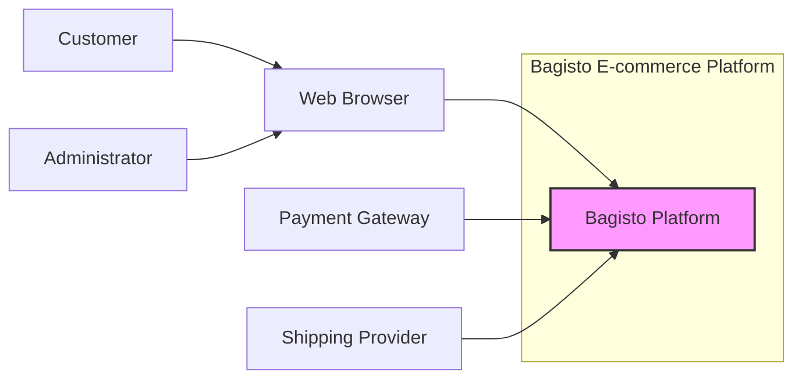
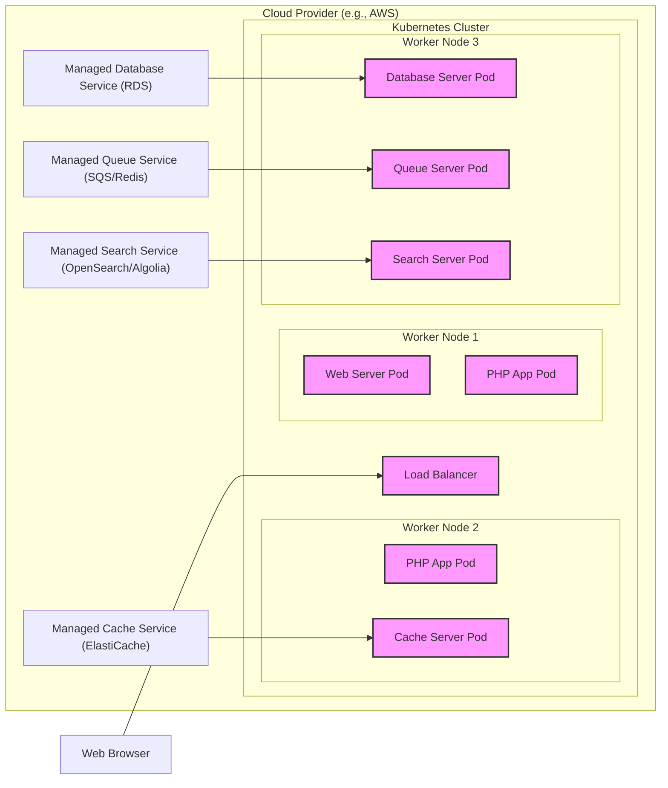

# BUSINESS POSTURE

Bagisto is an open-source e-commerce platform built on top of Laravel. It aims to provide a comprehensive solution for businesses to create and manage online stores.

- Business priorities:
  - Provide a feature-rich e-commerce platform to meet diverse business needs.
  - Ensure platform stability and reliability for uninterrupted online store operations.
  - Offer scalability to accommodate business growth and increasing transaction volumes.
  - Maintain a secure platform to protect sensitive customer and business data.
  - Foster an active community and provide good documentation for ease of use and adoption.

- Business goals:
  - Enable businesses to quickly and easily set up and manage online stores.
  - Offer a customizable and extensible platform to adapt to specific business requirements.
  - Provide tools for effective product management, order processing, and customer relationship management.
  - Support various payment gateways and shipping methods to cater to a global customer base.
  - Build a strong ecosystem of developers and partners around the platform.

- Business risks:
  - Data breaches leading to loss of customer trust and financial penalties.
  - System downtime resulting in lost sales and damage to reputation.
  - Performance issues affecting user experience and conversion rates.
  - Security vulnerabilities exploited by malicious actors.
  - Lack of community support or slow development hindering platform adoption and growth.
  - Compliance issues with data privacy regulations (e.g., GDPR, CCPA).

# SECURITY POSTURE

- Security controls:
  - security control: Laravel framework security features (CSRF protection, protection against SQL injection, etc.) - Implemented within the Laravel framework itself.
  - security control: Input validation and sanitization - Expected to be implemented throughout the application codebase, especially in controllers and models.
  - security control: Authentication and authorization mechanisms - Implemented using Laravel's built-in authentication and authorization features, likely customized for e-commerce roles (admin, customer, etc.).
  - security control: HTTPS encryption - Expected to be configured for production deployments, typically at the web server or load balancer level.
  - security control: Regular security updates for Laravel and dependencies - Responsibility of the platform maintainers and users to apply updates.
  - security control: Code reviews -  Likely practiced by the development team, especially for core platform changes.
  - security control: Security testing (basic) -  Likely performed by the development team, potentially including unit and integration tests with some security considerations.

- Accepted risks:
  - accepted risk:  Potential for vulnerabilities in third-party packages - Risk mitigated by dependency scanning and regular updates, but not fully eliminated.
  - accepted risk:  Configuration errors leading to security weaknesses - Risk mitigated by documentation and best practices, but relies on user diligence.
  - accepted risk:  Slow adoption of security patches by users -  Risk inherent in open-source software, mitigated by clear communication and update mechanisms.
  - accepted risk:  Social engineering attacks targeting administrators - Risk mitigated by security awareness training and strong account security practices.

- Recommended security controls:
  - security control: Implement a Web Application Firewall (WAF) to protect against common web attacks.
  - security control: Integrate Static Application Security Testing (SAST) tools into the CI/CD pipeline to automatically detect vulnerabilities in the code.
  - security control: Implement Dynamic Application Security Testing (DAST) to identify runtime vulnerabilities.
  - security control: Conduct regular penetration testing by security professionals to assess the platform's security posture.
  - security control: Implement a robust security incident response plan.
  - security control:  Enhance logging and monitoring for security events and anomalies.
  - security control:  Implement database encryption at rest and in transit for sensitive data.
  - security control:  Strengthen access control mechanisms, including multi-factor authentication for administrators.
  - security control:  Implement a Content Security Policy (CSP) to mitigate cross-site scripting (XSS) attacks.
  - security control:  Regularly scan dependencies for known vulnerabilities using tools like Dependabot or similar.

- Security requirements:
  - Authentication:
    - Requirement: Secure user authentication for administrators and customers.
    - Requirement: Support for strong password policies and password reset mechanisms.
    - Requirement: Consider multi-factor authentication (MFA) for administrator accounts.
    - Requirement: Protection against brute-force attacks on login forms (rate limiting, account lockout).
  - Authorization:
    - Requirement: Role-based access control (RBAC) to manage permissions for administrators and different user roles.
    - Requirement: Ensure proper authorization checks are in place before granting access to resources and functionalities.
    - Requirement: Principle of least privilege should be applied to user roles and permissions.
  - Input validation:
    - Requirement: Comprehensive input validation and sanitization for all user inputs to prevent injection attacks (SQL injection, XSS, etc.).
    - Requirement: Server-side validation should be enforced, not relying solely on client-side validation.
    - Requirement: Use parameterized queries or ORM features to prevent SQL injection.
  - Cryptography:
    - Requirement: Use strong encryption algorithms for sensitive data at rest and in transit.
    - Requirement: Securely store and manage cryptographic keys.
    - Requirement: Implement HTTPS for all communication to protect data in transit.
    - Requirement: Properly handle and store sensitive data like passwords and payment information using secure hashing and encryption techniques.

# DESIGN

## C4 CONTEXT



- Context Diagram Elements:
  - Element:
    - Name: Bagisto Platform
    - Type: Software System
    - Description: The Bagisto e-commerce platform itself, providing online store functionalities.
    - Responsibilities: Product catalog management, order processing, customer management, payment processing, shipping integration, user interface for customers and administrators.
    - Security controls: Authentication, authorization, input validation, data encryption, security logging, vulnerability management.
  - Element:
    - Name: Web Browser
    - Type: Person (Customer), Person (Administrator)
    - Description:  Used by customers to access the online store and by administrators to manage the platform.
    - Responsibilities:  Customers - browsing products, placing orders, managing accounts. Administrators - managing products, orders, customers, platform settings, and content.
    - Security controls: Browser security features, user awareness of phishing and malware.
  - Element:
    - Name: Payment Gateway
    - Type: External System
    - Description: Third-party service for processing online payments (e.g., Stripe, PayPal).
    - Responsibilities: Securely processing payment transactions, handling payment authorizations and settlements.
    - Security controls: PCI DSS compliance, secure API communication, encryption of payment data.
  - Element:
    - Name: Shipping Provider
    - Type: External System
    - Description: Third-party service for managing shipping and delivery of orders (e.g., FedEx, UPS).
    - Responsibilities: Calculating shipping costs, generating shipping labels, tracking shipments.
    - Security controls: Secure API communication, data exchange security.

## C4 CONTAINER

```mermaid
graph LR
    subgraph "Bagisto E-commerce Platform"
        A["Web Server" <br> (Nginx/Apache)]
        B["PHP Application" <br> (Laravel/Bagisto Code)]
        C["Database Server" <br> (MySQL/MariaDB)]
        D["Cache Server" <br> (Redis/Memcached)]
        E["Queue Server" <br> (Redis/Beanstalkd)]
        F["Search Server" <br> (Elasticsearch/Algolia)]

        B --> C
        B --> D
        B --> E
        B --> F
        A --> B
    end
    G["Web Browser"] --> A
    H["Payment Gateway"] --> B
    I["Shipping Provider"] --> B
    style A fill:#f9f,stroke:#333,stroke-width:2px
    style B fill:#f9f,stroke:#333,stroke-width:2px
    style C fill:#f9f,stroke:#333,stroke-width:2px
    style D fill:#f9f,stroke:#333,stroke-width:2px
    style E fill:#f9f,stroke:#333,stroke-width:2px
    style F fill:#f9f,stroke:#333,stroke-width:2px
```

- Container Diagram Elements:
  - Element:
    - Name: Web Server (Nginx/Apache)
    - Type: Container
    - Description:  Handles incoming HTTP requests from web browsers and proxies them to the PHP application. Serves static assets.
    - Responsibilities:  Receiving web requests, serving static content, SSL termination, load balancing (potentially).
    - Security controls: HTTPS configuration, web server hardening, access control, DDoS protection (potentially via WAF).
  - Element:
    - Name: PHP Application (Laravel/Bagisto Code)
    - Type: Container
    - Description:  The core Bagisto application code written in PHP using the Laravel framework. Handles business logic, data processing, and interacts with other containers.
    - Responsibilities:  Implementing e-commerce functionalities, handling user requests, interacting with the database, cache, queue, and search servers, integrating with external systems (payment gateways, shipping providers).
    - Security controls: Input validation, authorization, secure coding practices, vulnerability scanning, framework security features, session management, CSRF protection.
  - Element:
    - Name: Database Server (MySQL/MariaDB)
    - Type: Container
    - Description:  Stores persistent data for the Bagisto application, including product information, customer data, orders, and platform settings.
    - Responsibilities:  Data storage, data retrieval, data integrity, data backup and recovery.
    - Security controls: Database access control, database hardening, data encryption at rest, regular backups, SQL injection prevention (handled by application layer primarily).
  - Element:
    - Name: Cache Server (Redis/Memcached)
    - Type: Container
    - Description:  In-memory data store used for caching frequently accessed data to improve application performance.
    - Responsibilities:  Caching data, reducing database load, improving response times.
    - Security controls: Access control, secure configuration, protection against cache poisoning.
  - Element:
    - Name: Queue Server (Redis/Beanstalkd)
    - Type: Container
    - Description:  Handles asynchronous tasks and background jobs, such as sending emails, processing orders, and generating reports.
    - Responsibilities:  Queue management, task scheduling, background processing.
    - Security controls: Access control, secure configuration, protection against message tampering.
  - Element:
    - Name: Search Server (Elasticsearch/Algolia)
    - Type: Container
    - Description:  Provides fast and efficient search capabilities for products and other data within the platform.
    - Responsibilities:  Indexing data, handling search queries, providing search results.
    - Security controls: Access control, secure configuration, data sanitization before indexing.

## DEPLOYMENT

Deployment Solution: Cloud-based deployment using container orchestration (Kubernetes) on a cloud provider (AWS, GCP, Azure).



- Deployment Diagram Elements:
  - Element:
    - Name: Load Balancer
    - Type: Infrastructure
    - Description: Distributes incoming traffic across multiple Web Server Pods for high availability and scalability.
    - Responsibilities: Traffic distribution, health checks, SSL termination.
    - Security controls: DDoS protection, SSL/TLS configuration, access control.
  - Element:
    - Name: Web Server Pod
    - Type: Container Instance
    - Description: Instance of the Web Server container (Nginx/Apache) running within a Kubernetes pod.
    - Responsibilities: Serving static content, proxying requests to PHP App Pods.
    - Security controls: Container security hardening, network policies, resource limits.
  - Element:
    - Name: PHP App Pod
    - Type: Container Instance
    - Description: Instance of the PHP Application container (Laravel/Bagisto) running within a Kubernetes pod.
    - Responsibilities: Handling application logic, processing requests, interacting with other services.
    - Security controls: Container security hardening, network policies, resource limits, application-level security controls.
  - Element:
    - Name: Cache Server Pod
    - Type: Container Instance
    - Description: Instance of the Cache Server container (Redis/Memcached) running within a Kubernetes pod or using a managed service.
    - Responsibilities: Caching data for performance optimization.
    - Security controls: Network policies, access control, secure configuration.
  - Element:
    - Name: Database Server Pod / Managed Database Service (RDS)
    - Type: Infrastructure / Managed Service
    - Description: Database server (MySQL/MariaDB) either running in a Kubernetes pod or using a managed database service provided by the cloud provider. Managed service is recommended for production.
    - Responsibilities: Persistent data storage.
    - Security controls: Database access control, encryption at rest and in transit, regular backups, security patching, network policies.
  - Element:
    - Name: Queue Server Pod / Managed Queue Service (SQS/Redis)
    - Type: Infrastructure / Managed Service
    - Description: Queue server (Redis/Beanstalkd) either running in a Kubernetes pod or using a managed queue service. Managed service is recommended for production.
    - Responsibilities: Asynchronous task processing.
    - Security controls: Access control, secure configuration, network policies.
  - Element:
    - Name: Search Server Pod / Managed Search Service (OpenSearch/Algolia)
    - Type: Infrastructure / Managed Service
    - Description: Search server (Elasticsearch/Algolia) either running in a Kubernetes pod or using a managed search service. Managed service is recommended for production.
    - Responsibilities: Search functionality.
    - Security controls: Access control, secure configuration, data sanitization, network policies.

## BUILD

```mermaid
graph LR
    A["Developer"] --> B["Code Repository (GitHub)"];
    B --> C["CI/CD Pipeline (GitHub Actions)"];
    C --> D["Build Stage"];
    D --> E["Test Stage (SAST, Unit Tests)"];
    E --> F["Package/Containerize Stage"];
    F --> G["Artifact Repository (Container Registry)"];
    G --> H["Deployment Pipeline"];
    H --> I["Deployment Environment"];
    style A fill:#ccf,stroke:#333,stroke-width:2px
    style B fill:#f9f,stroke:#333,stroke-width:2px
    style C fill:#f9f,stroke:#333,stroke-width:2px
    style D fill:#f9f,stroke:#333,stroke-width:2px
    style E fill:#f9f,stroke:#333,stroke-width:2px
    style F fill:#f9f,stroke:#333,stroke-width:2px
    style G fill:#f9f,stroke:#333,stroke-width:2px
    style H fill:#f9f,stroke:#333,stroke-width:2px
    style I fill:#f9f,stroke:#333,stroke-width:2px
```



- Build Process Description:
  - Developer commits code changes to the Code Repository (GitHub).
  - CI/CD Pipeline (GitHub Actions) is triggered automatically on code changes (e.g., push, pull request).
  - Build Stage: Dependencies are installed, code is compiled (if necessary), and static assets are built.
  - Test Stage: Automated tests are executed, including:
    - SAST (Static Application Security Testing) tools scan the code for potential vulnerabilities.
    - Unit tests verify the functionality of individual code components.
  - Package/Containerize Stage: The application is packaged into deployable artifacts, such as:
    - PHP application files are packaged into a release archive.
    - Docker containers are built for different components (web server, application, etc.).
  - Artifact Repository (Container Registry): Built artifacts (release archives, container images) are stored in a secure artifact repository (e.g., GitHub Container Registry, Docker Hub, AWS ECR).
  - Deployment Pipeline:  Artifacts from the repository are deployed to the Deployment Environment through an automated deployment pipeline.

- Build Process Security Controls:
  - security control: Secure Code Repository (GitHub) - Access control, branch protection, audit logs.
  - security control: Automated CI/CD Pipeline (GitHub Actions) - Pipeline as code, access control, secure secrets management, isolated build environments.
  - security control: Static Application Security Testing (SAST) - Automated code scanning for vulnerabilities during the build process.
  - security control: Dependency Scanning - Automated scanning of project dependencies for known vulnerabilities.
  - security control: Container Image Scanning - Scanning container images for vulnerabilities before deployment.
  - security control: Secure Artifact Repository (Container Registry) - Access control, vulnerability scanning, image signing.
  - security control: Code Signing - Signing code artifacts to ensure integrity and authenticity.
  - security control: Build Environment Hardening - Secure configuration of build agents and environments.
  - security control: Principle of Least Privilege - Granting only necessary permissions to build processes and service accounts.
  - security control: Audit Logging - Logging build process activities for monitoring and auditing.

# RISK ASSESSMENT

- Critical Business Processes:
  - Customer registration and account management.
  - Product browsing and search.
  - Shopping cart and checkout process.
  - Order placement and processing.
  - Payment processing.
  - Shipping and fulfillment.
  - Administrator login and platform management.
  - Product and inventory management.
  - Customer data management.
  - Reporting and analytics.

- Data Sensitivity:
  - High Sensitivity:
    - Customer Personally Identifiable Information (PII): Names, addresses, email addresses, phone numbers.
    - Payment Information: Credit card details, bank account information (handled by Payment Gateway, but platform interacts with it).
    - Order History and Purchase Details.
    - Administrator credentials and access keys.
  - Medium Sensitivity:
    - Product information and inventory data.
    - Order status and shipping information.
    - Website content and configuration.
  - Low Sensitivity:
    - Publicly available product descriptions and images.
    - Website usage statistics (anonymized).

# QUESTIONS & ASSUMPTIONS

- Questions:
  - What are the specific compliance requirements for the platform (e.g., PCI DSS, GDPR, CCPA)?
  - What is the organization's risk appetite regarding security vulnerabilities?
  - What is the budget allocated for security measures?
  - Are there any existing security policies or standards that need to be adhered to?
  - What are the expected traffic volumes and scalability requirements for the platform?
  - What are the specific integrations with payment gateways and shipping providers?
  - What level of security expertise is available within the development and operations teams?
  - What are the requirements for data retention and disposal?
  - Is there a security incident response plan in place?

- Assumptions:
  - Assumption: The platform will handle sensitive customer and payment data.
  - Assumption: Security is a high priority for the platform due to the nature of e-commerce.
  - Assumption: The platform will be deployed in a cloud environment.
  - Assumption: A CI/CD pipeline will be used for building and deploying the platform.
  - Assumption: Standard web application security best practices will be followed.
  - Assumption: The organization using Bagisto is responsible for configuring and securing their deployment environment.
  - Assumption: The provided GitHub repository represents the core Bagisto platform and is actively maintained.