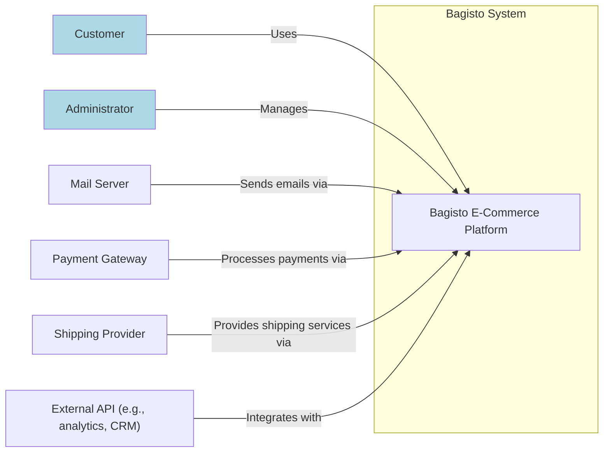
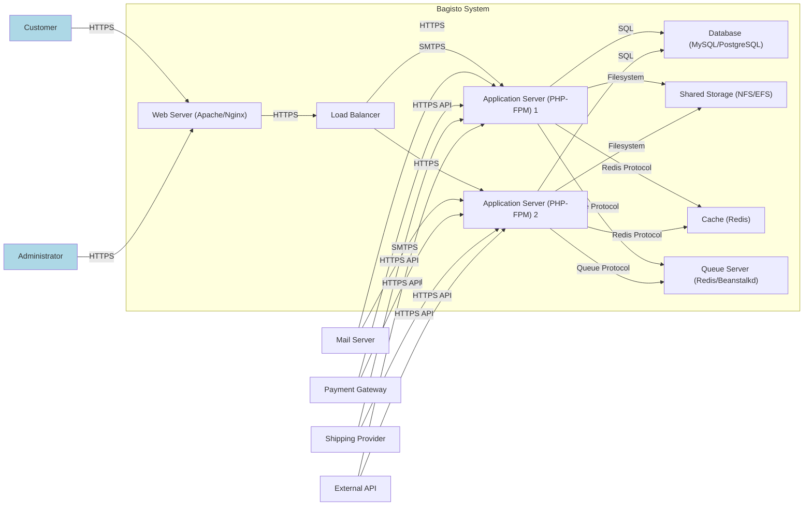
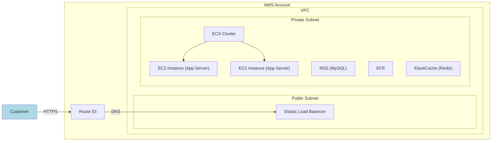
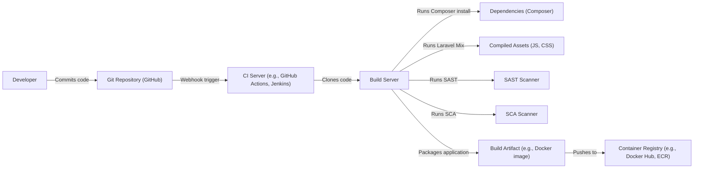

Okay, let's create a design document for the Bagisto project.

# BUSINESS POSTURE

Bagisto is an open-source e-commerce platform built on Laravel.  The business priorities likely revolve around:

*   Providing a free, customizable, and feature-rich e-commerce solution.
*   Attracting a large community of users and developers.
*   Enabling businesses of various sizes to establish and manage online stores.
*   Offering optional paid services/extensions/support for revenue generation.
*   Maintaining a positive reputation for reliability and security.
*   Facilitating easy integration with third-party services (payment gateways, shipping providers, etc.).

Given its open-source nature and target audience (potentially including small businesses with limited security expertise), the most important business risks are:

*   Data breaches affecting customer data (PII, payment information).
*   Vulnerabilities that allow attackers to deface or take down online stores.
*   Reputational damage due to security incidents.
*   Loss of user trust and adoption.
*   Supply chain attacks through compromised dependencies or extensions.
*   Lack of compliance with relevant data privacy regulations (GDPR, CCPA, etc.).

# SECURITY POSTURE

Based on the GitHub repository, the following security controls and accepted risks can be identified.  It's important to note that this is an assessment based on a *brief* review of the repository and documentation; a full security audit would be much more in-depth.

Existing Security Controls:

*   security control: Use of Laravel framework, which provides built-in security features like protection against XSS, CSRF, and SQL injection (if used correctly). Implemented in: Laravel framework.
*   security control: Authentication and authorization mechanisms for users and administrators. Implemented in: Bagisto codebase, `packages/Webkul/User`, `packages/Webkul/Admin`.
*   security control: Password hashing using secure algorithms (likely bcrypt, based on Laravel standards). Implemented in: User authentication logic.
*   security control: Input validation and sanitization (though the extent and effectiveness need further review). Implemented in: Various controllers and form request classes.
*   security control: Use of prepared statements or an ORM (Eloquent) to interact with the database, reducing SQL injection risk. Implemented in: Database interaction logic.
*   security control: Role-based access control (RBAC) to restrict administrative privileges. Implemented in: `packages/Webkul/User` and related middleware.
*   security control: Some degree of session management. Implemented in: Laravel's session handling.
*   security control: HTTPS configuration (this is typically handled at the deployment level, not within the application code itself, but is crucial). Implemented in: Server configuration (e.g., Apache, Nginx).
*   security control: Regular updates and security patches from both Bagisto and Laravel teams. Implemented in: Dependency management (Composer).

Accepted Risks:

*   accepted risk: Reliance on third-party packages and extensions, which may introduce vulnerabilities if not carefully vetted and kept up-to-date.
*   accepted risk: Potential for misconfiguration by users, especially in deployment and server setup, leading to security weaknesses.
*   accepted risk: The open-source nature of the project means that vulnerabilities, once discovered, are publicly known, potentially giving attackers a window of opportunity before patches are applied.
*   accepted risk: Limited built-in protection against more advanced attacks like business logic flaws or sophisticated phishing campaigns.

Recommended Security Controls (High Priority):

*   Implement a robust Content Security Policy (CSP) to mitigate XSS and data injection attacks.
*   Integrate security scanning tools (SAST, DAST, SCA) into the development and CI/CD pipeline.
*   Provide detailed security documentation and guidelines for users and developers.
*   Establish a clear vulnerability disclosure program.
*   Implement rate limiting and brute-force protection for login and other sensitive endpoints.
*   Consider adding two-factor authentication (2FA) for administrators.
*   Implement robust logging and monitoring to detect and respond to security incidents.
*   Regularly conduct penetration testing and security audits.

Security Requirements:

*   Authentication:
    *   All users (customers and administrators) must be authenticated before accessing protected resources.
    *   Strong password policies must be enforced.
    *   Password reset mechanisms must be secure and prevent account takeover.
    *   Support for multi-factor authentication (especially for administrators) is highly recommended.

*   Authorization:
    *   Role-based access control (RBAC) must be implemented to restrict access based on user roles.
    *   The principle of least privilege should be followed, granting users only the necessary permissions.
    *   Access control checks must be performed on the server-side, not solely relying on client-side validation.

*   Input Validation:
    *   All user-supplied input (including form data, URL parameters, and API requests) must be validated against a strict whitelist of allowed characters and formats.
    *   Input validation should be performed on the server-side.
    *   Output encoding should be used to prevent XSS vulnerabilities when displaying user-supplied data.

*   Cryptography:
    *   Sensitive data (passwords, API keys, etc.) must be stored securely using strong, industry-standard cryptographic algorithms.
    *   All communication between the client and server, and between different server components, should be encrypted using TLS/SSL.
    *   Cryptographic keys must be managed securely and rotated regularly.

# DESIGN

## C4 CONTEXT

Element Descriptions:

*   1.  Name: Customer
    2.  Type: Person
    3.  Description: A person who interacts with the Bagisto e-commerce platform to browse products, place orders, and manage their account.
    4.  Responsibilities: Browsing products, adding items to cart, placing orders, managing account details, viewing order history.
    5.  Security controls: Authentication, authorization, session management, data encryption (HTTPS).

*   1.  Name: Administrator
    2.  Type: Person
    3.  Description: A person who manages the Bagisto e-commerce platform, including configuring settings, managing products, processing orders, and managing users.
    4.  Responsibilities: Configuring system settings, managing products and inventory, processing orders, managing users and roles, viewing reports.
    5.  Security controls: Strong authentication (potentially with 2FA), authorization (RBAC), session management, data encryption (HTTPS), audit logging.

*   1.  Name: Mail Server
    2.  Type: System
    3.  Description: An external system used by Bagisto to send emails (e.g., order confirmations, password reset emails).
    4.  Responsibilities: Sending transactional emails.
    5.  Security controls: Secure connection (SMTPS), authentication with Bagisto.

*   1.  Name: Payment Gateway
    2.  Type: System
    3.  Description: An external system used by Bagisto to process payments (e.g., Stripe, PayPal).
    4.  Responsibilities: Processing payments securely, handling sensitive payment information.
    5.  Security controls: Secure communication (HTTPS), PCI DSS compliance, tokenization of payment data.

*   1.  Name: Shipping Provider
    2.  Type: System
    3.  Description: An external system used by Bagisto to manage shipping (e.g., UPS, FedEx).
    4.  Responsibilities: Providing shipping rates, generating shipping labels, tracking shipments.
    5.  Security controls: Secure API communication (HTTPS), authentication with Bagisto.

*   1.  Name: External API (e.g., analytics, CRM)
    2.  Type: System
    3.  Description: Any external system that integrates with Bagisto for additional functionality.
    4.  Responsibilities: Varies depending on the specific API.
    5.  Security controls: Secure API communication (HTTPS), authentication and authorization with Bagisto.

*   1.  Name: Bagisto E-Commerce Platform
    2.  Type: System
    3.  Description: The core Bagisto application.
    4.  Responsibilities: Managing products, orders, customers, content, and all other e-commerce functionality.
    5.  Security controls: All previously mentioned security controls.

## C4 CONTAINER

Element Descriptions:

*   1.  Name: Web Server (Apache/Nginx)
    2.  Type: Container
    3.  Description: Serves static content and acts as a reverse proxy for the application server.
    4.  Responsibilities: Handling incoming HTTP requests, serving static files, forwarding requests to the application server.
    5.  Security controls: HTTPS configuration, TLS/SSL certificates, access controls, web application firewall (WAF) (potentially).

*   1.  Name: Load Balancer
    2.  Type: Container
    3.  Description: Distributes incoming traffic across multiple application server instances.
    4.  Responsibilities: Distributing traffic, health checks of application servers.
    5.  Security controls: HTTPS configuration, TLS/SSL termination (potentially), DDoS protection (potentially).

*   1.  Name: Application Server (PHP-FPM) 1 & 2
    2.  Type: Container
    3.  Description: Executes the Bagisto application code (PHP). Multiple instances for high availability and scalability.
    4.  Responsibilities: Running the Bagisto application logic, handling dynamic requests.
    5.  Security controls: Input validation, output encoding, authentication, authorization, secure coding practices.

*   1.  Name: Database (MySQL/PostgreSQL)
    2.  Type: Container
    3.  Description: Stores persistent data for the Bagisto application (products, orders, users, etc.).
    4.  Responsibilities: Storing and retrieving data.
    5.  Security controls: Access controls, encryption at rest (potentially), regular backups, database firewall (potentially).

*   1.  Name: Shared Storage (NFS/EFS)
    2.  Type: Container
    3.  Description: Provides shared storage for files that need to be accessed by multiple application server instances (e.g., product images, uploads).
    4.  Responsibilities: Storing and serving files.
    5.  Security controls: Access controls, encryption at rest (potentially).

*   1.  Name: Cache (Redis)
    2.  Type: Container
    3.  Description: Caches frequently accessed data to improve performance.
    4.  Responsibilities: Storing and retrieving cached data.
    5.  Security controls: Access controls, authentication (potentially).

*   1.  Name: Queue Server (Redis/Beanstalkd)
    2.  Type: Container
    3.  Description: Manages asynchronous tasks (e.g., sending emails, processing large imports).
    4.  Responsibilities: Queuing and processing background jobs.
    5.  Security controls: Access controls, authentication (potentially).

*   Rest of the elements are described in C4 CONTEXT section.

## DEPLOYMENT

Possible Deployment Solutions:

1.  **Cloud-Based (AWS, Google Cloud, Azure):** Using managed services like EC2, ECS, Kubernetes, or platform-as-a-service offerings. This is the most scalable and flexible option.
2.  **Virtual Private Server (VPS):** Using a VPS provider like DigitalOcean, Linode, or Vultr. This offers more control than shared hosting but requires more manual configuration.
3.  **Dedicated Server:** Renting or owning a dedicated physical server. This provides the most control but also the highest cost and management overhead.
4.  **Shared Hosting:** Using a shared hosting provider. This is the least expensive option but offers the least control and scalability, and may not be suitable for production environments.

Chosen Solution (for detailed description): Cloud-Based (AWS)

Deployment Diagram (AWS):

Element Descriptions:

*   1.  Name: Route 53
    2.  Type: Node
    3.  Description: AWS DNS service.
    4.  Responsibilities: Resolving domain names to the Elastic Load Balancer.
    5.  Security controls: DNSSEC (potentially).

*   1.  Name: Elastic Load Balancer (ELB)
    2.  Type: Node
    3.  Description: AWS load balancing service.
    4.  Responsibilities: Distributing traffic across EC2 instances, SSL/TLS termination.
    5.  Security controls: HTTPS configuration, TLS/SSL certificates, security groups, integration with AWS WAF.

*   1.  Name: ECS Cluster
    2.  Type: Node
    3.  Description: Amazon Elastic Container Service cluster.
    4.  Responsibilities: Managing and orchestrating Docker containers.
    5.  Security controls: IAM roles and policies, security groups, network isolation.

*   1.  Name: EC2 Instance (App Server) 1 & 2
    2.  Type: Node
    3.  Description: AWS virtual machines running the Bagisto application server (PHP-FPM) within Docker containers.
    4.  Responsibilities: Running the Bagisto application logic.
    5.  Security controls: Security groups, IAM roles, system hardening, regular patching.

*   1.  Name: RDS (MySQL)
    2.  Type: Node
    3.  Description: AWS managed relational database service.
    4.  Responsibilities: Storing and retrieving Bagisto data.
    5.  Security controls: Security groups, IAM roles, encryption at rest, automated backups, database firewall (potentially).

*   1.  Name: EFS
    2.  Type: Node
    3.  Description: AWS managed file storage service.
    4.  Responsibilities: Providing shared storage for Bagisto files.
    5.  Security controls: Security groups, IAM roles, encryption at rest.

*   1.  Name: ElastiCache (Redis)
    2.  Type: Node
    3.  Description: AWS managed caching service.
    4.  Responsibilities: Caching frequently accessed data.
    5.  Security controls: Security groups, IAM roles, authentication (potentially).

*   Rest of the elements are described in previous sections.

## BUILD

Bagisto uses Composer for dependency management and Laravel Mix (Webpack) for asset compilation.  While the repository doesn't explicitly show a CI/CD pipeline, a secure build process would involve the following:

Build Process Diagram:

Build Process Description:

1.  **Developer Commits Code:** A developer commits code changes to the Git repository (GitHub).
2.  **Webhook Trigger:** A webhook configured on the repository triggers the CI server (e.g., GitHub Actions, Jenkins) upon a push event.
3.  **CI Server Clones Code:** The CI server clones the latest code from the repository onto a build server.
4.  **Dependency Installation:** Composer is used to install PHP dependencies.  A `composer.lock` file ensures consistent dependency versions.
5.  **Asset Compilation:** Laravel Mix (Webpack) compiles JavaScript, CSS, and other assets.
6.  **Security Scans:**
    *   **SAST (Static Application Security Testing):** A SAST scanner (e.g., PHPStan, Psalm) analyzes the source code for potential vulnerabilities.
    *   **SCA (Software Composition Analysis):** An SCA scanner (e.g., Dependabot, Snyk) checks for known vulnerabilities in third-party dependencies.
7.  **Packaging:** The application is packaged into a build artifact, such as a Docker image.
8.  **Artifact Storage:** The build artifact is pushed to a container registry (e.g., Docker Hub, Amazon ECR).

Security Controls in Build Process:

*   **Dependency Management:** Using Composer with a `composer.lock` file ensures consistent and reproducible builds, reducing the risk of introducing vulnerable dependencies.
*   **SAST:** Static analysis helps identify vulnerabilities early in the development lifecycle.
*   **SCA:** Software composition analysis identifies known vulnerabilities in third-party libraries.
*   **Build Automation:** Using a CI server ensures that security checks are consistently performed for every build.
*   **Secure Artifact Storage:** Storing build artifacts in a secure container registry protects them from tampering.
*   **Least Privilege:** The build server and CI server should have only the necessary permissions to perform their tasks.

# RISK ASSESSMENT

*   **Critical Business Processes:**
    *   Order processing and fulfillment.
    *   Customer account management.
    *   Payment processing.
    *   Product catalog management.
    *   Inventory management.

*   **Data to Protect and Sensitivity:**
    *   **Customer Personally Identifiable Information (PII):** Names, addresses, email addresses, phone numbers (High sensitivity).
    *   **Payment Card Information:** Credit card numbers, expiration dates, CVV codes (Highest sensitivity - should be handled by a PCI DSS compliant payment gateway and not stored directly by Bagisto).
    *   **Order History:** Purchase details, shipping addresses (Medium sensitivity).
    *   **User Credentials:** Usernames and hashed passwords (High sensitivity).
    *   **Product Data:** Product descriptions, prices, images (Low sensitivity, but could be subject to intellectual property concerns).
    *   **System Configuration Data:** API keys, database credentials (Highest sensitivity).

# QUESTIONS & ASSUMPTIONS

*   **Questions:**
    *   What is the specific threat model that Bagisto is designed to address?
    *   What are the compliance requirements (e.g., GDPR, CCPA, PCI DSS) that Bagisto needs to meet?
    *   What is the expected scale and traffic volume for Bagisto deployments?
    *   What are the existing security policies and procedures for the Bagisto development team?
    *   Are there any specific security concerns or past incidents that need to be addressed?
    *   What level of support is provided for security-related issues?
    *   How are third-party extensions vetted for security?
    *   Is there a bug bounty program or vulnerability disclosure program in place?

*   **Assumptions:**
    *   **BUSINESS POSTURE:** Assumes that Bagisto aims to provide a secure platform, but prioritizes ease of use and customization, potentially accepting some level of risk associated with user configuration and third-party extensions.
    *   **SECURITY POSTURE:** Assumes that basic security best practices are followed, but there may be gaps in more advanced security controls and processes. Assumes users are responsible for securing their own deployments.
    *   **DESIGN:** Assumes a standard LAMP/LEMP stack deployment, with potential for scaling using cloud services. Assumes that security is primarily handled at the application and infrastructure levels, with reliance on the underlying framework and best practices.