## Project Design Document: Laravel Debugbar - Improved

**1. Introduction**

This document provides an enhanced design overview of the Laravel Debugbar package, a tool designed to aid developers in debugging Laravel applications by displaying runtime information directly in the browser. This detailed design will serve as the foundation for subsequent threat modeling activities, enabling a thorough security assessment.

**2. Project Overview**

*   **Project Name:** Laravel Debugbar
*   **Project Repository:** [https://github.com/barryvdh/laravel-debugbar](https://github.com/barryvdh/laravel-debugbar)
*   **Project Goal:** To empower developers with an intuitive, browser-based interface for inspecting various facets of their Laravel application's execution, thereby streamlining debugging, performance analysis, and overall development efficiency.
*   **Target Environment:** Exclusively intended for use in development and testing environments. Its activation in production environments poses significant security risks and potential performance degradation and is strongly discouraged.

**3. System Architecture**

The Laravel Debugbar seamlessly integrates into the Laravel application's request/response lifecycle through the utilization of service providers and middleware. It functions by collecting data from various internal points within the application and subsequently rendering this information within a dedicated panel in the user's browser.

```mermaid
graph LR
    A["'Browser'"] --> B("'Laravel Application'");
    B --> C("'Debugbar Service Provider'");
    C --> D("'Event Listeners & Hooks'");
    D --> E("'Data Collectors'");
    E --> F("'Debugbar Storage (Optional)'");
    F --> G("'Debugbar Renderer'");
    G --> H("'Response Interceptor (Middleware)'");
    H --> I["'Browser (Debugbar Panel)'"];
    style A fill:#f9f,stroke:#333,stroke-width:2px
    style B fill:#ccf,stroke:#333,stroke-width:2px
    style C fill:#ddf,stroke:#333,stroke-width:2px
    style D fill:#eef,stroke:#333,stroke-width:2px
    style E fill:#ffe,stroke:#333,stroke-width:2px
    style F fill:#fdf,stroke:#333,stroke-width:2px
    style G fill:#fdd,stroke:#333,stroke-width:2px
    style H fill:#ede,stroke:#333,stroke-width:2px
    style I fill:#f9f,stroke:#333,stroke-width:2px
```

**4. Component Design**

*   **Debugbar Service Provider:**
    *   Primary responsibility is to register the Debugbar service within the Laravel application's service container.
    *   Handles the bootstrapping process, initializing core components such as data collectors and the renderer.
    *   Registers the Debugbar middleware, which is crucial for intercepting the application's HTTP response.
    *   Manages the loading and access of the Debugbar's configuration settings.
    *   Potential Security Implication: Misconfiguration within the service provider could lead to the Debugbar being inadvertently enabled in production.

*   **Event Listeners & Hooks:**
    *   The Debugbar leverages Laravel's event system and various hooks within the framework to tap into different stages of the application's execution.
    *   This allows data collectors to receive notifications and gather relevant information at specific points.
    *   Potential Security Implication:  If not carefully implemented, listeners could potentially introduce performance bottlenecks or inadvertently expose internal application logic.

*   **Data Collectors:**
    *   Core components responsible for gathering specific debugging information from the running application.
    *   Each collector focuses on a particular aspect of the application, such as:
        *   **Queries Collector:** Captures all database queries executed, including bindings and execution time.
        *   **Routes Collector:** Identifies the matched route, parameters, and associated middleware.
        *   **Views Collector:** Records rendered views, the data passed to them, and rendering time.
        *   **Logs Collector:** Displays application log messages.
        *   **Cache Collector:** Tracks cache hits, misses, and store/retrieve operations.
        *   **Session Collector:** Shows the current session data.
        *   **Request Collector:** Provides details about the incoming HTTP request (headers, parameters, cookies).
        *   **Time Collector:** Measures the execution time of various parts of the application lifecycle.
        *   **Exceptions Collector:** Lists caught exceptions and their details.
        *   **Gate Collector:** Shows the results of authorization checks.
        *   **Event Collector:** Displays dispatched events and their listeners.
        *   **Mail Collector:** Logs sent emails, including recipients and content.
        *   **Notifications Collector:** Tracks sent notifications.
        *   **User Collector:** Presents information about the authenticated user.
    *   Potential Security Implications: Data collectors can expose sensitive information. Improper sanitization of collected data could lead to XSS vulnerabilities.

*   **Debugbar Storage (Optional):**
    *   Provides a mechanism to persist collected data temporarily. This is particularly useful for AJAX requests or scenarios where the full response is not an HTML page, allowing the Debugbar to display information even when the traditional injection method is not feasible.
    *   Supports various storage drivers, such as file-based storage or Redis.
    *   Potential Security Implications:  Stored data could be accessed if the storage mechanism is not properly secured (e.g., insecure file permissions, unauthorized access to Redis).

*   **Debugbar Renderer:**
    *   Takes the data gathered by the data collectors (and potentially retrieved from storage).
    *   Generates the HTML, CSS, and JavaScript code necessary to render the interactive Debugbar panel within the browser.
    *   Focuses on the presentation layer of the Debugbar.
    *   Potential Security Implications: Vulnerabilities in the rendering logic could lead to XSS if user-provided data is not properly escaped before being displayed.

*   **Response Interceptor (Middleware):**
    *   A crucial piece of middleware that intercepts the outgoing HTTP response from the Laravel application before it is sent to the user's browser.
    *   Determines if the Debugbar is enabled for the current environment and request.
    *   Triggers the data collection process if the Debugbar is active.
    *   Instructs the renderer to inject the generated Debugbar panel (HTML, CSS, JavaScript) into the HTML response.
    *   Potential Security Implications:  If the middleware logic is flawed, it could potentially allow the Debugbar to be injected into production responses.

*   **Configuration:**
    *   Provides a flexible way for developers to customize the Debugbar's behavior.
    *   Key configuration options include:
        *   Globally enabling or disabling the Debugbar.
        *   Enabling or disabling individual data collectors.
        *   Specifying the storage driver and its configuration.
        *   Defining routes or requests that should be ignored by the Debugbar.
        *   Customizing the visual appearance of the Debugbar panel.
    *   Potential Security Implications:  Incorrect configuration is a primary security risk. Leaving the Debugbar enabled in production or failing to disable specific sensitive collectors can expose critical information.

*   **JavaScript and CSS Assets:**
    *   Client-side code responsible for rendering the interactive Debugbar panel within the user's browser.
    *   Handles the dynamic display of the collected data, allowing users to toggle panels, search for specific information, and inspect details.
    *   Relies on JavaScript and CSS for its functionality and presentation.
    *   Potential Security Implications:  Vulnerabilities in the JavaScript code could potentially be exploited for client-side attacks. Inclusion of outdated or vulnerable JavaScript libraries could also pose a risk.

**5. Data Flow**

1. A user initiates an HTTP request to the Laravel application via their web browser.
2. The Laravel application processes the incoming request through its standard lifecycle.
3. As the application prepares the HTTP response, the Debugbar middleware intercepts it.
4. The middleware checks the current environment and configuration to determine if the Debugbar is enabled for this request.
5. If enabled, the middleware triggers the data collection process.
6. Event listeners and hooks within the Debugbar infrastructure notify the registered data collectors.
7. Data collectors gather relevant information from various parts of the application (e.g., database queries, log entries, session data).
8. Collected data may be optionally persisted using the configured storage driver (e.g., for AJAX requests).
9. The Debugbar renderer retrieves the collected data (potentially from storage).
10. The renderer generates the HTML, CSS, and JavaScript code for the Debugbar panel.
11. The Debugbar middleware injects this generated code into the application's HTML response, typically just before the closing `</body>` tag.
12. The modified HTTP response is sent back to the user's web browser.
13. The browser renders the HTML content, including the injected Debugbar panel.
14. Client-side JavaScript within the Debugbar panel initializes and interacts with the displayed data, allowing the developer to explore the debugging information.

**6. Security Considerations**

*   **Critical Information Exposure:** The Debugbar inherently displays sensitive application data, including database credentials (in queries), session identifiers, environment variables, and internal application logic. Exposure of this information in production is a high-severity risk.
*   **Cross-Site Scripting (XSS) Vulnerabilities:** If data collected by the Debugbar is not properly sanitized before being rendered in the browser, it creates a significant risk of XSS attacks. Malicious scripts could be injected via data collectors (e.g., through user input stored in the session or database) and executed in the context of another user's browser session if the Debugbar is inadvertently active.
*   **Information Disclosure Leading to Further Exploitation:** The detailed information provided by the Debugbar can reveal internal workings of the application, potentially aiding attackers in identifying vulnerabilities and crafting more targeted attacks. This includes insights into database structures, framework usage, and application logic.
*   **Configuration Errors as Attack Vectors:**  A common security oversight is failing to disable the Debugbar in production environments. This can be exploited by attackers to gain access to sensitive information. Similarly, misconfigured collectors could expose more data than intended, even in non-production environments.
*   **Insecure Storage of Debug Data:** If the optional storage mechanism is used, inadequate security measures (e.g., weak file permissions, lack of authentication for Redis) can allow unauthorized access to the stored debugging data.
*   **Risks Associated with Third-Party Dependencies:** The Debugbar relies on various third-party libraries. Vulnerabilities in these dependencies could introduce security flaws into the Debugbar itself, potentially leading to exploits. Regular updates and security audits of these dependencies are crucial.
*   **Accidental Inclusion in Production Builds:**  Care must be taken to ensure that the Debugbar is not accidentally included or enabled in production deployments through improper build processes or configuration management.

**7. Deployment Considerations**

*   **Strictly for Development and Testing:** The Laravel Debugbar is explicitly designed for use during the development and testing phases of the software lifecycle.
*   **Disable in Production - Imperative:** It is absolutely critical to ensure that the Debugbar is completely disabled in production environments. This is typically achieved through the `APP_DEBUG` environment variable being set to `false` or through specific Debugbar configuration settings that are environment-aware.
*   **Environment-Specific Configuration:** Utilize Laravel's environment configuration features to manage Debugbar settings appropriately for different environments. This ensures that the Debugbar is active in development and testing but inactive in production.
*   **Build Process Verification:** Implement checks within the build and deployment pipeline to verify that the Debugbar is disabled and not included in production builds.
*   **Configuration Management Best Practices:** Employ robust configuration management practices to ensure that Debugbar settings are consistently and correctly applied across all environments. Avoid hardcoding sensitive settings.

**8. Assumptions and Constraints**

*   It is assumed that developers are aware of the security implications associated with enabling the Debugbar in production environments and will adhere to best practices for disabling it.
*   The accuracy and completeness of the information provided by the Debugbar are dependent on the correct functioning of the underlying Laravel application and its components.
*   The design assumes that the server environment where the Laravel application is deployed has basic security measures in place.
*   The visual presentation and interactivity of the Debugbar are constrained by the capabilities of standard web browser technologies (HTML, CSS, JavaScript).
*   This design document focuses on the core functionality of the Laravel Debugbar package itself and does not cover potential interactions with other third-party packages or custom application code beyond the standard integration points.

This improved design document provides a more detailed and nuanced understanding of the Laravel Debugbar's architecture and functionalities, specifically highlighting potential security considerations. This enhanced level of detail will be invaluable for conducting a comprehensive threat modeling exercise and implementing appropriate security measures.
