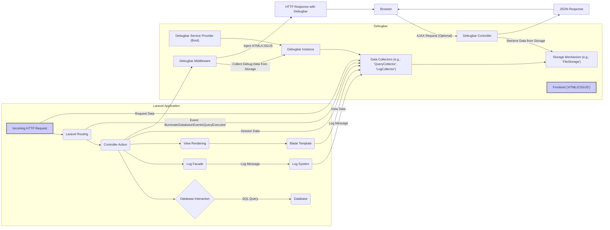

# Project Design Document: Laravel Debugbar

**Version:** 1.1
**Date:** October 26, 2023
**Author:** AI Software Architect

## 1. Introduction

This document provides an enhanced and detailed design overview of the Laravel Debugbar project, as found at [https://github.com/barryvdh/laravel-debugbar](https://github.com/barryvdh/laravel-debugbar). The primary goal of this document is to offer a clear and comprehensive understanding of the system's architecture, individual components, and the flow of data within it. This detailed design serves as a crucial foundation for conducting thorough threat modeling, enabling the identification of potential security vulnerabilities and the subsequent design of effective mitigation strategies.

## 2. Project Overview

The Laravel Debugbar is a highly valuable package designed for the Laravel PHP framework. Its core function is to provide developers with an intuitive and readily accessible interface for inspecting and debugging application behavior during the development process. It achieves this by injecting a dynamic, floating toolbar directly into the browser window. This toolbar presents a wealth of real-time debugging information, including:

*   A comprehensive list of all database queries executed during the request lifecycle, including execution time and bindings.
*   Detailed PHP log messages generated by the application.
*   Information about the currently matched route, including parameters and middleware.
*   Data passed to rendered views, facilitating inspection of template context.
*   The contents of the current user session.
*   In-depth details about the incoming HTTP request and the outgoing response.
*   Key performance metrics, such as execution time and memory usage.
*   The ability to display custom messages for application-specific debugging.

The fundamental purpose of the Debugbar is to significantly improve developer efficiency by offering immediate and insightful visibility into the application's internal operations. It is explicitly intended for use within **development and testing environments only**. It is imperative that the Debugbar is **never enabled in production environments** due to significant potential security risks and performance overhead.

## 3. System Architecture

The Laravel Debugbar achieves its functionality through tight integration with the Laravel framework, leveraging service providers, middleware, event listeners, and view composers. The architecture can be dissected into the following key components:

*   **Debugbar Service Provider (`Barryvdh\Debugbar\ServiceProvider`):** This essential Laravel service provider acts as the entry point for the Debugbar. Its responsibilities include:
    *   Registering the Debugbar with the Laravel application's service container.
    *   Bootstrapping the Debugbar, which involves configuring settings and registering other necessary components.
    *   Registering event listeners that trigger data collection.
    *   Publishing configuration files, allowing customization of the Debugbar's behavior.
*   **Debugbar Instance (`Barryvdh\Debugbar\LaravelDebugbar`):** This central class acts as the orchestrator for the entire Debugbar system. It manages:
    *   The collection of debug information by interacting with various data collectors.
    *   The storage of collected data using the configured storage mechanism.
    *   The rendering of the Debugbar UI.
    *   Providing methods for enabling, disabling, and adding messages to the Debugbar.
*   **Data Collectors (Located in `Barryvdh\Debugbar\DataCollector`):** These are individual, specialized classes responsible for gathering specific types of debugging information. Each collector focuses on a particular aspect of the application:
    *   `QueryCollector`: Monitors and collects all database queries executed via Laravel's database facade, including query SQL, bindings, and execution time.
    *   `LogCollector`: Captures messages logged using Laravel's logging facade (`Log::info()`, `Log::error()`, etc.).
    *   `RouteCollector`: Gathers information about the current route, including the route name, URI, controller, and middleware.
    *   `ViewCollector`: Collects data passed to views during the rendering process, allowing inspection of variables available in the template.
    *   `EventCollector`: Records dispatched events and their listeners, aiding in understanding application flow.
    *   `RequestCollector`: Provides details about the current HTTP request, including headers, parameters, and uploaded files.
    *   `SessionCollector`: Displays the data stored in the current user's session.
    *   `MemoryCollector`: Tracks PHP memory usage throughout the request lifecycle.
    *   `TimeCollector`: Measures the time taken for various stages of the request, such as booting, routing, and rendering.
    *   `MessagesCollector`: Allows developers to add custom debug messages directly to the Debugbar.
    *   Custom Collectors: Developers can extend the Debugbar by creating their own collectors to gather application-specific debugging data.
*   **Storage Mechanism (Implementations of `Barryvdh\Debugbar\Storage\DebugbarStorageInterface`):** The Debugbar requires a temporary storage mechanism to hold the collected data before it's displayed. Available options include:
    *   `FileStorage (`Barryvdh\Debugbar\Storage\FileStorage`): The default, storing data in serialized files within the `storage/debugbar` directory.
    *   `SessionStorage (`Barryvdh\Debugbar\Storage\SessionStorage`): Stores data within the user's session.
    *   `CacheStorage (`Barryvdh\Debugbar\Storage\CacheStorage`): Utilizes Laravel's caching system for storage.
    *   `NullStorage (`Barryvdh\Debugbar\Storage\NullStorage`): Disables storage, often used for AJAX requests where data is directly embedded.
*   **Debugbar Middleware (`Barryvdh\Debugbar\Middleware\Debugbar`):** This HTTP middleware plays a crucial role in injecting the Debugbar into the response. Its primary functions are:
    *   Intercepting the outgoing HTTP response before it's sent to the browser.
    *   Retrieving the collected debug data from the configured storage mechanism.
    *   Injecting the necessary HTML, CSS, and JavaScript code to render the Debugbar toolbar into the response body.
*   **View Composers (`Barryvdh\Debugbar\View\ViewServiceProvider`):**  View composers are used to share the `LaravelDebugbar` instance with specific views, enabling data collectors to add information during the view rendering process. This is particularly relevant for the `ViewCollector`.
*   **User Interface (Frontend Assets):** The visual representation of the Debugbar in the browser, consisting of:
    *   HTML structure defining the layout of the toolbar and its tabs.
    *   CSS styles for visual presentation and responsiveness.
    *   JavaScript code for handling user interactions, dynamically updating the UI, and making AJAX requests for detailed information.

## 4. Data Flow

The following diagram illustrates the typical flow of data within the Laravel Debugbar during a request lifecycle:

**Detailed Data Flow Steps:**

1. **Incoming HTTP Request:** A user initiates a request to the Laravel application.
2. **Laravel Routing:** Laravel's router matches the incoming request to the appropriate controller action based on the defined routes.
3. **Controller Action Execution:** The designated controller action is executed, potentially involving interactions with the database, logging events, and rendering views.
4. **Data Collection by Collectors:**
    *   **Event-Driven Collection:** The Debugbar's data collectors actively listen for specific Laravel events. For instance, the `QueryCollector` listens for `Illuminate\Database\Events\QueryExecuted` events, triggered whenever a database query is executed. When such an event occurs, the collector extracts relevant information (SQL query, bindings, execution time). Similarly, the `LogCollector` captures messages written to the log.
    *   **Direct Data Access:** Some collectors directly access relevant data. The `RequestCollector`, for example, accesses the current HTTP request object to gather information about headers and parameters. The `SessionCollector` retrieves data from the session store.
    *   **View Composer Integration:** View composers share the `LaravelDebugbar` instance with views. This allows collectors like the `ViewCollector` to access the data being passed to the view before it's rendered.
5. **Data Storage:** The collected debug information from various collectors is then passed to the configured storage mechanism (e.g., `FileStorage`, `SessionStorage`). The storage mechanism serializes the data and saves it temporarily.
6. **Middleware Interception:** As the Laravel application prepares the HTTP response, the `Debugbar` middleware intercepts it.
7. **Retrieval of Debug Data:** The middleware retrieves the collected debug data from the storage mechanism.
8. **Injection of Frontend Assets:** The middleware injects the necessary HTML, CSS, and JavaScript code required to render the Debugbar toolbar into the body of the HTTP response. This injected code includes references to the stored debug data.
9. **HTTP Response to Browser:** The modified HTTP response, now containing the Debugbar's frontend code and references to the debug data, is sent to the user's web browser.
10. **Debugbar Rendering in Browser:** The browser renders the HTML, CSS, and JavaScript of the Debugbar, making the toolbar visible.
11. **Optional AJAX Requests for Details:**  The Debugbar frontend often uses AJAX requests to fetch more detailed information on demand. For example, clicking on a specific database query might trigger an AJAX request to a Debugbar controller to retrieve the full query details.
12. **Debugbar Controller Interaction:** The Debugbar package includes a controller that handles these AJAX requests. This controller retrieves the requested data from the storage mechanism.
13. **JSON Response:** The Debugbar controller sends the requested data back to the browser as a JSON response.
14. **Dynamic UI Update:** The JavaScript in the Debugbar frontend processes the JSON response and dynamically updates the UI to display the detailed information.

## 5. Security Considerations (For Threat Modeling)

Considering the architecture and data flow, several potential security vulnerabilities warrant careful consideration during threat modeling:

*   **Information Disclosure in Production:**  If the Debugbar is inadvertently enabled in a production environment, it exposes sensitive internal application details (database queries, session data, environment variables, etc.) to potentially malicious actors. This is a high-severity risk.
*   **Cross-Site Scripting (XSS) Vulnerabilities:** If data collected by the Debugbar (e.g., request parameters, log messages, view data) is rendered in the UI without proper sanitization, it can create opportunities for XSS attacks. Attackers could inject malicious scripts that execute in the context of a developer's browser.
*   **Indirect Remote Code Execution:** While the Debugbar doesn't directly execute code, vulnerabilities in custom data collectors or in the way data is processed and displayed could potentially be exploited to achieve indirect code execution. For example, if a custom collector processes unsanitized input that is later used in a way that allows code injection.
*   **Denial of Service (DoS):**  Collecting and storing excessive amounts of debug data, especially in high-traffic scenarios, can lead to performance degradation and potentially exhaust server resources, resulting in a denial of service. Inefficient storage mechanisms could exacerbate this.
*   **Session Hijacking (with SessionStorage):** If `SessionStorage` is used and the application's session management is not robust, the debug data stored in the session could become a target for session hijacking attacks.
*   **Path Traversal (with FileStorage):** If the `FileStorage` mechanism is not implemented securely, vulnerabilities like path traversal could allow unauthorized access to arbitrary files on the server's filesystem.
*   **Unauthorized Access to Debug Data in Development:** While intended for development, access to the Debugbar should ideally be restricted to authorized developers. Lack of proper access controls, even in development, could lead to unintended information leaks.
*   **Exposure of Sensitive Data in AJAX Responses:**  The AJAX requests made by the Debugbar frontend to retrieve detailed information must be secured to prevent unauthorized access to this sensitive data.

## 6. Deployment Considerations

*   **Development and Testing Environments Only:** The Laravel Debugbar is explicitly designed and intended for use solely within development and testing environments.
*   **Disable in Production - Critical:** It is absolutely crucial to ensure that the Debugbar is **completely disabled** in production environments. This is the most important security measure.
*   **Environment-Specific Configuration:** Utilize Laravel's environment-specific configuration files (`.env` and `config/app.php`) to control the Debugbar's enablement. The `APP_DEBUG` environment variable is a common way to achieve this.
*   **Conditional Service Provider Registration:**  Implement conditional registration of the `DebugbarServiceProvider` to prevent it from being loaded in production environments. This can be done in your `app/Providers/AppServiceProvider.php` file.
*   **Middleware Configuration:** Ensure the `Debugbar` middleware is not included in the global middleware stack or route middleware groups used in production.

## 7. Data Storage Details

The choice of storage mechanism for the Debugbar has implications for performance and security:

*   **File Storage:**
    *   **Pros:** Generally efficient for development, isolates debug data.
    *   **Cons:** Potential for path traversal vulnerabilities if not implemented carefully. Requires write access to the storage directory.
*   **Session Storage:**
    *   **Pros:** Convenient, no extra file system setup.
    *   **Cons:** Increases session size, potential security risk if sessions are compromised. Not suitable for high-volume data.
*   **Cache Storage:**
    *   **Pros:** Can be efficient, leverages existing caching infrastructure.
    *   **Cons:** Debug data might be mixed with other cached data. Requires a configured cache driver.
*   **Null Storage:**
    *   **Pros:** No storage overhead, suitable for AJAX requests where data is embedded.
    *   **Cons:** No persistent storage of debug data.

File storage is generally the recommended default for development due to its balance of performance and isolation.

## 8. Dependencies

The Laravel Debugbar relies on the following key dependencies:

*   **Laravel Framework:** The core PHP framework it integrates with. Specific version compatibility should be checked against the Debugbar's documentation.
*   **PHP:** Requires a compatible version of PHP.
*   Potentially other third-party packages depending on the specific data collectors enabled or if custom collectors are used. These dependencies are typically managed by Composer.

## 9. Future Considerations

*   **Enhanced Security Features:** Explore options for more secure storage and transmission of debug data, even within development environments. Consider features like encryption or access control for stored debug information.
*   **Granular Control Over Data Collection:** Provide more fine-grained control over which data collectors are enabled and the level of detail collected. This would allow developers to optimize performance and reduce potential information exposure.
*   **Improved User Interface and User Experience:** Continuously enhance the UI for better usability, responsiveness, and information presentation.
*   **Extensibility and Plugin Architecture:** Further improve the ability for developers to create custom data collectors and integrate with other development tools.
*   **Integration with Browser Developer Tools:** Explore deeper integration with browser developer tools for a more seamless debugging experience.

This improved design document provides a more in-depth understanding of the Laravel Debugbar's architecture, data flow, and security considerations. This detailed information is essential for conducting thorough threat modeling and implementing appropriate security measures to protect applications, especially by ensuring the Debugbar is never active in production environments.