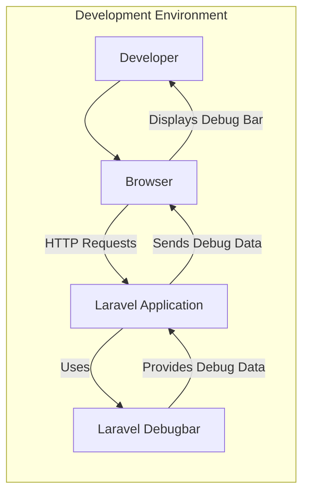
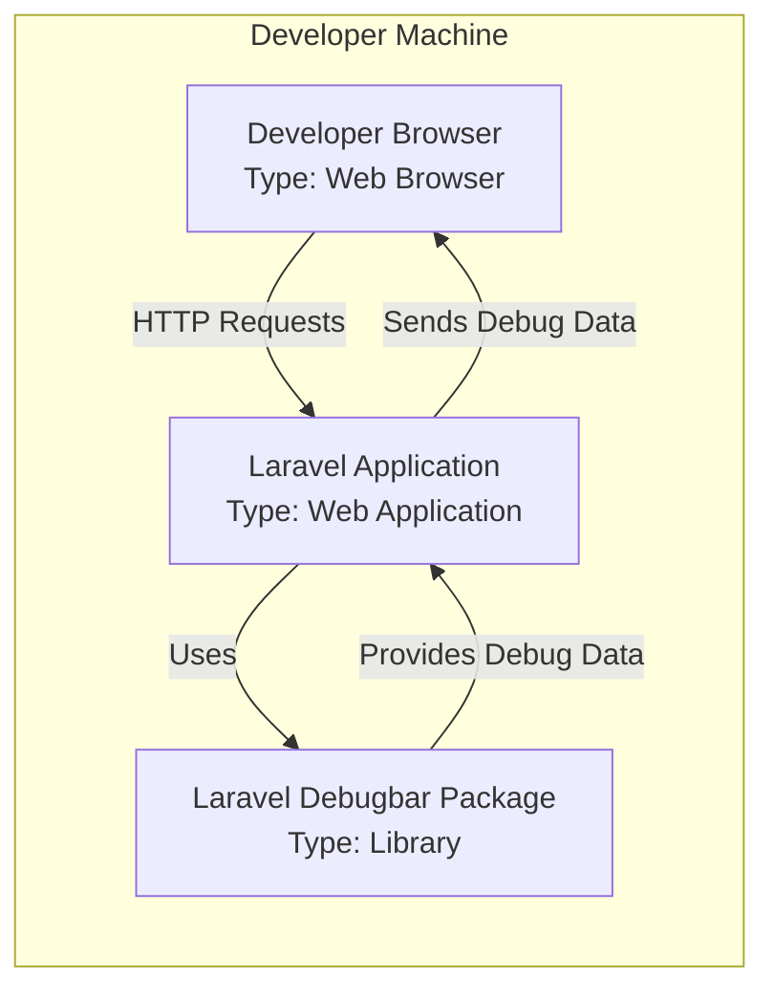
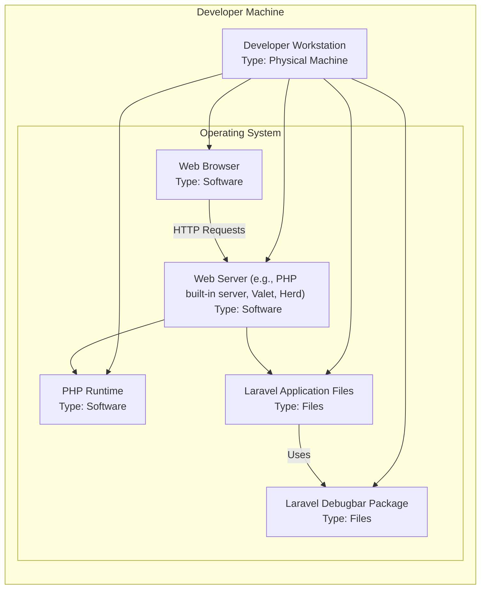
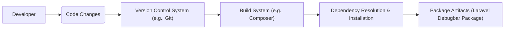

# BUSINESS POSTURE

This project, Laravel Debugbar, aims to enhance the developer experience during the development phase of Laravel applications. It provides a convenient interface within the browser to inspect application behavior, performance, and debug information.

Business Priorities and Goals:
- Accelerate development cycles by providing immediate feedback and insights into application execution.
- Improve code quality by facilitating easier identification and resolution of bugs and performance bottlenecks.
- Enhance developer productivity by streamlining the debugging process.

Business Risks:
- Accidental exposure of sensitive debug information in production environments, potentially leading to data leaks or security vulnerabilities.
- Performance overhead if the debug bar is inadvertently enabled in production, impacting application responsiveness and user experience.
- Potential vulnerabilities within the debug bar package itself, which could be exploited if not properly maintained and updated.

# SECURITY POSTURE

Existing Security Controls:
- security control: Configuration-based disabling in production environments. Laravel Debugbar is designed to be disabled by default in production environments through configuration settings (`APP_DEBUG=false` in `.env` file).
- security control: Package management via Composer. Laravel projects typically use Composer for dependency management, which includes Laravel Debugbar. Composer helps manage package versions and dependencies.

Accepted Risks:
- accepted risk: Risk of misconfiguration leading to debug bar being enabled in production if developers fail to properly configure their environments.
- accepted risk: Reliance on the security of third-party package (Laravel Debugbar). Vulnerabilities in the package could affect applications using it.

Recommended Security Controls:
- recommended security control: Automated checks in deployment pipelines to verify that debug bar is disabled in production environments. This can be implemented as part of CI/CD processes.
- recommended security control: Dependency scanning to identify known vulnerabilities in Laravel Debugbar and its dependencies. Tools like `composer audit` or dedicated dependency scanning services can be used.
- recommended security control: Secure coding practices during development to avoid exposing sensitive information in debug output, even during development.
- recommended security control: Regular updates of Laravel Debugbar package to patch any identified security vulnerabilities.

Security Requirements:
- Authentication: Not directly applicable to Laravel Debugbar itself. Access to debug information is implicitly controlled by access to the application in a development environment. However, if debug information includes sensitive data, access to development environments should be restricted to authorized developers.
- Authorization: Access to debug information is implicitly granted to developers working in development environments. No specific authorization mechanism is built into Debugbar itself.
- Input Validation: Laravel Debugbar primarily displays information and does not take direct user input that could be exploited. However, if custom data providers are used, input validation might be relevant in those providers.
- Cryptography: Not directly applicable to Laravel Debugbar functionality. Debugbar displays application data, which might include cryptographic operations performed by the application itself, but Debugbar does not implement cryptography itself.

# DESIGN

## C4 CONTEXT

Context Diagram Elements:

- Element:
    - Name: Developer
    - Type: Person
    - Description: Software developer working on the Laravel application.
    - Responsibilities: Develops and debugs the Laravel application. Uses the debug bar to gain insights into application behavior.
    - Security controls: Access to development environment is typically controlled by organization's access management policies.

- Element:
    - Name: Laravel Application
    - Type: Software System
    - Description: The Laravel web application being developed.
    - Responsibilities: Serves HTTP requests, interacts with databases and other services, and utilizes Laravel Debugbar to provide debugging information.
    - Security controls: Application-level security controls such as authentication, authorization, input validation, and output encoding are implemented within the Laravel application itself, not directly by Debugbar.

- Element:
    - Name: Laravel Debugbar
    - Type: Software System
    - Description: A Laravel package that provides a debug bar in the browser to display debugging information.
    - Responsibilities: Collects and displays debugging information from the Laravel application, such as queries, requests, logs, and performance metrics.
    - Security controls: Configuration to disable in production environments. Relies on Laravel application's security context.

- Element:
    - Name: Browser
    - Type: Software System
    - Description: Web browser used by the developer to access the Laravel application in the development environment.
    - Responsibilities: Sends HTTP requests to the Laravel application and renders the debug bar provided by Laravel Debugbar.
    - Security controls: Browser security features, such as same-origin policy and content security policy, are relevant to the context in which the debug bar is displayed.

## C4 CONTAINER

Container Diagram Elements:

- Element:
    - Name: Developer Browser
    - Type: Web Browser
    - Description: Web browser running on the developer's machine.
    - Responsibilities: Sends HTTP requests to the Laravel application running locally and renders the debug bar.
    - Security controls: Browser security features.

- Element:
    - Name: Laravel Application
    - Type: Web Application
    - Description: Laravel application running on a development server (e.g., developer's machine, staging server).
    - Responsibilities: Handles HTTP requests, executes application logic, uses Laravel Debugbar, and sends debug data to the browser.
    - Security controls: Laravel application's security controls (authentication, authorization, input validation, etc.). Configuration to disable Debugbar based on environment.

- Element:
    - Name: Laravel Debugbar Package
    - Type: Library
    - Description: Composer package integrated into the Laravel application.
    - Responsibilities: Intercepts application events, collects debug data, and provides it to the Laravel application for rendering in the debug bar.
    - Security controls: Package is obtained from a package repository (e.g., Packagist). Security depends on the package maintainers and the integrity of the package repository.

## DEPLOYMENT

Deployment Scenario: Development Environment (Local Machine)

Deployment Diagram Elements:

- Element:
    - Name: Developer Workstation
    - Type: Physical Machine
    - Description: The physical computer used by the developer for software development.
    - Responsibilities: Hosts all software components required for development, including the operating system, web browser, PHP runtime, web server, Laravel application, and Laravel Debugbar.
    - Security controls: Physical security of the developer's workstation. Operating system security controls (firewall, user access control, etc.).

- Element:
    - Name: Web Browser
    - Type: Software
    - Description: Web browser used by the developer to interact with the Laravel application.
    - Responsibilities: Rendering the user interface, including the debug bar. Sending HTTP requests to the web server.
    - Security controls: Browser security features.

- Element:
    - Name: PHP Runtime
    - Type: Software
    - Description: PHP interpreter used to execute the Laravel application.
    - Responsibilities: Executing PHP code of the Laravel application and Laravel Debugbar.
    - Security controls: Operating system level security controls.

- Element:
    - Name: Web Server (e.g., PHP built-in server, Valet, Herd)
    - Type: Software
    - Description: Web server used to serve the Laravel application during development.
    - Responsibilities: Handling HTTP requests and serving the Laravel application.
    - Security controls: Web server configuration and security features.

- Element:
    - Name: Laravel Application Files
    - Type: Files
    - Description: Files comprising the Laravel application codebase.
    - Responsibilities: Contains the application logic and configuration.
    - Security controls: File system permissions. Source code version control.

- Element:
    - Name: Laravel Debugbar Package
    - Type: Files
    - Description: Files of the Laravel Debugbar package installed within the Laravel application.
    - Responsibilities: Provides debug bar functionality to the Laravel application.
    - Security controls: File system permissions. Integrity of package source (obtained via Composer).

## BUILD

Build Process Description:

1. Developer: Developers write and modify code for the Laravel application, potentially including or updating the Laravel Debugbar package dependency in `composer.json`.
2. Code Changes: Code changes are committed and pushed to a Version Control System (e.g., Git).
3. Version Control System (e.g., Git): Stores the source code and build configuration (e.g., `composer.json`, `composer.lock`).
4. Build System (e.g., Composer): Composer is used to manage PHP dependencies. When dependencies are updated or installed, Composer is invoked.
5. Dependency Resolution & Installation: Composer resolves dependencies specified in `composer.json` and downloads and installs the required packages, including Laravel Debugbar, into the `vendor` directory. Composer also generates `composer.lock` to ensure consistent dependency versions.
6. Package Artifacts (Laravel Debugbar Package): The Laravel Debugbar package is installed as part of the application's dependencies in the `vendor` directory.

Build Security Controls:
- security control: Dependency Management with Composer: Composer helps manage dependencies and ensures that packages are obtained from trusted sources (Packagist by default).
- security control: `composer.lock` file: Ensures consistent dependency versions across different environments, reducing the risk of supply chain attacks through dependency version changes.
- security control: Code review: Reviewing code changes, including updates to dependencies, can help identify and prevent malicious or vulnerable dependencies from being introduced.
- recommended security control: Dependency scanning: Integrate dependency scanning tools (e.g., `composer audit`, Snyk, or similar) into the build process to automatically check for known vulnerabilities in dependencies, including Laravel Debugbar and its dependencies.
- recommended security control: Secure development practices: Developers should follow secure coding practices to minimize vulnerabilities in the application code that could be exploited, even if indirectly through debug information.

# RISK ASSESSMENT

Critical Business Processes:
- Software Development Lifecycle: The primary business process is the efficient and secure development of Laravel applications. Laravel Debugbar directly supports this process by improving developer productivity and code quality.

Data to Protect:
- Potentially sensitive application data displayed in the debug bar: This could include database queries (potentially containing sensitive data), request and response data, session information, configuration details, and logs.
- Sensitivity: The sensitivity of the data depends on the specific application. For applications handling personal data, financial information, or other confidential data, the debug information could be highly sensitive. Even for less sensitive applications, exposing internal application details could provide valuable information to attackers.

# QUESTIONS & ASSUMPTIONS

Questions:
- How is the debug bar typically disabled in production environments for Laravel applications? (Assumption: Configuration via `.env` file and `APP_DEBUG` setting).
- What types of data are exposed by default by Laravel Debugbar? (Need to review documentation to understand default data providers).
- Are there any configuration options to control the data displayed by the debug bar? (Assumption: Yes, likely through configuration and custom data providers).

Assumptions:
- BUSINESS POSTURE: The primary goal is to improve developer productivity and code quality during development. Security is a secondary concern in development environments but critical in production.
- SECURITY POSTURE: Laravel Debugbar is intended for development and testing only and should be disabled in production environments. The primary security control is configuration-based disabling in production.
- DESIGN: The deployment model described is for a development environment on a developer's local machine. Production deployments should not include the debug bar enabled. The build process relies on Composer for dependency management.