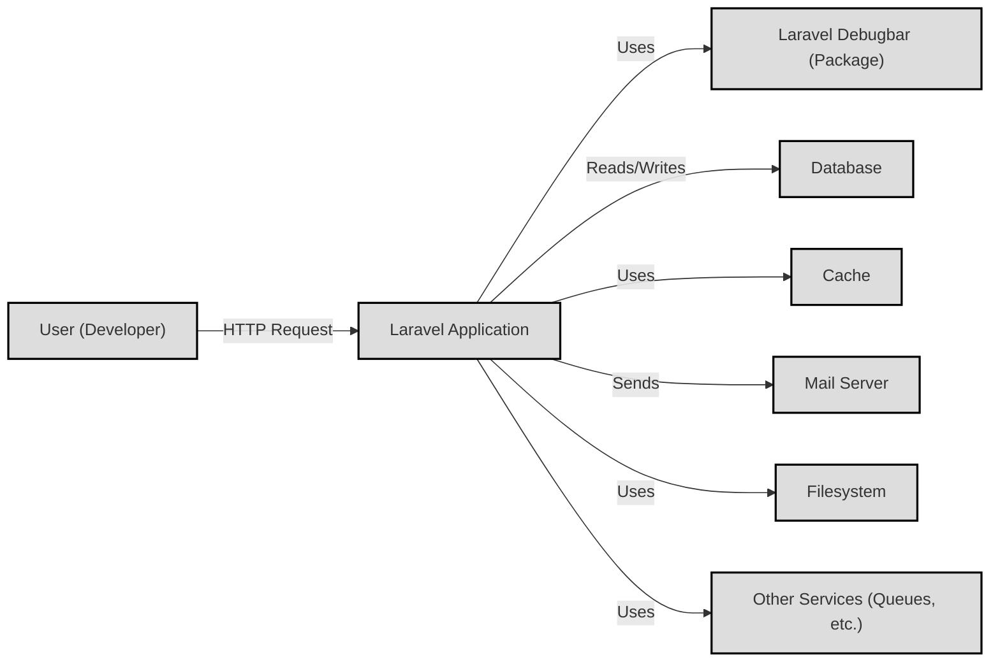
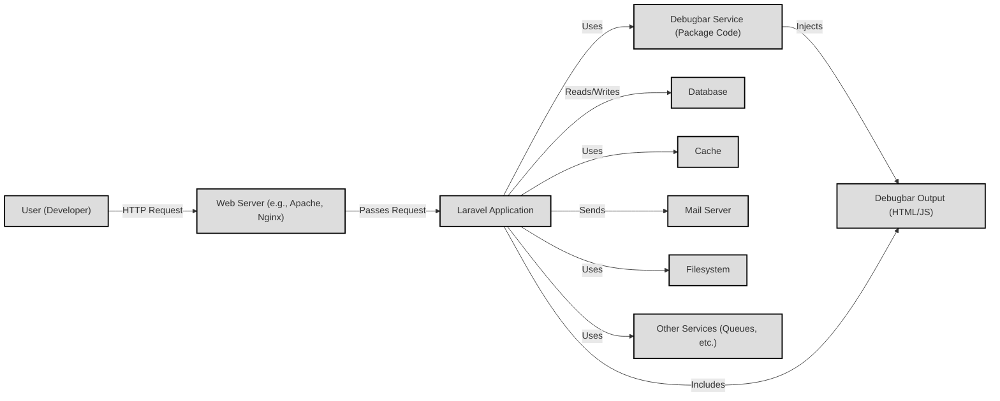
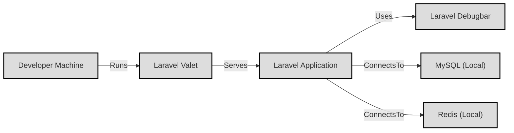
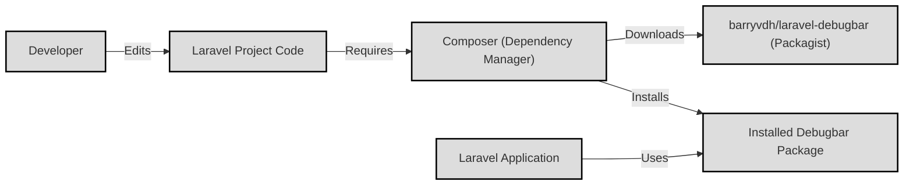

Okay, let's create a design document for the `laravel-debugbar` project.

# BUSINESS POSTURE

Business Priorities and Goals:

*   Improve developer productivity during the development and debugging of Laravel applications.
*   Provide insights into application performance and behavior without significant overhead in production (when disabled).
*   Offer a user-friendly interface for inspecting various aspects of a request/response cycle.
*   Minimize the risk of exposing sensitive information in production environments.
*   Easy integration with existing Laravel projects.

Business Risks:

*   Accidental exposure of sensitive application data (database queries, environment variables, session data) if enabled in a production environment.
*   Performance degradation if improperly configured or excessively used, even in development.
*   Potential security vulnerabilities within the debugbar itself, leading to information disclosure or other exploits.
*   Compatibility issues with specific Laravel versions or other installed packages.
*   Increased attack surface due to additional code and dependencies.

# SECURITY POSTURE

Existing Security Controls:

*   security control: Disabled by default in production environments (controlled via the `APP_DEBUG` environment variable in Laravel). Source: `.env` file and Laravel documentation.
*   security control: Configuration options to restrict access based on IP address. Source: `config/debugbar.php`
*   security control: Collectors can be enabled/disabled to control the amount of data collected and potential exposure. Source: `config/debugbar.php`
*   security control: Data is primarily displayed within the developer's browser, limiting external access during development.
*   security control: The package relies on Laravel's underlying security mechanisms (e.g., CSRF protection, authentication) for the main application.

Accepted Risks:

*   accepted risk: Developers might accidentally enable the debugbar in production, despite warnings.
*   accepted risk: The debugbar adds code and dependencies, slightly increasing the attack surface.
*   accepted risk: While collectors can be disabled, there's a risk that sensitive data might be inadvertently exposed if custom collectors are not carefully implemented.

Recommended Security Controls:

*   security control: Implement a robust mechanism to *guarantee* the debugbar is disabled in production, beyond relying solely on `APP_DEBUG`. This could involve a separate configuration file or environment variable specifically for the debugbar, checked independently.
*   security control: Enforce IP whitelisting even in development environments, limiting access to authorized developer machines.
*   security control: Provide clear documentation and warnings about the risks of enabling the debugbar in production.
*   security control: Regularly audit the codebase and dependencies for potential security vulnerabilities.
*   security control: Implement Content Security Policy (CSP) headers to mitigate XSS risks, even within the debugbar's interface.
*   security control: Provide configuration options to sanitize or redact sensitive data displayed by collectors (e.g., passwords, API keys).

Security Requirements:

*   Authentication: The debugbar itself does not require separate authentication, as it's intended for use during development. However, access should be restricted via IP whitelisting and environment checks.
*   Authorization:  No granular authorization is needed within the debugbar. Access is binary: either the developer has access to the debugbar, or they don't.
*   Input Validation: The debugbar primarily displays data collected from the application.  However, any user-configurable options within the debugbar (e.g., settings, filters) should be properly validated to prevent injection vulnerabilities.
*   Cryptography:  The debugbar does not handle sensitive cryptographic operations directly. It may display information *about* cryptographic operations performed by the application (e.g., hashing algorithms used).  It should not store or transmit sensitive cryptographic keys.

# DESIGN

## C4 CONTEXT

Element Descriptions:

*   Element:
    *   Name: User (Developer)
    *   Type: Person
    *   Description: The developer using the Laravel application and interacting with the debugbar.
    *   Responsibilities: Initiates requests, views debugbar output, analyzes application behavior.
    *   Security controls: IP whitelisting (recommended).

*   Element:
    *   Name: Laravel Application
    *   Type: Software System
    *   Description: The web application being developed, built using the Laravel framework.
    *   Responsibilities: Handles user requests, interacts with data sources, generates responses.
    *   Security controls: Laravel's built-in security features (CSRF protection, authentication, etc.).

*   Element:
    *   Name: Laravel Debugbar (Package)
    *   Type: Software System
    *   Description: The `barryvdh/laravel-debugbar` package, integrated into the Laravel application.
    *   Responsibilities: Collects data about the application's execution, displays information to the developer.
    *   Security controls: Disabled in production (by default), IP whitelisting (configurable), collector enabling/disabling.

*   Element:
    *   Name: Database
    *   Type: Data Store
    *   Description: The database used by the Laravel application (e.g., MySQL, PostgreSQL).
    *   Responsibilities: Stores and retrieves application data.
    *   Security controls: Database access controls, encryption at rest (recommended).

*   Element:
    *   Name: Cache
    *   Type: Data Store
    *   Description: The caching system used by the Laravel application (e.g., Redis, Memcached).
    *   Responsibilities: Stores and retrieves cached data to improve performance.
    *   Security controls: Cache access controls, data encryption (recommended).

*   Element:
    *   Name: Mail Server
    *   Type: External System
    *   Description: The mail server used by the Laravel application to send emails.
    *   Responsibilities: Sends emails on behalf of the application.
    *   Security controls: Secure SMTP configuration, TLS encryption.

*   Element:
    *   Name: Filesystem
    *   Type: Data Store
    *   Description: The filesystem used by the Laravel application to store files.
    *   Responsibilities: Stores and retrieves files.
    *   Security controls: File permissions, access controls.

*   Element:
    *   Name: Other Services (Queues, etc.)
    *   Type: External Systems
    *   Description: Other services used by the Laravel application, such as queue workers, external APIs, etc.
    *   Responsibilities: Varies depending on the specific service.
    *   Security controls: Varies depending on the specific service.

## C4 CONTAINER

Element Descriptions:

*   Element:
    *   Name: User (Developer)
    *   Type: Person
    *   Description: Same as in the Context diagram.
    *   Responsibilities: Same as in the Context diagram.
    *   Security controls: Same as in the Context diagram.

*   Element:
    *   Name: Web Server (e.g., Apache, Nginx)
    *   Type: Container
    *   Description: The web server that receives HTTP requests and forwards them to the Laravel application.
    *   Responsibilities: Handles incoming requests, serves static assets, passes dynamic requests to the application server.
    *   Security controls: Web server security configuration (e.g., disabling directory listing, configuring TLS).

*   Element:
    *   Name: Laravel Application
    *   Type: Container
    *   Description: Same as in the Context diagram, but now viewed as a container within the web server.
    *   Responsibilities: Same as in the Context diagram.
    *   Security controls: Same as in the Context diagram.

*   Element:
    *   Name: Debugbar Service (Package Code)
    *   Type: Container
    *   Description: The core code of the `laravel-debugbar` package, running within the Laravel application.
    *   Responsibilities: Collects data from various sources (database queries, cache operations, etc.), manages collectors.
    *   Security controls:  Configuration options for enabling/disabling collectors, IP whitelisting.

*   Element:
    *   Name: Debugbar Output (HTML/JS)
    *   Type: Container
    *   Description: The HTML and JavaScript code that renders the debugbar interface in the developer's browser.
    *   Responsibilities: Displays collected data in a user-friendly format.
    *   Security controls:  CSP headers (recommended) to mitigate XSS risks.

*   Element:
    *   Name: Database, Cache, Mail Server, Filesystem, Other Services
    *   Type: Container
    *   Description: Same as Context diagram.
    *   Responsibilities: Same as Context diagram.
    *   Security controls: Same as Context diagram.

## DEPLOYMENT

Possible Deployment Solutions:

1.  Local Development Environment (e.g., Laravel Valet, Homestead, Docker).
2.  Staging/Testing Environment (similar to production, but with debugbar potentially enabled).
3.  Production Environment (debugbar *must* be disabled).

Chosen Solution (Detailed Description): Local Development Environment (Laravel Valet)

Element Descriptions:

*   Element:
    *   Name: Developer Machine
    *   Type: Infrastructure Node
    *   Description: The developer's local workstation.
    *   Responsibilities: Runs the development environment, hosts the code, and provides access to the application.
    *   Security controls: Local firewall, up-to-date operating system, secure development practices.

*   Element:
    *   Name: Laravel Valet
    *   Type: Infrastructure Node
    *   Description:  A minimalist development environment for macOS.  It configures Nginx, PHP, and DnsMasq to serve the Laravel application.
    *   Responsibilities:  Provides a local web server, manages DNS for local domains, and simplifies the setup of PHP and other services.
    *   Security controls:  Relies on the security of the underlying macOS system and the configured services (Nginx, PHP).

*   Element:
    *   Name: Laravel Application
    *   Type: Software System
    *   Description: The application being developed, as described in previous sections.
    *   Responsibilities:  Same as in previous sections.
    *   Security controls: Same as in previous sections.

*   Element:
    *   Name: Laravel Debugbar
    *   Type: Software System
    *   Description: The debugbar package, integrated into the application.
    *   Responsibilities: Same as in previous sections.
    *   Security controls: Same as in previous sections.

*   Element:
    *   Name: MySQL (Local)
    *   Type: Infrastructure Node
    *   Description: A local instance of the MySQL database server.
    *   Responsibilities:  Provides database services to the Laravel application.
    *   Security controls:  Local database access controls, strong passwords.

*   Element:
    *   Name: Redis (Local)
    *   Type: Infrastructure Node
    *   Description: A local instance of the Redis server (used for caching).
    *   Responsibilities: Provides caching services to the Laravel application.
    *   Security controls: Local access controls, strong passwords (if configured).

## BUILD

The `laravel-debugbar` is a composer package. It doesn't have a dedicated build process in the same way a compiled application might. However, we can describe the process of integrating it into a Laravel project and the relevant security considerations.

Build Process Description:

1.  **Developer Action:** The developer adds `barryvdh/laravel-debugbar` as a development dependency in the `composer.json` file of their Laravel project.
2.  **Composer:** The developer runs `composer require --dev barryvdh/laravel-debugbar` (or `composer update` if it's already listed).
3.  **Dependency Resolution:** Composer resolves the dependencies and determines the appropriate version of the debugbar package to install.
4.  **Package Download:** Composer downloads the package from Packagist (the main Composer repository).
5.  **Installation:** Composer installs the package into the `vendor` directory of the Laravel project.
6.  **Configuration:** The developer may optionally configure the debugbar by publishing its configuration file (`php artisan vendor:publish --provider="Barryvdh\Debugbar\ServiceProvider"`) and modifying the settings in `config/debugbar.php`.
7.  **Integration:** The debugbar is automatically integrated into the Laravel application's middleware stack when enabled.

Security Controls during Build:

*   security control: **Dependency Management (Composer):** Composer uses checksums (in `composer.lock`) to verify the integrity of downloaded packages, ensuring they haven't been tampered with.
*   security control: **Source Control:** The Laravel project's code (including `composer.json` and `composer.lock`) should be stored in a secure source control system (e.g., Git) with appropriate access controls.
*   security control: **Code Review:** Any changes to the project's dependencies (including adding or updating the debugbar) should be reviewed by another developer.
*   security control: **Vulnerability Scanning:** Regularly scan the project's dependencies (including the debugbar) for known security vulnerabilities using tools like Composer's audit command or dedicated vulnerability scanners.

# RISK ASSESSMENT

Critical Business Processes:

*   **Development Workflow:** The primary business process is the efficient development and debugging of Laravel applications. The debugbar directly supports this process.
*   **Application Performance:**  While the debugbar is a development tool, it indirectly impacts application performance by providing insights into bottlenecks and inefficiencies.

Data Sensitivity:

*   **Application Data (High Sensitivity):** The debugbar can potentially expose *any* data processed by the application, including:
    *   Database queries (containing sensitive data from tables).
    *   Session data (user authentication tokens, personal information).
    *   Environment variables (API keys, database credentials).
    *   Request and response data (form submissions, API responses).
    *   Cache contents.
    *   Log messages.
*   **Configuration Data (Medium Sensitivity):** The debugbar's own configuration file (`config/debugbar.php`) may contain settings that, if exposed, could reveal information about the application's environment.

# QUESTIONS & ASSUMPTIONS

Questions:

*   Are there any specific compliance requirements (e.g., GDPR, HIPAA) that the Laravel application must adhere to? This would influence the data handling practices and the need for stricter controls on the debugbar.
*   What is the expected level of technical expertise of the developers using the debugbar? This helps determine the appropriate level of detail in documentation and warnings.
*   Are there any existing security tools or processes in place for the Laravel application development workflow (e.g., static analysis, dynamic analysis)?

Assumptions:

*   BUSINESS POSTURE: The primary use case is for local development and debugging, not for production environments.
*   SECURITY POSTURE: Developers are aware of the basic security risks of exposing debugging tools in production.
*   DESIGN: The Laravel application follows standard Laravel conventions and best practices. The debugbar is installed and configured according to the official documentation. The development environment is reasonably secure (e.g., the developer's machine is not compromised).