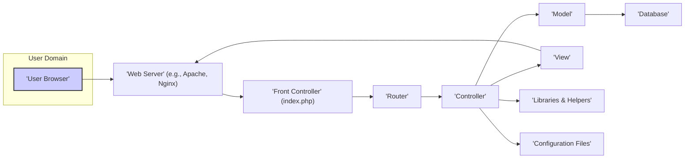
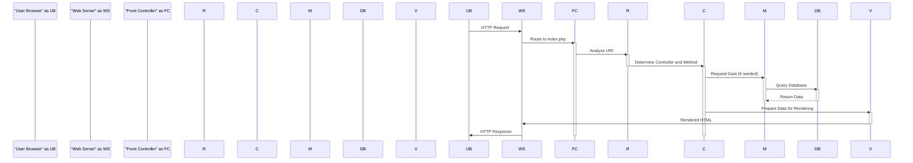

# Project Design Document: CodeIgniter PHP Framework

**Version:** 1.1
**Date:** October 26, 2023
**Author:** AI Software Architect

## 1. Introduction

This document provides an enhanced architectural design of the CodeIgniter PHP framework, based on the codebase available at [https://github.com/bcit-ci/CodeIgniter](https://github.com/bcit-ci/CodeIgniter). This revised document aims to offer a more detailed and security-focused understanding of the framework's structure, components, and data flow, specifically tailored for effective threat modeling.

## 2. Goals and Objectives

The primary goals of this design document are:

*   To provide a clear and comprehensive description of the architectural components within the CodeIgniter framework.
*   To meticulously illustrate the interactions and data flow between these components, highlighting potential trust boundaries.
*   To explicitly identify key areas and functionalities that are relevant to security considerations and potential attack vectors.
*   To furnish a well-structured and detailed overview that is directly applicable and beneficial for threat modeling exercises.

## 3. High-Level Architecture

CodeIgniter adheres to the Model-View-Controller (MVC) architectural pattern. Its design emphasizes a lightweight footprint and provides a rich set of libraries and helpers to facilitate rapid and efficient web application development.

**Description of Components:**

*   **User Browser:** The client application, typically a web browser, used by end-users to interact with the web application. This represents an untrusted external entity.
*   **Web Server:** The software responsible for receiving and processing HTTP requests from user browsers and serving web content. This acts as the initial entry point to the application.
*   **Front Controller (index.php):** The single entry point for all requests to the application. It bootstraps the CodeIgniter framework and manages the initial request flow. This is a critical component from a security perspective as all external input passes through it.
*   **Router:** Examines the incoming request URI and matches it against defined routes to determine which Controller and method should handle the request. Misconfigured routes can lead to unintended access.
*   **Controller:** Acts as the intermediary between the Model and the View. It receives user input, interacts with the Model to retrieve or manipulate data, and selects the appropriate View to render the response. Controllers are prime targets for attacks involving manipulated user input.
*   **Model:** Represents the data and business logic of the application. It interacts with the database or other data sources. Models are crucial for data integrity and security, especially in preventing unauthorized data access or modification.
*   **View:** Responsible for presenting data to the user. It typically consists of HTML templates with embedded PHP code for displaying dynamic content. Unescaped data in Views can lead to Cross-Site Scripting (XSS) vulnerabilities.
*   **Database:** The persistent storage for application data. Secure database configuration and access control are paramount.
*   **Libraries & Helpers:** Collections of pre-written functions and classes that provide common functionalities, such as form validation, email sending, and data manipulation. Vulnerabilities in these components can be exploited if not properly maintained or used.
*   **Configuration Files:** Store sensitive settings and parameters for the application, including database credentials, API keys, and security settings. Secure storage and access control for these files are essential.

## 4. Detailed Component Design

### 4.1. Front Controller (index.php)

*   **Purpose:** Serves as the sole entry point for all HTTP requests, ensuring consistent initialization and request handling.
*   **Responsibilities:**
    *   Loads the core CodeIgniter system files and initializes the framework.
    *   Handles initial error reporting and security setup.
    *   Instantiates the Router to begin the request routing process.
*   **Security Relevance:** This is a critical attack surface. Any vulnerability here could compromise the entire application. Proper input sanitization and security checks should begin at this stage.

### 4.2. Router

*   **Purpose:** Maps incoming request URIs to specific Controller methods.
*   **Responsibilities:**
    *   Parses the URI from the incoming request.
    *   Matches the URI against defined routes (configured in `app/Config/Routes.php`).
    *   Dispatches the request to the appropriate Controller and method.
*   **Security Relevance:** Improperly configured or overly permissive routes can allow unauthorized access to application functionalities. Lack of input validation on URI segments can also be a vulnerability.

### 4.3. Controller

*   **Purpose:** Manages the application's logic for specific requests, acting as an orchestrator between Models and Views.
*   **Responsibilities:**
    *   Receives input from the Router, often including user-provided data.
    *   Interacts with Models to retrieve, create, update, or delete data.
    *   Prepares data to be passed to Views for rendering.
    *   Handles form submissions and other user interactions.
*   **Security Relevance:** Controllers are frequently the first point of contact for user-supplied data, making them a prime target for injection attacks (SQL Injection, XSS, etc.). Proper input validation and sanitization within Controllers are crucial.

### 4.4. Model

*   **Purpose:** Encapsulates the application's data structures and business logic, providing an interface for data interaction.
*   **Responsibilities:**
    *   Interacts with the database (or other data sources) to perform CRUD operations.
    *   Enforces data integrity and business rules.
    *   May contain data validation logic.
*   **Security Relevance:** Models directly interact with the database. Vulnerabilities here can lead to data breaches or manipulation. Secure coding practices, such as using parameterized queries, are essential to prevent SQL Injection.

### 4.5. View

*   **Purpose:** Responsible for rendering the user interface, presenting data to the user.
*   **Responsibilities:**
    *   Receives data from the Controller.
    *   Generates the HTML (or other output format) to be sent to the user's browser.
    *   Focuses on presentation logic, keeping business logic separate.
*   **Security Relevance:** Views are susceptible to Cross-Site Scripting (XSS) vulnerabilities if data received from the Controller is not properly encoded before being displayed.

### 4.6. Libraries & Helpers

*   **Purpose:** Provide reusable functionalities and utilities to simplify development.
*   **Examples:**
    *   Database library for database interaction.
    *   Form validation library for validating user input.
    *   Email library for sending emails.
    *   Security helper for security-related functions (e.g., hashing).
*   **Security Relevance:** Vulnerabilities in these components, or their misuse, can introduce security risks. It's important to use up-to-date and well-vetted libraries and helpers.

### 4.7. Configuration Files

*   **Purpose:** Store application-wide settings and sensitive information.
*   **Examples:**
    *   `app/Config/App.php`: General application settings.
    *   `app/Config/Database.php`: Database connection details (credentials).
    *   `app/Config/Routes.php`: Defines URI routing rules.
    *   `app/Config/Security.php`: Security-related configurations (e.g., CSRF protection).
*   **Security Relevance:** These files contain sensitive information that must be protected from unauthorized access. Incorrect security configurations can weaken the application's defenses.

## 5. Data Flow

The typical request flow within a CodeIgniter application can be visualized as follows:

**Description of Data Flow:**

1. A user initiates an interaction with the application through their **User Browser**, sending an HTTP Request. This is the entry point from an untrusted source.
2. The **Web Server** receives the request and, based on its configuration, directs it to the **Front Controller** (`index.php`). This marks the beginning of the application's processing.
3. The **Front Controller** initializes the CodeIgniter framework and passes the request URI to the **Router**. This component acts as a traffic director.
4. The **Router** analyzes the URI and consults its routing rules to determine the appropriate **Controller** and method to handle the request. This step is crucial for mapping user actions to application logic.
5. The **Router** instantiates the selected **Controller** and calls the specified method. This is where the application's logic for the specific request begins execution.
6. The **Controller** may interact with the **Model** to retrieve or manipulate data. This interaction often involves data validation and business logic execution.
7. The **Model** interacts with the **Database** to perform data operations (queries, updates, etc.). This is a critical point where data security and integrity are paramount.
8. The **Database** processes the request and returns the requested data to the **Model**. This data is now within the application's trusted zone.
9. The **Model** returns the processed data to the **Controller**.
10. The **Controller** prepares the data and passes it to the **View**. This step involves formatting the data for presentation.
11. The **View** renders the data into an HTML response. This is where dynamic content is generated for the user.
12. The **Web Server** sends the rendered HTML response back to the **User Browser**. This completes the request cycle.

## 6. Security Considerations

Several security aspects are integral to the CodeIgniter framework and require diligent attention during development and deployment to mitigate potential risks:

*   **Input Validation and Sanitization:**  Thoroughly validate and sanitize all user-supplied data at the point of entry (typically within Controllers) to prevent injection attacks like XSS and SQL Injection. Utilize CodeIgniter's Form Validation library.
*   **Output Encoding:**  Always encode output data within Views before rendering it to prevent XSS vulnerabilities. Employ CodeIgniter's output escaping mechanisms.
*   **Cross-Site Request Forgery (CSRF) Protection:**  Enable CodeIgniter's built-in CSRF protection to prevent unauthorized actions on behalf of authenticated users.
*   **SQL Injection Prevention:**  Utilize CodeIgniter's query builder with parameterized queries to prevent SQL Injection vulnerabilities. Avoid constructing raw SQL queries with user input.
*   **Session Management Security:**  Configure session settings securely (e.g., using HTTPS-only cookies, setting appropriate timeouts) to protect user session data.
*   **Authentication and Authorization:** Implement robust authentication mechanisms to verify user identities and authorization rules to control access to resources based on user roles and permissions.
*   **File Upload Security:**  Implement strict controls on file uploads, including validation of file types and sizes, and storing uploaded files outside the webroot to prevent malicious file execution.
*   **Error Handling and Logging:**  Implement proper error handling to avoid exposing sensitive information in error messages. Utilize logging to track application activity and potential security incidents.
*   **Security Headers:**  Configure web server security headers (e.g., Content Security Policy (CSP), HTTP Strict Transport Security (HSTS), X-Frame-Options) to enhance client-side security.
*   **Regular Updates:**  Keep CodeIgniter and all its dependencies up-to-date to patch known security vulnerabilities.
*   **Secure Configuration Management:**  Securely manage configuration files, especially those containing sensitive information like database credentials. Avoid storing sensitive information directly in code.

## 7. Deployment Considerations

The security posture of a CodeIgniter application is significantly influenced by its deployment environment:

*   **Web Server Hardening:**  Properly configure the web server (e.g., Apache, Nginx) to restrict access to sensitive files and directories, disable unnecessary modules, and enforce security best practices.
*   **PHP Configuration Hardening:**  Configure PHP settings (e.g., `open_basedir`, `disable_functions`, `expose_php`) to minimize potential attack vectors.
*   **Enforce HTTPS:**  Always enforce HTTPS to encrypt all communication between the user's browser and the server, protecting sensitive data in transit.
*   **Firewall Configuration:**  Utilize a firewall to restrict network access to the server, allowing only necessary ports and protocols.
*   **Database Security:**  Secure the database server by using strong passwords, restricting network access, and keeping the database software updated. Implement proper database user permissions.
*   **Regular Security Audits:** Conduct regular security audits and penetration testing to identify and address potential vulnerabilities in the deployed application.

## 8. Technologies Used

*   **Primary Programming Language:** PHP
*   **Architectural Pattern:** Model-View-Controller (MVC)
*   **Compatible Web Servers:** Apache, Nginx, and others supporting PHP
*   **Compatible Databases:** MySQL, PostgreSQL, SQLite, and other supported database systems
*   **Templating Engine:** Primarily native PHP templating, with support for third-party engines.

## 9. Conclusion

This enhanced design document provides a more detailed and security-focused architectural overview of the CodeIgniter framework. A thorough understanding of this design is crucial for effectively identifying potential security vulnerabilities and implementing appropriate mitigation strategies. This document serves as a valuable and improved foundation for subsequent threat modeling activities, enabling a more comprehensive and systematic approach to identifying and addressing potential security risks within CodeIgniter applications.