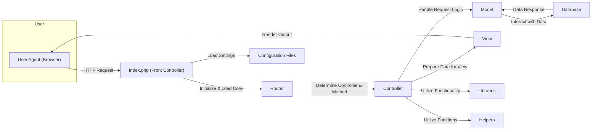
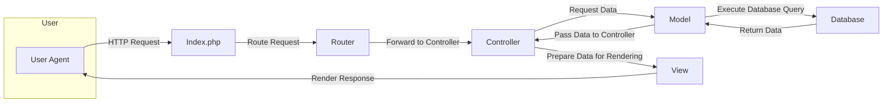

# Project Design Document: CodeIgniter Framework

**Version:** 1.1
**Date:** October 26, 2023
**Author:** AI Software Architect

## 1. Introduction

This document provides an enhanced architectural design of the CodeIgniter framework, an open-source PHP web application framework. This detailed design serves as a crucial foundation for subsequent threat modeling activities, providing a clear understanding of the framework's structure, components, and interactions.

## 2. System Overview

CodeIgniter is a lightweight yet powerful PHP framework renowned for its speed, simplicity, and flexibility. It is designed to provide developers with the essential tools needed to build full-featured web applications efficiently. Adhering to the Model-View-Controller (MVC) architectural pattern, CodeIgniter promotes clean code organization, separation of concerns, and rapid development. Its core philosophy emphasizes providing a helpful toolkit without imposing rigid development constraints.

## 3. Architectural Design

CodeIgniter's architecture revolves around the well-established MVC pattern. A typical HTTP request processed by a CodeIgniter application traverses through the following key components:

*   **User Agent (Browser/Client):** The initiator of the web request, typically a web browser or an API client.
*   **Index.php (Front Controller):** The singular entry point for all incoming HTTP requests to the application. It bootstraps the CodeIgniter environment.
*   **Router:**  The component responsible for examining the incoming request URI and mapping it to the appropriate Controller and its corresponding method.
*   **Controller:**  The intermediary that handles the application's business logic. It receives the request from the Router, interacts with Models to fetch or manipulate data, and prepares data for the View.
*   **Model:** Represents the application's data structures and encapsulates the logic for interacting with data sources, typically databases.
*   **View:**  Responsible for rendering the user interface, presenting data to the user in a specific format (e.g., HTML, JSON).
*   **Libraries:** Collections of pre-built classes offering a wide range of functionalities, such as database interaction, form handling, email sending, and more.
*   **Helpers:** Sets of standalone PHP functions that perform specific, often utility-based tasks, like URL creation, string manipulation, and cookie management.
*   **Configuration Files:** Store application-specific settings and parameters, including database credentials, application keys, and routing rules.
*   **Database:** The persistent storage layer where the application's data is stored and managed.

Here's a refined flowchart illustrating the request flow, emphasizing the sequence of interactions:

### 3.1. Component Details

*   **Index.php (Front Controller):**
    *   Serves as the single entry point for all HTTP requests, ensuring a consistent processing flow.
    *   Initializes the core CodeIgniter system, loading essential classes and configurations.
    *   Instantiates the Router to begin the request routing process.

*   **Router:**
    *   Analyzes the incoming URI to determine the intended Controller and method.
    *   Compares the URI against defined routes in configuration files, allowing for custom URL structures.
    *   If no specific route matches, it uses default routing rules based on URI segments.
    *   Extracts any parameters from the URI and makes them available to the Controller.

*   **Controller:**
    *   Receives control from the Router, along with any extracted parameters.
    *   Interprets user input received through GET or POST requests.
    *   Invokes methods in the Model to interact with the application's data.
    *   Processes the data returned by the Model and prepares it for presentation.
    *   Loads the appropriate View file and passes the prepared data to it for rendering.
    *   Can utilize Library classes to perform various tasks (e.g., validation, security).
    *   Can call Helper functions for utility operations.

*   **Model:**
    *   Represents the data structures of the application, often corresponding to database tables.
    *   Contains methods for performing CRUD (Create, Read, Update, Delete) operations on the data.
    *   Encapsulates the logic for interacting with the database or other data storage mechanisms.
    *   Promotes a separation of concerns by isolating data access logic from the Controller.

*   **View:**
    *   Responsible for generating the user interface that is sent back to the user agent.
    *   Typically contains HTML markup, CSS for styling, and potentially JavaScript for client-side interactions.
    *   Receives data from the Controller and dynamically displays it within the HTML structure.
    *   Should primarily focus on presentation logic, minimizing business logic within the View.

*   **Libraries:**
    *   Offer reusable, object-oriented functionalities that extend the core capabilities of CodeIgniter.
    *   Examples include: Database (for database interaction), Email (for sending emails), Form Validation (for validating user input), Session (for managing user sessions), and Security (for security-related tasks).
    *   Can be extended or customized to meet specific application requirements.

*   **Helpers:**
    *   Provide procedural functions that perform specific, often global utility tasks.
    *   Examples include: URL (for generating URLs), Form (for creating form elements), Cookie (for managing cookies), and File (for file manipulation).
    *   Loaded on demand or automatically loaded for global availability.

*   **Configuration Files:**
    *   Store various settings that govern the behavior of the CodeIgniter application.
    *   Located primarily in the `application/config` directory.
    *   Include settings for database connections, application base URL, encryption keys, autoloading of resources, and routing rules.

*   **Database:**
    *   The persistent storage system used by the application to store and retrieve data.
    *   CodeIgniter supports various database management systems through its Database Library.
    *   Interaction with the database is typically handled through Model classes, ensuring a consistent data access layer.

## 4. Data Flow

The flow of data within a CodeIgniter application, from the initial request to the final response, follows these steps:

1. A user agent initiates an HTTP request targeting a specific resource within the application.
2. The web server directs this request to the `index.php` file, the front controller.
3. `index.php` initializes the CodeIgniter environment and loads the necessary core components.
4. The Router examines the incoming URI and determines the appropriate Controller and method to handle the request.
5. The designated Controller is instantiated, and its corresponding method is executed.
6. The Controller may interact with one or more Model classes to retrieve, insert, update, or delete data from the database.
7. The Model interacts with the configured Database system, executing queries to perform the requested data operations.
8. The Database returns the results of the query to the Model.
9. The Model processes the data (if necessary) and returns it to the Controller.
10. The Controller prepares the data to be displayed and passes it to the appropriate View.
11. The View uses the provided data to render the HTML (or other format) output.
12. The rendered output is sent back to the user agent as the HTTP response.

Here's a flowchart illustrating the data flow with more explicit labels:

## 5. Security Considerations (For Threat Modeling)

Understanding the architecture is crucial for identifying potential security vulnerabilities. Here are some key security considerations relevant for threat modeling within a CodeIgniter application:

*   **Input Handling and Validation:**
    *   **Threat:** Malicious input injection (e.g., SQL Injection, Cross-Site Scripting).
    *   **Consideration:**  All user-provided data (from forms, URLs, cookies, headers) must be rigorously validated and sanitized before being used in database queries or displayed in views. CodeIgniter's Input and Form Validation libraries are critical here.
*   **Output Encoding:**
    *   **Threat:** Cross-Site Scripting (XSS).
    *   **Consideration:** Data displayed in views should be properly encoded to prevent the execution of malicious scripts embedded in the data. CodeIgniter's output encoding functions should be consistently used.
*   **Cross-Site Request Forgery (CSRF) Protection:**
    *   **Threat:** Unauthorized actions performed on behalf of an authenticated user.
    *   **Consideration:** CodeIgniter's built-in CSRF protection mechanisms should be enabled and correctly implemented for all state-changing requests.
*   **Session Management Security:**
    *   **Threats:** Session hijacking, session fixation.
    *   **Consideration:** Secure session configuration (e.g., using HTTP-only and secure flags for cookies), regular session regeneration, and protection against session fixation attacks are essential.
*   **Authentication and Authorization:**
    *   **Threats:** Unauthorized access to resources, privilege escalation.
    *   **Consideration:** Robust authentication mechanisms (verifying user identity) and authorization controls (managing access permissions) must be implemented. CodeIgniter provides tools, but developers need to implement secure logic.
*   **Database Security:**
    *   **Threats:** Data breaches, unauthorized data access.
    *   **Consideration:** Secure database configurations, parameterized queries (to prevent SQL Injection), and appropriate database user permissions are vital.
*   **File Upload Security:**
    *   **Threats:** Malicious file uploads, path traversal vulnerabilities.
    *   **Consideration:**  Strict validation of uploaded files (type, size, content), secure storage locations, and prevention of direct access to uploaded files are necessary.
*   **Error Handling and Logging:**
    *   **Threat:** Information disclosure through error messages.
    *   **Consideration:**  Detailed error messages should be logged securely but not displayed to end-users in production environments.
*   **Configuration Security:**
    *   **Threat:** Exposure of sensitive information (e.g., database credentials, API keys).
    *   **Consideration:** Configuration files should be properly secured, and sensitive information should not be hardcoded or stored in easily accessible locations. Environment variables are a better approach.
*   **Dependency Management:**
    *   **Threat:** Vulnerabilities in third-party libraries.
    *   **Consideration:** Regularly update CodeIgniter and its dependencies to patch known security vulnerabilities.

## 6. Deployment Model

CodeIgniter applications are typically deployed on web servers that support PHP execution. Common deployment models include:

*   **Traditional Web Server Setup:**
    *   **Components:** Web server (Apache, Nginx), PHP interpreter, database server (MySQL, PostgreSQL, etc.).
    *   **Process:** Application files are placed in the web server's document root or a subdirectory. The web server is configured to route requests to the `index.php` file.
*   **Cloud-Based Deployment:**
    *   **Platforms:** AWS (EC2, Elastic Beanstalk), Google Cloud (Compute Engine, App Engine), Azure (Virtual Machines, App Service).
    *   **Process:** Deployment often involves using platform-specific tools and services to manage the application environment. Containerization (Docker) can also be used for easier deployment and scaling.
*   **Containerization (Docker):**
    *   **Technology:** Docker containers encapsulate the application and its dependencies.
    *   **Process:** A Dockerfile defines the application environment. Docker Compose can be used to manage multi-container applications. This facilitates consistent deployments across different environments.

Key deployment considerations include:

*   **Web Server Configuration:** Ensuring proper virtual host configuration and security settings.
*   **PHP Configuration:** Optimizing PHP settings for performance and security.
*   **Database Configuration:** Securely configuring database access and credentials.
*   **File Permissions:** Setting appropriate file and directory permissions for security.

## 7. Key Technologies

*   **Core Language:** PHP
*   **Web Server Compatibility:** Apache, Nginx, and others
*   **Database Support:** MySQL, PostgreSQL, SQLite, MariaDB, and more
*   **Frontend Flexibility:** Compatible with any frontend technologies (HTML, CSS, JavaScript frameworks)

## 8. Glossary

*   **MVC:** Model-View-Controller - a software design pattern separating application logic, data, and user interface.
*   **URI:** Uniform Resource Identifier - a string of characters that identifies a resource.
*   **HTTP:** Hypertext Transfer Protocol - the foundation of data communication for the World Wide Web.
*   **XSS:** Cross-Site Scripting - a type of web security vulnerability that enables attackers to inject client-side scripts into web pages viewed by other users.
*   **SQL Injection:** A code injection technique used to attack data-driven applications, in which malicious SQL statements are inserted into an entry field for execution.
*   **CSRF:** Cross-Site Request Forgery - an attack that forces authenticated users to submit requests to a web application unintentionally.
*   **LAMP:** An acronym for Linux, Apache, MySQL, PHP - a common web service stack.
*   **LEMP:** An acronym for Linux, Nginx, MySQL, PHP - another common web service stack.

This improved design document provides a more detailed and refined understanding of the CodeIgniter framework's architecture, specifically tailored for the purpose of conducting thorough threat modeling. The added details and explicit security considerations will aid in identifying potential vulnerabilities and developing appropriate mitigation strategies.
