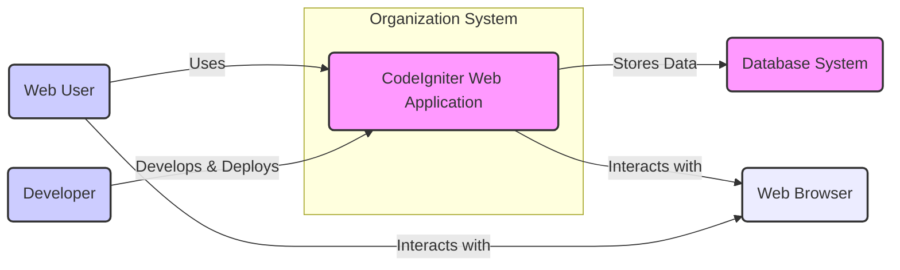
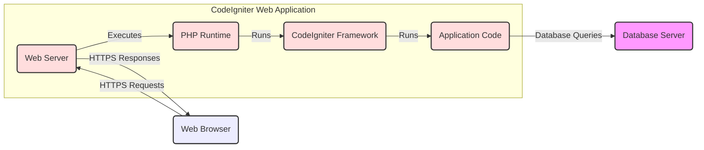

# BUSINESS POSTURE

CodeIgniter is a PHP framework designed to provide a simple, lightweight, and fast environment for building web applications. It aims to empower developers to create web applications rapidly with less code compared to writing from scratch or using more complex frameworks.

- Business Priorities:
  - Rapid web application development.
  - Ease of use and developer-friendliness.
  - High performance and efficiency of web applications.
  - Broad compatibility with various hosting environments.
  - Strong community support and extensive documentation.

- Business Goals:
  - Enable developers to quickly prototype and deploy web applications.
  - Reduce development time and costs for web projects.
  - Provide a stable and reliable framework for building robust web applications.
  - Foster a large and active community of users and contributors.
  - Maintain a lightweight footprint and minimal dependencies.

- Business Risks:
  - Security vulnerabilities in web applications built using CodeIgniter, potentially leading to data breaches, service disruption, or reputational damage.
  - Lack of adherence to secure coding practices by developers using the framework, resulting in exploitable weaknesses.
  - Dependency on community support for security updates and patches, which might have delays or gaps.
  - Potential for misconfiguration of the framework or underlying server environment, leading to security issues.
  - Risk of supply chain attacks targeting dependencies or the framework itself.

# SECURITY POSTURE

- Existing Security Controls:
  - security control CSRF Protection: Built-in protection against Cross-Site Request Forgery attacks, configurable in the framework settings. Described in CodeIgniter documentation under "Security".
  - security control XSS Filtering: Built-in input filtering to prevent Cross-Site Scripting attacks, applied to input data. Described in CodeIgniter documentation under "Security".
  - security control Database Input Escaping: Database abstraction layer provides mechanisms to escape input data to prevent SQL injection attacks. Described in CodeIgniter documentation under "Database".
  - security control Password Hashing: Utilizes PHP's password hashing functions for secure storage of user passwords. Described in CodeIgniter documentation under "Security" and "Authentication".
  - security control Input Validation: Framework provides input validation library to validate user inputs based on defined rules. Described in CodeIgniter documentation under "Input Validation".

- Accepted Risks:
  - accepted risk Vulnerabilities in user-developed application code: Security of applications built with CodeIgniter heavily relies on developers following secure coding practices. Vulnerabilities in application logic, custom modules, or third-party libraries are an accepted risk.
  - accepted risk Misconfiguration of server environment: Incorrectly configured web servers, databases, or PHP settings can introduce security vulnerabilities. Proper server hardening and configuration are assumed to be the responsibility of the deployment environment.
  - accepted risk Outdated dependencies: Usage of outdated versions of CodeIgniter or its dependencies can expose applications to known vulnerabilities. Maintaining up-to-date dependencies is considered a shared responsibility.
  - accepted risk Social engineering attacks targeting application users: Phishing, credential theft, and other social engineering attacks are outside the scope of the framework itself and are considered an accepted risk at the application level.

- Recommended Security Controls:
  - security control Static Application Security Testing (SAST): Implement SAST tools to automatically scan application code for potential security vulnerabilities during development and build processes.
  - security control Dependency Scanning: Utilize dependency scanning tools to identify known vulnerabilities in third-party libraries and components used by CodeIgniter applications.
  - security control Penetration Testing: Conduct regular penetration testing by security professionals to identify and address security weaknesses in deployed applications.
  - security control Security Audits: Perform periodic security audits of application code, configuration, and infrastructure to ensure adherence to security best practices.
  - security control Security Training for Developers: Provide security training to developers to promote secure coding practices and awareness of common web application vulnerabilities.
  - security control Web Application Firewall (WAF): Deploy a WAF in front of web applications to provide an additional layer of security against common web attacks.

- Security Requirements:
  - Authentication:
    - Requirement: Implement secure user authentication mechanisms to verify the identity of users accessing the application.
    - Details: CodeIgniter provides session management and helpers for authentication. Applications should use strong password policies, multi-factor authentication where appropriate, and protect against brute-force attacks.
  - Authorization:
    - Requirement: Implement robust authorization controls to manage user access to different parts of the application and data based on roles and permissions.
    - Details: Applications should define clear roles and permissions, enforce the principle of least privilege, and validate user authorization before granting access to resources or functionalities.
  - Input Validation:
    - Requirement: Thoroughly validate all user inputs to prevent injection attacks (SQL injection, XSS, command injection, etc.) and ensure data integrity.
    - Details: Utilize CodeIgniter's input validation library and implement server-side validation for all user-provided data. Sanitize and escape outputs appropriately based on context.
  - Cryptography:
    - Requirement: Use cryptography appropriately to protect sensitive data in transit and at rest.
    - Details: Employ HTTPS for all communication, use strong encryption algorithms for data storage when necessary, and manage cryptographic keys securely. Utilize password hashing for storing user credentials.

# DESIGN

## C4 CONTEXT



- Context Diagram Elements:
  - - Name: CodeIgniter Web Application
    - Type: System
    - Description: Web application built using the CodeIgniter framework. It provides functionalities and services to web users.
    - Responsibilities:
      - Process user requests and generate responses.
      - Implement business logic and application functionalities.
      - Manage data persistence and retrieval from the database system.
      - Handle user authentication and authorization.
      - Protect against common web application vulnerabilities.
    - Security Controls:
      - security control Input validation and sanitization.
      - security control Output encoding.
      - security control Session management.
      - security control Authentication and authorization mechanisms.
      - security control CSRF protection.
      - security control XSS filtering.
      - security control Database input escaping.

  - - Name: Web User
    - Type: Person
    - Description: End-user who interacts with the CodeIgniter web application through a web browser to access its functionalities and services.
    - Responsibilities:
      - Accessing the web application through a web browser.
      - Providing input data to the application.
      - Consuming the output and services provided by the application.
    - Security Controls:
      - security control Web browser security features (e.g., XSS protection, Content Security Policy).
      - security control User awareness training to avoid phishing and social engineering attacks.

  - - Name: Developer
    - Type: Person
    - Description: Software developer who builds, maintains, and deploys the CodeIgniter web application.
    - Responsibilities:
      - Writing application code using the CodeIgniter framework.
      - Configuring and deploying the application to a server environment.
      - Implementing security controls within the application code.
      - Maintaining and updating the application.
    - Security Controls:
      - security control Secure coding practices.
      - security control Code reviews.
      - security control Static and dynamic code analysis tools.
      - security control Access control to development and deployment environments.

  - - Name: Database System
    - Type: System
    - Description: Database server (e.g., MySQL, PostgreSQL) used by the CodeIgniter web application to store and retrieve data.
    - Responsibilities:
      - Storing application data persistently.
      - Providing data access and retrieval services to the web application.
      - Ensuring data integrity and availability.
      - Managing database security.
    - Security Controls:
      - security control Database access controls and authentication.
      - security control Database encryption at rest and in transit.
      - security control Regular database backups.
      - security control Database activity monitoring and auditing.

  - - Name: Web Browser
    - Type: Element
    - Description: Software application used by web users to access and interact with the CodeIgniter web application.
    - Responsibilities:
      - Rendering web pages and executing client-side scripts.
      - Sending user requests to the web application.
      - Displaying responses from the web application.
    - Security Controls:
      - security control Browser security features (e.g., sandboxing, Content Security Policy enforcement).
      - security control Regular browser updates and security patches.
      - security control Browser extensions and plugins security management.

## C4 CONTAINER



- Container Diagram Elements:
  - - Name: Web Server
    - Type: Container
    - Description: Web server software (e.g., Apache, Nginx) that handles HTTP requests and responses, and serves the CodeIgniter application.
    - Responsibilities:
      - Receiving HTTP requests from web browsers.
      - Serving static files (if any).
      - Forwarding dynamic requests to the PHP runtime.
      - Handling HTTPS connections and SSL/TLS termination.
      - Implementing web server security configurations.
    - Security Controls:
      - security control Web server hardening and security configuration.
      - security control HTTPS/TLS configuration.
      - security control Access control to web server configuration files.
      - security control Web server logs and monitoring.
      - security control Web Application Firewall (WAF) integration (optional).

  - - Name: PHP Runtime
    - Type: Container
    - Description: PHP runtime environment that executes the CodeIgniter framework and application code.
    - Responsibilities:
      - Interpreting and executing PHP code.
      - Providing necessary PHP extensions and libraries.
      - Managing PHP sessions.
      - Handling file uploads and processing.
    - Security Controls:
      - security control PHP runtime security configuration (e.g., disable dangerous functions, enable security extensions).
      - security control Regular PHP runtime updates and security patches.
      - security control File system permissions and access controls.

  - - Name: CodeIgniter Framework
    - Type: Container
    - Description: CodeIgniter PHP framework providing core functionalities, libraries, and helpers for web application development.
    - Responsibilities:
      - Providing routing and request handling.
      - Database abstraction and interaction.
      - Input validation and sanitization.
      - Session management.
      - Security features (CSRF protection, XSS filtering).
    - Security Controls:
      - security control Framework security features enabled and configured correctly.
      - security control Regular framework updates and security patches.
      - security control Secure framework configuration.

  - - Name: Application Code
    - Type: Container
    - Description: Custom PHP code developed for the specific web application, utilizing the CodeIgniter framework.
    - Responsibilities:
      - Implementing business logic and application functionalities.
      - Handling user authentication and authorization.
      - Interacting with the database system.
      - Generating dynamic web pages and responses.
    - Security Controls:
      - security control Secure coding practices applied in application development.
      - security control Input validation and output encoding implemented in application code.
      - security control Authorization checks implemented in application code.
      - security control Code reviews and security testing of application code.

  - - Name: Database Server
    - Type: Container
    - Description: Database management system (e.g., MySQL, PostgreSQL) used to store and manage application data.
    - Responsibilities:
      - Storing and retrieving application data.
      - Enforcing data integrity and consistency.
      - Managing database user accounts and permissions.
      - Providing database security features.
    - Security Controls:
      - security control Database access controls and authentication.
      - security control Database encryption at rest and in transit.
      - security control Regular database backups and recovery procedures.
      - security control Database activity monitoring and auditing.
      - security control Principle of least privilege for database access.

## DEPLOYMENT

Deployment Solution: Cloud-based Deployment using Containerization

```mermaid
flowchart LR
    subgraph "Cloud Environment"
        load_balancer("Load Balancer")
        subgraph "Application Instances"
            container_instance_1("Container Instance 1")
            container_instance_2("Container Instance 2")
            container_instance_n("Container Instance N")
        end
        database_cluster("Database Cluster")
    end

    web_browser("Web Browser")

    web_browser -- "HTTPS Requests" --> load_balancer
    load_balancer -- "Distributes Requests" --> container_instance_1
    load_balancer -- "Distributes Requests" --> container_instance_2
    load_balancer -- "Distributes Requests" --> container_instance_n
    container_instance_1 -- "Database Queries" --> database_cluster
    container_instance_2 -- "Database Queries" --> database_cluster
    container_instance_n -- "Database Queries" --> database_cluster

    subgraph "Container Instance 1"
        web_server_1("Web Server")
        php_runtime_1("PHP Runtime")
        codeigniter_app_1("CodeIgniter Application")
    end
    subgraph "Container Instance 2"
        web_server_2("Web Server")
        php_runtime_2("PHP Runtime")
        codeigniter_app_2("CodeIgniter Application")
    end
    subgraph "Container Instance N"
        web_server_n("Web Server")
        php_runtime_n("PHP Runtime")
        codeigniter_app_n("CodeIgniter Application")
    end

    container_instance_1 -- web_server_1
    container_instance_1 -- php_runtime_1
    container_instance_1 -- codeigniter_app_1

    container_instance_2 -- web_server_2
    container_instance_2 -- php_runtime_2
    container_instance_2 -- codeigniter_app_2

    container_instance_n -- web_server_n
    container_instance_n -- php_runtime_n
    container_instance_n -- codeigniter_app_n


    classDef deployment fill:#eee,stroke:#333,stroke-width:2px,color:#333
    classDef element stroke:#333,stroke-width:2px,color:#333
    classDef container fill:#fdd,stroke:#333,stroke-width:2px,color:#333
    classDef system fill:#f9f,stroke:#333,stroke-width:2px,color:#333

    class load_balancer,database_cluster deployment
    class container_instance_1,container_instance_2,container_instance_n deployment
    class web_server_1,php_runtime_1,codeigniter_app_1 container
    class web_server_2,php_runtime_2,codeigniter_app_2 container
    class web_server_n,php_runtime_n,codeigniter_app_n container
    class web_browser element
```

- Deployment Diagram Elements:
  - - Name: Load Balancer
    - Type: Deployment Node
    - Description: Distributes incoming HTTPS traffic across multiple container instances of the CodeIgniter application for high availability and scalability.
    - Responsibilities:
      - Load balancing incoming requests.
      - SSL/TLS termination.
      - Health checks for application instances.
      - Routing requests to healthy instances.
    - Security Controls:
      - security control Load balancer security configuration.
      - security control DDoS protection.
      - security control Access control to load balancer management interface.
      - security control SSL/TLS certificate management.

  - - Name: Container Instance 1, 2, N
    - Type: Deployment Node
    - Description: Virtual machines or containers running instances of the CodeIgniter web application. Each instance includes a web server, PHP runtime, and the CodeIgniter application code.
    - Responsibilities:
      - Hosting and running the CodeIgniter web application.
      - Processing user requests.
      - Interacting with the database cluster.
    - Security Controls:
      - security control Container/VM hardening.
      - security control Security updates and patching of OS and runtime environment.
      - security control Network segmentation and firewall rules.
      - security control Intrusion detection and prevention systems (IDS/IPS).
      - security control Container image security scanning.

  - - Name: Web Server (within Container Instance)
    - Type: Container
    - Description: Web server software running inside each container instance.
    - Responsibilities:
      - Serving HTTP requests within the container.
      - Forwarding requests to PHP runtime.
    - Security Controls:
      - security control Web server security configuration within container.
      - security control Minimal software installation within container image.

  - - Name: PHP Runtime (within Container Instance)
    - Type: Container
    - Description: PHP runtime environment running inside each container instance.
    - Responsibilities:
      - Executing PHP code within the container.
    - Security Controls:
      - security control PHP runtime security configuration within container.
      - security control Minimal PHP extensions enabled within container image.

  - - Name: CodeIgniter Application (within Container Instance)
    - Type: Container
    - Description: CodeIgniter application code deployed within each container instance.
    - Responsibilities:
      - Application logic execution.
      - Data processing.
      - Database interaction.
    - Security Controls:
      - security control Application security controls as described in previous sections.
      - security control Secure application configuration within container.

  - - Name: Database Cluster
    - Type: Deployment Node
    - Description: Clustered database system providing high availability and scalability for data storage.
    - Responsibilities:
      - Persistent data storage.
      - Data replication and failover.
      - Database management and administration.
    - Security Controls:
      - security control Database cluster security configuration.
      - security control Database access controls and encryption.
      - security control Database backups and disaster recovery.
      - security control Database monitoring and auditing.

## BUILD

```mermaid
flowchart LR
    developer("Developer") --> code_repository("Code Repository (e.g., GitHub)")
    code_repository --> ci_server("CI Server (e.g., GitHub Actions)")
    ci_server --> build_environment("Build Environment")
    build_environment --> build_artifacts("Build Artifacts (e.g., Docker Image)")
    build_artifacts --> container_registry("Container Registry")

    subgraph "Build Environment"
        dependency_manager("Dependency Manager (e.g., Composer)")
        sast_scanner("SAST Scanner")
        linter("Linter")
        unit_tests("Unit Tests")
    end
    build_environment -- dependency_manager
    build_environment -- sast_scanner
    build_environment -- linter
    build_environment -- unit_tests

    ci_server -- build_environment

    classDef build fill:#eee,stroke:#333,stroke-width:2px,color:#333
    classDef element stroke:#333,stroke-width:2px,color:#333
    classDef container fill:#fdd,stroke:#333,stroke-width:2px,color:#333
    classDef system fill:#f9f,stroke:#333,stroke-width:2px,color:#333

    class ci_server,build_environment,container_registry build
    class dependency_manager,sast_scanner,linter,unit_tests build
    class code_repository system
    class build_artifacts container
    class developer element
```

- Build Process Description:
  1. Developer writes code and commits changes to a Code Repository (e.g., GitHub).
  2. Changes to the code repository trigger a Continuous Integration (CI) Server (e.g., GitHub Actions).
  3. CI Server orchestrates the Build Environment.
  4. Build Environment performs the following steps:
     - Fetches code from the Code Repository.
     - Uses a Dependency Manager (e.g., Composer) to download and manage project dependencies.
     - Runs SAST Scanner to identify potential security vulnerabilities in the code.
     - Executes Linter to enforce code quality and style guidelines.
     - Runs Unit Tests to ensure code functionality and stability.
     - Builds Build Artifacts, such as a Docker image containing the application.
  5. Build Artifacts are pushed to a Container Registry.

- Build Process Security Controls:
  - security control Code Repository Access Control: Restrict access to the code repository to authorized developers. Use branch protection and code review processes.
  - security control CI/CD Pipeline Security: Secure the CI/CD pipeline infrastructure and configurations. Implement access controls and audit logging.
  - security control Dependency Management: Use a dependency manager to track and manage project dependencies. Implement dependency scanning to identify and mitigate vulnerabilities in dependencies. Use dependency lock files to ensure consistent builds.
  - security control Static Application Security Testing (SAST): Integrate SAST tools into the build pipeline to automatically scan code for vulnerabilities. Fail builds on critical findings.
  - security control Code Linting: Enforce code quality and security best practices using linters.
  - security control Unit Testing: Implement comprehensive unit tests to ensure code functionality and reduce the likelihood of bugs and vulnerabilities.
  - security control Container Image Scanning: Scan container images for vulnerabilities before pushing to the container registry.
  - security control Artifact Signing: Sign build artifacts to ensure integrity and authenticity.
  - security control Secure Build Environment: Harden the build environment and minimize its attack surface. Regularly update build tools and dependencies.

# RISK ASSESSMENT

- Critical Business Processes:
  - The critical business processes depend on the specific web application built using CodeIgniter. Examples include:
    - E-commerce transactions processing.
    - User account management and authentication.
    - Content management and delivery.
    - Data collection and analysis.
    - Communication and collaboration platforms.
  - The security of these processes is paramount to ensure business continuity, data protection, and customer trust.

- Data Sensitivity:
  - The sensitivity of data handled by CodeIgniter applications varies depending on the application's purpose. Data categories may include:
    - Personally Identifiable Information (PII): User names, email addresses, phone numbers, addresses, etc. Sensitivity: High.
    - Authentication Credentials: Passwords, API keys, session tokens. Sensitivity: Critical.
    - Financial Data: Credit card numbers, bank account details, transaction history. Sensitivity: Critical.
    - Business Confidential Data: Proprietary information, trade secrets, internal documents. Sensitivity: Medium to High.
    - Application Data: User-generated content, application settings, logs. Sensitivity: Low to Medium.
  - Data sensitivity classification should be performed based on the specific application and regulatory requirements (e.g., GDPR, HIPAA, PCI DSS).

# QUESTIONS & ASSUMPTIONS

- Questions:
  - What type of web applications will be built using CodeIgniter? (e.g., e-commerce, CMS, APIs, internal tools).
  - What is the expected scale and performance requirements for the applications?
  - What are the specific regulatory compliance requirements (if any) for the applications?
  - What is the organization's risk appetite regarding security vulnerabilities?
  - What existing security infrastructure and tools are already in place?
  - What is the team's experience with secure coding practices and web application security?

- Assumptions:
  - Assumption: CodeIgniter will be used to build typical web applications that handle user data and require standard web application security measures.
  - Assumption: Applications will be deployed in a cloud environment using containerization for scalability and resilience.
  - Assumption: Developers using CodeIgniter have a basic understanding of web application security principles but may require further training and guidance.
  - Assumption: The organization is concerned about security risks and is willing to invest in implementing recommended security controls.
  - Assumption: The development team will follow secure coding practices and utilize the security features provided by the CodeIgniter framework.