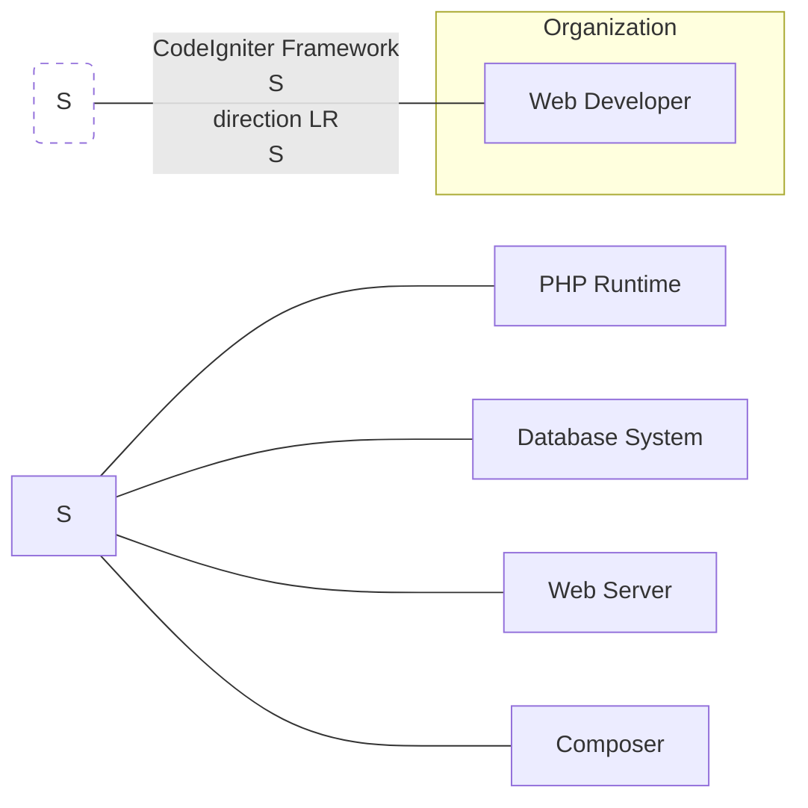
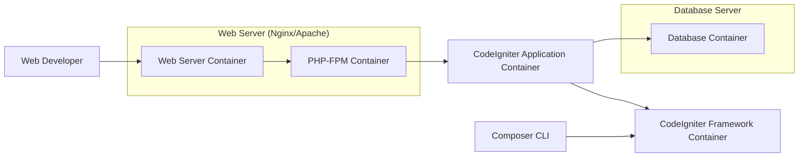
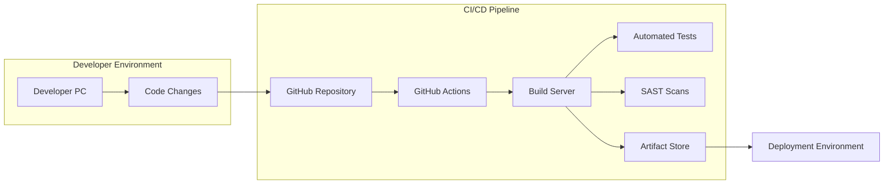

# BUSINESS POSTURE

- Business Priorities and Goals:
  - Provide a lightweight and rapid development PHP framework for building web applications.
  - Offer a simple and easy-to-learn framework for developers of all skill levels.
  - Maintain a strong community and provide comprehensive documentation.
  - Enable developers to quickly prototype and deploy web applications.
- Business Risks:
  - Security vulnerabilities within the CodeIgniter framework could be exploited in applications built using it, leading to data breaches or service disruption.
  - Insecure coding practices by developers using CodeIgniter, due to lack of security awareness or framework misuse, can introduce vulnerabilities into applications.
  - Lack of timely security updates and patches for the framework could leave applications vulnerable to known exploits.
  - Dependency on community contributions for security fixes might lead to delays in addressing critical vulnerabilities.

# SECURITY POSTURE

- Existing Security Controls:
  - security control: Input validation libraries and helpers are provided within the framework to assist developers in sanitizing user inputs. (Implemented within the CodeIgniter framework code - see documentation and code examples).
  - security control: Cross-Site Scripting (XSS) protection helpers are available to encode output and prevent XSS attacks. (Implemented within the CodeIgniter framework code - see documentation and code examples).
  - security control: Cross-Site Request Forgery (CSRF) protection is offered as a feature that can be enabled in the framework configuration. (Implemented within the CodeIgniter framework code - see configuration files and documentation).
  - security control: Database abstraction layer with query binding helps prevent SQL injection vulnerabilities. (Implemented within the CodeIgniter framework code - see database library and documentation).
  - accepted risk: Security of applications built using CodeIgniter is ultimately the responsibility of the developers creating those applications.
  - accepted risk: The framework itself might contain undiscovered vulnerabilities that could be exploited.
- Recommended Security Controls:
  - security control: Implement automated Static Application Security Testing (SAST) scans on the CodeIgniter framework codebase during development to identify potential vulnerabilities early in the development lifecycle.
  - security control: Conduct regular penetration testing and security audits of the CodeIgniter framework by external security experts to identify and address security weaknesses.
  - security control: Establish a clear and well-documented process for reporting and handling security vulnerabilities in the framework, including a responsible disclosure policy.
  - security control: Provide security training and educational resources for developers using CodeIgniter to promote secure coding practices and framework security features.
- Security Requirements:
  - Authentication:
    - Applications built with CodeIgniter should implement robust authentication mechanisms to verify user identities.
    - Consider supporting multi-factor authentication (MFA) for enhanced security.
    - Securely manage user credentials and avoid storing passwords in plain text.
  - Authorization:
    - Implement fine-grained authorization controls to restrict user access to resources and functionalities based on their roles and permissions.
    - Follow the principle of least privilege when granting access rights.
    - Regularly review and update authorization policies.
  - Input Validation:
    - All user inputs must be validated and sanitized to prevent injection attacks (e.g., SQL injection, XSS, command injection).
    - Use framework-provided input validation libraries and helpers.
    - Implement both client-side and server-side validation for comprehensive input validation.
  - Cryptography:
    - Use strong encryption algorithms and libraries for protecting sensitive data at rest and in transit.
    - Properly manage encryption keys and ensure their secure storage.
    - Implement HTTPS for all communication to protect data in transit.
    - Utilize cryptography for secure session management and token generation.

# DESIGN

## C4 CONTEXT



- Context Diagram Elements:
  - - Name: Web Developer
    - Type: Person
    - Description: Developers who use the CodeIgniter framework to build web applications.
    - Responsibilities: Develop, deploy, and maintain web applications using CodeIgniter.
    - Security controls: Secure coding practices, input validation in applications, authentication and authorization implementation in applications.
  - - Name: CodeIgniter Framework
    - Type: Software System
    - Description: A lightweight PHP framework for building web applications.
    - Responsibilities: Provide core functionalities for web application development, including routing, database interaction, templating, and security features.
    - Security controls: Input validation helpers, XSS protection, CSRF protection, database abstraction layer, security vulnerability patching and updates.
  - - Name: PHP Runtime
    - Type: Software System
    - Description: The PHP runtime environment required to execute CodeIgniter applications.
    - Responsibilities: Execute PHP code, manage server-side scripting, and interact with the web server.
    - Security controls: PHP security configurations (e.g., disable dangerous functions), regular PHP updates, security extensions (e.g., Suhosin).
  - - Name: Database System
    - Type: Software System
    - Description: Database system (e.g., MySQL, PostgreSQL) used by CodeIgniter applications to store and retrieve data.
    - Responsibilities: Data persistence, data management, and data retrieval for applications.
    - Security controls: Database access controls, database hardening, regular security patching of the database system, data encryption at rest.
  - - Name: Web Server
    - Type: Software System
    - Description: Web server (e.g., Apache, Nginx) that hosts and serves CodeIgniter applications.
    - Responsibilities: Handle HTTP requests, serve static files, and forward requests to the PHP runtime.
    - Security controls: Web server hardening, access controls, HTTPS configuration, regular security patching of the web server.
  - - Name: Composer
    - Type: Software System
    - Description: Dependency manager for PHP, used to manage CodeIgniter framework and application dependencies.
    - Responsibilities: Manage project dependencies, download and install libraries, and update packages.
    - Security controls: Dependency vulnerability scanning, using trusted package repositories, verifying package integrity.

## C4 CONTAINER



- Container Diagram Elements:
  - - Name: Web Server Container
    - Type: Container
    - Description: Web server software (e.g., Nginx or Apache) responsible for handling HTTP requests and serving static content.
    - Responsibilities: Accept incoming HTTP requests, route requests to PHP-FPM, serve static files, and manage SSL/TLS connections.
    - Security controls: Web server hardening, access control lists, HTTPS configuration, rate limiting, web application firewall (WAF).
  - - Name: PHP-FPM Container
    - Type: Container
    - Description: FastCGI Process Manager (PHP-FPM) that executes PHP code for CodeIgniter applications.
    - Responsibilities: Execute PHP scripts, manage PHP processes, and communicate with the database.
    - Security controls: PHP-FPM configuration hardening, process isolation, resource limits, regular PHP updates.
  - - Name: CodeIgniter Application Container
    - Type: Container
    - Description: The deployed CodeIgniter application code, including controllers, models, views, and configuration files.
    - Responsibilities: Implement application logic, handle user requests, interact with the database, and render web pages.
    - Security controls: Application-level input validation, authorization checks, secure session management, protection against application-specific vulnerabilities.
  - - Name: CodeIgniter Framework Container
    - Type: Container
    - Description: The core CodeIgniter framework files, libraries, and helpers.
    - Responsibilities: Provide framework functionalities, handle routing, database abstraction, and security features.
    - Security controls: Framework security features (XSS, CSRF protection), regular framework updates, security audits of the framework code.
  - - Name: Database Container
    - Type: Container
    - Description: Database management system (e.g., MySQL, PostgreSQL) responsible for storing application data.
    - Responsibilities: Store and manage application data, handle database queries, and ensure data integrity.
    - Security controls: Database access controls, database hardening, encryption at rest, regular database security patching, database activity monitoring.
  - - Name: Composer CLI
    - Type: Container
    - Description: Command-line interface for Composer, used to manage framework and application dependencies during development.
    - Responsibilities: Install, update, and manage PHP dependencies for the project.
    - Security controls: Using trusted package repositories, dependency vulnerability scanning, verifying package integrity.

## DEPLOYMENT

```mermaid
flowchart LR
    subgraph "Deployment Environment"
        subgraph "Server Instance"
            OS[Operating System]
            WS_D[Web Server (Nginx/Apache)]
            PHP_FPM_D[PHP-FPM]
            CI_APP_D[CodeIgniter Application]
        end
        DB_D[Database Server]
        LB[Load Balancer (Optional)]
        NET[Network]
    end
    NET -- Internet --> LB
    LB --> WS_D
    WS_D --> PHP_FPM_D
    PHP_FPM_D --> CI_APP_D
    CI_APP_D --> DB_D
    OS --> WS_D
    OS --> PHP_FPM_D
    OS --> CI_APP_D
    OS --> DB_D
```

- Deployment Diagram Elements:
  - - Name: Server Instance
    - Type: Infrastructure Node
    - Description: A virtual or physical server instance hosting the web application components.
    - Responsibilities: Provide computing resources for the web server, PHP-FPM, and CodeIgniter application.
    - Security controls: Operating system hardening, security patching, intrusion detection system (IDS), host-based firewall.
  - - Name: Operating System
    - Type: Software
    - Description: Operating system (e.g., Linux) running on the server instance.
    - Responsibilities: Manage system resources, provide a platform for running applications, and handle system security.
    - Security controls: OS hardening, security updates and patching, access controls, audit logging.
  - - Name: Web Server (Nginx/Apache)
    - Type: Software
    - Description: Web server software deployed on the server instance.
    - Responsibilities: Serve web application content, handle HTTP requests, and manage connections.
    - Security controls: Web server hardening, access controls, HTTPS configuration, rate limiting, web application firewall (WAF).
  - - Name: PHP-FPM
    - Type: Software
    - Description: PHP-FPM running on the server instance to process PHP code.
    - Responsibilities: Execute PHP scripts for the CodeIgniter application.
    - Security controls: PHP-FPM configuration hardening, process isolation, resource limits, regular PHP updates.
  - - Name: CodeIgniter Application
    - Type: Software
    - Description: Deployed CodeIgniter application files on the server instance.
    - Responsibilities: Handle application logic and serve web pages.
    - Security controls: Application-level security measures, input validation, authorization, secure coding practices.
  - - Name: Database Server
    - Type: Infrastructure Node
    - Description: Separate server instance hosting the database system.
    - Responsibilities: Store and manage application data.
    - Security controls: Database server hardening, access controls, network segmentation, database encryption at rest, database activity monitoring.
  - - Name: Load Balancer (Optional)
    - Type: Infrastructure Node
    - Description: Load balancer distributing traffic across multiple server instances (for scalability and high availability).
    - Responsibilities: Distribute incoming traffic, improve application availability and performance.
    - Security controls: Load balancer security configuration, DDoS protection, SSL termination.
  - - Name: Network
    - Type: Infrastructure
    - Description: Network infrastructure connecting different components.
    - Responsibilities: Provide network connectivity between servers and users.
    - Security controls: Network segmentation, firewalls, intrusion prevention system (IPS), network monitoring.

## BUILD



- Build Process Elements:
  - - Name: Developer PC
    - Type: Environment
    - Description: Developer's local machine where code is written and tested.
    - Responsibilities: Code development, local testing, and committing code changes.
    - Security controls: Developer workstation security, code review, local security scans.
  - - Name: Code Changes
    - Type: Artifact
    - Description: Source code modifications made by developers.
    - Responsibilities: Implement new features, fix bugs, and address security vulnerabilities.
    - Security controls: Version control (Git), code review process, secure coding practices.
  - - Name: GitHub Repository
    - Type: System
    - Description: Central repository hosting the CodeIgniter framework source code.
    - Responsibilities: Version control, code storage, collaboration, and trigger CI/CD pipelines.
    - Security controls: Access controls, branch protection, audit logging, vulnerability scanning of repository dependencies.
  - - Name: GitHub Actions
    - Type: System
    - Description: CI/CD platform used to automate the build, test, and deployment process.
    - Responsibilities: Orchestrate the build pipeline, run automated tests, perform security scans, and deploy artifacts.
    - Security controls: Secure pipeline configuration, access controls, secret management, audit logging.
  - - Name: Build Server
    - Type: System
    - Description: Server responsible for compiling and building the CodeIgniter framework.
    - Responsibilities: Compile code, build packages, run linters and static analysis tools.
    - Security controls: Build server hardening, access controls, secure build environment, regular security patching.
  - - Name: Automated Tests
    - Type: Process
    - Description: Automated tests (unit, integration, and security tests) executed during the build process.
    - Responsibilities: Verify code functionality, identify bugs, and ensure code quality.
    - Security controls: Security testing as part of the test suite, regular test updates, test environment security.
  - - Name: SAST Scans
    - Type: Process
    - Description: Static Application Security Testing (SAST) scans performed on the codebase during the build process.
    - Responsibilities: Identify potential security vulnerabilities in the source code.
    - Security controls: SAST tool configuration, vulnerability reporting, integration with development workflow.
  - - Name: Artifact Store
    - Type: System
    - Description: Repository for storing build artifacts (e.g., compiled framework packages).
    - Responsibilities: Securely store and manage build artifacts, provide access for deployment.
    - Security controls: Access controls, artifact integrity checks, vulnerability scanning of artifacts, secure storage.
  - - Name: Deployment Environment
    - Type: Environment
    - Description: Target environment where the CodeIgniter framework is deployed (e.g., staging, production).
    - Responsibilities: Host and run the CodeIgniter framework and applications.
    - Security controls: Deployment environment hardening, access controls, network segmentation, runtime security monitoring.

# RISK ASSESSMENT

- Critical Business Processes:
  - Development and maintenance of the CodeIgniter framework itself.
  - Development and deployment of web applications built using CodeIgniter.
  - Maintaining the reputation and trust associated with the CodeIgniter project.
- Data to Protect and Sensitivity:
  - Source code of the CodeIgniter framework: Highly sensitive - Intellectual property, vulnerabilities could be exploited.
  - User data in applications built with CodeIgniter: Sensitivity varies depending on the application - Could be highly sensitive (PII, financial data, etc.).
  - Configuration data for the framework and applications: Moderately sensitive - Could expose system details or access credentials.
  - Build artifacts and deployment packages: Moderately sensitive - Could be tampered with to introduce malicious code.

# QUESTIONS & ASSUMPTIONS

- Questions:
  - What is the intended scope of security responsibility for the CodeIgniter project team versus developers using the framework?
  - What are the current processes for security vulnerability reporting and patching for the CodeIgniter framework?
  - Are there any specific compliance requirements that applications built with CodeIgniter need to adhere to?
  - What is the expected lifespan and maintenance plan for the CodeIgniter framework?
- Assumptions:
  - Security is a significant concern for both the CodeIgniter project and applications built using it.
  - Developers using CodeIgniter have varying levels of security awareness and expertise.
  - The CodeIgniter project aims to provide a secure foundation for web application development, but ultimately application security is the responsibility of the developers.
  - The CodeIgniter community plays a vital role in identifying and addressing security vulnerabilities.